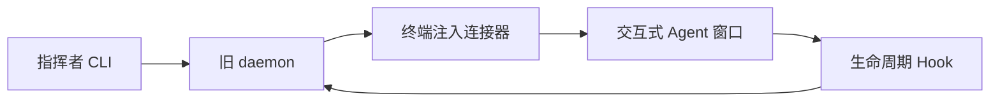
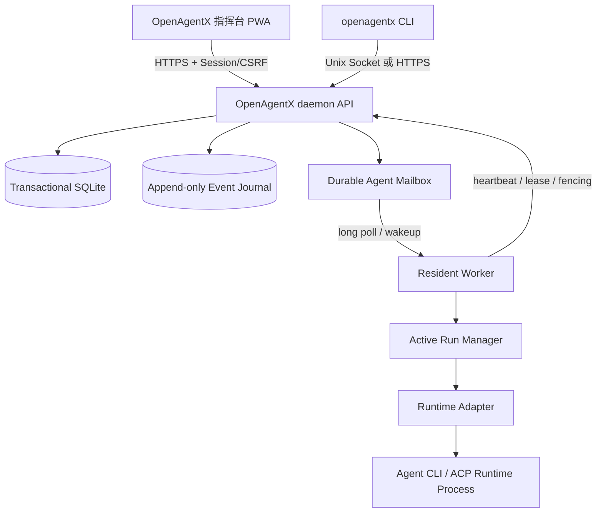

# OpenAgentX 架构

## 1. 目标

OpenAgentX 将逻辑 Agent、Resident Worker、Runtime Process、Task 和 Turn 分离。daemon 是持久化控制面，Worker 是可迁移的执行进程，Runtime Adapter 负责适配具体 Agent CLI/ACP 协议。

## 2. 原有架构与变更

### 原有路径

旧路径把终端布局和 Agent 控制耦合在一起，Task 结束后需要再次从外部窗口注入指令。

### 目标路径

业务命令只写入 Mailbox；Worker 完成当前 Turn 后继续 Claim 下一项。控制通道可并发处理 steer、approval、cancel，且按 RunAttempt/version 做 CAS。

## 3. 核心边界

| 层 | 责任 |
|---|---|
| daemon | 组织、权限、任务状态、Mailbox、Worker lease、Event Journal、Observe/Control/Admin API |
| Worker | 单 Agent 的常驻生命周期、Mailbox pump、Active Run Manager、heartbeat 和 lease 维护 |
| Runtime Adapter | 把统一 ExecutionSpec 转换为具体 CLI/ACP 启动参数，归一化事件和取消/审批能力 |
| Runtime Process | 一次 Turn 的实际模型推理与工具执行；Turn 结束即释放，Session 可跨 Turn |
| 指挥台 | 登录、观察、业务指令、审批、取消和移动 PWA 入口 |

V1 每个逻辑 Agent 最多一个 Active Run。并行工作通过多个 Agent 组织，不在一个 Worker 内隐式并发修改同一工作区。

## 4. 持久化与一致性

当前状态表是权威读取源，Event Journal 是不可变审计和 SSE replay 源。状态、Mailbox、RunAttempt、WorkerCommand 和事件在同一事务中提交。Broker 仅用于唤醒；唤醒丢失时，Worker 通过长轮询重新检查持久 Mailbox，不丢工作。

Cancel 首先将 Task 置为 `cancel_requested` 并阻止新 RunAttempt；针对当前 Run 的 control item 只负责尽快中断，竞态失效后不得迁移到下一 Turn。native Approval 绑定具体 RunAttempt，过期即 `stale`；preflight Approval 才能作为下一 Turn 前置条件。

## 5. 传输与安全

- 本机 Worker 使用权限为 0600 的 Unix Socket；远程 Worker 使用 TLS 1.3 mTLS，并绑定逻辑 Agent、Worker Instance、generation、lease 和 fencing token。
- Web 入口要求密码 Session、RBAC、CSRF、幂等键和审计；响应禁止缓存敏感 API/SSE。
- PWA 只缓存带 hash 的静态应用壳。离线时所有写操作禁用，不使用 Background Sync。

## 6. 运行时适配

Runtime Backend 由 `ExecutionSpec` 选择，运行时可指定 Backend、模型、reasoning、session mode、预算和能力。Adapter descriptor 声明 `steer`、`approval`、`cancel` 能力：

- `steer=native`：消息进入当前 Turn；
- `steer=queued`：持久化后在下一 Turn 消费；
- `approval=native`：绑定当前 Run；
- `approval=preflight`：作为下一 Turn 前置条件；
- `cancel=native`：尝试中断当前 Runtime Process。

AGY Batch、CodeBuddy CLI 和 Generic ACP 实现同一 Adapter/TurnHandle 契约；新增 CLI 只需实现 Adapter，不改变 daemon/Worker 协议。目前 CodeBuddy CLI 已由 `internal/runtime/conformance` suite 实际覆盖，AGY/ACP 接入该 suite 仍是待补事项。

## 7. 发布边界

正式版本只提供 `openagentx` 二进制、OpenAgentX socket、目标 schema 和 Command Center。旧命令、终端注入、生命周期 Hook、旧环境变量和旧数据库不作为兼容路径；发布前由 legacy scanner 和目标 schema 检查阻断遗漏。
