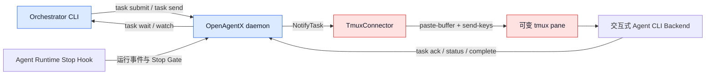
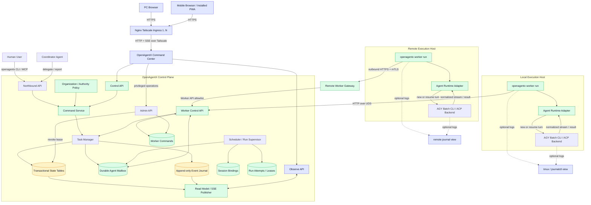
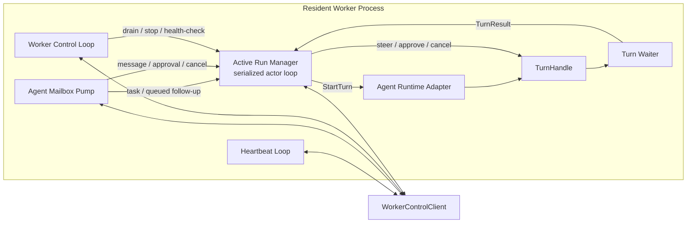

# ADR-001: OpenAgentX 组织控制面、Resident Worker 与移动指挥台决策

## 状态 (Status)

已接受 (Accepted)

## 日期 (Date)

2026-08-29

## 决策者 / 所有者 (Decision Maker / Owner)

OpenAgentX Team / OpenAgentX Maintainer

---

## 背景 (Context)

OpenAgentX 的目标不只是连接异构 Agent CLI，而是提供一个可持久运行的 **Agent 组织控制面**：人类用户、指挥者和 Domain Agent 按组织关系协作，通过统一邮箱、任务、消息、审批和委派协议通信，并由独立 Worker 驱动具体 Agent Runtime Backend。tmux pane 是可变的终端展示位置，不具备稳定身份、可靠投递、执行确认或故障恢复语义，不能作为 Agent 控制面。

目标系统必须同时满足：

1. Domain Agent 的生命周期独立于 Task 和单次 Agent Runtime turn；
2. 人类用户、指挥者和 Domain Agent 的通信全部经过 OpenAgentX 的持久 Task、Message、Approval 和 Event 协议；
3. Agent Runtime Backend 不执行 turn 时不占用模型调用，由常驻 Worker 等待并接收下一项工作；
4. pane 创建、移动、关闭或重建不影响 Agent 身份、任务路由和会话绑定；
5. daemon 或 Worker 重启后，未处理工作能够从持久事实源恢复；
6. 人类用户能够通过需要密码登录的 **OpenAgentX 指挥台**观察组织状态，并向指挥者或明确的 Domain Agent 下达业务指令；
7. 指挥台通过 Tailscale 网络中的一个或多个 Nginx 入口提供 HTTPS 访问，支持 PWA 安装，同时支持 PC 和手机浏览器，并以手机体验为第一设计基线；
8. Worker 可以迁移到其他主机，而不改变 Task、Mailbox、Worker 和 Agent Runtime Adapter 的业务协议；
9. 控制面不解析终端屏幕，不保存模型隐藏推理，不以进程退出码替代任务事实。

---

## 决策 (Decision)

OpenAgentX 采用以下目标架构：

1. **产品与 CLI 统一命名为 OpenAgentX**：产品名为 `OpenAgentX`，唯一公开 CLI 和二进制为 `openagentx`；`agentbus` 不再作为产品、命令、socket、数据库、环境变量或服务名称，只保留为内部 Mailbox/Event Bus 的概念描述。
2. **组织模型是控制面的上层领域**：Organization、OrgUnit、Position、Role、ReportingLine 和 AuthorityPolicy 定义成员关系、汇报链与委派权限；技术实现不固化朝廷或公司术语，界面可以按组织模板显示不同称谓。
3. **业务指令面向逻辑 Agent**：指挥台默认把新目标发送给指挥者，由其拆解和委派；用户也可以在权限允许时显式直达 Domain Agent。业务 Task 和 Message 永不以 `worker_instance_id` 为目标。
4. **Worker 只承载执行和运维**：Worker 是 OpenAgentX 的独立 OS 进程，不是组织成员。业务输入经 Agent Mailbox 领取；drain、health check 和受控停止经独立 Worker Control Channel 面向 Worker Instance，lease revoke 由 daemon 直接更新权威状态并立即生效。
5. **Agent Runtime Adapter 是唯一南向执行入口**：Worker 根据结构化 ExecutionSpec 从 Adapter Registry 选择 AGY Batch、Codex ACP、Claude Code ACP 或 OpenCode ACP 等 Backend；CLI 进程、provider session、turn、stream、取消及能力差异全部封装在 Adapter 后方。
6. **模型与思考强度按 RunAttempt 解析**：Agent Profile 提供默认值，Task/turn 可以在授权范围内覆盖 Backend、模型、reasoning、session、权限、sandbox、timeout 和预算；最终 ResolvedExecutionSpec 持久化到 RunAttempt，不接受任意 shell argv。
7. **持久 Agent Mailbox 是唯一业务投递入口**：Task、补充 Message、Cancel 和 Approval 决策均先持久化，再由目标 Agent 的 Active Worker 原子领取。Mailbox 提供 work 与 active-run control 两个逻辑 lane，control lane 优先于 work lane，同一 lane 内严格按 `sequence ASC` 领取；内存 Broker 仅用于尽力唤醒等待者。
8. **SessionBinding 保持上下文连续性**：OpenAgentX 的 `context_id + agent_id + backend_id` 映射到 provider conversation/thread/session；更换 Worker 不改变逻辑上下文，更换 Backend 必须创建新的 SessionBinding，不能伪造跨 provider resume。
9. **Task 与 turn 明确分离**：Task 可跨多个 turn。Batch/queued 路径可以结束当前 turn 并让 Task 保持 `waiting_input` 或 `waiting_approval`；native Approval 路径则允许 Task 显示 `waiting_approval`，同时保持当前 RunAttempt 与 TurnHandle 活动。
10. **V1 每个逻辑 Agent 最多一个 Active Run**：`max_active_runs_per_agent=1` 由 daemon 跨 Worker 强制执行；Agent 可以积压多个 Task，但只能有一个取得执行 lease 的非终态 RunAttempt。需要并行时使用多个逻辑 Agent，V1 不在单 Agent 内并发修改 workspace 或 provider session。
11. **Cancel 是 Task 级 desired state**：取消命令的权威效果是事务性地将非终态 Task 置为 `cancel_requested` 并禁止创建新 RunAttempt。存在 Active Run 时额外创建 control MailboxItem 尝试中断物理执行；该 item 未命中目标 Run 时只能成为 `superseded/no-op`，不得迁移到下一 turn。
12. **Approval 按授权范围绑定**：native Approval Decision 必须绑定具体 `approval_request_id + target_run_id + expected_run_version`，目标 Run 或请求失效后只能成为 `stale/superseded`；preflight Approval 是独立类型，只能在明确范围、有效期和一次性消费约束下作为下一 turn 的启动条件。两者不得互相降级或继承。
13. **采用 Transactional State + Append-only Event Journal**：领域状态表是当前权威状态，Event Journal 是状态变化的不可变审计、时间线、SSE replay、debug 和 provenance 记录；系统不通过事件回放重建 aggregate，也不解析 tmux、终端文本或私有 transcript。
14. **Worker 执行与活动控制并发**：Worker 内部分为 Heartbeat Loop、Agent Mailbox Pump、Active Run Manager 和 Worker Control Loop。Adapter 通过 `StartTurn` 返回可控制的 `TurnHandle`，使 `Wait` 与 steer、approval、cancel 可以并发进行；不能在等待 turn 结束期间停止收件。
15. **Worker Control API 与传输解耦**：本机 binding 为 HTTP over Unix Domain Socket，远程 binding 为出站 HTTPS over TCP + mTLS；Worker 执行组件和 Agent Runtime Adapter 不感知具体 binding。daemon 不反向连接 Worker，运维命令通过持久 Worker Control Channel 由 Worker 主动 long poll 领取。V1 的 `stop` 只停止目标 Worker Instance，不表示持续禁用逻辑 Agent。
16. **OpenAgentX 指挥台是认证后的控制入口**：Observe API 保持只读，独立 Control API 负责 Task、Message、Approval 和取消；Worker 管理使用更高权限的 Admin API。浏览器不得直接调用 Worker Control API。
17. **指挥台采用 Vite + React + TypeScript、mobile-first 与 PWA**：手机端是指挥、待办和任务跟进的第一基线；PWA 支持安装到桌面，但不离线缓存敏感业务数据，也不在离线状态排队控制命令。
18. **指挥台使用应用层密码与纵深网络安全**：daemon 负责用户、授权、密码摘要和 Web Session；一个或多个 Nginx 入口使用 ACME 免费证书终止 HTTPS，再通过 Tailscale 访问 daemon 私有 listener。
19. **tmux 不属于 OpenAgentX 控制平面**：OpenAgentX 不保存 pane 地址，不调用 `tmux paste-buffer`、`tmux send-keys` 或 `capture-pane`。tmux 仅可由操作者在系统外用于查看 Worker 日志和 Agent Runtime Backend 输出。

---

## 架构 (Architecture)

### 原有架构



该结构中的任务事实位于 daemon，但工作唤醒仍依赖 pane 地址和终端输入。

### 目标架构



绿色节点是本决策确立的组织、指挥、执行和传输能力。本机与远程 Worker 运行相同代码并调用同一 Worker Control API；业务指令只进入 Agent Mailbox，Worker 实例运维只进入 Worker Commands，不从浏览器直达 Worker。领域状态表保存当前权威状态，Event Journal 保存不可变变化记录。指挥台 HTTPS 在 Nginx 终止，后端流量通过 Tailscale 到达 daemon 私有 listener。虚线仅表示日志观察，不传递任务或控制指令。

### 组件关系

| 组件 | 稳定身份 | 部署与生命周期 | 职责 |
|---|---|---|---|
| Human User | `user_id` | 登录主体，长期存在 | 下达指令、补充输入、审批和运维授权 |
| Organization Position | `position_id` | 组织席位，独立于具体 Agent | Role、汇报链、指挥范围和授权边界 |
| Coordinator / Domain Agent | `agent_id` | 占据 Position 的逻辑成员，长期存在 | 任务、上下文与组织职责所有权 |
| OpenAgentX daemon | control-plane instance | 独立服务进程 | 组织、持久状态、调度、lease、API 和指挥台后端 |
| Worker Instance | `worker_instance_id` | 独立 OS 进程，可在本机或远程主机重启替换 | 收件、心跳、执行监督、事件与结果核对 |
| Agent Runtime Adapter | `adapter_type + version` | 由 Worker 承载或按需创建 | 将 OpenAgentX 执行契约转换为具体 Backend 协议 |
| Agent Runtime Backend | backend type + process/session | 每个 turn 启动或作为受管服务存在 | 实际运行 AGY、Codex、Claude Code 或 OpenCode 的模型调用与工具循环 |
| Agent Runtime Session | provider session ID | 跨 turn 或按需恢复 | 保存 provider 侧 conversation/thread/session 上下文 |
| Task | `task_id` | 跨多个 turn | 稳定工作意图与验收边界 |
| RunAttempt | `run_id` | 单次执行 | 一次实际派发与副作用边界 |

Worker 是 OpenAgentX 的执行面组件，与 daemon 使用同一代码仓库和同一个 `openagentx` 二进制发布，但二者运行在独立故障域。一个 Domain Agent 可以先后由多个 Worker Instance 承载，但同一时刻只有持有当前 fencing token 的 Worker 可以领取工作和更新执行状态。

### 产品与运行名称

| 对象 | 目标名称 |
|---|---|
| 产品与仓库 | `OpenAgentX` |
| CLI / 二进制 | `openagentx` |
| daemon 命令 | `openagentx serve` |
| Worker 命令 | `openagentx worker run --config <agent.yaml>` |
| 环境变量前缀 | `OPENAGENTX_` |
| 本机 Socket | `openagentx.sock` |
| 数据库 | `openagentx.db` |
| daemon service | `openagentx.service` |
| Worker service template | `openagentx-worker@.service` |
| Web 产品名 | `OpenAgentX 指挥台` / `OpenAgentX Command Center` |

目标版本只交付以上名称，不提供 `agentbus` 二进制、命令别名、环境变量 fallback 或双 service unit。

### 组织与业务寻址

```text
Organization
├── OrgUnit
├── Position
│   └── occupied by Agent
├── Role
├── ReportingLine
└── AuthorityPolicy
```

- Organization 是治理边界；首版可以只有一个默认 Organization，但 schema 和 API 不把组织字段写死为全局单例；
- Position 表示稳定岗位，Role 表示职责与能力模板，Agent 是当前占据岗位的逻辑成员；更换 Worker 不改变岗位、权限或历史；
- ReportingLine 描述指挥和汇报关系，AuthorityPolicy 决定用户或 Agent 可以给哪些目标创建 Task、发送 Message、审批或取消；
- 指挥者是具有分解、委派、审查和汇总权限的 Agent，不是特殊网络进程；一个组织可以有一个或多个指挥者；
- 指挥台默认接收者是当前 Organization 的主指挥者。用户显式选择 Domain Agent 时，Command Service 执行 direct-dispatch 授权检查并记录 `dispatch_mode=direct`；
- Worker Instance 不出现在业务接收者选择器中。它只显示在 Agent 执行详情和管理员运维页面。

### 身份、租约与执行术语

| 术语 | 作用 | 失效或变化时机 |
|---|---|---|
| `worker_instance_id` | 唯一标识一次 Worker OS 进程实例，不使用 PID 或主机名代替 | Worker 每次启动都生成新值 |
| `generation` | daemon 为某个 `agent_id` 的 Active Worker 所有权签发的单调递增代次，用于判定请求是否属于当前 Worker 进程代次 | Worker 重启、替换或重新取得 Active Worker 所有权时递增；heartbeat 续租不递增 |
| Worker Session Token | Worker 完成 UDS/mTLS 身份认证后取得的短期 API 凭证，绑定 `agent_id`、`worker_instance_id`、`generation`、capabilities 和有效期；lease 与 fencing 仍由服务端独立校验 | 到期、显式吊销、generation 变化或 Worker 注销时失效；它不是 Agent Runtime Session，也不保存模型上下文 |
| lease | daemon 授予 Worker、mailbox claim、RunAttempt 或 Workspace 的限时占有权，解决“当前谁可以继续做” | heartbeat 或显式续租延长；到期即失去占有权，但存在不确定副作用时不得自动重跑 |
| fencing token | 每次取得受保护资源 lease 时生成的单调递增写入栅栏；服务端只接受等于该资源当前最新值且与有效 lease 匹配的写入 | lease 被重新授予时递增；即使旧 Worker 的延迟请求后来到达，也会因 token 落后被拒绝 |
| SessionBinding | OpenAgentX 上下文到 provider conversation/thread/session ID 的持久映射 | 创建新上下文或 provider session 明确失效时变化；不随 Worker Session Token 轮换 |
| turn | 对某个 Agent Runtime Backend 的一次有边界交互：从 `StartTurn` 提交输入开始，到 `TurnHandle.Wait` 返回最终结果、取消结果或异常为止 | native 输入/审批请求只是活动 turn 内的暂停事件，TurnHandle 保持有效；Batch/queued 模式可以结束当前 turn 并让 Task 等待下一 turn；一个 Task 可以包含多个 turn |
| RunAttempt | OpenAgentX 对一次实际派发和副作用边界的持久记录 | V1 中一个 RunAttempt 至多对应一个 turn，且每个 `agent_id` 同时最多一个取得执行 lease 的非终态 RunAttempt |

`generation` 是 Agent 级的 Worker 进程代次，负责识别“是不是当前 Worker”；lease 是有截止时间的占有权，负责判断“现在是否仍有权执行”；fencing token 是资源级写入序号，负责阻止网络延迟或进程停顿后的旧写入。三者不能互相替代。

native ApprovalRequest 发生时，RunAttempt 和 TurnHandle 仍然活动，Task 可以显示 `waiting_approval`，Approval Decision 生效后回到同一 turn 的 `running`。preflight ApprovalRequest 发生在 `StartTurn` 之前，此时没有可接收 `DecideApproval` 的 TurnHandle；决策满足启动条件后才创建新的 RunAttempt。

本文中的 **Agent Runtime Backend** 特指真正执行 coding-agent turn 的外部程序或协议端点，例如 `agy --print` 子进程、`codex-acp`、`claude-agent-acp` 或 `opencode acp`。它不指 OpenAgentX daemon，不指 Worker，也不单指底层 LLM。**Agent Runtime Adapter** 是 Worker 内连接该 Backend 的协议适配代码，负责启动或恢复 provider session、发送 prompt、接收 stream、取消执行，并转换为 OpenAgentX 的标准 Event 和 TurnResult。

---

## 正向执行流程 (Canonical Flow)

### 人类下达业务指令

1. 用户从指挥台、`openagentx` CLI 或 MCP 登录为 Human Principal。
2. 新建指令默认选择主指挥者，`dispatch_mode=coordinated`；用户也可以显式选择有权直达的 Domain Agent，`dispatch_mode=direct`。
3. Command Service 校验 Organization、Position、ReportingLine、AuthorityPolicy、目标 Agent 状态和 ExecutionSpec override 范围。
4. 新工作创建 Task；对非终态 Task 的补充创建 Message；审批操作创建 Approval Decision。三者不能用自由文本互相替代。
5. daemon 在同一事务中更新领域状态表、写入目标 Agent 的 MailboxItem 和 append-only Event Journal，并返回稳定 ID 与 sequence。
6. 事务提交后，daemon 尽力通过内存 Broker 唤醒等待者；即使唤醒丢失，Worker long poll 超时后也会重新查询持久 Mailbox。
7. 指挥台立即显示 `persisted`，随后根据 mailbox claim、RunAttempt 和 Backend Event 更新为 `queued/accepted/running/waiting_input/terminal`。

默认发给指挥者不是强制中转：明确的小任务可以直达 Domain Agent，但每次 direct dispatch 都必须可审计，且不能绕过 workspace、权限、预算和组织范围。业务界面不接受 `worker_instance_id` 作为接收者。

### Worker 执行

1. 用户级 systemd 在本机或远程执行主机启动独立进程 `openagentx worker run --config <agent.yaml>`。
2. Worker 根据部署配置选择本机 UDS 或远程 mTLS HTTPS binding，并使用同一 Worker Control API 主动连接 daemon；daemon 不反向连接 Worker。
3. Worker 读取 Agent Profile 与 Position/Role，注册 `worker_instance_id`，获取 generation、短期 Worker Session Token、lease 和 fencing token。
4. Worker 注册 Adapter/Backend descriptor、模型、reasoning、权限和 session capabilities，并并行启动 Heartbeat Loop、Agent Mailbox Pump、Active Run Manager 和 Worker Control Loop。
5. Agent Mailbox Pump 使用有效 lease 原子 long-poll claim。它优先领取 active-run control lane，再领取 work lane；Agent 级 Broker 只负责提前唤醒 long poll。
6. 新 Task 或 queued follow-up 交给 Active Run Manager。Scheduler 结合组织策略、Agent 默认 Execution Profile、Task override 和 Worker capability 生成 ResolvedExecutionSpec，创建 RunAttempt 并取得 Workspace Lease。
7. Session Broker 根据 `context_id + agent_id + backend_id` 新建或恢复 SessionBinding；Backend 变化时创建新 binding。
8. Active Run Manager 从 Adapter Registry 选择 Adapter，调用 `StartTurn` 获得 `TurnHandle`；Adapter 将 ResolvedExecutionSpec 转换为安全 argv、stdin 或 ACP 请求，并将 Backend stream 归一化为 Message、Event、Artifact 和 usage。
9. `TurnHandle.Wait` 在独立等待路径中运行，Agent Mailbox Pump 不因此停止。运行中的 Message、native Approval Decision 和 Cancel 继续进入 Active Run Manager；preflight Approval Decision 只参与下一 RunAttempt 的启动门禁，不调用当前 TurnHandle。
10. Backend 返回 TurnResult 后，Worker 对退出状态、Task 状态、工作区副作用和必要验证进行 reconcile。取消请求被 Adapter 接受只表示 `cancel_requested`，最终 `canceled/uncertain/failed/succeeded` 由 `Wait` 结果与 reconcile 决定。
11. turn 结束与控制 MailboxItem 并发到达时，daemon 以 Task/RunAttempt version、ApprovalRequest/MailboxItem state 和 compare-and-set 确定唯一结果；Message、native Approval、Cancel 和 preflight Approval 按各自语义结算，不能统一降级为下一 turn 输入。
12. Task 进入 `succeeded`、`failed`、`waiting_input`、`waiting_approval` 或 `uncertain`；Worker 释放对应 run 资源，但四个常驻组件继续运行并等待后续工作。
13. 指挥台通过 REST 获取快照，通过 SSE 接收 Event Journal 增量；断线后按 sequence 回放。

补充消息始终写入同一 Task：

- Adapter 的 steer mode 为 `native` 时，消息在 RunAttempt version/CAS 校验成功后进入当前 turn；
- Adapter 的 steer mode 为 `queued` 时，或者 native steer 在 turn 结束竞态中未取得当前 RunAttempt，消息保留在 work lane，并在当前 turn 结束后使用同一 SessionBinding 启动下一 turn；
- Adapter 的 steer mode 为 `unsupported` 时，表示当前 Backend/SessionBinding 既不能修改活动 turn，也不能形成合法 deferred follow-up，Command Service 在入队前明确拒绝该操作；
- Task 已达到终态时，新的独立工作必须创建新 Task。

Message 提交与 turn 结算也必须以 Task version 串行化：Message 事务先成功时，待处理 Message 阻止当前 reconcile 将 Task 直接结算为终态；Task 终态事务先成功时，Message API 返回状态冲突且不创建 MailboxItem，调用方必须创建新 Task。

### Cancel 与 Approval 线性化

Cancel API 的事务是取消意图的权威线性化点：

```text
BEGIN
    compare-and-set Task.status -> cancel_requested
    if Active Run exists:
        insert control MailboxItem(target_run_id, expected_run_version)
    append Event Journal
COMMIT
```

- `cancel_requested` 后 Scheduler 不得再为该 Task 创建 RunAttempt；该约束必须由 daemon 的状态机和事务校验执行，不能只依赖 Worker 自律；
- 没有 Active Run 且没有不确定副作用时，daemon 将 Task 结算为 `canceled`；
- Cancel 事务先于 RunAttempt finish 成功时，finish 必须从 `cancel_requested` reconcile 为 `canceled | succeeded | failed | uncertain`；
- RunAttempt finish 已先将 Task 置于终态时，Cancel API 返回现有终态，不创建 control MailboxItem；
- control Cancel 未命中 `target_run_id + expected_run_version` 时标记为 `superseded`，不能改投下一 RunAttempt；重复 Cancel 按 Task 与 Idempotency-Key 幂等处理。

ApprovalRequest 与 Approval Decision 使用以下规则：

- native ApprovalRequest 绑定具体 RunAttempt、run version 和 Backend action/tool-call；决策只在请求仍为 `pending` 且目标 TurnHandle 活动时应用；
- native Approval Decision 未命中当前请求或 RunAttempt 时标记为 `stale/superseded`，不得转换为 preflight Approval；
- preflight ApprovalRequest 在 `StartTurn` 前创建，授权范围至少绑定 Task、ResolvedExecutionSpec 或其稳定摘要、允许的动作、有效期和一次性消费状态；条件变化后必须重新审批；
- Approval Decision 通过 ApprovalRequest ID 寻址，不能把自由文本 Message 当作授权，也不能复用其他 RunAttempt 的批准。

竞态结算矩阵如下：

| MailboxItem 类型 | 目标 Run/version CAS miss 后的唯一处理 |
|---|---|
| Message | Task 仍非终态且 Message 事务已成功时转入 work lane，作为下一 turn 输入；Task 已先终态时拒绝提交 |
| native Approval Decision | 标记 `stale/superseded`，不得跨 RunAttempt 继承 |
| Cancel | Task 保持 `cancel_requested`；control item 标记 `superseded/no-op`，不得成为下一 turn 输入 |
| preflight Approval Decision | 在授权范围、有效期和消费状态仍匹配时保留为下一 RunAttempt 的启动条件 |

---

## Worker 契约 (Worker Contract)

### 进程模型

daemon 与 Worker 由同一个 Go module 和 `openagentx` 二进制交付，但以独立 OS 进程运行：

```text
openagentx serve
    OpenAgentX control plane

openagentx worker run --config <agent.yaml>
    one Domain Agent execution plane
```

Worker 不嵌入 daemon。该边界确保任一 Agent Runtime Backend 卡死、崩溃或资源耗尽不会拖垮权威状态表、Mailbox 和可观测 API，并允许每个 Domain Agent 使用独立工作区、权限、环境变量和发布节奏。

生产环境使用用户级 systemd 模板管理每个 Domain Worker：

```text
openagentx-worker@steadyflow.quote.service
openagentx-worker@steadyflow.engine.service
openagentx-worker@steadyflow.dashboard-frontend.service
```

远程主机安装相同 `openagentx` 版本和 Worker service，通过 mTLS HTTPS 主动接入 daemon。Worker 不直接访问 SQLite，不信任 pane、PID 或 Agent Runtime Backend 自报身份。所有读取、claim、状态转换和事件写入均通过 daemon 的认证 Worker Control API 完成。

### Worker 内部并发模型

Worker 不能使用 `claim -> RunTurn -> claim` 的串行循环。一次 turn 可以持续数十分钟，在此期间仍必须接收 steer、Approval Decision、Cancel 和运维命令：



- Heartbeat Loop 续租并上报 Worker、Adapter 和 Backend health；
- Agent Mailbox Pump 持续领取业务输入。active-run control lane 始终优先；Active Run Manager 无 work capacity 时，新 Task 留在数据库，不提前 claim 后长期占有；
- Active Run Manager 使用单一串行 actor/event loop 管理活动 RunAttempt、TurnHandle 和状态转换，避免多个 goroutine 直接竞争本地 run 状态；
- Turn Waiter 只阻塞在 `TurnHandle.Wait`，其结果作为事件返回 Active Run Manager，不阻塞 Mailbox Pump；
- Worker Control Loop 主动领取持久运维命令。远程 Worker 与本机 Worker 均不要求 daemon 建立反向连接。

### Agent Runtime Adapter 接口

```go
type AgentRuntimeAdapter interface {
    Descriptor(ctx context.Context) (AdapterDescriptor, error)
    Validate(ctx context.Context, spec ExecutionSpec) error
    Health(ctx context.Context) error
    StartTurn(
        ctx context.Context,
        req TurnRequest,
        sink EventSink,
    ) (TurnHandle, error)
}

type TurnHandle interface {
    Wait(ctx context.Context) (TurnResult, error)
    Steer(ctx context.Context, message Message) error
    DecideApproval(ctx context.Context, decision ApprovalDecision) error
    RequestCancel(ctx context.Context) error
}
```

`StartTurn` 在启动或恢复 Backend turn 并建立控制句柄后返回，不能等待 turn 完成。`Wait` 必须允许与 `Steer`、`DecideApproval` 和 `RequestCancel` 并发调用；Active Run Manager 负责串行化三个控制方法。Adapter descriptor 先声明能力，Worker 不以试错调用推断支持情况。不支持的操作必须返回稳定错误，不能静默忽略或伪造成功。

Worker 顶层生命周期遵循以下结构：

```go
func (w *Worker) Run(ctx context.Context) error {
    session := w.RegisterAndAcquireLease(ctx)
    group, ctx := errgroup.WithContext(ctx)

    group.Go(func() error { return w.HeartbeatLoop(ctx, session) })
    group.Go(func() error { return w.MailboxPump(ctx, session) })
    group.Go(func() error { return w.RunManager.Run(ctx, session) })
    group.Go(func() error { return w.WorkerControlLoop(ctx, session) })

    return group.Wait()
}
```

Active Run Manager 收到 work item 后，请求 daemon 在 `max_active_runs_per_agent=1` 约束下创建 RunAttempt，加载 SessionBinding，并调用 `StartTurn`。随后由独立 Turn Waiter 等待结果，actor loop 继续处理控制 item。turn 完成事件与控制 item 同时到达时，Worker 必须带 Task/RunAttempt version 向 daemon 提交 compare-and-set：仍属于活动 turn 的控制才调用 native handle；CAS miss 后只有合法 Message 或 preflight Approval 可以保留到下一 turn，native Approval 必须失效，Cancel control item 必须结束为 `superseded/no-op`。

### 执行约束

- mailbox claim 使用事务性 compare-and-set，并携带 `lease_until` 与 fencing token；
- 投递采用 at-least-once，使用 `mailbox_item_id` 和 `run_id` 保证幂等；
- daemon 必须跨 Worker 强制每个 `agent_id` 最多一个取得执行 lease 的非终态 RunAttempt；
- Mailbox 按 `lane_priority ASC, sequence ASC` 确定性领取，其中 control 为 `0`、work 为 `1`；同一 lane 不因 kind 再次排序，普通 Cancel 不越过更早的同 lane Message 或 Approval；
- Adapter 必须先验证 ResolvedExecutionSpec，不能把用户输入拼接为 shell 或未声明的 Backend 参数；
- Agent Runtime Backend 子进程使用 direct argv 和受控环境变量，不经过 shell；
- stdout 结构化解析，stderr 有长度限制并执行敏感信息脱敏；
- Agent Runtime Backend 退出码为零不自动等价于 Task 成功；
- Task 进入 `cancel_requested` 后，BeginAttempt 必须失败；`RequestCancel` 返回成功只表示 Backend 中断请求已被接受，不能直接把 Task 标为 `canceled`；
- Agent Runtime Backend 中断且副作用无法确认时，Task 进入 `uncertain`；
- Worker 收到终止信号或实例级 stop 后停止领取新工作，并对当前 RunAttempt 执行受控收尾；
- 过期 Worker 的 fencing token 不能继续写入 Task、Event Journal、Artifact 或 Workspace。

---

## Agent Runtime Backend 与 Adapter 决策

### Adapter Registry

Worker 内置类型安全的 Adapter Registry，不使用 Go 动态 plugin：

```text
agy-batch   -> AgyBatchAdapter
codex-acp   -> GenericACPAdapter + Codex descriptor
claude-acp  -> GenericACPAdapter + Claude descriptor
opencode-acp -> GenericACPAdapter + OpenCode descriptor
```

每个 Adapter descriptor 至少声明：

- `adapter_id`、Backend 类型、版本和启动协议；
- 可用模型及稳定 model ID；
- reasoning schema：`backend_default`、`effort` 或 `budget_tokens`，以及允许的值域；
- session 能力：`new/resume/fork`；
- steer mode：`native | queued | unsupported`；
- approval mode：`native | preflight | unsupported`；
- cancel mode：`native | process_signal | unsupported`；
- permission、sandbox、network 和 stream 能力；
- Backend 专用选项的版本化 JSON Schema；
- health probe、最大并发和运行前置条件。

Worker 注册时上报实际可用 descriptor。Scheduler 只从健康 Worker 已注册且 AuthorityPolicy 允许的组合中选择；请求不受支持时明确失败，不静默切换 Backend、模型、reasoning 或权限。

能力值具有固定语义：

- `steer=native` 可修改当前活动 turn；`queued` 表示不能修改当前 turn，但当前 Backend/SessionBinding 可以可靠形成下一 turn follow-up；`unsupported` 仅表示 native 与 deferred follow-up 均不成立；
- `approval=native` 可将决策提交给当前活动 turn，`preflight` 只允许在启动下一 turn 前解析权限门禁，`unsupported` 不建立该 Backend 的审批路径；
- `cancel=native` 使用 Backend 协议取消，`process_signal` 对受管子进程发送受控信号，`unsupported` 只能停止后续调度并将无法确认的活动执行标记为 `uncertain`。

### ExecutionSpec

Agent Profile 保存默认 Execution Profile；Task 或后续 turn 可以提交 override：

```yaml
execution:
  adapter_id: codex-acp
  backend_id: codex-local
  model: gpt-5.4
  reasoning:
    mode: effort
    value: high
  session:
    mode: resume
  approval_policy: on-request
  sandbox: workspace-write
  timeout: 45m
  budget:
    max_tokens: 200000
  backend_options: {}
```

解析顺序为：

```text
Adapter defaults
    ← Agent Execution Profile defaults
    ← Task / turn override
    ∩ Organization policy hard limits
    ∩ Position / Role allowlist
    → Worker descriptor capability validation
```

Task override 可以改变允许范围内的 Backend、模型和思考强度，但不能扩大 Position/Role 的权限、workspace、预算或网络边界。`backend_options` 必须通过对应 Adapter 的 JSON Schema；API 和 Web 不接受 raw argv、shell fragment 或未声明环境变量。

最终 ResolvedExecutionSpec 完整写入 RunAttempt，包括来源、解析版本和每个字段的最终值。这样同一 Task 的不同 turn 可以选择不同模型或 reasoning，但每次执行都可重现、比较和审计。切换 Backend 时继续使用同一 Task，但创建新的 SessionBinding；指挥台必须明确提示不会继承原 provider 的隐藏上下文。

### AGY

AGY 使用官方 Batch CLI Adapter：

```text
agy --print --output-format stream-json --conversation <conversation-id>
```

- Worker 常驻，AGY process 按 turn 启动；
- `conversation-id` 持久化在 SessionBinding；
- `steer=queued`，不伪造 mid-turn steering；
- `approval=preflight` 或 `unsupported`，由已验证的启动模式声明，不伪造活动 turn 审批；
- `cancel=process_signal`，信号送达不等于任务已经安全取消；
- Adapter 解析 stream-json 并产生标准 Agent Runtime Event；
- 最终 TurnResult 使用 JSON Schema 约束，并由 Worker 独立核对工作区与验收结果。

### ACP Backend

Codex、Claude Code 和 OpenCode 优先通过 Generic ACP Adapter 接入：

- Codex 使用 `codex-acp`；
- Claude Code 使用 `claude-agent-acp`；
- OpenCode 使用原生 `opencode acp`；
- ACP 的 session、prompt、permission、tool、usage 和 cancel 事件映射为 OpenAgentX 标准模型；
- 只有 Backend 握手与 descriptor 明确支持时，ACP Adapter 才声明 native steer、approval 或 cancel；
- provider 扩展字段保留在 namespaced metadata，不污染核心状态机。

---

## 持久模型与状态 (Persistent Model and State)

目标 schema 至少包含：

```text
agents
agent_profiles
principals
organizations
org_units
positions
roles
position_assignments
reporting_lines
authority_policies
worker_instances
execution_profiles
runtime_backend_registrations
tasks
messages
event_journal
mailbox_items
worker_commands
run_attempts
session_bindings
workspace_leases
artifacts
approval_requests
approval_decisions
web_users
web_sessions
```

### 权威状态与 Event Journal

OpenAgentX 不采用严格 Event Sourcing，也不通过 replay 全部事件重建 Task、Worker、Mailbox 或 RunAttempt aggregate：

```text
Transactional State Tables
    tasks / messages / worker_instances / mailbox_items /
    worker_commands / run_attempts / session_bindings / ...
    = 当前权威状态

Append-only Event Journal
    = 不可变审计 / 时间线 / SSE replay / debug / provenance
```

每次领域状态转换在同一 SQLite 事务中提交当前状态、必要的 MailboxItem 和 Event Journal 记录：

```sql
BEGIN;
UPDATE tasks ...;
INSERT INTO mailbox_items ...;
INSERT INTO event_journal ...;
COMMIT;
```

并非每个事务都必须创建 MailboxItem，但任何可观察的状态变化必须追加 Event Journal。事务提交后才执行 best-effort Broker wakeup。当前架构不引入 Transactional Outbox：Broker 唤醒丢失不会丢工作，Worker long poll 超时后必须重新查询数据库。只有未来向外部 webhook、消息中间件或其他不能共享该事务的系统可靠发布时，才单独决策是否引入 outbox。

### WorkerInstance

```text
worker_instance_id
agent_id
generation
transport: unix | https
authenticated_principal
capabilities
status
last_heartbeat_at
lease_until
fencing_token
started_at
updated_at
```

`authenticated_principal` 来自 UDS 本机身份边界或远程 mTLS 身份，不使用 Worker 自报字符串生成。Worker Session Token 只保存安全摘要或可撤销标识，不以明文持久化。

### Task 与 RunAttempt 执行字段

```text
Task:
task_id
version
status
sender_principal_id
target_agent_id
dispatch_mode: coordinated | direct
parent_task_id
organization_id
cancel_requested_by
cancel_requested_at

RunAttempt:
run_id
agent_id
version
status
worker_instance_id
fencing_token
lease_until
execution_spec_version
requested_execution_json
resolved_execution_json
adapter_id
backend_id
model
reasoning_mode
reasoning_value
```

业务目标只保存 `target_agent_id`，不保存 `worker_instance_id` 作为寻址依据。RunAttempt 可以记录实际执行它的 Worker Instance，但 Worker 重启或迁移不改变 Task 接收者。daemon 必须在一个事务中检查 Task status/version、Agent active-run ownership 和执行 lease，保证同一 `agent_id` 不会创建第二个 Active RunAttempt；仅靠单个 Worker 的内存状态不足以满足该约束。

### ApprovalRequest 与 ApprovalDecision

```text
ApprovalRequest:
approval_request_id
task_id
mode: native | preflight
target_run_id
expected_run_version
scope_digest
state: pending | approved | rejected | stale | consumed | expired
expires_at
created_at

ApprovalDecision:
approval_decision_id
approval_request_id
decided_by
decision: approve | reject
state: persisted | applied | superseded
idempotency_key
created_at
```

native ApprovalRequest 的 `target_run_id` 和 `expected_run_version` 必填，其 scope 必须绑定具体 Backend action/tool-call。preflight ApprovalRequest 不绑定活动 TurnHandle，但必须通过 `scope_digest` 固定 Task、ResolvedExecutionSpec 和允许动作的授权范围。Approval Decision 只改变其目标 ApprovalRequest，不直接扩大 ExecutionSpec；native 决策 CAS miss 时 Decision 进入 `superseded` 且 Request 进入 `stale`，preflight 批准被成功用于创建 RunAttempt 后 Request 进入 `consumed`，不能重复使用。

### MailboxItem

```text
sequence
mailbox_item_id
target_agent_id
kind: task | message | approval | cancel
lane: work | control
task_id
message_id
approval_request_id
approval_decision_id
target_run_id
expected_run_version
state: pending | claimed | accepted | superseded | failed
worker_instance_id
fencing_token
lease_until
attempts
created_at
accepted_at
```

`kind` 的合法值为：

```text
task | message | approval | cancel
```

Agent Mailbox 不包含 `shutdown`。work lane 承载新 Task、queued follow-up 和 preflight Approval Decision；control lane 只承载携带 `target_run_id + expected_run_version`、明确面向活动 RunAttempt 的 Message、native Approval Decision 和 Cancel，并具有更高 claim 优先级。`sequence` 是 daemon 分配的确定性序列化顺序，不声称表达所有跨主体因果关系；因果关系由 `task_id`、`message_id`、`approval_request_id` 和父子引用表达。Task、Message/Approval Decision、MailboxItem 和 Event Journal 必须与对应领域状态在同一数据库事务中提交。Broker 通知可以丢失，但持久 MailboxItem 不能丢失。

### WorkerCommand

```text
worker_command_id
worker_instance_id
generation
kind: drain | stop | health_check
state: pending | claimed | applied | failed
requested_by
idempotency_key
lease_until
attempts
created_at
claimed_at
applied_at
result
```

WorkerCommand 是 Worker 运维控制通道，不是 Agent MailboxItem，也不能携带业务 prompt。daemon 将 drain、stop 和 health-check 持久化后，由 Worker Control Loop 主动 long poll 领取并确认。V1 的 `stop` 仅要求当前 `worker_instance_id + generation` 受控退出：Worker 先停止 claim、收尾活动 RunAttempt、确认命令并释放 lease，然后以退出码 `0` 结束。它不写入逻辑 Agent 的持续禁用状态，新 Worker 被人工启动后仍可取得新的 generation。用户级 systemd 模板使用 `Restart=on-failure`，受控正常退出不得自动重启；未来的 Agent 级 `enabled | disabled | draining` desired state 需要独立 ADR。

lease revoke 不进入 WorkerCommand 队列：daemon 直接撤销权威 lease、推进 fencing 状态并拒绝旧 Worker 的后续写入；Worker 通过 heartbeat、control claim 或下一次 API 错误感知失效。

### 状态正交性

```text
Connectivity:
bootstrapping -> online -> degraded -> offline

Availability:
idle | busy | waiting_input | waiting_approval

DeliveryReadiness:
ready | backpressured | unavailable

Task:
queued -> dispatching -> running
running -> waiting_input -> dispatching
running -> waiting_approval(native) -> running
queued | running | waiting_input -> waiting_approval(preflight) -> dispatching
running -> succeeded | failed | uncertain
queued | dispatching | running | waiting_input | waiting_approval -> cancel_requested
cancel_requested -> canceled | succeeded | failed | uncertain
```

状态图中的 `(native)` 与 `(preflight)` 是转移条件，不是持久化状态字符串。native 路径的 `waiting_approval` 仍有 Active RunAttempt，Approval 应用后回到同一 turn；preflight 路径没有 Active RunAttempt，批准满足启动条件后进入 `dispatching` 并创建新 RunAttempt。

Connectivity 由 Worker heartbeat 和 Agent Runtime Adapter/Backend health 决定；Availability 由 Connectivity、活动 RunAttempt 和非终态 Task 派生，不单独作为权威状态写入数据库。

`DeliveryReadiness` 是指挥台展示的“指挥者到 Domain Agent 是否可通信”读模型，不表示双方存在长期 socket：

- `ready`：Active Worker online，lease 有效，Backend health 正常，mailbox claim 循环工作；
- `backpressured`：输入已经可靠持久化，但受活动 RunAttempt、Mailbox 容量或消费延迟影响，不能立即执行；
- `unavailable`：没有有效 Active Worker 或 Backend 不可用；新输入仍可持久化，但不会立即执行。

---

## API 边界 (API Boundaries)

### Worker Control API

Worker Control API 是与传输无关的稳定协议，负责 Worker 注册、心跳、Agent Mailbox claim、WorkerCommand claim、投递确认、RunAttempt 事件和执行结算。核心端点包括：

```text
POST /api/v1/workers/register
POST /api/v1/workers/{worker-id}/heartbeat
POST /api/v1/workers/{worker-id}/mailbox/claim?wait=30s
POST /api/v1/workers/{worker-id}/control/claim?wait=30s
POST /api/v1/mailbox/{item-id}/accept
POST /api/v1/worker-commands/{command-id}/ack
POST /api/v1/run-attempts/{run-id}/events
POST /api/v1/run-attempts/{run-id}/finish
```

Worker 侧通过统一 client interface 调用这些语义：

```go
type WorkerControlClient interface {
    RegisterWorker(ctx context.Context, req RegisterRequest) (*WorkerSession, error)
    Heartbeat(ctx context.Context, req HeartbeatRequest) error
    ClaimMailbox(ctx context.Context, req ClaimRequest) (*MailboxItem, error)
    AcceptMailboxItem(ctx context.Context, req AcceptRequest) error
    ClaimWorkerCommand(ctx context.Context, req ControlClaimRequest) (*WorkerCommand, error)
    AcknowledgeWorkerCommand(ctx context.Context, req ControlAckRequest) error
    AppendRunEvents(ctx context.Context, req EventBatch) error
    FinishRun(ctx context.Context, req FinishRunRequest) error
}
```

本机与远程实现分别为：

```text
UnixHTTPWorkerClient
RemoteHTTPSWorkerClient
```

Worker 执行组件、Mailbox、Scheduler 和 Agent Runtime Adapter 只依赖 `WorkerControlClient`，不得分支处理 UDS 或 HTTPS 业务语义。

### 本机 Binding

本机 Worker 使用 HTTP over Unix Domain Socket。Socket 权限固定为 `0600`，不开放 TCP 端口：

```text
Local Worker -> HTTP over UDS -> Worker Control API
```

UDS 文件权限提供主机级访问边界；Worker Session Token、generation、lease 和 fencing token 继续提供应用级写入校验。

### 远程 Binding

远程 Worker 使用出站 HTTPS over TCP + mTLS：

```text
Remote Worker
    -> outbound HTTPS + mTLS
    -> Remote Worker Gateway
    -> Worker Control API allowlist
```

- daemon 不向 Worker 发起入站连接；Worker 主动注册、heartbeat，并分别 long-poll Agent Mailbox 与 Worker Control Channel，适配 NAT、防火墙和 Tailscale 网络；
- Gateway 只暴露 Worker API allowlist，不暴露完整本机控制 API；
- mTLS 认证执行主机或部署实例，不能单独授权其冒充任意 `agent_id`；
- 注册成功后，daemon 签发短期 Worker Session Token，并绑定 `agent_id`、`worker_instance_id`、generation、capabilities 和过期时间；lease 与 fencing token 作为独立的动态授权状态校验；
- 每个写请求同时校验 mTLS principal、Worker Session Token、worker instance、generation、lease 和 fencing token；
- 远程 Worker 与本机 Worker 使用相同 API schema、错误码、幂等键和 conformance test。

### Mailbox 输入链路

Worker 通过 `POST .../mailbox/claim?wait=30s` 执行带 lease 的原子 long poll。ClaimRequest 携带当前 work capacity；活动 turn 存在时仍领取 control lane，但不提前占有无法执行的新 Task。服务端对同一 Agent 的可领取 item 使用以下确定性顺序：

```sql
ORDER BY
    CASE lane WHEN 'control' THEN 0 ELSE 1 END ASC,
    sequence ASC
```

同一 lane 内不按 `kind` 提升普通 Cancel 的优先级。SSE 不用于 Worker 收件，因为 SSE 不能单独提供 claim、ack、fencing 和重试语义。

Worker Control Loop 并行调用 `POST .../control/claim?wait=30s` 领取 drain、stop 和 health-check。命令先持久化再返回 Admin API，Worker 以 `worker_command_id + generation` 幂等确认；远程链路断开时命令保持 pending。lease revoke 由 daemon 立即生效，不等待 Worker claim。

Worker 数量和吞吐需要升级时，可以在不改变 Worker Control API 领域契约的前提下，将 transport binding 扩展为 HTTP/2 stream 或 gRPC stream。持久 Mailbox 始终是权威事实源；stream 或消息中间件只能加速唤醒和传输。

### OpenAgentX 指挥台 HTTP API

daemon 使用 Tailscale 私有 listener，例如 `http://rtx4090:18100`，提供登录、PWA 静态资源、Observe API、Control API、Admin API 和 SSE。除登录入口与健康探针外，所有页面、API 和 SSE 都必须持有有效 Web Session。

认证 API：

```text
POST /api/auth/v1/login
POST /api/auth/v1/logout
GET  /api/auth/v1/session
```

Observe API 保持只读：

```text
GET /api/observe/v1/overview
GET /api/observe/v1/organization
GET /api/observe/v1/agents
GET /api/observe/v1/agents/{agent-id}
GET /api/observe/v1/tasks
GET /api/observe/v1/tasks/{task-id}
GET /api/observe/v1/mailboxes
GET /api/observe/v1/run-attempts/{run-id}
GET /api/observe/v1/execution-options?target_agent_id=<agent-id>
GET /api/observe/v1/events/stream?after_sequence=<n>
GET /api/observe/v1/health
```

Control API 只操作业务事实，并复用 CLI/MCP 的 Command Service：

```text
POST /api/control/v1/tasks
POST /api/control/v1/tasks/{task-id}/messages
POST /api/control/v1/tasks/{task-id}/cancel
POST /api/control/v1/approvals/{approval-request-id}/decisions
```

Admin API 只操作 Worker 运维状态，不承载业务指令：

```text
POST /api/admin/v1/workers/{worker-id}/drain
POST /api/admin/v1/workers/{worker-id}/lease/revoke
POST /api/admin/v1/workers/{worker-id}/health-check
POST /api/admin/v1/workers/{worker-id}/stop
```

浏览器永远不能调用 Worker Control API、Unix Socket 或 Remote Worker Gateway。SSE 只承载事件流，不参与调度。所有 Control/Admin 请求必须携带 CSRF token 和 `Idempotency-Key`；取消、审批、Worker 运维等依赖既有状态的操作还必须携带目标资源 version/sequence 前置条件。服务端执行 RBAC、AuthorityPolicy 与状态机校验，并在同一事务中更新权威状态、按需创建 MailboxItem/WorkerCommand、追加审计 Event Journal。drain、health-check 和 stop 创建 WorkerCommand；lease revoke 直接更新 lease 与 fencing 状态。

`POST .../workers/{worker-id}/stop` 必须同时校验目标 generation，界面文案固定为“停止当前执行实例”。请求成功返回 `202 Accepted + worker_command_id`，只表示命令已经持久化；指挥台必须在 WorkerCommand 进入 `applied` 且 daemon 观察到 lease 已释放、Worker offline 后，才显示实例已停止。该操作不改变 Agent Profile 或创建持续 disabled 状态；重新启动 service 会产生新的 `worker_instance_id` 和 generation。

### Web 身份认证

- 初始 owner 通过本机 CLI 的交互式密码设置流程创建，不提供默认密码、匿名模式、公开注册或 Web 自助提权；
- 密码使用 Argon2id 和每用户随机 salt 保存摘要，数据库不保存明文、可逆密文或命令行参数中的密码；
- 登录成功后签发高熵不透明 Web Session ID，数据库只保存其摘要、用户、创建时间、最后活动时间、绝对过期时间和撤销状态；
- 浏览器只通过 `HttpOnly; Secure; SameSite=Strict` Cookie 携带 Session；Session 具有 idle timeout 和 absolute timeout，登出、改密或禁用用户后立即撤销；
- 登录接口在 Nginx 与应用层同时限速，连续失败写入审计事件；错误响应不能区分用户名不存在与密码错误；
- 多个 Nginx 入口共享 daemon 中的 Web Session 事实，不依赖 sticky session；
- Web 权限至少区分 `owner`、`operator` 和 `viewer`：viewer 只读，operator 可在授权组织范围内下达业务指令，owner 才能执行 Worker Admin 操作和组织配置；
- direct dispatch、取消、审批、ExecutionSpec override 和 Worker 运维分别授权，登录成功不自动获得全部写权限；
- daemon 只信任配置中明确列出的 Nginx Tailscale 节点所发送的 forwarded headers，其他来源的同名 header 一律忽略。

### Tailscale 与 Nginx 发布边界

```text
PC / Mobile Browser
    -> HTTPS
    -> Nginx ingress 1..N in tailnet
    -> HTTP + SSE over Tailscale
    -> OpenAgentX daemon private listener
```

- Nginx 使用免费 ACME 证书终止 HTTPS：MagicDNS `*.ts.net` 域名优先使用 `tailscale cert`，自有域名使用 Let's Encrypt DNS-01；不要求为了签发证书把 daemon 或 Nginx 暴露到公网；
- daemon listener 只绑定 Tailscale 可达地址，主机防火墙只允许已登记 Nginx 节点访问，不直接接受公网流量；
- Nginx 强制 HTTP 到 HTTPS 跳转、TLS 1.2+、合理的安全响应头和请求体上限；
- SSE 路径关闭 proxy buffering，延长 read timeout，并透传 `Last-Event-ID` 或 `after_sequence`，保证移动网络重连后可回放；
- Nginx 只负责 TLS、反向代理和入口限速，密码验证与授权始终由 OpenAgentX 完成。

---

## OpenAgentX 指挥台决策

前端采用以下技术栈：

```text
Vite
React
TypeScript
React Router
TanStack Query
TanStack Table
lucide-react
CSS Modules + CSS Variables
vite-plugin-pwa + Workbox
Vitest + Testing Library
Playwright
```

选型约束：

- Vite 负责开发服务器、构建和静态资源输出；React 负责 UI 组件和状态渲染；
- TanStack Query 管理 REST 快照、缓存、失效和 SSE 触发的局部更新；
- TanStack Table 管理 Agent/Task 的排序、过滤、分页、固定列和虚拟化；
- 不引入 SSR 或独立 Node 生产服务；构建产物通过 Go `embed` 纳入 `openagentx` 二进制；
- OpenAgentX 指挥台独立于 SteadyFlow Dashboard，业务系统只提供导航入口；
- 页面使用紧凑运维布局，不使用营销式页面或卡片嵌套；
- mobile-first 从 360 CSS px 宽度开始设计；手机使用底部主导航、单列信息流和全屏详情，PC 使用侧边导航、数据表与并列详情；
- 核心操作不依赖 hover，触控目标不小于 44x44 CSS px，状态不能只用颜色表达；
- 手机端列表只显示决策所需的优先字段，其余字段进入详情分组，不以压缩桌面宽表或整页横向滚动代替移动布局。

### PWA 契约

- 提供 Web App Manifest、独立应用名称、完整 icon/maskable icon、`display=standalone`、theme color、安装提示和可控版本更新提示；
- iOS Safari、Android Chrome 和桌面 Chromium 均可添加到主屏或安装为独立窗口；
- Service Worker 只缓存带内容哈希的静态应用壳，不缓存 Observe/Control/Admin API、SSE、Task、Message、Artifact、用户信息或认证响应；
- 离线时显示明确的全局状态，禁用发送、审批、取消和 Worker 运维，不使用 Background Sync 排队指令；用户必须收到服务端持久化 ID 后，界面才能显示发送成功；
- 新版本等待当前表单安全保存或用户确认后激活，不能在输入指令过程中静默刷新；
- PWA 安装能力是目标版本验收项，不作为后续增强。

### 业务指挥入口

手机首屏是“指挥”，不是统计 Dashboard：

```text
接收者: [主指挥者 / Domain Agent]
指令:   [多行输入]
附件:   [可选 Artifact]
执行:   [使用 Agent 默认值]
         [展开后选择 Backend / Model / Reasoning / Session]
发送:   [创建 Task]
```

- 默认接收者是主指挥者，并标记“由指挥者拆解与委派”；
- Domain Agent 选择器只列出当前用户有 direct-dispatch 权限的逻辑 Agent，显示 Role、Availability、DeliveryReadiness 和当前任务；
- Backend、模型和思考难度来自 `execution-options`，默认折叠并继承 Agent Profile，不允许自由输入未注册 model ID 或 CLI 参数；
- 从 Agent Detail 发起的新工作创建 Task；从非终态 Task Detail 补充内容创建 Message；终态 Task 上的“继续工作”必须创建新 Task，并可引用原 Task；
- Control API 返回 `task_id/message_id + sequence` 后才显示“已发送”；连接中断或响应不确定时按 Idempotency-Key 查询结果，不盲目重复提交。

### 指挥台可见与可操作信息

| 页面 | 主要信息与操作 | 能回答的问题 |
|---|---|---|
| Login | 用户名、密码、登录错误和 Session 过期提示 | 当前操作者是否已通过应用认证 |
| 指挥 | 选择主指挥者或 Domain Agent、输入新指令、附件与 ExecutionSpec override、发送 | 如何最快从手机创建一个可靠 Task |
| 待办 | `waiting_input`、`waiting_approval`、失败、`uncertain`、Agent offline 和超时项；补充、批准、拒绝或进入详情 | 现在有哪些事项必须由人处理 |
| Tasks | `task_id`、发送者、目标 Agent、dispatch mode、状态、优先级、排队/执行时长、RunAttempt；筛选和进入详情 | 工作处于排队、执行、等待还是终态 |
| Task Detail | 可见 Message 时间线、投递/claim/accept、状态迁移、Backend turn、Artifact、usage、验证结果；补充 Message、取消和审批 | 指令是否收到、执行到哪一步、为何停止，以及下一步能做什么 |
| 组织 | OrgUnit、Position、Role、ReportingLine、指挥者与 Domain Agent 状态；选择 Agent 后发起 direct Task | 谁负责什么、谁可以指挥谁、某个岗位当前是否可工作 |
| Agent Detail | Profile、Position、Worker Instance、generation、capabilities、Execution Profile、活动/历史 Task、最近消息和重连时间线；创建新 Task | Agent 为什么 offline/degraded，当前默认使用什么 Backend/模型 |
| Mailboxes | 每个 Agent 的 pending、claimed、accepted、superseded、failed 数量，最早 sequence、最老 item、claim Worker、lease 和重试次数 | 是否存在“已发送但尚未被 Agent 消费”或因竞态失效的工作 |
| Execution | Worker 主机与版本、Adapter 类型与版本、Backend 类型与版本、health/capabilities、活动 turn、provider session 是否可恢复、最近退出分类 | 问题发生在 Worker、Adapter 还是具体 Agent Runtime Backend |
| 系统 | daemon、数据库、Event Journal/SSE、Nginx ingress、PWA 版本和积压告警 | 控制面整体是否健康 |
| Worker Admin | Worker transport、heartbeat、lease、Backend health；drain、revoke、health-check、停止当前执行实例 | 如何维护执行实例，而不是给它派业务工作或禁用逻辑 Agent |
| Events | 按 sequence 排序的组织、Task、Message、Worker、RunAttempt、登录和控制事件 | 系统事实按什么顺序发生，谁执行了什么操作 |

指挥台中的“指挥者与 Domain Agent 连接状态”使用 `DeliveryReadiness`、Message 投递状态和 mailbox 状态表达，不把一次 CLI/HTTP 请求伪装成长期连接。每条 Message 至少显示发送者、目标 Agent、所属 Task、创建时间、持久化 sequence、投递状态、处理状态和关联 RunAttempt。

### 手机与 PC 展示规则

- 手机使用四个底部主导航：`指挥 / 待办 / 任务 / 组织`；系统和 Worker Admin 放入受权限控制的二级入口；
- 手机“指挥”是登录后的默认页面；待办数量和断线状态常驻可见，统计 Dashboard 降为系统二级页面；
- 手机 Agent 行首屏显示名称、Connectivity、Availability、当前 Task 和最后 heartbeat，点击后进入全屏详情；
- 手机 Task 行首屏显示标题、目标 Agent、状态、持续时间和最后更新时间，消息与 RunAttempt 使用纵向时间线；
- PC 端提供可排序、筛选、分页和固定列的数据表，并允许在同屏比较多个 Agent 或 Task；
- 关键页面必须在 390x844、412x915 和 1440x900 视口完成真实 DOM、渲染、SSE 重连和触控交互验收。

指挥台不展示或持久化模型隐藏推理、密码摘要、Web/Worker Session Token、mTLS 私钥、完整 fencing token、环境变量或其他凭证。Message、Event、Artifact 和日志必须经过访问控制与敏感字段脱敏；Agent Runtime Backend 原始输出仅在明确完成脱敏和授权后展示。

---

## 实施与发布策略 (Implementation and Release Strategy)

### 内部阶段实现

目标架构按可独立测试的内部里程碑实现：

```text
M1  Transactional State + Event Journal
    Durable Mailbox + Concurrent Worker + AGY Batch Adapter

M2  RunAttempt + SessionBinding + Task multi-turn
    waiting_input / waiting_approval + cancel / approval race semantics

M3  ExecutionSpec + Adapter Registry
    Generic ACP Adapter + capability conformance

M4  Organization + AuthorityPolicy
    Worker Control Channel + Remote Worker mTLS binding

M5  OpenAgentX 指挥台
    Web Auth + RBAC + SSE + mobile-first PWA

Release
    一次性切换到 OpenAgentX 目标架构
```

这些里程碑表示内部开发、集成和验收顺序，不是生产双栈，也不形成可发布的旧路径 fallback。前一里程碑必须通过自己的状态机、故障恢复和接口测试，后一里程碑才在其稳定契约上扩展；正式发布只发生在全部里程碑完成后。

### 外部原子切换

本决策不提供旧控制路径兼容层，不实施双写、双投递、fallback 或按 Agent 灰度的长期并存模式。目标版本必须在同一发布边界内完成以下切换：

1. 将 Go module/import 改为仓库的 canonical OpenAgentX module path，并将二进制、CLI、socket、数据库、环境变量、service unit、日志字段和当前有效文档一次性从 `agentbus/AgentBus` 重命名为 `openagentx/OpenAgentX`；不交付旧命令别名或环境变量 fallback；
2. 删除 `TmuxConnector` 及所有 pane probe、paste、send-keys 和 terminal notification 代码；
3. `SubmitTask`、`SendMessage` 和 Web Control API 只在事务中更新领域状态、写入 Task/Message/Approval/MailboxItem 和追加 Event Journal，不直接调用 Agent Runtime Backend 或终端；
4. 从 Agent Manifest 删除 `connector` 和 `address`，加入 Organization/Position、Worker control、Execution Profile、Adapter 和 Backend 配置；
5. 同一版本交付 Organization、ReportingLine、AuthorityPolicy、业务 direct/coordinated dispatch 和审计模型；
6. 同一版本交付 Adapter Registry、版本化 ExecutionSpec/ResolvedExecutionSpec、AGY Batch Adapter 和 Generic ACP Adapter；
7. 同一版本交付并发 Worker、`max_active_runs_per_agent=1`、`StartTurn -> TurnHandle`、Task 级 Cancel、范围绑定 Approval、持久 Worker Control Channel、传输无关的 `WorkerControlClient`、本机 HTTP over UDS binding、远程 mTLS HTTPS binding，以及只开放 Worker API allowlist 的 Remote Worker Gateway；
8. 删除 `agent attach/bootstrap/launch` 的 pane 生命周期语义，由独立的 `openagentx worker run` 进程自注册、自检并进入 online；
9. 删除 `runtime agy-hook` 的任务解析与 Stop Gate 调度职责，Agent Runtime Backend 生命周期由 Adapter 和 RunAttempt 统一管理；
10. 用版本化 schema 取代内联 `CREATE TABLE IF NOT EXISTS` 初始化；目标 daemon 只接受目标 schema 版本，旧 SQLite 数据库只读归档；
11. 为全部 Domain Agent 启动采用 `Restart=on-failure` 的 Worker service，完成身份、lease、Adapter/Backend capability 和 mailbox claim 验证后，再开放任务入口；
12. 同一版本交付 Web 用户与 RBAC、密码登录、CSRF、Observe/Control/Admin API、SSE、Nginx 部署配置和 OpenAgentX 指挥台；未配置 owner 密码时 fail closed；
13. 同一版本交付可安装 PWA、mobile-first 的 `指挥/待办/任务/组织` 主流程，并以手机和 PC 真实浏览器视口作为发布门槛；
14. 自动化测试必须证明运行期间没有 tmux 控制命令调用、本机与远程 binding 遵循同一 Worker Control API、业务 API 无法寻址 Worker Instance。

---

## 理由 (Rationale)

- **稳定寻址**：Agent 身份绑定 `agent_id` 和经过认证的 Worker，不绑定可变 pane；
- **组织治理稳定**：Position、Role 和 AuthorityPolicy 独立于 Worker 与 Backend，成员更换执行实例不会改变汇报链和指挥权限；
- **指挥路径明确**：默认 coordinated dispatch 保留拆解与审查，显式 direct dispatch 提供效率，两者共享同一权限和审计事实；
- **可靠恢复**：领域状态、Mailbox、RunAttempt、SessionBinding 和 Event Journal 均持久化，daemon/Worker 重启不会丢失待处理工作；
- **故障域隔离**：daemon 与 Worker 是独立进程，Agent Runtime Backend 卡死、崩溃或资源耗尽不会阻塞持久状态和观测服务；
- **活动执行可控**：Mailbox Pump 与 Turn Waiter 并行，长时间 turn 不会阻断 steer、审批、取消或 Worker 运维命令；
- **取消语义稳定**：Task 的 `cancel_requested` 是禁止后续调度的权威事实，Backend 中断只是尽力加速物理停止；
- **授权不泄漏**：native Approval 绑定具体请求和 RunAttempt，preflight Approval 绑定可验证范围，批准不会跨执行边界漂移；
- **Agent Runtime 解耦**：批处理 CLI、ACP 和后续协议共享同一 Task 与执行事实模型；
- **执行选择可审计**：模型、reasoning、session 和权限在每个 RunAttempt 解析并持久化，不依赖不可审计的 CLI 默认值；
- **部署拓扑可演进**：本机 UDS 和远程 HTTPS 只替换 transport binding，Worker 执行组件、Mailbox 语义和 Agent Runtime Adapter 无需重构；
- **远程边界可控**：Worker 只发起出站连接，Gateway 只暴露 Worker API allowlist，并通过 mTLS、短期 token、lease 和 fencing 共同限制身份与写权限；
- **资源边界清晰**：Worker 常驻等待，LLM 只在有 turn 时运行；
- **状态可审计**：Task、Message、RunAttempt、Artifact 和 Worker health 都有结构化事实；
- **观察与指挥同源**：指挥台和 CLI/MCP 复用同一 Command Service、权威状态表和 Event Journal，不建立第二套写入路径；
- **纵深认证**：Tailscale 限制网络可达性，Nginx 提供 HTTPS，OpenAgentX 密码与 Web Session 决定应用访问权，任一层都不替代其他层；
- **移动指挥可用**：PWA 中可以从手机创建任务、补充输入、审批和取消，并在断线时 fail closed；
- **实现边界明确**：内部按可验证里程碑推进，外部只发布单一目标架构，消除长期双栈、状态漂移和 fallback 分支。

---

## 后果 (Consequences)

### 正面收益

- tmux pane 变化不再影响 Agent 路由和任务执行；
- Domain Agent 成为长期在线 Actor，Worker 可独立重启和接管；
- 人类可以默认指挥协调 Agent，也可以在授权范围内直接指挥 Domain Agent；
- Worker 可迁移到其他执行主机，而 Task、Mailbox、SessionBinding 和 Agent Runtime Adapter 契约保持不变；
- 同一 Agent 可以按 RunAttempt 选择不同 Backend、模型和思考强度，实际配置完整可审计；
- Task 可以跨多个 turn 等待输入、审批和补充消息；
- 活动 turn 执行期间仍可处理 native steer、审批和取消，不需要等待 Backend 自然返回后再收件；
- AGY、Codex、Claude Code、OpenCode 使用统一执行与事件模型；
- 操作者能够实时查看连接、队列、执行、等待、失败和恢复状态；
- 操作者能够将指挥台安装为 PWA，从手机创建指令并判断其是否已持久化、已领取、执行中或等待人工输入；
- 控制 API、执行面和可观测面的权限边界清晰；
- daemon 不需要发现或反向连接位于 NAT、防火墙或 Tailscale 后的 Worker。

### 代价与约束

- OpenAgentX 必须承担 Worker supervisor、lease、fencing、session binding 和 subprocess reconcile 的工程复杂度；
- Active Run Manager、TurnHandle 并发契约、双 lane Mailbox 和完成/控制竞态需要严格的 actor loop、CAS 与并发测试；
- V1 限制每个逻辑 Agent 同时只有一个 Active Run；单 Agent 内并行执行需要后续独立决策；
- 持久 WorkerCommand、主动 control long poll 和命令确认增加了远程运维状态机；
- OpenAgentX 必须维护 Organization、ReportingLine、AuthorityPolicy、RBAC 和 direct dispatch 审计；
- Adapter descriptor、ExecutionSpec schema、模型目录和 reasoning 映射需要版本化 conformance test；
- daemon 与 Worker 作为独立进程部署，需要分别管理版本、配置、资源限额、日志、重启和健康检查；
- 远程执行需要运维 Remote Worker Gateway、私有 CA 或等价 PKI、证书签发、轮换、吊销和审计；
- Worker Control API 需要同时维护 UDS 与 HTTPS transport conformance，任何领域语义差异都视为缺陷；
- OpenAgentX 指挥台需要维护用户、密码策略、Session 撤销、CSRF、幂等写入、登录/控制审计和 forwarded header 信任边界；
- 一个或多个 Nginx 入口需要维护 ACME 证书续期、Tailscale ACL、防火墙 allowlist 和 SSE 代理配置；
- mobile-first 与 PWA 增加安装、更新、离线 fail-closed、多视口信息优先级、触控交互和真实浏览器回归测试成本；
- AGY Batch Adapter 每个 turn 有进程启动成本，active turn follow-up 只能可靠排队到下一 turn；
- 前端引入 Node/Vite 构建工具链，但生产运行仍保持 Go 单二进制；
- 取消 tmux fallback 后，Agent Runtime Adapter 或 Backend 故障必须通过结构化错误、`uncertain` 和人工审计处理。

---

## 验证基线 (Verification Baseline)

### 命名与组织

1. 目标构建产物、CLI help、socket、数据库、环境变量、service unit、Manifest 和当前运维文档只使用 `openagentx/OpenAgentX`；不存在可执行的 `agentbus` alias 或 fallback；
2. 默认新建指令以主指挥者为目标并记录 `dispatch_mode=coordinated`；显式直达 Domain Agent 时校验 AuthorityPolicy 并记录 `dispatch_mode=direct`；
3. Task/Message API 传入 `worker_instance_id` 作为业务目标时被拒绝；Admin API 不能提交业务 prompt 或创建 Task；
4. Position、Role 或 ReportingLine 变化产生审计 Event，Worker 重启或迁移不改变组织关系和 Task 目标。

### Worker 与 Agent Runtime

1. 修改、移动或关闭任意 tmux pane，不影响已在线 Worker 的任务领取和结果回传；代码、测试、Manifest 和 service 中不存在 tmux 控制命令依赖；
2. 同一组 Worker Control API conformance test 分别通过 UDS 和 mTLS HTTPS binding，schema、错误码、幂等和状态转换结果一致；
3. 位于 NAT 或防火墙后的远程 Worker 仅通过出站连接完成注册、heartbeat、Agent Mailbox/Worker Control long-poll claim、事件回传和任务结算；
4. mTLS principal 无权绑定的 `agent_id`、伪造的 Worker Instance、过期 Session Token、generation、lease 或 fencing token 均被拒绝；
5. daemon 重启后 `pending` mailbox item 可继续领取；Worker 或 Backend 在可能产生副作用后异常退出时 Task 进入 `uncertain`，不会自动重复执行；
6. Adapter conformance test 覆盖 descriptor、模型目录、reasoning schema、session capability、steer/approval/cancel mode、`StartTurn`、TurnHandle 并发、Event normalizer 和 TurnResult；
7. Task override 只能在 Organization/Position/Agent allowlist 内选择 Backend、model 和 reasoning；不支持的值明确失败，不静默降级；
8. ResolvedExecutionSpec 与来源完整写入 RunAttempt；API 拒绝 raw argv、shell fragment 和未声明环境变量；
9. 同一 Task 切换 Backend 时创建新的 SessionBinding，指挥台明确提示不继承原 provider 隐藏上下文；
10. AGY active turn 的 follow-up 持久排队，并在同一 SessionBinding 的下一 turn 消费；`waiting_input` Task 收到 Message 后重新 dispatch；
11. 一个持续运行的 turn 不阻塞 Agent Mailbox Pump：native Message、native Approval Decision 和 Cancel 无需等待 `TurnHandle.Wait` 返回即可交给 Active Run Manager；native Approval 等待期间 TurnHandle 与 RunAttempt 保持活动；
12. Message 与 turn finish 的双向竞态测试证明：Message 事务先提交时保留下一 turn 且阻止 Task 直接终态化，Task 终态先提交时 Message 被拒绝且不创建 MailboxItem；
13. native Approval Decision 在目标 Run/version 或 ApprovalRequest 已失效时进入 `stale/superseded`，不能被下一 RunAttempt 消费；preflight Approval 只在 scope、有效期和一次性消费状态匹配时允许 BeginAttempt；
14. Cancel API 在一个事务中写入 `cancel_requested`、可选 control MailboxItem 和 Event Journal；随后任何 BeginAttempt 都被拒绝；stale Cancel control item 进入 `superseded/no-op`，不迁移到下一 turn；
15. Cancel 与 finish 的双向竞态测试覆盖：Cancel 先提交时由 `Wait + reconcile` 得到 `canceled | succeeded | failed | uncertain`，Task 终态先提交时 Cancel 返回现有终态且不创建 control item；
16. 两个 Worker 并发请求同一 Agent 的工作时，daemon 只允许一个取得执行 lease 的非终态 RunAttempt；其余 work item 保持 pending；
17. Mailbox 在 control/work 两个 lane 间按 lane priority、同一 lane 内按 `sequence ASC` 领取；普通 Cancel 不越过更早的同 lane Message/Approval；
18. Adapter 接受 `RequestCancel` 只表示物理中断请求已被接受，不能直接产生 `canceled`；副作用不确定时进入 `uncertain`；
19. 实例级 stop 校验 worker generation，Worker 确认命令、释放 lease 并以退出码 `0` 结束；`Restart=on-failure` 不自动拉起新实例，手动启动后使用新 instance/generation；
20. drain、stop 和 health-check 在远程 Worker 断线时保持 pending，重连后通过出站 control long poll 领取；lease revoke 无需等待 Worker 在线即可拒绝旧 fencing token；
21. 事务故障测试证明状态表、MailboxItem 和 Event Journal 同成同败；关闭或丢弃 Broker wakeup 后，Worker 仍能在 long poll 重查时领取工作；系统不依赖 Event replay 或 outbox 得到当前状态。

### OpenAgentX 指挥台

1. 登录响应设置 `Secure`、`HttpOnly` 和 `SameSite=Strict` Cookie；未登录、Session 过期或撤销时，受保护页面、Observe/Control/Admin API 和 SSE 均不可访问；
2. viewer 的写请求、operator 越组织或越权 direct dispatch、非 owner 的 Worker Admin 请求，以及缺少或无效 CSRF/Idempotency-Key 的请求均被拒绝并审计；
3. Control API 的网络重试使用相同 Idempotency-Key 时只创建一份 Task/Message/Approval Decision；不确定响应可以查询最终结果；
4. 一个或多个 Nginx 入口使用有效 ACME 证书通过 HTTPS 访问指挥台并共享 Web Session；daemon 私有 listener 只接受 allowlist 中的 Tailscale 节点；
5. SSE 经 Nginx 和移动网络断线重连后按 sequence 回放，无事件丢失或重复应用；
6. 指挥台展示的 Organization、DeliveryReadiness、Message、Task、RunAttempt 和 mailbox 状态与领域状态表一致，时间线与 SSE sequence 可追溯到 Event Journal；
7. PWA 可在 iOS Safari、Android Chrome 和桌面 Chromium 安装；manifest、icon、standalone display 和版本更新流程有效；
8. Service Worker 只缓存静态应用壳，不缓存 API、SSE、Task、Message、Artifact、用户或认证响应；离线时所有写操作禁用且不进入 Background Sync；
9. 390x844、412x915 和 1440x900 视口均完成真实 DOM、渲染和交互测试；手机核心页面无整页横向滚动、文本遮挡、hover-only 控件或小于 44x44 CSS px 的主要触控目标；
10. 指挥台不返回密码摘要、Web/Worker Session Token、私钥、完整 fencing token、环境变量或模型隐藏推理；Observe API 不接受写操作，浏览器不能访问 Worker Control API。

---

## 相关文档 (Related Docs)

- [ARCHITECTURE.md](../ARCHITECTURE.md)
- [IMPLEMENTATION_DISCUSSION.md](../IMPLEMENTATION_DISCUSSION.md)
- [AGENT_ROLE_BOOTSTRAP.md](../design/AGENT_ROLE_BOOTSTRAP.md)
