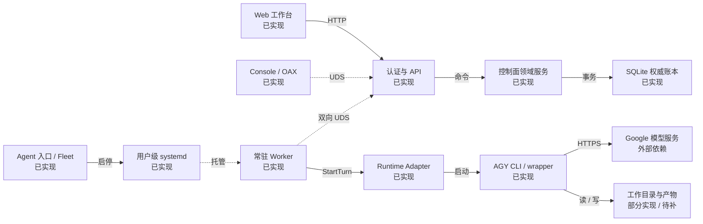
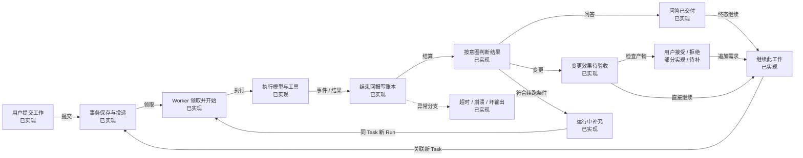
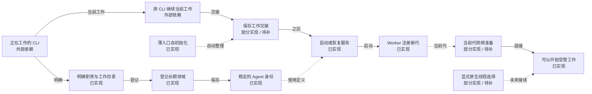
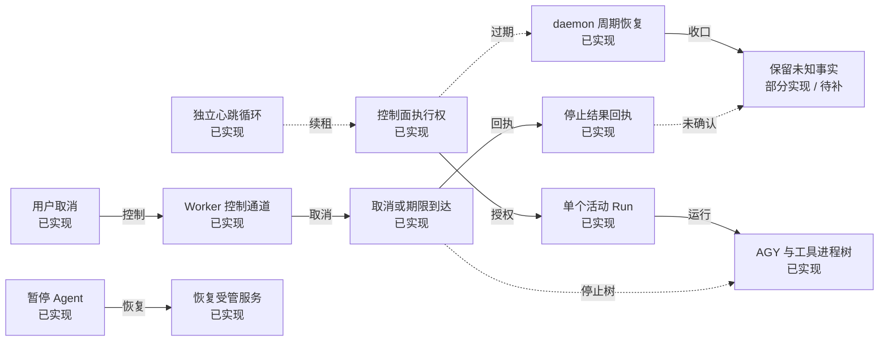
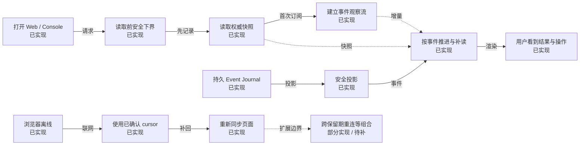
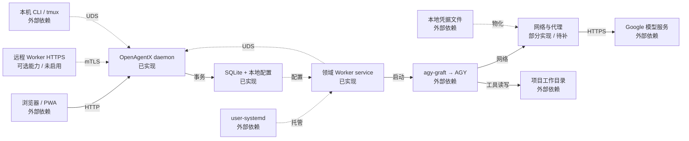
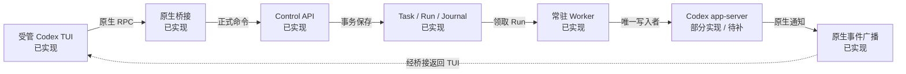

# OpenAgentX · 架构与关键流程

交互图：[打开 HTML 图册](current-architecture.html)。快照日期：2026-10-03。
本图描述 OpenAgentX 任务后台。交易、行情等属于受管领域及业务工作区；不声称券商、交易所或真实交易执行已经接通。

## 要点

- 控制面是一个 daemon；每个领域有独立 Worker service。API、领域服务不是分别部署的微服务。
- SQLite 保存 Task、Run、投递与审计等权威事实；内存 Broker 只用于唤醒。Worker 通过正式 API 工作，不直接写库。
- 每次 Run 冻结角色、工作目录、输入与期限。AGY 每轮启动 CLI；Codex 由常驻 app-server 管理 thread/turn。原生 TUI 的写入经桥接进入正式调度，关闭界面不会终止 Worker。
- 问答成功表示完整回复已交付；执行任务的业务效果需独立核验。人工接受是独立 review，不改写原始执行事实。
- AGY 保留历史验收；Codex 已装配并安装，来源、Web静态工件及网络重启 I 已通过。任务、迁入和原生交互 I 按覆盖表分别验收；精确取消和异常恢复仍待补。

## 当前版本与阅读方法

核对源码：`6576c559ae852304b04a7bf149583a471b112597`；当前安装工件来源：`6576c559ae852304b04a7bf149583a471b112597`。本图不是服务实时监控。后续文档提交不会自动改变安装来源。

实际安装二进制 SHA-256：`432cbd044902351670179e7eaaf463871f59bec0d274ed8810f49eab56d7fd39`。

证据入口：[AGY 历史安装来源（9434479）](../reports/validation/2026-10-02-agy-workflow/evidence/final-independent-9434479/result.json)、[AGY 历史安装 Web 日用证据](../reports/validation/2026-10-02-agy-workflow/evidence/installed-browser-9434479-daily01/README.md)、[AGY 22 组覆盖与未测边界](../reports/validation/2026-10-02-agy-workflow/COVERAGE.md)；Codex 本轮见 [2026-10-02 历史：Codex 当前验收覆盖](../reports/validation/2026-10-02-codex-workflow/COVERAGE.md)、[2026-10-02 历史：Codex 交付与安装边界](../reports/validation/2026-10-02-codex-workflow/DELIVERY.md)、[真实 Codex 主链独立核验](../reports/validation/2026-10-02-codex-workflow/evidence/real-workflow02/independent-verification.json)、[2026-10-02 历史：6b68eeb 安装来源、Web 与网络重启核验](../reports/validation/2026-10-02-codex-workflow/evidence/installed-provenance01/README.md)。AGY 历史证据按影响复用；Codex 安装来源/环境 I 不代表全部用户流程通过。

实现状态与证据强度是两条轴：**已实现**、**部分实现 / 待补**、**待实现**、**可选 / 未启用**、**外部依赖**；证据标注 **D**（确定性）、**R**（真实 Runtime）、**I**（已安装环境）。绿色不等于全部 E2E 通过。

HTML 每次只显示一个子图；点击节点可见职责、限制和引用。虚线区分控制与拟议关系，以箭头文字和节点状态为准。

## 01 · 总览：一项工作如何穿过整个系统

**谁接收指令，谁持有状态，谁真正执行？** 一个 daemon 保存权威状态；每个领域的 Worker 独立接单；外部 CLI 执行模型与工具。

[打开此图](current-architecture.html#overview)

| 节点 | 状态 | 关键职责 / 限制 | 证据范围 |
|---|---|---|---|
| Web 工作台 | 已实现 | 浏览器通过正式 HTTP API 提交任务、查看结果与控制取消。当前安装访问入口 127.0.0.1:18100。关闭浏览器不停止 Worker。 | 历史验收：AGY 既有 I＋R 日用；6b68eeb 的8项Web静态工件与HTTP响应 I 匹配；新版本交互验收另记。[浏览器观察与重连](../../web/src/main.jsx)、[AGY 历史安装 Web 日用证据](../reports/validation/2026-10-02-agy-workflow/evidence/installed-browser-9434479-daily01/README.md)、[2026-10-02 历史：6b68eeb 安装来源、Web 与网络重启核验](../reports/validation/2026-10-02-codex-workflow/evidence/installed-provenance01/README.md)、[2026-10-02 历史：Codex 当前验收覆盖](../reports/validation/2026-10-02-codex-workflow/COVERAGE.md) |
| 认证与 API | 已实现 | Web 使用 Cookie、RBAC、CSRF；Console 使用本地 UDS 与 CLI Token；Worker 使用其专用注册及写入约束。API 与领域服务处于同一 daemon。 | 源码已核对；真实覆盖见所列证据。[daemon 与 API 装配](../../cmd/openagentx/main.go)、[Overview 与安全观察投影](../../internal/api/panel/handler.go) |
| 控制面领域服务 | 已实现 | 处理任务、补充、取消、结果验收和网络工作流。服务模块共同运行在一个 daemon 内，不是独立部署的微服务。 | 源码已核对；真实覆盖见所列证据。[任务、补充与取消入口](../../internal/controlplane/command_service.go)、[网络测试、发布与应用](../../internal/controlplane/network_workflow_service.go)、[Task 内会话与输入冻结](../../internal/controlplane/worker_service.go) |
| SQLite 权威账本 | 已实现 | SQLite schema v3 保存 Task、Message、Mailbox、Run、SessionBinding、Worker 代次和 Journal，并新增外部会话绑定与持久消息表。复合变更由事务保持一致；external_session 消息不伪造 Worker/Run。 | AGY/Codex 历史事务与安装证据保留；本轮真实消息 API、v2副本升级v3旧数据行集合核验。[事务化执行账本](../../internal/persistence/sqlite/worker_execution_repository.go)、[外部绑定与消息持久化](../../internal/persistence/sqlite/external_session_repository.go)、[6576c559 当前安装与外部消息交付边界](../reports/validation/2026-10-03-external-session/DELIVERY.md)、[真实消息 API 与不创建 Worker/Run 的证据](../reports/validation/2026-10-03-external-session/evidence/README.md) |
| Console / OAX | 已实现 | Console 是正式 API 客户端。OAX pane 0 承载 TUI，overview 提供 Agent 导航。tmux 不承担任务路由、Runtime 身份或进程执行权。 | AGY 既有证据：I：80×24 PTY，完整结果、接受/拒绝、继续与重开。[Console Attach 与工作台](../../internal/cli/console/application.go)、[真实 Console 与空闲采样](../reports/validation/2026-10-02-agy-workflow/evidence/installed-17d5cd2-console01/README.md) |
| 常驻 Worker | 已实现 | 每个领域使用受管 Worker。心跳和控制循环独立于一次模型运行；单 Agent 当前最多一个活动 Run。完成任务后继续等待下一项。 | 源码已核对；真实覆盖见所列证据。[Worker 执行与控制循环](../../internal/worker/runner.go)、[安装入口、角色与故障恢复证据](../reports/validation/2026-10-02-agy-workflow/evidence/installed-17d5cd2-onboarding01-resume02/README.md) |
| Runtime Adapter | 已实现 | AGY 与 Codex adapter 共用冻结输入、Worker 与账本。AGY 每 Run 启动 CLI；Codex 由常驻 app-server 管理 thread/turn。6b68eeb 的 Runtime 主链验收作为历史保留；6576c559 已安装，本轮新增消息通道不代表原会话或 Runtime 全链重验。 | AGY：既有 R＋I；Codex：D＋隔离 R 主链，安装来源/环境 I。[AGY 进程与角色输入](../../internal/runtime/agy/adapter.go)、[Codex app-server 与取消边界](../../internal/runtime/codex/adapter.go)、[实际装配的 Runtime](../../internal/cli/worker/command.go)、[真实 Codex 主链独立核验](../reports/validation/2026-10-02-codex-workflow/evidence/real-workflow02/independent-verification.json)、[2026-10-02 历史：6b68eeb 安装来源、Web 与网络重启核验](../reports/validation/2026-10-02-codex-workflow/evidence/installed-provenance01/README.md)、[2026-10-02 历史：Codex 交付与安装边界](../reports/validation/2026-10-02-codex-workflow/DELIVERY.md)、[6576c559 当前安装与外部消息交付边界](../reports/validation/2026-10-03-external-session/DELIVERY.md) |
| AGY CLI / wrapper | 已实现 | 通过正式 agy-graft 启动 AGY。每个 Run 都启动受控 CLI 进程；同 Task 内可用已保存 conversation 续接。没有接管任意外部活 CLI 的入口。 | R＋I：使用真实 agy-graft 与 AGY。[AGY 进程与角色输入](../../internal/runtime/agy/adapter.go)、[Task 内会话与输入冻结](../../internal/controlplane/worker_service.go)、[AGY 历史安装 Web 日用证据](../reports/validation/2026-10-02-agy-workflow/evidence/installed-browser-9434479-daily01/README.md) |
| Agent 入口 / Fleet | 已实现 | 日常使用 agent add/open/status/pause/resume。新增 Codex join --prepare 与 open --native；离线准备不启动服务，原生写入仍进入正式调度。 | AGY：既有 I；Codex：D＋真实 PTY 准备，已安装help与服务来源 I。[登记与服务入口](../../internal/cli/fleet/agent.go)、[离线准备与交接入口](../../internal/cli/fleet/agent_join.go)、[Codex 登记与使用说明](../operations/codex-agent-entry.md)、[真实 PTY 离线准备证据](../reports/validation/2026-10-02-codex-workflow/evidence/codex-cli-join-20261002T074001Z/README.md)、[2026-10-02 历史：6b68eeb 安装来源、Web 与网络重启核验](../reports/validation/2026-10-02-codex-workflow/evidence/installed-provenance01/README.md) |
| 用户级 systemd | 已实现 | 后台服务独立于浏览器和终端。受管服务提供进程组清理及故障重启。agent add/start 使用 start，不等于默认已经 enable 开机启动。 | AGY 既有证据：I：服务启停、角色冻结、排队暂停、Worker 崩溃恢复。[登记与服务入口](../../internal/cli/fleet/agent.go)、[安装入口、角色与故障恢复证据](../reports/validation/2026-10-02-agy-workflow/evidence/installed-17d5cd2-onboarding01-resume02/README.md) |
| 工作目录与产物 | 部分实现 / 待补 | 工具真实读写 Agent 的工作目录。业务产物在文件系统，不因模型回复就被自动验证；当前 Web 没有统一产物预览/下载入口。 **待补：产物可读写且已实测；文件浏览与验收展示仍待改善** | 源码已核对；真实覆盖见所列证据。[AGY 历史安装 Web 日用证据](../reports/validation/2026-10-02-agy-workflow/evidence/installed-browser-9434479-daily01/README.md)、[日用操作指南](../operations/agy-daily-workflow.md) |
| Google 模型服务 | 外部依赖 | 模型推理由 AGY 依赖外部服务完成。代理与登录状态影响 Runtime 可用性；控制面并不直接代替 AGY 调用模型。图中不固定未核实的外部域名。 | 真实 AGY 链接通；供应商内部实现不在本工程内。[AGY 进程与角色输入](../../internal/runtime/agy/adapter.go)、[网络测试、发布与应用](../../internal/controlplane/network_workflow_service.go)、[AGY 历史安装 Web 日用证据](../reports/validation/2026-10-02-agy-workflow/evidence/installed-browser-9434479-daily01/README.md) |

- 主图仍是受管任务链；外部原会话消息通道见第03图“正在工作的CLI”旁注。消息API已验不等于原会话整链通过。
- 绿色代表能力已实现，不表示相关的所有边界用例全部通过。点击节点可见证据范围。
- Quote Service 等是受管领域与业务工作区；本图不声称券商、交易所或交易执行已接通。

## 02 · 工作流：从用户指令到可继续的结果

**“已受理”“执行结束”“用户验收”分别意味着什么？** Task 表示一项工作，Run 表示一次执行。问答交付与文件变更验收采用不同完成规则。

[打开此图](current-architecture.html#work)

| 节点 | 状态 | 关键职责 / 限制 | 证据范围 |
|---|---|---|---|
| 用户提交工作 | 已实现 | 选择问答 query 或执行任务 mutation。带幂等键提交；用户界面不直接调用模型。继续工作会携带父任务目标和结果摘要。 | 源码已核对；真实覆盖见所列证据。[任务、补充与取消入口](../../internal/controlplane/command_service.go)、[AGY 历史安装 Web 日用证据](../reports/validation/2026-10-02-agy-workflow/evidence/installed-browser-9434479-daily01/README.md) |
| 事务保存与投递 | 已实现 | 同一事务保存工作和投递记录并追加 Journal。返回 Task ID 只证明已受理。持久 Mailbox 是领取来源，Broker 仅加速唤醒。 | 源码已核对；真实覆盖见所列证据。[任务、补充与取消入口](../../internal/controlplane/command_service.go)、[事务化执行账本](../../internal/persistence/sqlite/worker_execution_repository.go)、[真实 AGY 主链与取消证据](../reports/validation/2026-10-02-agy-workflow/evidence/live-f3cd7a3-main01/REPORT.md) |
| Worker 领取并开始 | 已实现 | 验证当前执行权，创建 RunAttempt，冻结角色内容/hash、cwd、网络版本、参数与截止时间。后续修改职责不会改变本次 Run。 | 源码已核对；真实覆盖见所列证据。[Task 内会话与输入冻结](../../internal/controlplane/worker_service.go)、[安装入口、角色与故障恢复证据](../reports/validation/2026-10-02-agy-workflow/evidence/installed-17d5cd2-onboarding01-resume02/README.md) |
| 执行模型与工具 | 已实现 | AGY 启动 CLI；Codex 在明确 thread 中启动 turn。运行中补充进入正式控制与账本路径，不用向终端注入按键代替调度。 | AGY：既有 R＋I；Codex：隔离正式 API 三轮及独立产物核验。[AGY 进程与角色输入](../../internal/runtime/agy/adapter.go)、[Codex app-server 与取消边界](../../internal/runtime/codex/adapter.go)、[原生终端写入桥接](../../internal/nativebridge/bridge.go)、[真实 Codex 主链独立核验](../reports/validation/2026-10-02-codex-workflow/evidence/real-workflow02/independent-verification.json) |
| 结束回报写账本 | 已实现 | Worker 上报正式 TurnResult；事务同时处理 Run、Task、会话绑定与审计。空输出、坏 JSON、缺终态不能只凭 exit 0 当成功。 | 源码已核对；真实覆盖见所列证据。[事务化执行账本](../../internal/persistence/sqlite/worker_execution_repository.go)、[Task 内会话与输入冻结](../../internal/controlplane/worker_service.go)、[AGY 22 组覆盖与未测边界](../reports/validation/2026-10-02-agy-workflow/COVERAGE.md) |
| 按意图判断结果 | 已实现 | 问答依据完整最终回复交付；执行任务还涉及实际业务效果。Runtime succeeded 与 Task succeeded 不是一个断言。 | 源码已核对；真实覆盖见所列证据。[问答与业务效果判定](../../internal/domain/task_completion.go)、[Task 内会话与输入冻结](../../internal/controlplane/worker_service.go)、[独立的人工结果验收](../../internal/api/panel/task_review.go)、[AGY 历史安装 Web 日用证据](../reports/validation/2026-10-02-agy-workflow/evidence/installed-browser-9434479-daily01/README.md) |
| 问答已交付 | 已实现 | 合法成功终态及完整 FinalReply 可结算 query_result_delivered。它证明回复交付，不证明答案正确，也不提供只读沙箱。 | AGY 既有证据：I＋R：材料及职责标记的精确问答。[问答与业务效果判定](../../internal/domain/task_completion.go)、[AGY 历史安装 Web 日用证据](../reports/validation/2026-10-02-agy-workflow/evidence/installed-browser-9434479-daily01/README.md)、[AGY 22 组覆盖与未测边界](../reports/validation/2026-10-02-agy-workflow/COVERAGE.md) |
| 变更效果待验收 | 已实现 | 当前 AGY 未确认副作用（SideEffectsKnown=false）时，mutation 保留 uncertain/business_effect_unverified。Runtime 报告效果已知时可为 succeeded/mutation_effects_known，仍不等于系统独立业务验收。真实文件需另行检查。 | AGY 既有证据：I＋R：报告实际生成；原不确定执行记录保留。[问答与业务效果判定](../../internal/domain/task_completion.go)、[AGY 历史安装 Web 日用证据](../reports/validation/2026-10-02-agy-workflow/evidence/installed-browser-9434479-daily01/README.md)、[独立的人工结果验收](../../internal/api/panel/task_review.go) |
| 用户接受 / 拒绝 | 部分实现 / 待补 | 验收结论绑定对应 Run/版本，不改写原执行事实。当前详情可见用户已验收，列表仍可能显示 uncertain，这是已知体验欠缺。 **待补：验收落账已实现；列表与详情表达仍需统一** | 源码已核对；真实覆盖见所列证据。[独立的人工结果验收](../../internal/api/panel/task_review.go)、[AGY 历史安装 Web 日用证据](../reports/validation/2026-10-02-agy-workflow/evidence/installed-browser-9434479-daily01/README.md) |
| 继续此工作 | 已实现 | 继续创建关联的新 Task，复用目标与选定结果摘要；不自动继承父任务的原生 conversation，也不重跑原任务。 终态后可直接继续，不要求先接受或拒绝结果。 | AGY 既有证据：I＋R：原文保留后追加，B parent=A，各一 Run。[任务、补充与取消入口](../../internal/controlplane/command_service.go)、[AGY 历史安装 Web 日用证据](../reports/validation/2026-10-02-agy-workflow/evidence/installed-browser-9434479-daily01/README.md) |
| 运行中补充 | 已实现 | 符合结算条件时，已提交补充由下一 Run 消费；成功或明确失败可继续，效果未确认的 mutation 另要求完整有效回复。未知停止、坏协议结果或取消中不自动续跑。 | AGY 既有证据：R：query / mutation 补充与幂等消费；I 未单独重测。[真实 AGY 主链与取消证据](../reports/validation/2026-10-02-agy-workflow/evidence/live-f3cd7a3-main01/REPORT.md)、[95 秒续租与补充独立复核](../reports/validation/2026-10-02-agy-workflow/evidence/live-17d5cd2-lease02/REPORT.md)、[Task 内会话与输入冻结](../../internal/controlplane/worker_service.go) |
| 超时 / 崩溃 / 坏输出 | 已实现 | 超时、协议异常或失联时保留可信诊断与原始账本；是否停止进程要另行取证。不会靠重发旧任务制造“恢复成功”。 | 源码已核对；真实覆盖见所列证据。[AGY 22 组覆盖与未测边界](../reports/validation/2026-10-02-agy-workflow/COVERAGE.md)、[真实超时与后续任务证据](../reports/validation/2026-10-02-agy-workflow/evidence/live-f3cd7a3-timeout01/REPORT.md)、[周期恢复与裸进程清理边界](../reports/validation/2026-10-02-agy-workflow/evidence/live-17d5cd2-periodic01/REPORT.md) |

- query = 回复交付；mutation = 涉及效果。query 本身不是只读权限控制。
- 同 Task 补充进入下一 Run；“继续此工作”新建关联 Task，无需先验收。
- 人工接受和系统独立验证保持不同来源；文件精确字节与进程停止由验收证据核对。

## 03 · 领域初始化：从正在工作的 CLI 到长期领域

**哪些可以今天做到，哪些仍需补入口？** 长期保存的是领域身份、职责和工作目录。已有 CLI 对话目前通过明确交接接续。

[打开此图](current-architecture.html#init)

| 节点 | 状态 | 关键职责 / 限制 | 证据范围 |
|---|---|---|---|
| 正在工作的 CLI | 外部依赖 | 已有 CLI 可按受管模式 join --prepare 交接，也可用 external_session 保留原宿主/thread，仅经本地 UDS 进行 bind/send/inbox/ack/reply、去重和审计。消息模式不启动 Worker、不迁移历史、不伪造 Run。rhythm/oneaxe-pay 已绑定用户原 thread，但原会话尚未初始化，业务消息为0。 **待补：Desktop 自动 queue/wakeup 受阻；尚未证明原会话收信、已读、回复及续办整链** | 受管 prepare 保留既有证据；本轮仅真实消息 API 已验，绑定不等于原宿主已连接。[离线准备与交接入口](../../internal/cli/fleet/agent_join.go)、[真实 PTY 离线准备证据](../reports/validation/2026-10-02-codex-workflow/evidence/codex-cli-join-20261002T074001Z/README.md)、[外部原会话消息通道操作指南](../operations/external-session-entry.md)、[6576c559 当前安装与外部消息交付边界](../reports/validation/2026-10-03-external-session/DELIVERY.md)、[真实消息 API 与不创建 Worker/Run 的证据](../reports/validation/2026-10-03-external-session/evidence/README.md) |
| 明确职责与工作目录 | 已实现 | 用户或当前 Agent 编写长期职责与交接文件。prepare 保存私密快照，受管 Run 冻结角色/cwd；不热改当前对话的系统提示。 | 源码已核对；真实覆盖见所列证据。[Task 内会话与输入冻结](../../internal/controlplane/worker_service.go)、[离线准备与交接入口](../../internal/cli/fleet/agent_join.go)、[Codex 登记与使用说明](../operations/codex-agent-entry.md) |
| 登记长期领域 | 已实现 | 保存身份、Profile、Worker 与 Fleet 配置，可导入已有 OpenAgentX identity / Worker YAML。此选项不启动 Worker，但可能启动 daemon 并完成登录。 | AGY 既有证据：源码＋已有入口 D/I；活 CLI 自注册专项未测。[登记与服务入口](../../internal/cli/fleet/agent.go)、[安装入口、角色与故障恢复证据](../reports/validation/2026-10-02-agy-workflow/evidence/installed-17d5cd2-onboarding01-resume02/README.md) |
| 稳定的 Agent 身份 | 已实现 | 身份和职责可跨进程保存。相同定义重复添加幂等，冲突不会静默覆盖。长期身份不要求永远复用同一个聊天 session。 | 源码已核对；真实覆盖见所列证据。[登记与服务入口](../../internal/cli/fleet/agent.go)、[安装入口、角色与故障恢复证据](../reports/validation/2026-10-02-agy-workflow/evidence/installed-17d5cd2-onboarding01-resume02/README.md) |
| 原 CLI 继续当前工作 | 外部依赖 | 原 CLI 完成当前 turn 后进入空闲交接。原 thread 必须显式选择，不能猜测 Desktop 会话或只凭 PID 接管；任意 PTY 迁移仍未支持。 | AGY 既有证据：源码约束；不宣称任意活 CLI 接管。[Codex 登记与使用说明](../operations/codex-agent-entry.md)、[Codex app-server 与取消边界](../../internal/runtime/codex/adapter.go) |
| 保存工作交接 | 部分实现 / 待补 | join --prepare 保存 ROLE/HANDOFF 私密快照及 local_prepared 回执；身份/Fleet 暂不就绪。当前轮结束后显式 resume，Worker 和网络通过后才启用 Fleet。 **待补：完整自动总结与任意 CLI 历史迁移不在本轮能力内** | R：离线准备幂等、零 connect/子程序启动；激活全链按覆盖表。[离线准备与交接入口](../../internal/cli/fleet/agent_join.go)、[真实 PTY 离线准备证据](../reports/validation/2026-10-02-codex-workflow/evidence/codex-cli-join-20261002T074001Z/README.md)、[Codex 登记与使用说明](../operations/codex-agent-entry.md) |
| 启动或恢复服务 | 已实现 | 交接后显式启动目标 Worker，检查在线状态并准备网络。底层调用 user-systemd，不通过向终端注入业务指令执行。 | 源码已核对；真实覆盖见所列证据。[登记与服务入口](../../internal/cli/fleet/agent.go)、[安装入口、角色与故障恢复证据](../reports/validation/2026-10-02-agy-workflow/evidence/installed-17d5cd2-onboarding01-resume02/README.md) |
| Worker 注册新代 | 已实现 | Worker 为已存在的领域身份注册实例和 generation。网络旧代回执不能证明当前代已就绪。 | 源码已核对；真实覆盖见所列证据。[Task 内会话与输入冻结](../../internal/controlplane/worker_service.go)、[安装入口、角色与故障恢复证据](../reports/validation/2026-10-02-agy-workflow/evidence/installed-17d5cd2-onboarding01-resume02/README.md) |
| 薄入口自初始化 | 已实现 | Codex join 复用既有领域登记，默认只离线准备；薄技能指导职责、HANDOFF 和空闲交接。常驻监听由宿主承担，无需模型每轮 poll。 | 源码＋D；R：真实 PTY prepare 及重复调用；技能未全局安装。[领域 Agent 自初始化薄技能](../../skills/openagentx-join/SKILL.md)、[离线准备与交接入口](../../internal/cli/fleet/agent_join.go)、[真实 PTY 离线准备证据](../reports/validation/2026-10-02-codex-workflow/evidence/codex-cli-join-20261002T074001Z/README.md) |
| 显式原生线程选择 | 部分实现 / 待补 | Codex 可显式选择 thread/endpoint；Task 的 native session 选择与投递同事务，thread 创建后受 fencing 保护持久绑定。同一会话写入经 Worker 仲裁。AGY 外部 conversation 迁入仍待实现。 **待补：不自动发现 Desktop 活会话；不承诺任意外部 CLI 接管** | D：会话选择与竞争；R：同 thread 后续任务。[Codex app-server 与取消边界](../../internal/runtime/codex/adapter.go)、[原生终端写入桥接](../../internal/nativebridge/bridge.go)、[事务化执行账本](../../internal/persistence/sqlite/worker_execution_repository.go)、[关闭原生终端后同线程接单](../reports/validation/2026-10-02-codex-workflow/evidence/real-native-next01/verdict.json)、[原生桥接确定性验证与首败](../reports/validation/2026-10-02-codex-workflow/evidence/deterministic-native/README.md) |
| 当前代网络准备 | 部分实现 / 待补 | inherit/direct 经正式测试与当前代应用。Codex 从持久代理配置保存私密 env；重启后 Worker/app-server 环境、CODEX_HOME 和 NO_PROXY 保持，正式网络绑定匹配新代且ready。 **待补：Codex named_profile 仍拒绝；坏代理修复和其他网络组合按覆盖表** | R＋I：实际进程环境及一次Worker重启持久性；不代表外网流量。[网络测试、发布与应用](../../internal/controlplane/network_workflow_service.go)、[持久代理与私密环境](../../internal/cli/fleet/agent_environment.go)、[实际 Worker 与 app-server 环境核验](../reports/validation/2026-10-02-codex-workflow/evidence/network-live01/README.md)、[2026-10-02 历史：6b68eeb 安装来源、Web 与网络重启核验](../reports/validation/2026-10-02-codex-workflow/evidence/installed-provenance01/README.md) |
| 可以开始受管工作 | 已实现 | 身份、Worker 和网络满足条件后接受工作；默认新 Task 不猜测旧原生历史，选择已有 native thread 必须显式传入并由账本约束。 | 源码已核对；真实覆盖见所列证据。[登记与服务入口](../../internal/cli/fleet/agent.go)、[Codex app-server 与取消边界](../../internal/runtime/codex/adapter.go)、[真实 Codex 主链独立核验](../reports/validation/2026-10-02-codex-workflow/evidence/real-workflow02/independent-verification.json) |

- --configure-only 只抑制 Worker 启动，不代表零配置写入或 daemon 不启动。
- 新增 external_session：仅local UDS持久通信，不启动Worker/Run。active只是绑定有效，pending只是入库，ack只是显式已读；Desktop自动queue/wakeup尚未接通。
- 虚线“拟议”路径尚未接通；旧 agent attach/bootstrap/launch 不是当前支持入口。

## 04 · AGY 运行：AGY 的运行、取消与恢复

**停止请求、物理停止和账本恢复分别由谁负责？** 本子图展示 AGY 已实测的控制和恢复路径。Codex 共用控制面，但取消及未决状态的限制须另看 Codex 原生子图。

[打开此图](current-architecture.html#runtime)

| 节点 | 状态 | 关键职责 / 限制 | 证据范围 |
|---|---|---|---|
| 独立心跳循环 | 已实现 | Worker 不依靠模型输出证明存活；运行、控制与心跳分开。静默工具也需要保持 Worker/Run lease。 | AGY 既有证据：R：95秒工具、7检查点、约90秒续租；原夹具FAIL仍保留。[Worker 执行与控制循环](../../internal/worker/runner.go)、[95 秒续租与补充独立复核](../reports/validation/2026-10-02-agy-workflow/evidence/live-17d5cd2-lease02/REPORT.md) |
| 控制面执行权 | 已实现 | 当前代、租约和 fencing 限定有效执行权。旧实例迟到的写入必须被拒绝，不能覆盖新一代状态。 | 源码已核对；真实覆盖见所列证据。[Task 内会话与输入冻结](../../internal/controlplane/worker_service.go)、[事务化执行账本](../../internal/persistence/sqlite/worker_execution_repository.go) |
| 单个活动 Run | 已实现 | 单领域的有效活动 Run受约束。默认运行期限30分钟，可配置；心跳续租不会延长这次任务的截止时间。 | 源码已核对；真实覆盖见所列证据。[Task 内会话与输入冻结](../../internal/controlplane/worker_service.go)、[Worker 执行与控制循环](../../internal/worker/runner.go)、[AGY 22 组覆盖与未测边界](../reports/validation/2026-10-02-agy-workflow/COVERAGE.md) |
| AGY 与工具进程树 | 已实现 | Adapter 启动 AGY及其工具链并保留取消控制。取消不会撤销已经写出的文件。直接强杀裸 Worker 与systemd受管清理不同。 | AGY：源码已核对；真实覆盖见所列证据。[AGY 进程与角色输入](../../internal/runtime/agy/adapter.go)、[真实 AGY 主链与取消证据](../reports/validation/2026-10-02-agy-workflow/evidence/live-f3cd7a3-main01/REPORT.md)、[安装入口、角色与故障恢复证据](../reports/validation/2026-10-02-agy-workflow/evidence/installed-17d5cd2-onboarding01-resume02/README.md) |
| 用户取消 | 已实现 | 取消先记录请求。没有活动 Run 时，取消事务可同时收口 queued/waiting_input 与 Mailbox；活动 Run 经独立控制通道请求实际停止。运行补充的后续执行见工作流子图。 | 源码已核对；真实覆盖见所列证据。[任务、补充与取消入口](../../internal/controlplane/command_service.go)、[真实 AGY 主链与取消证据](../reports/validation/2026-10-02-agy-workflow/evidence/live-f3cd7a3-main01/REPORT.md)、[AGY 22 组覆盖与未测边界](../reports/validation/2026-10-02-agy-workflow/COVERAGE.md) |
| Worker 控制通道 | 已实现 | Worker 处理持久控制指令及任务取消，活动模型不能阻塞控制循环。queued steer和进程信号取消是当前AGY支持形式。 | AGY：源码已核对；真实覆盖见所列证据。[Worker 执行与控制循环](../../internal/worker/runner.go)、[AGY 进程与角色输入](../../internal/runtime/agy/adapter.go) |
| 取消或期限到达 | 已实现 | 显式取消触发进程信号与后代清理。超时也清理进程，但不能因此把未知业务效果判为成功或一概记为用户取消。 | AGY：R：活动取消全树观测上限约4秒；35秒timeout后可接下一query。[AGY 进程与角色输入](../../internal/runtime/agy/adapter.go)、[真实超时与后续任务证据](../reports/validation/2026-10-02-agy-workflow/evidence/live-f3cd7a3-timeout01/REPORT.md)、[真实 AGY 主链与取消证据](../reports/validation/2026-10-02-agy-workflow/evidence/live-f3cd7a3-main01/REPORT.md) |
| 停止结果回执 | 已实现 | 显式取消且真实进程停止确认，才正确收口canceled；清理失败、失联或结果无法确认时保留uncertain。UI区分请求与确认。 | AGY：源码已核对；真实覆盖见所列证据。[真实 AGY 主链与取消证据](../reports/validation/2026-10-02-agy-workflow/evidence/live-f3cd7a3-main01/REPORT.md)、[真实超时与后续任务证据](../reports/validation/2026-10-02-agy-workflow/evidence/live-f3cd7a3-timeout01/REPORT.md)、[AGY 22 组覆盖与未测边界](../reports/validation/2026-10-02-agy-workflow/COVERAGE.md) |
| 暂停 Agent | 已实现 | pause采用drain/stop语义：当前工作完成后Worker退出；排队任务保持未执行。它不是冻结一个模型进程。 | AGY：源码已核对；真实覆盖见所列证据。[登记与服务入口](../../internal/cli/fleet/agent.go)、[安装入口、角色与故障恢复证据](../reports/validation/2026-10-02-agy-workflow/evidence/installed-17d5cd2-onboarding01-resume02/README.md) |
| 恢复受管服务 | 已实现 | AGY 的 resume 启动新 Worker 代次；systemd受管崩溃清理已实测，不重放旧不确定任务。Codex 只能由空闲/正常关闭状态恢复；未决执行会持续隔离。 | AGY 既有证据：I：排队B无Run→恢复后单Run；崩溃后新query成功。[登记与服务入口](../../internal/cli/fleet/agent.go)、[安装入口、角色与故障恢复证据](../reports/validation/2026-10-02-agy-workflow/evidence/installed-17d5cd2-onboarding01-resume02/README.md)、[Codex app-server 与取消边界](../../internal/runtime/codex/adapter.go)、[2026-10-02 历史：6b68eeb 安装来源、Web 与网络重启核验](../reports/validation/2026-10-02-codex-workflow/evidence/installed-provenance01/README.md) |
| daemon 周期恢复 | 已实现 | daemon启动及周期调用同一保守恢复逻辑，按失效租约收口旧Task/Run。周期仅负责账本，不保证裸Worker的孤儿子进程自动被杀。 | AGY 既有证据：R：42.12秒自动收口；I服务故障约32.66秒。[daemon 周期恢复](../../cmd/openagentx/recovery.go)、[周期恢复与裸进程清理边界](../reports/validation/2026-10-02-agy-workflow/evidence/live-17d5cd2-periodic01/REPORT.md) |
| 保留未知事实 | 部分实现 / 待补 | AGY 旧任务保留uncertain，新代就绪后可接新工作；裸进程R遗留子进程曾由测试精确清理。Codex 的 running/starting/uncertain 状态重启后会持续隔离，普通resume不可清除。 **待补：AGY裸进程自动清理未证明；Codex未决状态的受控恢复入口待补** | AGY：源码已核对；真实覆盖见所列证据。[周期恢复与裸进程清理边界](../reports/validation/2026-10-02-agy-workflow/evidence/live-17d5cd2-periodic01/REPORT.md)、[安装入口、角色与故障恢复证据](../reports/validation/2026-10-02-agy-workflow/evidence/installed-17d5cd2-onboarding01-resume02/README.md)、[Codex app-server 与取消边界](../../internal/runtime/codex/adapter.go)、[2026-10-02 历史：Codex 当前验收覆盖](../reports/validation/2026-10-02-codex-workflow/COVERAGE.md) |

- 本图取消、超时、崩溃恢复和耗时数据均来自 AGY 既有证据，不套用到 Codex。
- Codex 已验证空闲 Worker 重启后的来源与网络持久性；这不等于异常执行后解除隔离。
- Codex 的精确取消和异常恢复缺口见原生子图及覆盖矩阵。

## 05 · 观察与重连：页面如何得到可信的当前状态

**刷新、断网和历史任务很多时，怎样避免丢结果？** 先读安全下界，再读快照；第一次从下界订阅，重连从已经确认的事件序号继续。

[打开此图](current-architecture.html#observe)

| 节点 | 状态 | 关键职责 / 限制 | 证据范围 |
|---|---|---|---|
| 打开 Web / Console | 已实现 | 登录成功与网络可达分别判断。Web初次session/overview暂时失败可重试；离线禁写，不把请求暗中排队后重发。 | 源码已核对；真实覆盖见所列证据。[浏览器观察与重连](../../web/src/main.jsx)、[AGY 历史安装 Web 日用证据](../reports/validation/2026-10-02-agy-workflow/evidence/installed-browser-9434479-daily01/README.md)、[AGY 22 组覆盖与未测边界](../reports/validation/2026-10-02-agy-workflow/COVERAGE.md) |
| 读取前安全下界 | 已实现 | Overview在读取任何投影之前采集安全下界。该值可用于首次订阅；不能把读完后latest_sequence当作首次安全起点。 | 源码已核对；真实覆盖见所列证据。[Overview 与安全观察投影](../../internal/api/panel/handler.go)、[前端游标规则](../../web/src/task-observation-state.js)、[AGY 历史安装 Web 日用证据](../reports/validation/2026-10-02-agy-workflow/evidence/installed-browser-9434479-daily01/README.md) |
| 读取权威快照 | 已实现 | 按当前数据库状态读取界面需要的投影。不是对所有投影宣称事务级快照，读取期间出现的新事件通过回放补齐。 | 源码已核对；真实覆盖见所列证据。[Overview 与安全观察投影](../../internal/api/panel/handler.go)、[浏览器观察与重连](../../web/src/main.jsx) |
| 建立事件观察流 | 已实现 | 第一次SSE使用live_after_sequence；后续使用已确认cursor与原生Last-Event-ID语义。旧历史数据不再强制从0回放。 | AGY 既有证据：I：267881首连在线；旧from0循环失败原件保留。[前端游标规则](../../web/src/task-observation-state.js)、[浏览器观察与重连](../../web/src/main.jsx)、[AGY 历史安装 Web 日用证据](../reports/validation/2026-10-02-agy-workflow/evidence/installed-browser-9434479-daily01/README.md) |
| 持久 Event Journal | 已实现 | 事件由控制面事务持久记录。SQLite当前状态是权威；Journal用于审计与增量观察，不要求全量事件重放重建状态。 | 源码已核对；真实覆盖见所列证据。[事务化执行账本](../../internal/persistence/sqlite/worker_execution_repository.go)、[Overview 与安全观察投影](../../internal/api/panel/handler.go) |
| 安全投影 | 已实现 | 通过认证后的Observe API输出投影。模型输出与诊断并不应携带秘密。投影错误不能被静默跳过并伪称已同步。 | 源码已核对；真实覆盖见所列证据。[Overview 与安全观察投影](../../internal/api/panel/handler.go)、[AGY 22 组覆盖与未测边界](../reports/validation/2026-10-02-agy-workflow/COVERAGE.md) |
| 按事件推进与补读 | 已实现 | SSE建立/恢复后重新读取Overview、列表和已选Task以补齐；页面保留确认过的游标。新快照不会跳过离线期间事件。 | 源码已核对；真实覆盖见所列证据。[浏览器观察与重连](../../web/src/main.jsx)、[前端游标规则](../../web/src/task-observation-state.js)、[AGY 历史安装 Web 日用证据](../reports/validation/2026-10-02-agy-workflow/evidence/installed-browser-9434479-daily01/README.md) |
| 用户看到结果与操作 | 已实现 | 页面分别显示Run结果、Task事实和人工验收。结果已返回并不自动等于业务验证完成；关闭再打开不创建新Task。 | 源码已核对；真实覆盖见所列证据。[AGY 历史安装 Web 日用证据](../reports/validation/2026-10-02-agy-workflow/evidence/installed-browser-9434479-daily01/README.md)、[独立的人工结果验收](../../internal/api/panel/task_review.go)、[真实 Console 与空闲采样](../reports/validation/2026-10-02-agy-workflow/evidence/installed-17d5cd2-console01/README.md) |
| 浏览器离线 | 已实现 | 真实Offline期间Worker仍可执行任务。浏览器恢复后不自动提交离线草稿；用户要明确再次发送。 | AGY 既有证据：I：离线时后台完成追加；隔离R：草稿不自动提交。[AGY 历史安装 Web 日用证据](../reports/validation/2026-10-02-agy-workflow/evidence/installed-browser-9434479-daily01/README.md)、[AGY 22 组覆盖与未测边界](../reports/validation/2026-10-02-agy-workflow/COVERAGE.md) |
| 使用已确认 cursor | 已实现 | 已确认267966后断网，恢复仍从267966请求，而不是跳到新Overview的268049。这是该批实测数值。 | AGY 既有证据：I：重连补回期间可投影事件与完整结果。[前端游标规则](../../web/src/task-observation-state.js)、[AGY 历史安装 Web 日用证据](../reports/validation/2026-10-02-agy-workflow/evidence/installed-browser-9434479-daily01/README.md) |
| 重新同步页面 | 已实现 | 恢复online后看见追加结果；刷新仍显示验收结论，同Worker随后成功完成新query。 | 源码已核对；真实覆盖见所列证据。[AGY 历史安装 Web 日用证据](../reports/validation/2026-10-02-agy-workflow/evidence/installed-browser-9434479-daily01/README.md) |
| 跨保留期重连等组合 | 部分实现 / 待补 | 当前真实验证覆盖整网Offline及首连暂时503。仅切断SSE、跨retention清理边界与全部多Agent切换组合仍需专项验证/完善。 **待补：未完成全组合验证，不把已测Offline扩成全部网络场景PASS** | 源码已核对；真实覆盖见所列证据。[AGY 22 组覆盖与未测边界](../reports/validation/2026-10-02-agy-workflow/COVERAGE.md) |

- 这里展示观察流程，不会对正在运行的产品发请求；图本身是离线架构文档。
- SSE是观察通道；用户命令仍走正式写API。退出浏览器或Console不停止Worker。
- 就绪原因来自身份、Worker和当前代网络事实；HTTP 200不等于用户已经能开始工作。

## 06 · 外部依赖：进程、存储、网络与部署边界

**运行依赖哪些外部东西，哪些只是可选能力？** 常态运行依赖本机 daemon、SQLite、受管 Worker、AGY 与外部模型服务；远程和其他Runtime另行标注。

[打开此图](current-architecture.html#dependencies)

| 节点 | 状态 | 关键职责 / 限制 | 证据范围 |
|---|---|---|---|
| 浏览器 / PWA | 外部依赖 | React前端构建后作为静态工件由daemon提供。Node/npm用于前端开发构建，不是已安装daemon执行任务所需的独立服务。 | 历史验收：6b68eeb Web静态工件 I；AGY旧版日用交互证据保留；新版本交互逐项验收。[daemon 与 API 装配](../../cmd/openagentx/main.go)、[2026-10-02 历史：6b68eeb 安装来源、Web 与网络重启核验](../reports/validation/2026-10-02-codex-workflow/evidence/installed-provenance01/README.md)、[AGY 历史安装 Web 日用证据](../reports/validation/2026-10-02-agy-workflow/evidence/installed-browser-9434479-daily01/README.md)、[2026-10-02 历史：Codex 当前验收覆盖](../reports/validation/2026-10-02-codex-workflow/COVERAGE.md) |
| OpenAgentX daemon | 已实现 | 当前安装来源为 6576c559，数据库 schema v3。本机 HTTP 服务 Web 与用户 API；external_session 的 bind/send/inbox/ack/reply 仅开放在本地 UDS。6b68eeb 的进程/Web/Runtime 验收属于历史证据。 | 本轮安装与消息 API 证据见外部会话交付；旧版 Runtime/Web 验收不扩为原会话整链。[daemon 与 API 装配](../../cmd/openagentx/main.go)、[仅本地 UDS 的外部消息 API](../../internal/api/external/handler.go)、[6576c559 当前安装与外部消息交付边界](../reports/validation/2026-10-03-external-session/DELIVERY.md)、[2026-10-02 历史：6b68eeb 安装来源、Web 与网络重启核验](../reports/validation/2026-10-02-codex-workflow/evidence/installed-provenance01/README.md) |
| 远程 Worker HTTPS | 可选能力 / 未启用 | 代码提供受限Worker API、mTLS身份映射和远程传输；当前本机部署未启用远程listener。本图不把它作为默认依赖。 | 有实现及既有协议测试；本轮未做远程真实验收。[远程 Worker 路由边界](../../internal/api/workerapi/handler.go)、[daemon 与 API 装配](../../cmd/openagentx/main.go) |
| Google 模型服务 | 外部依赖 | 真实AGY调用依赖模型服务可用性、AGY登录及所选模型。图不包含供应商内部架构，也不声称所有模型/effort参数已逐一验证。 | 源码已核对；真实覆盖见所列证据。[AGY 历史安装 Web 日用证据](../reports/validation/2026-10-02-agy-workflow/evidence/installed-browser-9434479-daily01/README.md)、[AGY 22 组覆盖与未测边界](../reports/validation/2026-10-02-agy-workflow/COVERAGE.md) |
| 本机 CLI / tmux | 外部依赖 | Console 使用 UDS；受管 Codex TUI 连接本地原生桥接。业务写入走 Control API/Task/Run，tmux 和 TUI 退出均不承担 Worker 存活责任。 | 源码已核对；真实覆盖见所列证据。[Console Attach 与工作台](../../internal/cli/console/application.go)、[原生终端入口](../../internal/cli/fleet/agent_native.go)、[原生终端写入桥接](../../internal/nativebridge/bridge.go)、[关闭原生终端后同线程接单](../reports/validation/2026-10-02-codex-workflow/evidence/real-native-next01/verdict.json) |
| 领域 Worker service | 已实现 | 当前入口采用一个领域身份一个受管Worker，共用daemon。Worker调用adapter，不直接绕过daemon修改SQLite。 | 源码已核对；真实覆盖见所列证据。[Worker 执行与控制循环](../../internal/worker/runner.go)、[安装入口、角色与故障恢复证据](../reports/validation/2026-10-02-agy-workflow/evidence/installed-17d5cd2-onboarding01-resume02/README.md) |
| agy-graft → AGY | 外部依赖 | wrapper/实际CLI是独立运行依赖；网络环境由受控配置准备。AGY执行工具、读写workspace，再回传结构化结果。 | 源码已核对；真实覆盖见所列证据。[AGY 进程与角色输入](../../internal/runtime/agy/adapter.go)、[真实 AGY 主链与取消证据](../reports/validation/2026-10-02-agy-workflow/evidence/live-f3cd7a3-main01/REPORT.md) |
| 网络与代理 | 部分实现 / 待补 | 网络设置保存、正式测试和当前代应用是独立阶段。Codex 代理从持久配置进入私密 env，实际 Worker/app-server 已匹配；本地 provider 被 NO_PROXY 覆盖。AGY 命名 profile 恢复边界保留。 **待补：配置覆盖不能替代实际流量证明；Codex named_profile 未开放** | AGY：既有证据；Codex：隔离 R 与正式 I 重启前后进程环境。[网络测试、发布与应用](../../internal/controlplane/network_workflow_service.go)、[持久代理与私密环境](../../internal/cli/fleet/agent_environment.go)、[实际 Worker 与 app-server 环境核验](../reports/validation/2026-10-02-codex-workflow/evidence/network-live01/README.md)、[2026-10-02 历史：6b68eeb 安装来源、Web 与网络重启核验](../reports/validation/2026-10-02-codex-workflow/evidence/installed-provenance01/README.md) |
| user-systemd | 外部依赖 | 托管daemon和Worker。日用入口启动目标service，退出页面不影响后台；开机自启/用户linger取决于实际配置。 | 源码已核对；真实覆盖见所列证据。[登记与服务入口](../../internal/cli/fleet/agent.go)、[安装入口、角色与故障恢复证据](../reports/validation/2026-10-02-agy-workflow/evidence/installed-17d5cd2-onboarding01-resume02/README.md) |
| SQLite + 本地配置 | 已实现 | SQLite schema v3 保存原有任务账本及外部会话绑定/消息，消息支持去重与 Journal。identity、ROLE、Worker YAML、Fleet 等仍在本地文件；外部消息模式不创建 Worker 或 Run，业务产物另存。 | 源码已核对；真实覆盖见所列证据。[事务化执行账本](../../internal/persistence/sqlite/worker_execution_repository.go)、[外部绑定与消息持久化](../../internal/persistence/sqlite/external_session_repository.go)、[6576c559 当前安装与外部消息交付边界](../reports/validation/2026-10-03-external-session/DELIVERY.md)、[真实消息 API 与不创建 Worker/Run 的证据](../reports/validation/2026-10-03-external-session/evidence/README.md) |
| 项目工作目录 | 外部依赖 | 由Agent Profile固定cwd。需要额外业务API/交易工具时，它们是该任务工具链的额外依赖，是否接通要各自验收。 | 源码已核对；真实覆盖见所列证据。[Task 内会话与输入冻结](../../internal/controlplane/worker_service.go)、[AGY 历史安装 Web 日用证据](../reports/validation/2026-10-02-agy-workflow/evidence/installed-browser-9434479-daily01/README.md) |
| 本地凭据文件 | 外部依赖 | CLI登录、AGY登录与网络secret有各自边界。网络secret为本地受权限保护文件，不在图里展示值，不画成已接入外部Vault。 | 源码已核对；真实覆盖见所列证据。[网络测试、发布与应用](../../internal/controlplane/network_workflow_service.go)、[daemon 与 API 装配](../../cmd/openagentx/main.go) |

- 当前未装配完整ACP生产路径；CodeBuddy代码保留，本轮未增加专项/真实验收。
- 组织/岗位/AuthorityPolicy模型与入口RBAC不同；完整组织业务授权和自主委派仍未贯通。
- 额外Nginx、公网入口、远程Worker、交易服务均不是本机AGY日用链的默认已启用依赖。

## 07 · Codex 原生：保留原生交互，写入进入正式调度

**原生 TUI 如何共享线程而不绕过 Task / Run？** 准备、空闲交接、明确线程、受管执行；界面可以关闭，Worker 继续接单。取消必须核验实际工具停止。

[打开此图](current-architecture.html#native)

| 节点 | 状态 | 关键职责 / 限制 | 证据范围 |
|---|---|---|---|
| 受管 Codex TUI | 已实现 | agent open --native 打开原生 Codex 终端，连接本地桥接。thread 由受管状态或明确选择确定；关闭终端后 Worker 继续在线。 | 源码；R：终端关闭后同 thread 正式 query 继续成功；I：原生输入、同thread迁入、关闭后后台继续与重开均已验。[原生终端入口](../../internal/cli/fleet/agent_native.go)、[Codex 登记与使用说明](../operations/codex-agent-entry.md)、[关闭原生终端后同线程接单](../reports/validation/2026-10-02-codex-workflow/evidence/real-native-next01/verdict.json)、[2026-10-02 历史：Codex 当前验收覆盖](../reports/validation/2026-10-02-codex-workflow/COVERAGE.md)、[2026-10-02 历史：Codex 正式API与实际取消](../reports/validation/2026-10-02-codex-workflow/evidence/installed-api01/README.md)、[2026-10-02 历史：Codex 正式原生终端与重连](../reports/validation/2026-10-02-codex-workflow/evidence/installed-native01/SUMMARY.md) |
| 原生桥接 | 已实现 | turn/start 转正式任务，steer/interrupt 转控制入口。写请求幂等、相同 RPC ID 不可换内容；新 turn 通知等待 start 响应，按 thread 过滤广播。 | D：重复输入、跨线程、快速终态及排序；R 边界按覆盖表；I：原生输入、同thread迁入、关闭后后台继续与重开均已验。[原生终端写入桥接](../../internal/nativebridge/bridge.go)、[原生通知过滤与响应排序](../../internal/nativebridge/event_order.go)、[原生桥接确定性验证与首败](../reports/validation/2026-10-02-codex-workflow/evidence/deterministic-native/README.md)、[2026-10-02 历史：Codex 当前验收覆盖](../reports/validation/2026-10-02-codex-workflow/COVERAGE.md)、[2026-10-02 历史：Codex 正式API与实际取消](../reports/validation/2026-10-02-codex-workflow/evidence/installed-api01/README.md)、[2026-10-02 历史：Codex 正式原生终端与重连](../reports/validation/2026-10-02-codex-workflow/evidence/installed-native01/SUMMARY.md) |
| Control API | 已实现 | 原生终端沿用正式身份、幂等与 CAS，不直接调用 app-server 写方法绕过 OAX；server requests 仍由执行端处理。 | 源码＋D；隔离正式 API 主链 R；I：原生输入、同thread迁入、关闭后后台继续与重开均已验。[任务、补充与取消入口](../../internal/controlplane/command_service.go)、[原生终端写入桥接](../../internal/nativebridge/bridge.go)、[原生桥接确定性验证与首败](../reports/validation/2026-10-02-codex-workflow/evidence/deterministic-native/README.md)、[2026-10-02 历史：Codex 当前验收覆盖](../reports/validation/2026-10-02-codex-workflow/COVERAGE.md)、[2026-10-02 历史：Codex 正式API与实际取消](../reports/validation/2026-10-02-codex-workflow/evidence/installed-api01/README.md)、[2026-10-02 历史：Codex 正式原生终端与重连](../reports/validation/2026-10-02-codex-workflow/evidence/installed-native01/SUMMARY.md) |
| Task / Run / Journal | 已实现 | 显式 native thread 选择与 Task/Message/Mailbox 同事务；session.bound 在执行权校验后保存 Task binding，Journal 只记录安全摘要。 | D：事务/绑定/重放；R：正式 Task、Run、Journal 与实际文件；I：原生输入、同thread迁入、关闭后后台继续与重开均已验。[Task 内会话与输入冻结](../../internal/controlplane/worker_service.go)、[事务化执行账本](../../internal/persistence/sqlite/worker_execution_repository.go)、[原生桥接确定性验证与首败](../reports/validation/2026-10-02-codex-workflow/evidence/deterministic-native/README.md)、[真实 Codex 主链独立核验](../reports/validation/2026-10-02-codex-workflow/evidence/real-workflow02/independent-verification.json)、[2026-10-02 历史：Codex 当前验收覆盖](../reports/validation/2026-10-02-codex-workflow/COVERAGE.md)、[2026-10-02 历史：Codex 正式API与实际取消](../reports/validation/2026-10-02-codex-workflow/evidence/installed-api01/README.md)、[2026-10-02 历史：Codex 正式原生终端与重连](../reports/validation/2026-10-02-codex-workflow/evidence/installed-native01/SUMMARY.md) |
| 常驻 Worker | 已实现 | Worker持续领取任务并冻结角色、cwd、网络与期限，外部thread忙碌时不抢占。正常空闲重启已验证；running/starting/uncertain 恢复时持续隔离，不盲重放，也不由普通resume清除。 | R：同Worker三轮及产物；I：发布SHA、重启后第2代ready/网络回执。[Worker 执行与控制循环](../../internal/worker/runner.go)、[Codex app-server 与取消边界](../../internal/runtime/codex/adapter.go)、[真实 Codex 主链独立核验](../reports/validation/2026-10-02-codex-workflow/evidence/real-workflow02/independent-verification.json)、[2026-10-02 历史：6b68eeb 安装来源、Web 与网络重启核验](../reports/validation/2026-10-02-codex-workflow/evidence/installed-provenance01/README.md)、[2026-10-02 历史：Codex 正式API与实际取消](../reports/validation/2026-10-02-codex-workflow/evidence/installed-api01/README.md)、[2026-10-02 历史：Codex 正式原生终端与重连](../reports/validation/2026-10-02-codex-workflow/evidence/installed-native01/SUMMARY.md) |
| Codex app-server | 部分实现 / 待补 | Worker 经 Unix WebSocket 管理 app-server。取消先尝试匹配本轮工具并核验OS进程；无法证明停止时，自有专属host可全树清理兜底，可能影响同Agent旧后台工具。外部host不被终止，工具停止未确认则uncertain；ACK或interrupted均不足以证明停止。 **待补：C08：仅目标turn的精确取消仍有缺口。C09：未知状态持续隔离，普通resume/restart不可清除；受控恢复入口待补** | R：模型、精确产物、上下文和取消兜底复验；I：实际长工具取消、延迟效果核验与下一query；完整组合按覆盖表。[Codex app-server 与取消边界](../../internal/runtime/codex/adapter.go)、[Codex 工具终止与自有宿主边界](../../internal/runtime/codex/tool_cancel.go)、[自有宿主进程身份与全树清理](../../internal/runtime/codex/process.go)、[Codex 失败及复验执行记录](../reports/validation/2026-10-02-codex-workflow/EXECUTION-LOG.md)、[2026-10-02 历史：Codex 当前验收覆盖](../reports/validation/2026-10-02-codex-workflow/COVERAGE.md)、[2026-10-02 历史：6b68eeb 安装来源、Web 与网络重启核验](../reports/validation/2026-10-02-codex-workflow/evidence/installed-provenance01/README.md)、[2026-10-02 历史：Codex 正式API与实际取消](../reports/validation/2026-10-02-codex-workflow/evidence/installed-api01/README.md)、[2026-10-02 历史：Codex 正式原生终端与重连](../reports/validation/2026-10-02-codex-workflow/evidence/installed-native01/SUMMARY.md) |
| 原生事件广播 | 已实现 | app-server 推送原生通知，bridge 过滤到选定 thread 并保持响应/通知顺序。界面仅观察，不持有 Worker 生命周期；真实结果仍由账本与独立效果核验。 | D：线程过滤、缓冲上限与排序；R：原生关闭后继续接单；I：原生输入、同thread迁入、关闭后后台继续与重开均已验。[原生通知过滤与响应排序](../../internal/nativebridge/event_order.go)、[原生终端写入桥接](../../internal/nativebridge/bridge.go)、[关闭原生终端后同线程接单](../reports/validation/2026-10-02-codex-workflow/evidence/real-native-next01/verdict.json)、[2026-10-02 历史：Codex 当前验收覆盖](../reports/validation/2026-10-02-codex-workflow/COVERAGE.md)、[2026-10-02 历史：Codex 正式API与实际取消](../reports/validation/2026-10-02-codex-workflow/evidence/installed-api01/README.md)、[2026-10-02 历史：Codex 正式原生终端与重连](../reports/validation/2026-10-02-codex-workflow/evidence/installed-native01/SUMMARY.md) |

- join --prepare 只离线保存身份、职责和交接；当前 turn 完成后再显式 resume。
- thread 必须明确选择；不猜测 Desktop 会话，不把 turn/start 用作抢占活跃 turn。
- 本图保留6b68eeb的来源、网络重启、API、迁入和native交互主链历史验收。当前安装为6576c559/schema3；本轮新增外部消息通道，不据此宣称原会话整链或全矩阵通过。

## 调整优先级与未完成能力

| 能力 | 当前事实 | 建议最小调整 | 重新处理的触发条件 |
|---|---|---|---|
| 已有CLI自初始化（部分实现 / 待补） | Codex prepare/薄技能、空闲thread迁入、新角色与原生历史 I 已核验；准备不等于live绑定 | 继续改善当前工作Agent的自说明入口；不接管活动中的任意PID | 本轮 Codex 日用交付 |
| 原生线程与外部会话（部分实现 / 待补） | Codex 已知thread迁入及原生界面重连 I 通过；AGY外部conversation导入未实现 | 按明确需求补AGY外部导入，不自动猜测外部会话 | 需要保留已有会话上下文 |
| Codex 精确取消与异常恢复（部分实现 / 待补） | 自有host全树兜底已实测，可能影响旧后台工具；外部host停止未确认为uncertain，未决状态持续隔离 | 补足仅目标turn的精确取消和受控解除隔离入口；普通resume不清除未决状态 | 需要保留同host旧后台任务或恢复异常Agent接单 |
| 产物与验收体验（部分实现 / 待补） | 文件真实生成；review独立记录 | 统一产物打开/下载，协调列表状态与用户验收显示 | 日常查找文件或判读结果仍繁琐 |
| 网络与恢复组合（部分实现 / 待补） | AGY默认模式恢复/取消/超时有既有证据；Codex空闲重启环境及当前代网络 I 已通过 | 按需求补命名profile、误配纠正、仅断SSE/retention；Codex异常恢复另列缺口 | 扩大网络模式或进入更长时程使用 |
| 组织治理与自主委派（部分实现 / 待补） | 基础模型与入口RBAC已在；完整业务授权未贯通 | 独立定义领域授权与委派闭环后再开放 | 开始真实多人/跨领域任务委派 |
| 其他Runtime与远程执行（可选能力 / 未启用） | Codex 已装配、已安装并有隔离R与来源/环境I；CodeBuddy保留，ACP和mTLS按既有边界 | Codex剩余用户流程按覆盖表验收；其他Runtime与远程通道按明确需求专项验证 | 确有其他 Runtime 或远程机器需求 |

## 源码与证据索引

- [登记与服务入口](../../internal/cli/fleet/agent.go)：`internal/cli/fleet/agent.go:73`。
- [AGY 进程与角色输入](../../internal/runtime/agy/adapter.go)：`internal/runtime/agy/adapter.go:241`。
- [Task 内会话与输入冻结](../../internal/controlplane/worker_service.go)：`internal/controlplane/worker_service.go:818`。
- [Worker 执行与控制循环](../../internal/worker/runner.go)：`internal/worker/runner.go:1`。
- [任务、补充与取消入口](../../internal/controlplane/command_service.go)：`internal/controlplane/command_service.go:53`。
- [事务化执行账本](../../internal/persistence/sqlite/worker_execution_repository.go)：`internal/persistence/sqlite/worker_execution_repository.go:1`。
- [Overview 与安全观察投影](../../internal/api/panel/handler.go)：`internal/api/panel/handler.go:164`。
- [前端游标规则](../../web/src/task-observation-state.js)：`web/src/task-observation-state.js:27`。
- [浏览器观察与重连](../../web/src/main.jsx)：`web/src/main.jsx:348`。
- [独立的人工结果验收](../../internal/api/panel/task_review.go)：`internal/api/panel/task_review.go:1`。
- [网络测试、发布与应用](../../internal/controlplane/network_workflow_service.go)：`internal/controlplane/network_workflow_service.go:1`。
- [daemon 周期恢复](../../cmd/openagentx/recovery.go)：`cmd/openagentx/recovery.go:12`。
- [实际装配的 Runtime](../../internal/cli/worker/command.go)：`internal/cli/worker/command.go:120`。
- [Console Attach 与工作台](../../internal/cli/console/application.go)：`internal/cli/console/application.go:190`。
- [daemon 与 API 装配](../../cmd/openagentx/main.go)：`cmd/openagentx/main.go:1`。
- [远程 Worker 路由边界](../../internal/api/workerapi/handler.go)：`internal/api/workerapi/handler.go:76`。
- [ADR-001：Worker 与 Runtime 边界](../decisions/ADR-001-resident-agent-worker-runtime-observability.md)：`docs/decisions/ADR-001-resident-agent-worker-runtime-observability.md:1042`。
- [AGY 22 组覆盖与未测边界](../reports/validation/2026-10-02-agy-workflow/COVERAGE.md)：`docs/reports/validation/2026-10-02-agy-workflow/COVERAGE.md:1`。
- [AGY 历史安装 Web 日用证据](../reports/validation/2026-10-02-agy-workflow/evidence/installed-browser-9434479-daily01/README.md)：`docs/reports/validation/2026-10-02-agy-workflow/evidence/installed-browser-9434479-daily01/README.md:1`。
- [安装入口、角色与故障恢复证据](../reports/validation/2026-10-02-agy-workflow/evidence/installed-17d5cd2-onboarding01-resume02/README.md)：`docs/reports/validation/2026-10-02-agy-workflow/evidence/installed-17d5cd2-onboarding01-resume02/README.md:1`。
- [真实 AGY 主链与取消证据](../reports/validation/2026-10-02-agy-workflow/evidence/live-f3cd7a3-main01/REPORT.md)：`docs/reports/validation/2026-10-02-agy-workflow/evidence/live-f3cd7a3-main01/REPORT.md:1`。
- [95 秒续租与补充独立复核](../reports/validation/2026-10-02-agy-workflow/evidence/live-17d5cd2-lease02/REPORT.md)：`docs/reports/validation/2026-10-02-agy-workflow/evidence/live-17d5cd2-lease02/REPORT.md:1`。
- [真实超时与后续任务证据](../reports/validation/2026-10-02-agy-workflow/evidence/live-f3cd7a3-timeout01/REPORT.md)：`docs/reports/validation/2026-10-02-agy-workflow/evidence/live-f3cd7a3-timeout01/REPORT.md:1`。
- [周期恢复与裸进程清理边界](../reports/validation/2026-10-02-agy-workflow/evidence/live-17d5cd2-periodic01/REPORT.md)：`docs/reports/validation/2026-10-02-agy-workflow/evidence/live-17d5cd2-periodic01/REPORT.md:1`。
- [AGY 历史安装来源（9434479）](../reports/validation/2026-10-02-agy-workflow/evidence/final-independent-9434479/result.json)：`docs/reports/validation/2026-10-02-agy-workflow/evidence/final-independent-9434479/result.json:1`。
- [真实 Console 与空闲采样](../reports/validation/2026-10-02-agy-workflow/evidence/installed-17d5cd2-console01/README.md)：`docs/reports/validation/2026-10-02-agy-workflow/evidence/installed-17d5cd2-console01/README.md:1`。
- [组织、岗位与授权模型](../../internal/domain/organization_contract.go)：`internal/domain/organization_contract.go:55`。
- [日用操作指南](../operations/agy-daily-workflow.md)：`docs/operations/agy-daily-workflow.md:1`。
- [问答与业务效果判定](../../internal/domain/task_completion.go)：`internal/domain/task_completion.go:26`。
- [Codex app-server 与取消边界](../../internal/runtime/codex/adapter.go)：`internal/runtime/codex/adapter.go:509`。
- [原生终端写入桥接](../../internal/nativebridge/bridge.go)：`internal/nativebridge/bridge.go:339`。
- [原生通知过滤与响应排序](../../internal/nativebridge/event_order.go)：`internal/nativebridge/event_order.go:27`。
- [离线准备与交接入口](../../internal/cli/fleet/agent_join.go)：`internal/cli/fleet/agent_join.go:1`。
- [持久代理与私密环境](../../internal/cli/fleet/agent_environment.go)：`internal/cli/fleet/agent_environment.go:1`。
- [原生终端入口](../../internal/cli/fleet/agent_native.go)：`internal/cli/fleet/agent_native.go:1`。
- [领域 Agent 自初始化薄技能](../../skills/openagentx-join/SKILL.md)：`skills/openagentx-join/SKILL.md:1`。
- [Codex 登记与使用说明](../operations/codex-agent-entry.md)：`docs/operations/codex-agent-entry.md:1`。
- [2026-10-02 历史：Codex 当前验收覆盖](../reports/validation/2026-10-02-codex-workflow/COVERAGE.md)：`docs/reports/validation/2026-10-02-codex-workflow/COVERAGE.md:1`。
- [2026-10-02 历史：Codex 交付与安装边界](../reports/validation/2026-10-02-codex-workflow/DELIVERY.md)：`docs/reports/validation/2026-10-02-codex-workflow/DELIVERY.md:1`。
- [Codex 失败及复验执行记录](../reports/validation/2026-10-02-codex-workflow/EXECUTION-LOG.md)：`docs/reports/validation/2026-10-02-codex-workflow/EXECUTION-LOG.md:1`。
- [真实 Codex 主链独立核验](../reports/validation/2026-10-02-codex-workflow/evidence/real-workflow02/independent-verification.json)：`docs/reports/validation/2026-10-02-codex-workflow/evidence/real-workflow02/independent-verification.json:1`。
- [真实 PTY 离线准备证据](../reports/validation/2026-10-02-codex-workflow/evidence/codex-cli-join-20261002T074001Z/README.md)：`docs/reports/validation/2026-10-02-codex-workflow/evidence/codex-cli-join-20261002T074001Z/README.md:1`。
- [关闭原生终端后同线程接单](../reports/validation/2026-10-02-codex-workflow/evidence/real-native-next01/verdict.json)：`docs/reports/validation/2026-10-02-codex-workflow/evidence/real-native-next01/verdict.json:1`。
- [实际 Worker 与 app-server 环境核验](../reports/validation/2026-10-02-codex-workflow/evidence/network-live01/README.md)：`docs/reports/validation/2026-10-02-codex-workflow/evidence/network-live01/README.md:1`。
- [原生桥接确定性验证与首败](../reports/validation/2026-10-02-codex-workflow/evidence/deterministic-native/README.md)：`docs/reports/validation/2026-10-02-codex-workflow/evidence/deterministic-native/README.md:1`。
- [2026-10-02 历史：6b68eeb 安装来源、Web 与网络重启核验](../reports/validation/2026-10-02-codex-workflow/evidence/installed-provenance01/README.md)：`docs/reports/validation/2026-10-02-codex-workflow/evidence/installed-provenance01/README.md:1`。
- [Codex 工具终止与自有宿主边界](../../internal/runtime/codex/tool_cancel.go)：`internal/runtime/codex/tool_cancel.go:1`。
- [自有宿主进程身份与全树清理](../../internal/runtime/codex/process.go)：`internal/runtime/codex/process.go:1`。
- [2026-10-02 历史：Codex 正式API与实际取消](../reports/validation/2026-10-02-codex-workflow/evidence/installed-api01/README.md)：`docs/reports/validation/2026-10-02-codex-workflow/evidence/installed-api01/README.md:1`。
- [2026-10-02 历史：Codex 正式原生终端与重连](../reports/validation/2026-10-02-codex-workflow/evidence/installed-native01/SUMMARY.md)：`docs/reports/validation/2026-10-02-codex-workflow/evidence/installed-native01/SUMMARY.md:1`。
- [2026-10-02 历史：Codex 正式桌面/窄屏与断线](../reports/validation/2026-10-02-codex-workflow/evidence/browser-installed01/README.md)：`docs/reports/validation/2026-10-02-codex-workflow/evidence/browser-installed01/README.md:1`。
- [外部原会话消息通道操作指南](../operations/external-session-entry.md)：`docs/operations/external-session-entry.md:1`。
- [6576c559 当前安装与外部消息交付边界](../reports/validation/2026-10-03-external-session/DELIVERY.md)：`docs/reports/validation/2026-10-03-external-session/DELIVERY.md:1`。
- [真实消息 API 与不创建 Worker/Run 的证据](../reports/validation/2026-10-03-external-session/evidence/README.md)：`docs/reports/validation/2026-10-03-external-session/evidence/README.md:1`。
- [仅本地 UDS 的外部消息 API](../../internal/api/external/handler.go)：`internal/api/external/handler.go:1`。
- [外部绑定与消息持久化](../../internal/persistence/sqlite/external_session_repository.go)：`internal/persistence/sqlite/external_session_repository.go:1`。

## 下一步与维护

1. 先读总览，再进入工作流、初始化、运行恢复、观察、依赖或 Codex 原生子图；按每个节点的 D/R/I 证据阅读。
2. Codex 已安装，继续按覆盖表收口用户流程；精确取消和异常恢复保留缺口。自有host全树兜底可能影响旧后台工具，普通resume不解除未决隔离。
3. 编辑 `docs/design/architecture-map.json` 后运行 `python3 docs/design/render_architecture.py`，同时更新两份输出；需要同步阅读入口时追加 `--reading-dir /home/sky/Documents/ChatGPT/OpenAgentX`。更新节点时同步来源、证据版本与限制，避免架构文档再次落后实现。

本图记录本轮源码及证据快照，不代表实时服务状态；原架构与失败证据由 Git 及对应批次目录保留。
