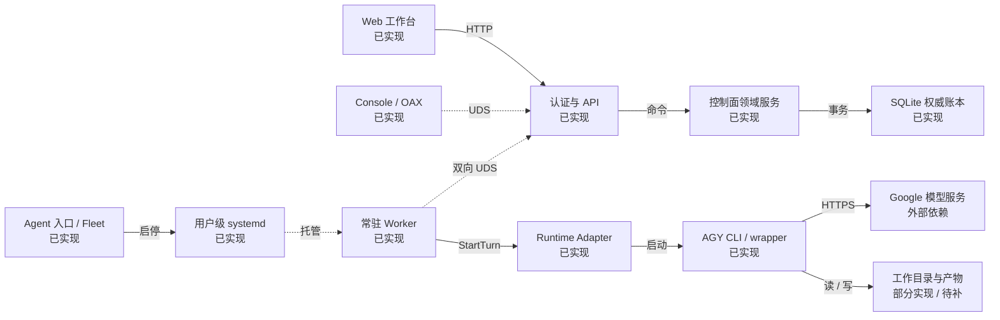
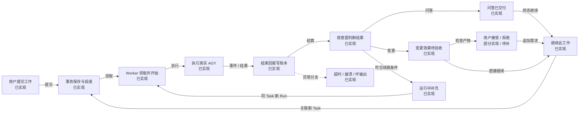
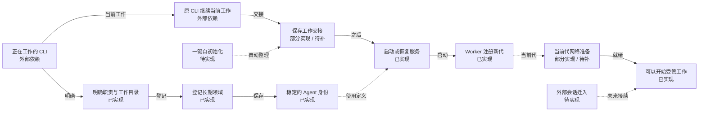
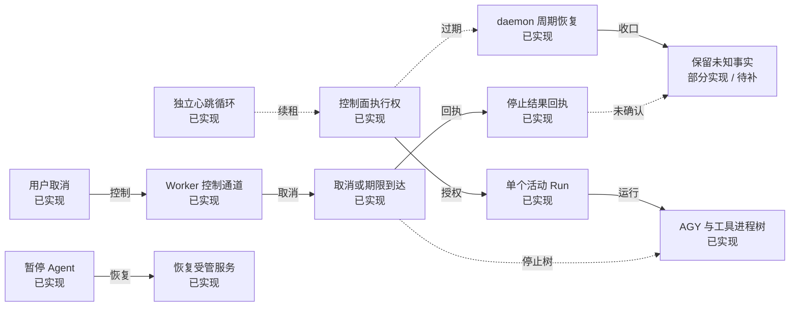
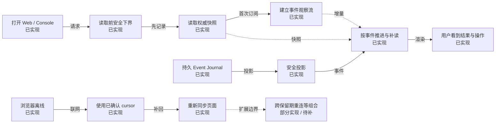
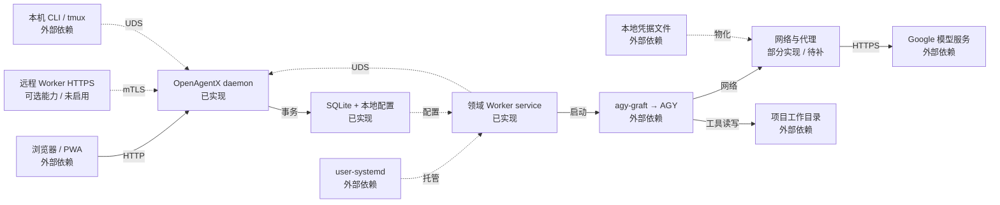

# OpenAgentX · 架构与关键流程

交互图：[打开 HTML 图册](current-architecture.html)。快照日期：2026-10-02。
本图描述 OpenAgentX 任务后台。交易、行情等属于受管领域及业务工作区；不声称券商、交易所或真实交易执行已经接通。

## 要点

- 控制面是一个 daemon；每个领域有独立 Worker service。API、领域服务不是分别部署的微服务。
- SQLite 保存 Task、Run、投递与审计等权威事实；内存 Broker 只用于唤醒。Worker 通过正式 API 工作，不直接写库。
- 每次 Run 冻结角色、工作目录、输入与期限，随后启动新的 AGY 进程。tmux 和浏览器只是入口，关闭不会终止后台工作。
- 问答成功表示完整回复已交付；执行任务的业务效果需独立核验。人工接受是独立 review，不改写原始执行事实。
- 主链已有真实安装证据；已有外部 CLI 的一键自初始化、原生会话迁入仍是待实现能力。

## 当前版本与阅读方法

核对源码：`b0b7e09`；最近安装与真实浏览器日用验收：`9434479e4fd3b6802aa2e4d57610bb710200cd01`。本图不是服务实时监控。后续文档提交不会自动改变安装来源。

实际安装二进制 SHA-256：`6725f3370b3c6bf27293a0f6368cc5bfac9e92c92682cc01a8b1b862231f75c7`。

证据入口：[最终安装来源与哈希](../reports/validation/2026-10-02-agy-workflow/evidence/final-independent-9434479/result.json)、[最终安装 Web 日用证据](../reports/validation/2026-10-02-agy-workflow/evidence/installed-browser-9434479-daily01/README.md)、[22 组证据覆盖与未测边界](../reports/validation/2026-10-02-agy-workflow/COVERAGE.md)。历史证据按影响复用，不代表 22 组在最终安装版全部重测。

实现状态与证据强度是两条轴：**已实现**、**部分实现 / 待补**、**待实现**、**可选 / 未启用**、**外部依赖**；证据标注 **D**（确定性）、**R**（真实 Runtime）、**I**（已安装环境）。绿色不等于全部 E2E 通过。

HTML 每次只显示一个子图；点击节点可见职责、限制和引用。虚线区分控制与拟议关系，以箭头文字和节点状态为准。

## 01 · 总览：一项工作如何穿过整个系统

**谁接收指令，谁持有状态，谁真正执行？** 一个 daemon 保存权威状态；每个领域的 Worker 独立接单；外部 CLI 执行模型与工具。

[打开此图](current-architecture.html#overview)

| 节点 | 状态 | 关键职责 / 限制 | 证据范围 |
|---|---|---|---|
| Web 工作台 | 已实现 | 浏览器通过正式 HTTP API 提交任务、查看结果与控制取消。当前安装访问入口 127.0.0.1:18100。关闭浏览器不停止 Worker。 | I＋R：最终安装版报告生成、继续、离线恢复、刷新返回。[浏览器观察与重连](../../web/src/main.jsx)、[最终安装 Web 日用证据](../reports/validation/2026-10-02-agy-workflow/evidence/installed-browser-9434479-daily01/README.md) |
| 认证与 API | 已实现 | Web 使用 Cookie、RBAC、CSRF；Console 使用本地 UDS 与 CLI Token；Worker 使用其专用注册及写入约束。API 与领域服务处于同一 daemon。 | 源码已核对；真实覆盖见所列证据。[daemon 与 API 装配](../../cmd/openagentx/main.go)、[Overview 与安全观察投影](../../internal/api/panel/handler.go) |
| 控制面领域服务 | 已实现 | 处理任务、补充、取消、结果验收和网络工作流。服务模块共同运行在一个 daemon 内，不是独立部署的微服务。 | 源码已核对；真实覆盖见所列证据。[任务、补充与取消入口](../../internal/controlplane/command_service.go)、[网络测试、发布与应用](../../internal/controlplane/network_workflow_service.go)、[Task 内会话与输入冻结](../../internal/controlplane/worker_service.go) |
| SQLite 权威账本 | 已实现 | Task、Message、Mailbox、Run、SessionBinding、Worker 代次与 Journal 保存在 SQLite。复合变更由事务保持一致；内存唤醒丢失不等于工作丢失。schema v2。 | D＋I：事务测试、历史库迁移与实际安装核对。[事务化执行账本](../../internal/persistence/sqlite/worker_execution_repository.go)、[最终安装来源与哈希](../reports/validation/2026-10-02-agy-workflow/evidence/final-independent-9434479/result.json) |
| Console / OAX | 已实现 | Console 是正式 API 客户端。OAX pane 0 承载 TUI，overview 提供 Agent 导航。tmux 不承担任务路由、Runtime 身份或进程执行权。 | I：80×24 PTY，完整结果、接受/拒绝、继续与重开。[Console Attach 与工作台](../../internal/cli/console/application.go)、[真实 Console 与空闲采样](../reports/validation/2026-10-02-agy-workflow/evidence/installed-17d5cd2-console01/README.md) |
| 常驻 Worker | 已实现 | 每个领域使用受管 Worker。心跳和控制循环独立于一次模型运行；单 Agent 当前最多一个活动 Run。完成任务后继续等待下一项。 | 源码已核对；真实覆盖见所列证据。[Worker 执行与控制循环](../../internal/worker/runner.go)、[安装入口、角色与故障恢复证据](../reports/validation/2026-10-02-agy-workflow/evidence/installed-17d5cd2-onboarding01-resume02/README.md) |
| Runtime Adapter | 已实现 | AGY adapter 校验冻结职责、工作目录、模型、网络与期限，启动 CLI 并解析结构化输出。结束、超时和取消均向账本回报。 | 源码已核对；真实覆盖见所列证据。[AGY 进程与角色输入](../../internal/runtime/agy/adapter.go)、[真实 AGY 主链与取消证据](../reports/validation/2026-10-02-agy-workflow/evidence/live-f3cd7a3-main01/REPORT.md) |
| AGY CLI / wrapper | 已实现 | 通过正式 agy-graft 启动 AGY。每个 Run 都启动受控 CLI 进程；同 Task 内可用已保存 conversation 续接。没有接管任意外部活 CLI 的入口。 | R＋I：使用真实 agy-graft 与 AGY。[AGY 进程与角色输入](../../internal/runtime/agy/adapter.go)、[Task 内会话与输入冻结](../../internal/controlplane/worker_service.go)、[最终安装 Web 日用证据](../reports/validation/2026-10-02-agy-workflow/evidence/installed-browser-9434479-daily01/README.md) |
| Agent 入口 / Fleet | 已实现 | 日常使用 agent add/open/status/pause/resume。身份、配置与服务协调由入口完成；Fleet 是内部配置与生命周期工具。 | 源码已核对；真实覆盖见所列证据。[登记与服务入口](../../internal/cli/fleet/agent.go)、[安装入口、角色与故障恢复证据](../reports/validation/2026-10-02-agy-workflow/evidence/installed-17d5cd2-onboarding01-resume02/README.md) |
| 用户级 systemd | 已实现 | 后台服务独立于浏览器和终端。受管服务提供进程组清理及故障重启。agent add/start 使用 start，不等于默认已经 enable 开机启动。 | I：服务启停、角色冻结、排队暂停、Worker 崩溃恢复。[登记与服务入口](../../internal/cli/fleet/agent.go)、[安装入口、角色与故障恢复证据](../reports/validation/2026-10-02-agy-workflow/evidence/installed-17d5cd2-onboarding01-resume02/README.md) |
| 工作目录与产物 | 部分实现 / 待补 | 工具真实读写 Agent 的工作目录。业务产物在文件系统，不因模型回复就被自动验证；当前 Web 没有统一产物预览/下载入口。 **待补：产物可读写且已实测；文件浏览与验收展示仍待改善** | 源码已核对；真实覆盖见所列证据。[最终安装 Web 日用证据](../reports/validation/2026-10-02-agy-workflow/evidence/installed-browser-9434479-daily01/README.md)、[日用操作指南](../operations/agy-daily-workflow.md) |
| Google 模型服务 | 外部依赖 | 模型推理由 AGY 依赖外部服务完成。代理与登录状态影响 Runtime 可用性；控制面并不直接代替 AGY 调用模型。图中不固定未核实的外部域名。 | 真实 AGY 链接通；供应商内部实现不在本工程内。[AGY 进程与角色输入](../../internal/runtime/agy/adapter.go)、[网络测试、发布与应用](../../internal/controlplane/network_workflow_service.go)、[最终安装 Web 日用证据](../reports/validation/2026-10-02-agy-workflow/evidence/installed-browser-9434479-daily01/README.md) |

- 总览只画主要依赖。事件回传、SSE 与凭据边界在第 05 / 06 图展开。
- 绿色代表能力已实现，不表示相关的所有边界用例全部通过。点击节点可见证据范围。
- Quote Service 等是受管领域与业务工作区；本图不声称券商、交易所或交易执行已接通。

## 02 · 工作流：从用户指令到可继续的结果

**“已受理”“执行结束”“用户验收”分别意味着什么？** Task 表示一项工作，Run 表示一次执行。问答交付与文件变更验收采用不同完成规则。

[打开此图](current-architecture.html#work)

| 节点 | 状态 | 关键职责 / 限制 | 证据范围 |
|---|---|---|---|
| 用户提交工作 | 已实现 | 选择问答 query 或执行任务 mutation。带幂等键提交；用户界面不直接调用模型。继续工作会携带父任务目标和结果摘要。 | 源码已核对；真实覆盖见所列证据。[任务、补充与取消入口](../../internal/controlplane/command_service.go)、[最终安装 Web 日用证据](../reports/validation/2026-10-02-agy-workflow/evidence/installed-browser-9434479-daily01/README.md) |
| 事务保存与投递 | 已实现 | 同一事务保存工作和投递记录并追加 Journal。返回 Task ID 只证明已受理。持久 Mailbox 是领取来源，Broker 仅加速唤醒。 | 源码已核对；真实覆盖见所列证据。[任务、补充与取消入口](../../internal/controlplane/command_service.go)、[事务化执行账本](../../internal/persistence/sqlite/worker_execution_repository.go)、[真实 AGY 主链与取消证据](../reports/validation/2026-10-02-agy-workflow/evidence/live-f3cd7a3-main01/REPORT.md) |
| Worker 领取并开始 | 已实现 | 验证当前执行权，创建 RunAttempt，冻结角色内容/hash、cwd、网络版本、参数与截止时间。后续修改职责不会改变本次 Run。 | 源码已核对；真实覆盖见所列证据。[Task 内会话与输入冻结](../../internal/controlplane/worker_service.go)、[安装入口、角色与故障恢复证据](../reports/validation/2026-10-02-agy-workflow/evidence/installed-17d5cd2-onboarding01-resume02/README.md) |
| 执行真实 AGY | 已实现 | Adapter 启动 CLI，AGY 调用模型和工具。运行中补充排到下一 Run，不承诺即时打断模型。 | 源码已核对；真实覆盖见所列证据。[AGY 进程与角色输入](../../internal/runtime/agy/adapter.go)、[真实 AGY 主链与取消证据](../reports/validation/2026-10-02-agy-workflow/evidence/live-f3cd7a3-main01/REPORT.md)、[95 秒续租与补充独立复核](../reports/validation/2026-10-02-agy-workflow/evidence/live-17d5cd2-lease02/REPORT.md) |
| 结束回报写账本 | 已实现 | Worker 上报正式 TurnResult；事务同时处理 Run、Task、会话绑定与审计。空输出、坏 JSON、缺终态不能只凭 exit 0 当成功。 | 源码已核对；真实覆盖见所列证据。[事务化执行账本](../../internal/persistence/sqlite/worker_execution_repository.go)、[Task 内会话与输入冻结](../../internal/controlplane/worker_service.go)、[22 组证据覆盖与未测边界](../reports/validation/2026-10-02-agy-workflow/COVERAGE.md) |
| 按意图判断结果 | 已实现 | 问答依据完整最终回复交付；执行任务还涉及实际业务效果。Runtime succeeded 与 Task succeeded 不是一个断言。 | 源码已核对；真实覆盖见所列证据。[问答与业务效果判定](../../internal/domain/task_completion.go)、[Task 内会话与输入冻结](../../internal/controlplane/worker_service.go)、[独立的人工结果验收](../../internal/api/panel/task_review.go)、[最终安装 Web 日用证据](../reports/validation/2026-10-02-agy-workflow/evidence/installed-browser-9434479-daily01/README.md) |
| 问答已交付 | 已实现 | 合法成功终态及完整 FinalReply 可结算 query_result_delivered。它证明回复交付，不证明答案正确，也不提供只读沙箱。 | I＋R：材料及职责标记的精确问答。[问答与业务效果判定](../../internal/domain/task_completion.go)、[最终安装 Web 日用证据](../reports/validation/2026-10-02-agy-workflow/evidence/installed-browser-9434479-daily01/README.md)、[22 组证据覆盖与未测边界](../reports/validation/2026-10-02-agy-workflow/COVERAGE.md) |
| 变更效果待验收 | 已实现 | 当前 AGY 未确认副作用（SideEffectsKnown=false）时，mutation 保留 uncertain/business_effect_unverified。Runtime 报告效果已知时可为 succeeded/mutation_effects_known，仍不等于系统独立业务验收。真实文件需另行检查。 | I＋R：报告实际生成；原不确定执行记录保留。[问答与业务效果判定](../../internal/domain/task_completion.go)、[最终安装 Web 日用证据](../reports/validation/2026-10-02-agy-workflow/evidence/installed-browser-9434479-daily01/README.md)、[独立的人工结果验收](../../internal/api/panel/task_review.go) |
| 用户接受 / 拒绝 | 部分实现 / 待补 | 验收结论绑定对应 Run/版本，不改写原执行事实。当前详情可见用户已验收，列表仍可能显示 uncertain，这是已知体验欠缺。 **待补：验收落账已实现；列表与详情表达仍需统一** | 源码已核对；真实覆盖见所列证据。[独立的人工结果验收](../../internal/api/panel/task_review.go)、[最终安装 Web 日用证据](../reports/validation/2026-10-02-agy-workflow/evidence/installed-browser-9434479-daily01/README.md) |
| 继续此工作 | 已实现 | 继续创建关联的新 Task，复用目标与选定结果摘要；不自动继承父任务的原生 conversation，也不重跑原任务。 终态后可直接继续，不要求先接受或拒绝结果。 | I＋R：原文保留后追加，B parent=A，各一 Run。[任务、补充与取消入口](../../internal/controlplane/command_service.go)、[最终安装 Web 日用证据](../reports/validation/2026-10-02-agy-workflow/evidence/installed-browser-9434479-daily01/README.md) |
| 运行中补充 | 已实现 | 符合结算条件时，已提交补充由下一 Run 消费；成功或明确失败可继续，效果未确认的 mutation 另要求完整有效回复。未知停止、坏协议结果或取消中不自动续跑。 | R：query / mutation 补充与幂等消费；I 未单独重测。[真实 AGY 主链与取消证据](../reports/validation/2026-10-02-agy-workflow/evidence/live-f3cd7a3-main01/REPORT.md)、[95 秒续租与补充独立复核](../reports/validation/2026-10-02-agy-workflow/evidence/live-17d5cd2-lease02/REPORT.md)、[Task 内会话与输入冻结](../../internal/controlplane/worker_service.go) |
| 超时 / 崩溃 / 坏输出 | 已实现 | 超时、协议异常或失联时保留可信诊断与原始账本；是否停止进程要另行取证。不会靠重发旧任务制造“恢复成功”。 | 源码已核对；真实覆盖见所列证据。[22 组证据覆盖与未测边界](../reports/validation/2026-10-02-agy-workflow/COVERAGE.md)、[真实超时与后续任务证据](../reports/validation/2026-10-02-agy-workflow/evidence/live-f3cd7a3-timeout01/REPORT.md)、[周期恢复与裸进程清理边界](../reports/validation/2026-10-02-agy-workflow/evidence/live-17d5cd2-periodic01/REPORT.md) |

- query = 回复交付；mutation = 涉及效果。query 本身不是只读权限控制。
- 同 Task 补充进入下一 Run；“继续此工作”新建关联 Task，无需先验收。
- 人工接受和系统独立验证保持不同来源；文件精确字节与进程停止由验收证据核对。

## 03 · 领域初始化：从正在工作的 CLI 到长期领域

**哪些可以今天做到，哪些仍需补入口？** 长期保存的是领域身份、职责和工作目录。已有 CLI 对话目前通过明确交接接续。

[打开此图](current-architecture.html#init)

| 节点 | 状态 | 关键职责 / 限制 | 证据范围 |
|---|---|---|---|
| 正在工作的 CLI | 外部依赖 | 当前外部 CLI 仍拥有自己的进程与聊天上下文。能执行本机命令时，可主动调用现有登记入口；这并不把活进程变成 Worker。 | 源码已核对；真实覆盖见所列证据。[登记与服务入口](../../internal/cli/fleet/agent.go)、[ADR-001：Worker 与 Runtime 边界](../decisions/ADR-001-resident-agent-worker-runtime-observability.md) |
| 明确职责与工作目录 | 已实现 | 用户或当前 Agent 编写长期职责。登记不热改现有对话的系统提示；当前 CLI 要显式读取职责，未来受管 AGY Run 自动注入。 | 源码已核对；真实覆盖见所列证据。[登记与服务入口](../../internal/cli/fleet/agent.go)、[Task 内会话与输入冻结](../../internal/controlplane/worker_service.go)、[安装入口、角色与故障恢复证据](../reports/validation/2026-10-02-agy-workflow/evidence/installed-17d5cd2-onboarding01-resume02/README.md) |
| 登记长期领域 | 已实现 | 保存身份、Profile、Worker 与 Fleet 配置，可导入已有 OpenAgentX identity / Worker YAML。此选项不启动 Worker，但可能启动 daemon 并完成登录。 | 源码＋已有入口 D/I；活 CLI 自注册专项未测。[登记与服务入口](../../internal/cli/fleet/agent.go)、[安装入口、角色与故障恢复证据](../reports/validation/2026-10-02-agy-workflow/evidence/installed-17d5cd2-onboarding01-resume02/README.md) |
| 稳定的 Agent 身份 | 已实现 | 身份和职责可跨进程保存。相同定义重复添加幂等，冲突不会静默覆盖。长期身份不要求永远复用同一个聊天 session。 | 源码已核对；真实覆盖见所列证据。[登记与服务入口](../../internal/cli/fleet/agent.go)、[安装入口、角色与故障恢复证据](../reports/validation/2026-10-02-agy-workflow/evidence/installed-17d5cd2-onboarding01-resume02/README.md) |
| 原 CLI 继续当前工作 | 外部依赖 | 系统没有 PID/PTY 接管参数，也不会自动收集当前聊天历史。原 CLI 仍可完成当前任务；不要把登记成功当成后台已接单。 | 源码已核对；真实覆盖见所列证据。[AGY 进程与角色输入](../../internal/runtime/agy/adapter.go)、[ADR-001：Worker 与 Runtime 边界](../decisions/ADR-001-resident-agent-worker-runtime-observability.md) |
| 保存工作交接 | 部分实现 / 待补 | 目前可由当前 Agent 手动生成 HANDOFF.md，新受管任务显式读取它。这是可操作建议，系统尚未自动生成/加载完整交接。 **待补：支持文件交接；自动接续体验尚缺** | 源码已核对；真实覆盖见所列证据。[日用操作指南](../operations/agy-daily-workflow.md)、[登记与服务入口](../../internal/cli/fleet/agent.go) |
| 启动或恢复服务 | 已实现 | 交接后显式启动目标 Worker，检查在线状态并准备网络。底层调用 user-systemd，不通过向终端注入业务指令执行。 | 源码已核对；真实覆盖见所列证据。[登记与服务入口](../../internal/cli/fleet/agent.go)、[安装入口、角色与故障恢复证据](../reports/validation/2026-10-02-agy-workflow/evidence/installed-17d5cd2-onboarding01-resume02/README.md) |
| Worker 注册新代 | 已实现 | Worker 为已存在的领域身份注册实例和 generation。网络旧代回执不能证明当前代已就绪。 | 源码已核对；真实覆盖见所列证据。[Task 内会话与输入冻结](../../internal/controlplane/worker_service.go)、[安装入口、角色与故障恢复证据](../reports/validation/2026-10-02-agy-workflow/evidence/installed-17d5cd2-onboarding01-resume02/README.md) |
| 一键自初始化 | 待实现 | 建议新增一个薄入口或技能，默认当前工作目录，整理可审阅的职责/交接，复用已有 add。尚未实现；不意味着接管原会话。 | 本轮建议，尚无实现或 E2E。[登记与服务入口](../../internal/cli/fleet/agent.go) |
| 外部会话迁入 | 待实现 | 目前没有外部 conversation 导入入口。后续需验证可恢复条件、独占使用与归属，再将会话接到明确 Task/Agent/backend；不是只凭 PID 即可接管。 | 未实现；内部 --conversation 不等于外部导入。[AGY 进程与角色输入](../../internal/runtime/agy/adapter.go)、[Task 内会话与输入冻结](../../internal/controlplane/worker_service.go) |
| 当前代网络准备 | 部分实现 / 待补 | inherit/direct 可由入口通过正式测试/发布/CAS应用到当前代。命名 profile 自动跨代恢复尚不完整，不能默认为已支持。 **待补：默认模式已实测；命名 profile 与误配纠正仍有边界** | 源码已核对；真实覆盖见所列证据。[网络测试、发布与应用](../../internal/controlplane/network_workflow_service.go)、[安装入口、角色与故障恢复证据](../reports/validation/2026-10-02-agy-workflow/evidence/installed-17d5cd2-onboarding01-resume02/README.md) |
| 可以开始受管工作 | 已实现 | 身份、Worker、网络满足条件后显示可开始工作；新 Task 使用相应职责与工作目录。原外部 CLI 历史不会凭空进入新 Task。 | 源码已核对；真实覆盖见所列证据。[登记与服务入口](../../internal/cli/fleet/agent.go)、[最终安装 Web 日用证据](../reports/validation/2026-10-02-agy-workflow/evidence/installed-browser-9434479-daily01/README.md) |

- --configure-only 只抑制 Worker 启动，不代表零配置写入或 daemon 不启动。
- 现有命令足以登记长期身份；当前 CLI 角色读取与交接仍需显式完成。
- 虚线“拟议”路径尚未接通；旧 agent attach/bootstrap/launch 不是当前支持入口。

## 04 · 运行与恢复：长运行、取消和崩溃如何收口

**停止请求、物理停止和账本恢复分别由谁负责？** 心跳维持执行权，取消控制真实进程，恢复维护账本；三者相互配合，不能互相替代。

[打开此图](current-architecture.html#runtime)

| 节点 | 状态 | 关键职责 / 限制 | 证据范围 |
|---|---|---|---|
| 独立心跳循环 | 已实现 | Worker 不依靠模型输出证明存活；运行、控制与心跳分开。静默工具也需要保持 Worker/Run lease。 | R：95秒工具、7检查点、约90秒续租；原夹具FAIL仍保留。[Worker 执行与控制循环](../../internal/worker/runner.go)、[95 秒续租与补充独立复核](../reports/validation/2026-10-02-agy-workflow/evidence/live-17d5cd2-lease02/REPORT.md) |
| 控制面执行权 | 已实现 | 当前代、租约和 fencing 限定有效执行权。旧实例迟到的写入必须被拒绝，不能覆盖新一代状态。 | 源码已核对；真实覆盖见所列证据。[Task 内会话与输入冻结](../../internal/controlplane/worker_service.go)、[事务化执行账本](../../internal/persistence/sqlite/worker_execution_repository.go) |
| 单个活动 Run | 已实现 | 单领域的有效活动 Run受约束。默认运行期限30分钟，可配置；心跳续租不会延长这次任务的截止时间。 | 源码已核对；真实覆盖见所列证据。[Task 内会话与输入冻结](../../internal/controlplane/worker_service.go)、[Worker 执行与控制循环](../../internal/worker/runner.go)、[22 组证据覆盖与未测边界](../reports/validation/2026-10-02-agy-workflow/COVERAGE.md) |
| AGY 与工具进程树 | 已实现 | Adapter 启动 AGY及其工具链并保留取消控制。取消不会撤销已经写出的文件。直接强杀裸 Worker 与systemd受管清理不同。 | 源码已核对；真实覆盖见所列证据。[AGY 进程与角色输入](../../internal/runtime/agy/adapter.go)、[真实 AGY 主链与取消证据](../reports/validation/2026-10-02-agy-workflow/evidence/live-f3cd7a3-main01/REPORT.md)、[安装入口、角色与故障恢复证据](../reports/validation/2026-10-02-agy-workflow/evidence/installed-17d5cd2-onboarding01-resume02/README.md) |
| 用户取消 | 已实现 | 取消先记录请求。没有活动 Run 时，取消事务可同时收口 queued/waiting_input 与 Mailbox；活动 Run 经独立控制通道请求实际停止。运行补充的后续执行见工作流子图。 | 源码已核对；真实覆盖见所列证据。[任务、补充与取消入口](../../internal/controlplane/command_service.go)、[真实 AGY 主链与取消证据](../reports/validation/2026-10-02-agy-workflow/evidence/live-f3cd7a3-main01/REPORT.md)、[22 组证据覆盖与未测边界](../reports/validation/2026-10-02-agy-workflow/COVERAGE.md) |
| Worker 控制通道 | 已实现 | Worker 处理持久控制指令及任务取消，活动模型不能阻塞控制循环。queued steer和进程信号取消是当前AGY支持形式。 | 源码已核对；真实覆盖见所列证据。[Worker 执行与控制循环](../../internal/worker/runner.go)、[AGY 进程与角色输入](../../internal/runtime/agy/adapter.go) |
| 取消或期限到达 | 已实现 | 显式取消触发进程信号与后代清理。超时也清理进程，但不能因此把未知业务效果判为成功或一概记为用户取消。 | R：活动取消全树观测上限约4秒；35秒timeout后可接下一query。[AGY 进程与角色输入](../../internal/runtime/agy/adapter.go)、[真实超时与后续任务证据](../reports/validation/2026-10-02-agy-workflow/evidence/live-f3cd7a3-timeout01/REPORT.md)、[真实 AGY 主链与取消证据](../reports/validation/2026-10-02-agy-workflow/evidence/live-f3cd7a3-main01/REPORT.md) |
| 停止结果回执 | 已实现 | 显式取消且真实进程停止确认，才正确收口canceled；清理失败、失联或结果无法确认时保留uncertain。UI区分请求与确认。 | 源码已核对；真实覆盖见所列证据。[真实 AGY 主链与取消证据](../reports/validation/2026-10-02-agy-workflow/evidence/live-f3cd7a3-main01/REPORT.md)、[真实超时与后续任务证据](../reports/validation/2026-10-02-agy-workflow/evidence/live-f3cd7a3-timeout01/REPORT.md)、[22 组证据覆盖与未测边界](../reports/validation/2026-10-02-agy-workflow/COVERAGE.md) |
| 暂停 Agent | 已实现 | pause采用drain/stop语义：当前工作完成后Worker退出；排队任务保持未执行。它不是冻结一个模型进程。 | 源码已核对；真实覆盖见所列证据。[登记与服务入口](../../internal/cli/fleet/agent.go)、[安装入口、角色与故障恢复证据](../reports/validation/2026-10-02-agy-workflow/evidence/installed-17d5cd2-onboarding01-resume02/README.md) |
| 恢复受管服务 | 已实现 | resume启动新的Worker代次。systemd受管崩溃清理已实测；恢复不会把旧不确定任务自动再执行一次。 | I：排队B无Run→恢复后单Run；崩溃后新query成功。[登记与服务入口](../../internal/cli/fleet/agent.go)、[安装入口、角色与故障恢复证据](../reports/validation/2026-10-02-agy-workflow/evidence/installed-17d5cd2-onboarding01-resume02/README.md) |
| daemon 周期恢复 | 已实现 | daemon启动及周期调用同一保守恢复逻辑，按失效租约收口旧Task/Run。周期仅负责账本，不保证裸Worker的孤儿子进程自动被杀。 | R：42.12秒自动收口；I服务故障约32.66秒。[daemon 周期恢复](../../cmd/openagentx/recovery.go)、[周期恢复与裸进程清理边界](../reports/validation/2026-10-02-agy-workflow/evidence/live-17d5cd2-periodic01/REPORT.md) |
| 保留未知事实 | 部分实现 / 待补 | 副作用不确定的旧任务保留uncertain。新代就绪后可接新工作。裸进程R的遗留子进程由测试精确清理；不能画成平台自动完成。 **待补：账本恢复已实现；裸进程自动清理不受当前证据支持** | 源码已核对；真实覆盖见所列证据。[周期恢复与裸进程清理边界](../reports/validation/2026-10-02-agy-workflow/evidence/live-17d5cd2-periodic01/REPORT.md)、[安装入口、角色与故障恢复证据](../reports/validation/2026-10-02-agy-workflow/evidence/installed-17d5cd2-onboarding01-resume02/README.md) |

- 图中的时间来自特定真实测试，不是服务等级承诺。
- 95秒测试脚本整体因格式断言FAIL；已完成续租场景由独立审计确认，未覆盖原失败。
- 受管systemd路径已验证清理；绕过service强杀裸Worker时仍须独立检查工具进程。

## 05 · 观察与重连：页面如何得到可信的当前状态

**刷新、断网和历史任务很多时，怎样避免丢结果？** 先读安全下界，再读快照；第一次从下界订阅，重连从已经确认的事件序号继续。

[打开此图](current-architecture.html#observe)

| 节点 | 状态 | 关键职责 / 限制 | 证据范围 |
|---|---|---|---|
| 打开 Web / Console | 已实现 | 登录成功与网络可达分别判断。Web初次session/overview暂时失败可重试；离线禁写，不把请求暗中排队后重发。 | 源码已核对；真实覆盖见所列证据。[浏览器观察与重连](../../web/src/main.jsx)、[最终安装 Web 日用证据](../reports/validation/2026-10-02-agy-workflow/evidence/installed-browser-9434479-daily01/README.md)、[22 组证据覆盖与未测边界](../reports/validation/2026-10-02-agy-workflow/COVERAGE.md) |
| 读取前安全下界 | 已实现 | Overview在读取任何投影之前采集安全下界。该值可用于首次订阅；不能把读完后latest_sequence当作首次安全起点。 | 源码已核对；真实覆盖见所列证据。[Overview 与安全观察投影](../../internal/api/panel/handler.go)、[前端游标规则](../../web/src/task-observation-state.js)、[最终安装 Web 日用证据](../reports/validation/2026-10-02-agy-workflow/evidence/installed-browser-9434479-daily01/README.md) |
| 读取权威快照 | 已实现 | 按当前数据库状态读取界面需要的投影。不是对所有投影宣称事务级快照，读取期间出现的新事件通过回放补齐。 | 源码已核对；真实覆盖见所列证据。[Overview 与安全观察投影](../../internal/api/panel/handler.go)、[浏览器观察与重连](../../web/src/main.jsx) |
| 建立事件观察流 | 已实现 | 第一次SSE使用live_after_sequence；后续使用已确认cursor与原生Last-Event-ID语义。旧历史数据不再强制从0回放。 | I：267881首连在线；旧from0循环失败原件保留。[前端游标规则](../../web/src/task-observation-state.js)、[浏览器观察与重连](../../web/src/main.jsx)、[最终安装 Web 日用证据](../reports/validation/2026-10-02-agy-workflow/evidence/installed-browser-9434479-daily01/README.md) |
| 持久 Event Journal | 已实现 | 事件由控制面事务持久记录。SQLite当前状态是权威；Journal用于审计与增量观察，不要求全量事件重放重建状态。 | 源码已核对；真实覆盖见所列证据。[事务化执行账本](../../internal/persistence/sqlite/worker_execution_repository.go)、[Overview 与安全观察投影](../../internal/api/panel/handler.go) |
| 安全投影 | 已实现 | 通过认证后的Observe API输出投影。模型输出与诊断并不应携带秘密。投影错误不能被静默跳过并伪称已同步。 | 源码已核对；真实覆盖见所列证据。[Overview 与安全观察投影](../../internal/api/panel/handler.go)、[22 组证据覆盖与未测边界](../reports/validation/2026-10-02-agy-workflow/COVERAGE.md) |
| 按事件推进与补读 | 已实现 | SSE建立/恢复后重新读取Overview、列表和已选Task以补齐；页面保留确认过的游标。新快照不会跳过离线期间事件。 | 源码已核对；真实覆盖见所列证据。[浏览器观察与重连](../../web/src/main.jsx)、[前端游标规则](../../web/src/task-observation-state.js)、[最终安装 Web 日用证据](../reports/validation/2026-10-02-agy-workflow/evidence/installed-browser-9434479-daily01/README.md) |
| 用户看到结果与操作 | 已实现 | 页面分别显示Run结果、Task事实和人工验收。结果已返回并不自动等于业务验证完成；关闭再打开不创建新Task。 | 源码已核对；真实覆盖见所列证据。[最终安装 Web 日用证据](../reports/validation/2026-10-02-agy-workflow/evidence/installed-browser-9434479-daily01/README.md)、[独立的人工结果验收](../../internal/api/panel/task_review.go)、[真实 Console 与空闲采样](../reports/validation/2026-10-02-agy-workflow/evidence/installed-17d5cd2-console01/README.md) |
| 浏览器离线 | 已实现 | 真实Offline期间Worker仍可执行任务。浏览器恢复后不自动提交离线草稿；用户要明确再次发送。 | I：离线时后台完成追加；隔离R：草稿不自动提交。[最终安装 Web 日用证据](../reports/validation/2026-10-02-agy-workflow/evidence/installed-browser-9434479-daily01/README.md)、[22 组证据覆盖与未测边界](../reports/validation/2026-10-02-agy-workflow/COVERAGE.md) |
| 使用已确认 cursor | 已实现 | 已确认267966后断网，恢复仍从267966请求，而不是跳到新Overview的268049。这是该批实测数值。 | I：重连补回期间可投影事件与完整结果。[前端游标规则](../../web/src/task-observation-state.js)、[最终安装 Web 日用证据](../reports/validation/2026-10-02-agy-workflow/evidence/installed-browser-9434479-daily01/README.md) |
| 重新同步页面 | 已实现 | 恢复online后看见追加结果；刷新仍显示验收结论，同Worker随后成功完成新query。 | 源码已核对；真实覆盖见所列证据。[最终安装 Web 日用证据](../reports/validation/2026-10-02-agy-workflow/evidence/installed-browser-9434479-daily01/README.md) |
| 跨保留期重连等组合 | 部分实现 / 待补 | 当前真实验证覆盖整网Offline及首连暂时503。仅切断SSE、跨retention清理边界与全部多Agent切换组合仍需专项验证/完善。 **待补：未完成全组合验证，不把已测Offline扩成全部网络场景PASS** | 源码已核对；真实覆盖见所列证据。[22 组证据覆盖与未测边界](../reports/validation/2026-10-02-agy-workflow/COVERAGE.md) |

- 这里展示观察流程，不会对正在运行的产品发请求；图本身是离线架构文档。
- SSE是观察通道；用户命令仍走正式写API。退出浏览器或Console不停止Worker。
- 就绪原因来自身份、Worker和当前代网络事实；HTTP 200不等于用户已经能开始工作。

## 06 · 外部依赖：进程、存储、网络与部署边界

**运行依赖哪些外部东西，哪些只是可选能力？** 常态运行依赖本机 daemon、SQLite、受管 Worker、AGY 与外部模型服务；远程和其他Runtime另行标注。

[打开此图](current-architecture.html#dependencies)

| 节点 | 状态 | 关键职责 / 限制 | 证据范围 |
|---|---|---|---|
| 浏览器 / PWA | 外部依赖 | React前端构建后作为静态工件由daemon提供。Node/npm用于前端开发构建，不是已安装daemon执行任务所需的独立服务。 | 源码已核对；真实覆盖见所列证据。[daemon 与 API 装配](../../cmd/openagentx/main.go)、[最终安装来源与哈希](../reports/validation/2026-10-02-agy-workflow/evidence/final-independent-9434479/result.json) |
| OpenAgentX daemon | 已实现 | 本机 HTTP 服务 Web 与用户 API，UDS 服务本地 CLI / Worker 专用入口。最近安装核验快照为 9434479；监听配置以安装证据为准。 | 源码已核对；真实覆盖见所列证据。[daemon 与 API 装配](../../cmd/openagentx/main.go)、[最终安装来源与哈希](../reports/validation/2026-10-02-agy-workflow/evidence/final-independent-9434479/result.json) |
| 远程 Worker HTTPS | 可选能力 / 未启用 | 代码提供受限Worker API、mTLS身份映射和远程传输；当前本机部署未启用远程listener。本图不把它作为默认依赖。 | 有实现及既有协议测试；本轮未做远程真实验收。[远程 Worker 路由边界](../../internal/api/workerapi/handler.go)、[daemon 与 API 装配](../../cmd/openagentx/main.go) |
| Google 模型服务 | 外部依赖 | 真实AGY调用依赖模型服务可用性、AGY登录及所选模型。图不包含供应商内部架构，也不声称所有模型/effort参数已逐一验证。 | 源码已核对；真实覆盖见所列证据。[最终安装 Web 日用证据](../reports/validation/2026-10-02-agy-workflow/evidence/installed-browser-9434479-daily01/README.md)、[22 组证据覆盖与未测边界](../reports/validation/2026-10-02-agy-workflow/COVERAGE.md) |
| 本机 CLI / tmux | 外部依赖 | agent命令协调配置与服务；Console通过UDS读取和控制。tmux仅在Console/OAX使用场景需要，Web+Worker执行链不靠tmux保持运行。 | 源码已核对；真实覆盖见所列证据。[登记与服务入口](../../internal/cli/fleet/agent.go)、[真实 Console 与空闲采样](../reports/validation/2026-10-02-agy-workflow/evidence/installed-17d5cd2-console01/README.md) |
| 领域 Worker service | 已实现 | 当前入口采用一个领域身份一个受管Worker，共用daemon。Worker调用adapter，不直接绕过daemon修改SQLite。 | 源码已核对；真实覆盖见所列证据。[Worker 执行与控制循环](../../internal/worker/runner.go)、[安装入口、角色与故障恢复证据](../reports/validation/2026-10-02-agy-workflow/evidence/installed-17d5cd2-onboarding01-resume02/README.md) |
| agy-graft → AGY | 外部依赖 | wrapper/实际CLI是独立运行依赖；网络环境由受控配置准备。AGY执行工具、读写workspace，再回传结构化结果。 | 源码已核对；真实覆盖见所列证据。[AGY 进程与角色输入](../../internal/runtime/agy/adapter.go)、[真实 AGY 主链与取消证据](../reports/validation/2026-10-02-agy-workflow/evidence/live-f3cd7a3-main01/REPORT.md) |
| 网络与代理 | 部分实现 / 待补 | 代理不是固定必须；依所选模式及本机网络而定。配置经过test/publish/applied，当前代回执必须匹配。inherit/direct重应用已实测，命名profile自动恢复仍有缺口。 **待补：网络设置保存、发布、应用是不同阶段** | 源码已核对；真实覆盖见所列证据。[网络测试、发布与应用](../../internal/controlplane/network_workflow_service.go)、[安装入口、角色与故障恢复证据](../reports/validation/2026-10-02-agy-workflow/evidence/installed-17d5cd2-onboarding01-resume02/README.md) |
| user-systemd | 外部依赖 | 托管daemon和Worker。日用入口启动目标service，退出页面不影响后台；开机自启/用户linger取决于实际配置。 | 源码已核对；真实覆盖见所列证据。[登记与服务入口](../../internal/cli/fleet/agent.go)、[安装入口、角色与故障恢复证据](../reports/validation/2026-10-02-agy-workflow/evidence/installed-17d5cd2-onboarding01-resume02/README.md) |
| SQLite + 本地配置 | 已实现 | SQLite schema2保存权威状态；identity、ROLE、Worker YAML、Fleet清单在本地文件。工作目录真实产物另存，不把全部文件塞进事件账本。 | 源码已核对；真实覆盖见所列证据。[事务化执行账本](../../internal/persistence/sqlite/worker_execution_repository.go)、[最终安装来源与哈希](../reports/validation/2026-10-02-agy-workflow/evidence/final-independent-9434479/result.json) |
| 项目工作目录 | 外部依赖 | 由Agent Profile固定cwd。需要额外业务API/交易工具时，它们是该任务工具链的额外依赖，是否接通要各自验收。 | 源码已核对；真实覆盖见所列证据。[Task 内会话与输入冻结](../../internal/controlplane/worker_service.go)、[最终安装 Web 日用证据](../reports/validation/2026-10-02-agy-workflow/evidence/installed-browser-9434479-daily01/README.md) |
| 本地凭据文件 | 外部依赖 | CLI登录、AGY登录与网络secret有各自边界。网络secret为本地受权限保护文件，不在图里展示值，不画成已接入外部Vault。 | 源码已核对；真实覆盖见所列证据。[网络测试、发布与应用](../../internal/controlplane/network_workflow_service.go)、[daemon 与 API 装配](../../cmd/openagentx/main.go) |

- 当前未装配完整ACP生产路径；CodeBuddy代码保留，本轮未增加专项/真实验收。
- 组织/岗位/AuthorityPolicy模型与入口RBAC不同；完整组织业务授权和自主委派仍未贯通。
- 额外Nginx、公网入口、远程Worker、交易服务均不是本机AGY日用链的默认已启用依赖。

## 调整优先级与未完成能力

| 能力 | 当前事实 | 建议最小调整 | 重新处理的触发条件 |
|---|---|---|---|
| 已有CLI自初始化（待实现） | 可登记身份；当前对话不会自动接入 | 薄入口整理ROLE与HANDOFF，复用add；交接后启动 | 需要降低每个领域首次配置成本 |
| 外部原生会话导入（待实现） | 内部同Task支持已保存conversation续接 | AGY专项验证可恢复与独占使用，再提供导入入口 | 文件交接不足以保留工作上下文 |
| 产物与验收体验（部分实现 / 待补） | 文件真实生成；review独立记录 | 统一产物打开/下载，协调列表状态与用户验收显示 | 日常查找文件或判读结果仍繁琐 |
| 网络与恢复组合（部分实现 / 待补） | 默认模式新代恢复、取消与超时已有真实证据 | 命名profile、误配纠正、仅断SSE/retention组合补测 | 扩大网络模式或进入更长时程使用 |
| 组织治理与自主委派（部分实现 / 待补） | 基础模型与入口RBAC已在；完整业务授权未贯通 | 独立定义领域授权与委派闭环后再开放 | 开始真实多人/跨领域任务委派 |
| 其他Runtime与远程执行（可选能力 / 未启用） | CodeBuddy保留、ACP组件存在、mTLS通道可选 | 逐项装配和真实验收；不套用AGY通过结论 | 明确需要第二种Runtime或远程机器 |

## 源码与证据索引

- [登记与服务入口](../../internal/cli/fleet/agent.go)：`internal/cli/fleet/agent.go:73`。
- [AGY 进程与角色输入](../../internal/runtime/agy/adapter.go)：`internal/runtime/agy/adapter.go:241`。
- [Task 内会话与输入冻结](../../internal/controlplane/worker_service.go)：`internal/controlplane/worker_service.go:818`。
- [Worker 执行与控制循环](../../internal/worker/runner.go)：`internal/worker/runner.go:1`。
- [任务、补充与取消入口](../../internal/controlplane/command_service.go)：`internal/controlplane/command_service.go:53`。
- [事务化执行账本](../../internal/persistence/sqlite/worker_execution_repository.go)：`internal/persistence/sqlite/worker_execution_repository.go:1`。
- [Overview 与安全观察投影](../../internal/api/panel/handler.go)：`internal/api/panel/handler.go:164`。
- [前端游标规则](../../web/src/task-observation-state.js)：`web/src/task-observation-state.js:27`。
- [浏览器观察与重连](../../web/src/main.jsx)：`web/src/main.jsx:348`。
- [独立的人工结果验收](../../internal/api/panel/task_review.go)：`internal/api/panel/task_review.go:1`。
- [网络测试、发布与应用](../../internal/controlplane/network_workflow_service.go)：`internal/controlplane/network_workflow_service.go:1`。
- [daemon 周期恢复](../../cmd/openagentx/recovery.go)：`cmd/openagentx/recovery.go:12`。
- [实际装配的 Runtime](../../internal/cli/worker/command.go)：`internal/cli/worker/command.go:120`。
- [Console Attach 与工作台](../../internal/cli/console/application.go)：`internal/cli/console/application.go:190`。
- [daemon 与 API 装配](../../cmd/openagentx/main.go)：`cmd/openagentx/main.go:1`。
- [远程 Worker 路由边界](../../internal/api/workerapi/handler.go)：`internal/api/workerapi/handler.go:76`。
- [ADR-001：Worker 与 Runtime 边界](../decisions/ADR-001-resident-agent-worker-runtime-observability.md)：`docs/decisions/ADR-001-resident-agent-worker-runtime-observability.md:1042`。
- [22 组证据覆盖与未测边界](../reports/validation/2026-10-02-agy-workflow/COVERAGE.md)：`docs/reports/validation/2026-10-02-agy-workflow/COVERAGE.md:1`。
- [最终安装 Web 日用证据](../reports/validation/2026-10-02-agy-workflow/evidence/installed-browser-9434479-daily01/README.md)：`docs/reports/validation/2026-10-02-agy-workflow/evidence/installed-browser-9434479-daily01/README.md:1`。
- [安装入口、角色与故障恢复证据](../reports/validation/2026-10-02-agy-workflow/evidence/installed-17d5cd2-onboarding01-resume02/README.md)：`docs/reports/validation/2026-10-02-agy-workflow/evidence/installed-17d5cd2-onboarding01-resume02/README.md:1`。
- [真实 AGY 主链与取消证据](../reports/validation/2026-10-02-agy-workflow/evidence/live-f3cd7a3-main01/REPORT.md)：`docs/reports/validation/2026-10-02-agy-workflow/evidence/live-f3cd7a3-main01/REPORT.md:1`。
- [95 秒续租与补充独立复核](../reports/validation/2026-10-02-agy-workflow/evidence/live-17d5cd2-lease02/REPORT.md)：`docs/reports/validation/2026-10-02-agy-workflow/evidence/live-17d5cd2-lease02/REPORT.md:1`。
- [真实超时与后续任务证据](../reports/validation/2026-10-02-agy-workflow/evidence/live-f3cd7a3-timeout01/REPORT.md)：`docs/reports/validation/2026-10-02-agy-workflow/evidence/live-f3cd7a3-timeout01/REPORT.md:1`。
- [周期恢复与裸进程清理边界](../reports/validation/2026-10-02-agy-workflow/evidence/live-17d5cd2-periodic01/REPORT.md)：`docs/reports/validation/2026-10-02-agy-workflow/evidence/live-17d5cd2-periodic01/REPORT.md:1`。
- [最终安装来源与哈希](../reports/validation/2026-10-02-agy-workflow/evidence/final-independent-9434479/result.json)：`docs/reports/validation/2026-10-02-agy-workflow/evidence/final-independent-9434479/result.json:1`。
- [真实 Console 与空闲采样](../reports/validation/2026-10-02-agy-workflow/evidence/installed-17d5cd2-console01/README.md)：`docs/reports/validation/2026-10-02-agy-workflow/evidence/installed-17d5cd2-console01/README.md:1`。
- [组织、岗位与授权模型](../../internal/domain/organization_contract.go)：`internal/domain/organization_contract.go:55`。
- [日用操作指南](../operations/agy-daily-workflow.md)：`docs/operations/agy-daily-workflow.md:1`。
- [问答与业务效果判定](../../internal/domain/task_completion.go)：`internal/domain/task_completion.go:26`。

## 下一步与维护

1. 先读总览，再按实际问题进入工作流、初始化、运行恢复、观察或依赖子图。不要把待实现路径当作可直接运行的命令。
2. 日用优先解决已有 CLI 交接、产物打开和验收状态展示；扩展 Runtime、远程执行与完整组织治理按明确需求推进。
3. 编辑 `docs/design/architecture-map.json` 后运行 `python3 docs/design/render_architecture.py`，同时更新两份输出；需要同步阅读入口时追加 `--reading-dir /home/sky/Documents/ChatGPT/OpenAgentX`。更新节点时同步来源、证据版本与限制，避免架构文档再次落后实现。

本轮仅更新架构文档与渲染工具，未修改产品实现、配置或业务服务。原架构快照由 Git 历史保留。
