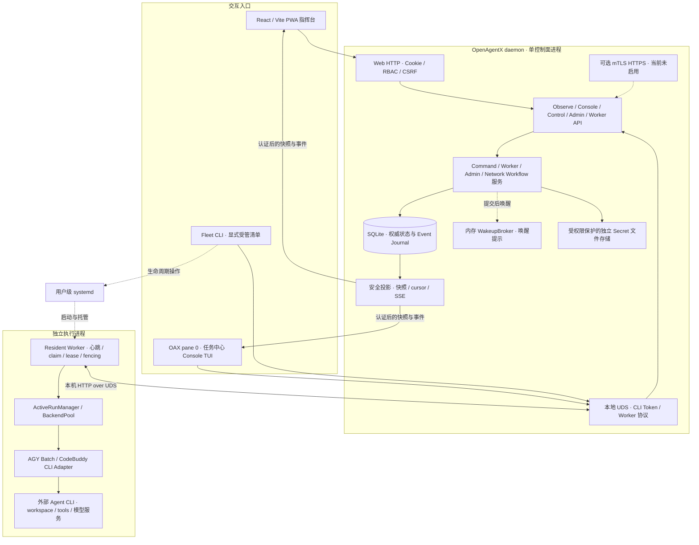
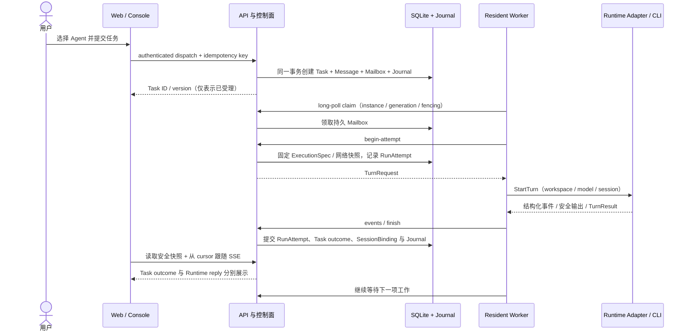
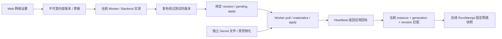

# OpenAgentX 当前系统架构

> 快照时间：2026-09-22 22:42–22:46（Asia/Shanghai）。本文件按**实际部署与对应源码**整理；ADR 表示决策，不能单凭 Accepted 判断功能已经上线。配套图：[离线 HTML 架构图](current-architecture.html)。

> 2026-09-23 评估补充：部署版本未变，新增真实测试与源码核对见[全面评估](../reports/assessment/2026-09-23/README.md)。确认组织 AuthorityPolicy 尚未接入业务命令、注册的 ROLE.md 没有确定性 Runtime 注入链路；ADR-006 已有 `dcd8fd6` 开发旁支，尚未安装。本图表示模块连接，不能当作每项功能均已兑现。

## 1. 本轮范围与验收

- 用户结果：先形成可追溯的 Markdown 架构说明，再提供可离线打开、可切换视图和查看组件职责的 HTML 图。
- 范围：OpenAgentX 的 Web/Console、控制面、持久状态、Worker、Runtime、网络配置、部署边界与 ADR 演进。Quote Service 是受管 Agent 的工作对象，不在本文件展开其业务架构。
- 非目标：不实现新 ADR、不修复任务终态、不部署或重启服务、不操作真实任务、不更改冻结决策。
- 验收证据：源码与安装产物只读核对；架构独立复核；Markdown 链接与 diff 检查；HTML 桌面/移动浏览器、视图切换、节点详情与离线渲染检查。
- 工作预算：本批最多 60 分钟，一个文档/图形实现批次和一次独立验证批次；同因工具失败两次改用等价路径。交付的是架构快照，不是完整 ADR 重新验收。

## 2. 先区分三个版本

| 对象 | 本次核实的版本 | 含义 |
|---|---|---|
| 本文所在主工作树 `main`（审计起点） | `3723c7731076d3f8d4b6a31b65cbcb48394c7d8f` | 仍是 ADR-005 首轮 Console/Fleet；其中 ADR-008 计划的 pending 不能代表整台主机现状；本次文档提交不改变产品实现 |
| ADR-008 实施工作树 | `008b2e0` / `codex/adr008-implementation` | 已有路径、CLI Token、OAX、全屏 Console、用户级 Fleet 实现；阶段记录与最终现场验收分开 |
| ADR-009 实施与现场记录 | `34053c02042ca7448587ff8c20bdd82c11ed870c` / `codex/adr009-task-console` | 包含 ADR-008 及任务中心 Console、后续 Web 修复；尚未合入本文所在主线 |
| 已安装 Go 程序 | `6d599aca8ce7c32fe11f23244478b495a0a78e68`，`vcs.modified=false` | daemon 与 quote-service Worker 的 `/proc/<pid>/exe` 和安装文件 SHA-256 一致 |
| 已安装 Web | 源码 `ee46038102ebd44d387e26ab912001f26b89ade5` | JS/CSS 与 ADR-009 工作树构建产物逐字节相同；源码归属同时依据安装报告，未在本轮重建 |

后文“当前已实现”主要指上述已安装候选分支的行为，**不表示已合并 main，也不表示完整 ADR 最终验收通过**。审计报告最新状态为 `installed-task-success-pending`：真实网页发送、过程与回复已有现场记录，但 Task 成功终态仍有缺口。

本次只读实测：用户级 daemon 和 `openagentx-worker@quote-service.service` 都是 `active/running`；`GET /api/observe/v1/health` 返回 `{"status":"ok"}`；Web 实际监听 `127.0.0.1:18100`。未发现 `18101` 监听，也没有启动远程 Worker HTTPS 的进程参数。未重做真实 Runtime 任务验收或外部 HTTPS 入口探测。

## 3. 总体架构

OpenAgentX 的目标是组织协作控制面；当前已贯通的核心是以逻辑 `agent_id` 寻址的任务投递与执行。组织/岗位模型已保存，但完整业务授权与自主委派尚未接线。独立常驻 Worker 领取持久工作，再通过 Runtime Adapter 启动一次 turn。Web 与 Console 都是正式 API 的客户端；tmux 的布局不参与业务路由、Worker 身份或执行权判定。



图中的 API 和服务模块同属一个 daemon，不是独立微服务；SQLite 同时保存当前状态和审计事件。内存 Broker 没有持久消息权威，丢失唤醒后仍以 Mailbox/Journal 为准。Event Journal 是追加审计与增量观察的来源，当前状态不靠全量事件重放重建。[S1][S2]

### 组件职责与边界

| 组件 | 当前职责 | 关键边界 |
|---|---|---|
| Web PWA | 登录、选择 Agent、发任务、跟踪过程、回复/审批/取消、网络设置 | 浏览器不直接访问 DB 或 Runtime；断线/离线写入不排队、不重放 |
| Console TUI | 当前关注 Task、Timeline、输入区、`/tasks`、`/status`、Normal/Diagnostic | Attach 要求 `OAX` 的 pane `0`；附加 pane 保留；退出 Console 不停止 Worker |
| Fleet CLI | manifest 管理、workspace 协调、user-systemd 启停、drain 观察 | 通过正式 API 获取身份；tmux 仅是 UI 宿主；不以键盘注入控制 Runtime |
| CommandService | dispatch、steer/message、cancel、approval | 入口有 Web/CLI RBAC、版本 CAS、幂等键；完整组织 AuthorityPolicy 未接入；领域状态和 Mailbox/Journal 在事务内一致提交 |
| WorkerService | 注册、心跳、claim、begin attempt、事件与 finish、过期恢复 | principal、Worker instance、generation、lease 与 fencing 共同约束执行权 |
| WorkerAdminService | drain、stop、force-stop、健康检查、lease revoke | 持久化 WorkerCommand；graceful 与强停语义分开 |
| NetworkWorkflowService | 配置草稿、测试、发布、绑定、应用回执 | 内容版本、测试对象和当前 Worker generation 必须匹配 |
| SQLite | 组织、身份、Task、Mailbox、RunAttempt、SessionBinding、Journal 等 | 单一权威状态库；终态、审计、session 等按各事务方法一起提交/回滚 |
| Resident Worker | 独立的心跳、健康、网络工作、Mailbox、控制命令与执行循环 | 完成 Task 后继续在线；活动 Run 不阻断心跳与取消通道 |
| BackendPool / Runtime Adapter | 能力、模型、推理强度、session、网络快照校验；启动/观察一次 turn | AGY 有结构化终态校验；本次发现 CodeBuddy 空成功/timeout 缺口；输出作安全投影，不能概括所有 Adapter 均已 fail closed |

## 4. 一次任务如何执行



- 执行规格在 RunAttempt 中固定，包含 Adapter、Backend、模型、推理参数、session 和网络版本；运行中不会跟随 UI 的新配置漂移。
- 补充消息、审批和取消先持久化，再由 Worker 控制通道与 Adapter 能力执行。Run 结束和新消息/取消并发时，事务里的版本与状态规则裁决，不依赖页面先后顺序。
- SessionBinding 保存逻辑执行上下文与 provider session 的关系；不使用 pane/window ID 作为对话身份。
- 恢复与 fencing 负责拒绝失效 Worker 的迟到写入；不能确定真实副作用时保留 `uncertain`，不能自动宣称重试成功。[S2][S3][S4]

### 必须分开的三种结果

| 层次 | 例子 | 能证明什么 |
|---|---|---|
| 控制面受理 | `queued`、`task.created` | 任务已保存，尚不证明已执行 |
| Runtime / RunAttempt 结果 | `succeeded` 且存在回复 | 本次 Runtime turn 有终态与回复，不自动证明业务任务成功 |
| Task outcome / 业务证据 | `succeeded` 或 `uncertain` | 按领域规则判断任务结果；当前缺少独立副作用证据可进入 `uncertain` |

当前 `FinishRun` 的规则是：Runtime `succeeded` 且 `SideEffectsKnown=false` 时，RunAttempt 可以是 `succeeded`，Task 则为 `uncertain / business_effect_unverified`，回复仍保留。模型自报字段 `RuntimeSideEffectsKnown` 不会自动升级成独立验证证据。ADR-006 的 query/change intent 分流尚未安装，已有 `dcd8fd6` 开发旁支；当前只读问答仍未达到用户要求的 Task 成功终态。2026-09-23 浏览器直达真实 AGY 的两项任务再次复现此差异。[S4][S8]

## 5. 网络配置是另一条控制闭环



配置模式包括 `inherit`、`direct` 与 Adapter 声明支持的代理模式。保存/发布成功不等于当前 Worker 已应用，Web 必须核对本代回执。进程网络凭据由受控文件/环境物化，不放进普通 API 观察数据、Event Journal 或图中。[S5]

当前 SecretStore 是 `0700` 目录与 `0600` 文件、不可变版本及受控引用/清理机制；不把它画成外部 Vault，也不凭 ADR 文字声称磁盘文件已经加密。网络策略受 Worker generation 隔离；ADR-007 提议的跨代自动连续性尚未实施。

2026-09-22 的已安装补丁允许 Runtime **主可执行文件**摘要变化时告警并继续；Adapter/protocol、wrapper/helper 等其他身份差异仍拒绝运行。这一补丁不等于取消网络 fencing，也不是 ADR-007 的代际继承。[S5]

## 6. 身份、存储与 API

### 身份分层

| 身份/对象 | 生命周期与用途 |
|---|---|
| Organization / Principal / Role / Position / AuthorityPolicy | 组织归属与授权模型；owner/operator/viewer 已用于入口，岗位/汇报链业务授权未贯通 |
| AgentIdentity / AgentProfile | 稳定逻辑 `agent_id`、能力与 workspace；不随终端布局变动；注册 instructions_path 未形成确定性 Runtime 注入 |
| WorkerInstance / generation / lease / fencing | 一次常驻 Worker 注册与其当前执行权；重启后的代际变化不能被旧回执掩盖 |
| Task / Message / MailboxItem | 用户工作、补充输入与持久投递分别建模 |
| RunAttempt / ExecutionSpec / SessionBinding | 一次执行尝试、不可变执行选择及 Runtime 会话关系 |
| Web Session / CLI Token | Web 走 Cookie + CSRF；CLI 走本机 UDS 的可撤销 Token，绑定 installation 并限定 scope |

CLI 本地 credential 文件为 `0600`；服务端保存 Token 摘要及期限/撤销状态。CLI 登录端点只挂在 UDS，Web HTTP 明确返回 404，不能互换浏览器 Cookie 与 CLI Token 的认证边界。[S1][S6]

### 存储分组

| 存储 | 主要内容 |
|---|---|
| SQLite · 组织与权限 | principals、organizations、roles、positions、agents、profiles、authority_policies |
| SQLite · 执行与投递 | tasks、messages、mailbox_items、run_attempts、session_bindings、workspace_leases、approval_*、worker_commands |
| SQLite · 运行与观察 | worker_instances、runtime_backend_registrations、event_journal、artifacts |
| SQLite · 会话与网络 | web_users/sessions、installation_metadata、cli_tokens、network_profiles/tests/bindings/work_items 等 |
| 数据库外 | 权限保护的网络 Secret 文件、Worker 配置、CLI credential、工作目录与实际业务文件 |

当前 schema 标识为 `1`，但实现已对 v1 增加网络表和 CLI Token 等兼容结构；不能再沿用旧 README 的“一切旧库都不在线扩展”表述。代码仍拒绝不支持的 schema 版本，以及缺少 `schema_meta` 的既有非空 legacy schema。本次只读架构检查未打开生产 DB；schema 现场值来自安装报告，源码契约来自 migration。[S7][S8]

### 传输与代表路由

| 入口 | 认证与使用者 | 代表路由 |
|---|---|---|
| Web HTTP（当前 loopback 18100） | Web Cookie / RBAC / CSRF | `/api/auth/v1/login`、`/api/observe/v1/tasks`、`/api/control/v1/tasks` |
| 本地 UDS · Console/Fleet | installation-bound CLI Token / scope / RBAC | `/api/auth/v1/cli/*`、`/api/console/v1/attach`、`/api/console/v1/agents/{agentID}/tasks` |
| 观察事件 | 沿用对应 Web 或 CLI 认证 | `/api/observe/v1/events/stream`；快照 high-water cursor + 增量事件 |
| 本地 UDS · Worker | 本地 socket 边界、Worker session 与 instance/generation/fencing | `/api/v1/workers/register`、`.../mailbox/claim`、`/api/v1/run-attempts/{run-id}/finish` |
| 可选远程 Worker HTTPS | mTLS 证书 principal 与 Agent 绑定，再校验 Worker 执行权 | 仅 Worker handler；当前部署未启用 |
| Worker 管理 | Owner/Admin 权限及版本条件 | `/api/admin/v1/workers/{worker-id}/drain`、`.../stop`、`.../force-stop` |

## 7. 当前部署拓扑与 Runtime 支持程度

```text
用户主机 / Linux 用户级 systemd
├─ ~/.local/bin/openagentx                         已安装二进制
├─ openagentx.service                             daemon
│  ├─ 127.0.0.1:18100                            Web 静态资源 + HTTP API
│  ├─ ~/.openagentx/run/openagentx.sock           UDS：CLI + Worker API
│  ├─ ~/.openagentx/data/openagentx.db            SQLite 权威状态
│  └─ ~/.openagentx/web/                         已安装 Web 资源
├─ openagentx-worker@quote-service.service         Resident Worker
│  └─ agy-batch → agy-graft → AGY                 本机配置的真实 Runtime 路径
│     └─ workspace / tools / 外部模型服务
└─ tmux OAX → Agent window → pane 0 Console        独立观察与操作界面
   └─ pane 1+ / 无关 window                       保留，不参与业务身份

可选外部 HTTPS 入口：仓库有 Nginx/Tailscale 部署方案；本轮未复核其现场链路。
可选远程 Worker：mTLS HTTPS；本轮实测未启用。
```

| Runtime | 代码与现场结论 |
|---|---|
| AGY Batch | `worker run` 已装配；当前 quote-service 配置使用 `agy-batch` 与 `agy-graft`；本轮未启动新 turn |
| CodeBuddy CLI | `worker run` 已装配；本次未核实有活动 CodeBuddy Worker |
| fake | 已装配，仅用于隔离测试，不代表真实 Runtime 验收 |
| ACP / Codex / Claude / OpenCode descriptors | 通用 ACP 代码与 descriptor 存在，但当前 `assembleM1Adapter` 未装配这些 Adapter ID，会拒绝；不能画成当前可直接选用的生产后端 |

systemd 托管 Worker 生命周期；Console/SSH 退出不等于 Worker 退出。graceful stop 是持久化停止意图：停止领新工作、等待活动 Run、释放 lease 后退出；force-stop 是单独的危险操作，可能留下 `uncertain`。[S3][S6]

## 8. ADR 演进与未落地边界

| ADR | 内容 | 本快照中的实际状态 |
|---|---|---|
| 001 | 组织控制面、Resident Worker、Runtime、移动指挥台 | 执行基础已贯通；组织授权/角色注入/结果收口仍有缺口；早期 T01–T10 只证明各自边界 |
| 002 | Runtime 网络配置、测试、发布、应用与诊断 | 已实现；按当前 Worker/Backend 验证，不等于保存即生效 |
| 003 | 任务详情、运行观察、安全内容呈现 | 主要页面存在；本批发现最新 Run 选择、详情审批与重连缺口 |
| 004 | 简化网络配置交互 | 主要流程存在；首次就绪引导、探测解释及加密承诺尚有差距 |
| 005 | Fleet、Console Attach、Worker 生命周期 | 首轮已实现；后续 workspace/TUI 体验由 008/009 演进 |
| 006 | Task intent 与可验证终态语义 | 固定部署基线文档为 Proposed；另有 `dcd8fd6` 实施旁支，**尚未安装**；当前缺口仍在 |
| 007 | 网络绑定跨 Worker generation 的连续性 | **Proposed，未授权实施**；当前仍按代际隔离 |
| 008 | OAX、路径、可撤销 CLI Token、一致快照、全屏 TUI | 功能已存在于已安装候选分支；main 的 pending 文档落后；不据此宣称完整 ADR 最终验收 |
| 009 | pane 0 任务工作台、Task 投影、Timeline、原位诊断 | 已安装实现；真实网页回复链路有记录，整体 Task 成功验收未完成，Diagnostic 跨 Task 旧输出问题仍待修复 |

Foreground Takeover 仍是禁用规划项；自动任务规划/跨 Agent 自主编排不能仅由组织模型推导为已实现。本图只表示已见到的控制、投递与执行链路。

## 9. 源码与证据索引

以下链接固定到已核对的 commit，避免本文所在旧 `main` 的同名文件误导。核心 Go 源使用已安装 `6d599ac`；最新现场说明用 `34053c0`；最新 Web 用 `ee46038`。

- [S1 — daemon 组装与路由隔离](https://github.com/insky2017/OpenAgentX/blob/6d599aca8ce7c32fe11f23244478b495a0a78e68/cmd/openagentx/main.go)：Web/UDS/可选 mTLS、共享服务与静态资源。
- [S2 — 事务边界](https://github.com/insky2017/OpenAgentX/blob/6d599aca8ce7c32fe11f23244478b495a0a78e68/internal/controlplane/transaction.go)；[唤醒 Broker](https://github.com/insky2017/OpenAgentX/blob/6d599aca8ce7c32fe11f23244478b495a0a78e68/internal/controlplane/broker.go)；[命令服务](https://github.com/insky2017/OpenAgentX/blob/6d599aca8ce7c32fe11f23244478b495a0a78e68/internal/controlplane/command_service.go)。
- [S3 — Worker 并行循环](https://github.com/insky2017/OpenAgentX/blob/6d599aca8ce7c32fe11f23244478b495a0a78e68/internal/worker/runner.go)；[Run 管理](https://github.com/insky2017/OpenAgentX/blob/6d599aca8ce7c32fe11f23244478b495a0a78e68/internal/worker/run_manager.go)；[真实 Adapter 装配](https://github.com/insky2017/OpenAgentX/blob/6d599aca8ce7c32fe11f23244478b495a0a78e68/internal/cli/worker/command.go)。
- [S4 — FinishRun 终态规则](https://github.com/insky2017/OpenAgentX/blob/6d599aca8ce7c32fe11f23244478b495a0a78e68/internal/persistence/sqlite/worker_execution_repository.go#L628)；[AGY 结果解析](https://github.com/insky2017/OpenAgentX/blob/6d599aca8ce7c32fe11f23244478b495a0a78e68/internal/runtime/agy/stream.go)。
- [S5 — 网络工作流](https://github.com/insky2017/OpenAgentX/blob/6d599aca8ce7c32fe11f23244478b495a0a78e68/internal/controlplane/network_workflow_service.go)；[Secret 文件存储](https://github.com/insky2017/OpenAgentX/blob/6d599aca8ce7c32fe11f23244478b495a0a78e68/internal/network/secretstore/file_store.go)；[Runtime 摘要变化策略](https://github.com/insky2017/OpenAgentX/blob/6d599aca8ce7c32fe11f23244478b495a0a78e68/internal/runtime/network/identity.go)；[Web 应用回执](https://github.com/insky2017/OpenAgentX/blob/ee46038102ebd44d387e26ab912001f26b89ade5/web/src/network-binding-state.js)。
- [S6 — CLI 会话](https://github.com/insky2017/OpenAgentX/blob/6d599aca8ce7c32fe11f23244478b495a0a78e68/internal/auth/cli/service.go)；[credential store](https://github.com/insky2017/OpenAgentX/blob/6d599aca8ce7c32fe11f23244478b495a0a78e68/internal/credentialstore/store.go)；[Fleet workspace](https://github.com/insky2017/OpenAgentX/blob/6d599aca8ce7c32fe11f23244478b495a0a78e68/internal/fleet/workspace.go)；[Task reducer](https://github.com/insky2017/OpenAgentX/blob/6d599aca8ce7c32fe11f23244478b495a0a78e68/internal/consolemodel/task_state.go)。
- [S7 — schema 与兼容扩展](https://github.com/insky2017/OpenAgentX/blob/6d599aca8ce7c32fe11f23244478b495a0a78e68/internal/persistence/sqlite/migrations/migrations.go)。
- [S8 — 2026-09-22 现场安装与未完成项](https://github.com/insky2017/OpenAgentX/blob/34053c02042ca7448587ff8c20bdd82c11ed870c/docs/reports/validation/2026-09-22-openagentx-adr009-live-installation.md)；[Web dispatch/reply 修复](https://github.com/insky2017/OpenAgentX/blob/ee46038102ebd44d387e26ab912001f26b89ade5/web/src/task-dispatch-state.js)。
- [S9 — 包含 ADR-009 的决策索引](https://github.com/insky2017/OpenAgentX/tree/34053c02042ca7448587ff8c20bdd82c11ed870c/docs/decisions)；[ADR-008 阶段执行记录](https://github.com/insky2017/OpenAgentX/blob/008b2e0/docs/plans/2026-09-14-openagentx-adr-008-implementation/EXECUTION-LOG.md)。

### 本轮运行证据摘要

- 安装文件、daemon PID `1686100`、Worker PID `1687781` 的 SHA-256 均为 `a26ebf4d84ede2fa60bd4c10aaee704056732dde9dc532cd424d85de76703e89`。
- 已安装 `assets/app.js`：`2e173b5064a89c61ca6a5a57f3e9ea1cc3fe8479b7695c81735edeb2053b1e7c`。
- 已安装 `assets/app.css`：`c7e9b0f8d223ff14ab76c2280ded37613bd4c06918f002c1627e9133a89b548f`。
- 执行了 `git status/log/worktree list`、`go version -m`、定向源码读取、`systemctl --user show/list-units`、`/proc/.../exe` 摘要、监听和健康检查；未读取 token、密码、Cookie、代理凭据或原始 Runtime payload。
- 独立只读复核覆盖 ADR-004 至 ADR-009、未合并分支、Task 终态、网络代际及 tmux 边界。历史现场任务结论引用安装报告，不冒充本轮新执行。

## 10. 后续维护

- 部署、ADR 实施或 Runtime 装配发生变化时，先更新版本表与证据，再同步 Markdown 图和 HTML；不能只更新某个 ADR 的状态标签。
- 重点重评触发条件：ADR-006 实施旁支安装并验收、ADR-007 获准实施、ADR-008/009 合入主线/最终验收、ACP 正式装配、远程 Worker 启用、部署入口变更。
- 本次交付检查结果如下；不回写历史关卡结论。

### 本次交付验证（2026-09-22）

2026-09-23 事实修订另经真实 Chrome 离线检查：1440/390 像素 × 4 视图无横向溢出；组织授权/ADR-006 修订可见；零页面异常及外部请求。证据见评估目录 `evidence/architecture-revised-browser.json` 与移动截图。以下保留原图首次交付记录。

| 检查 | 结果与边界 |
|---|---|
| 独立架构复核 | 通过；核对 ADR-004–009、认证、Task 终态、ACP 装配、Secret 与 schema；集中修正一处 legacy schema 措辞 |
| 源码证据 | S1–S9 共 21 个固定 commit Git 对象存在；本地 Markdown/HTML 互链有效 |
| 静态检查 | `git diff --check`、提取后 `node --check` 通过；AGENTS 与冻结 ADR 的 SHA-256 未变 |
| 离线浏览器 | 系统 Chrome `143.0.7499.109`，真实 headless 渲染，`file://` 打开且 browser context offline；零外部 HTTP 请求、零页面异常 |
| 响应式显示 | 1440、1024、760、390、320 像素 × 4 视图，共 20 组合；无页面横向溢出、无卡片内容裁切；桌面与 390 像素截图人工复看通过 |
| 交互 | 24 个组件入口均打开正确详情/源码链接，Escape 与关闭按钮有效；方向键/Home/End 切换、hash 刷新、深色模式与移动宽度弹窗通过 |
| 验证工具失败与替代 | agent-browser 默认引用缺失的 Chromium 1200；指定可执行文件又被已启动 daemon 忽略。两次同因失败后关闭该工具会话，改用 Playwright Core 显式启动系统 Chrome 完成上述真实浏览器检查 |
| 未覆盖 | 未跑业务 Go/Web 全量回归、未重启服务、未重做 Runtime/真机 PWA/外部入口验收；本次仅交付文档和独立静态 HTML，不代表修复了已记录业务缺口 |

本批仅修改 README 架构入口并新增本 Markdown 与 HTML；未合并实施分支、未修改产品代码或部署。移动检查为浏览器视口模拟，不冒称手机真机验收。
