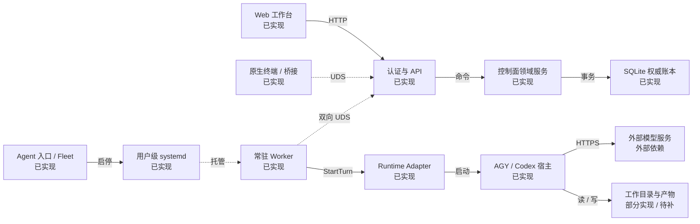
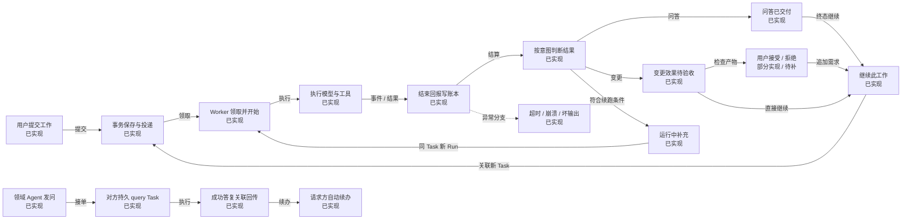
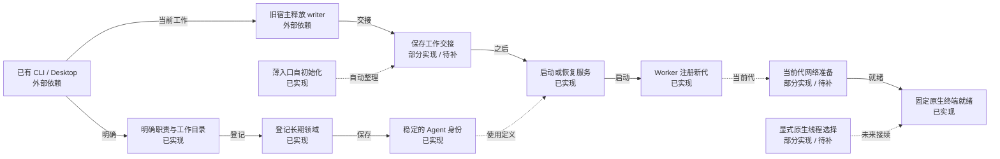
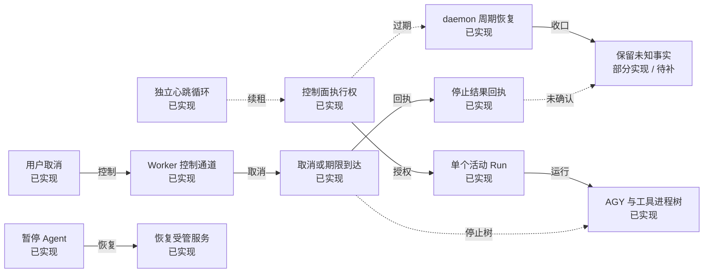
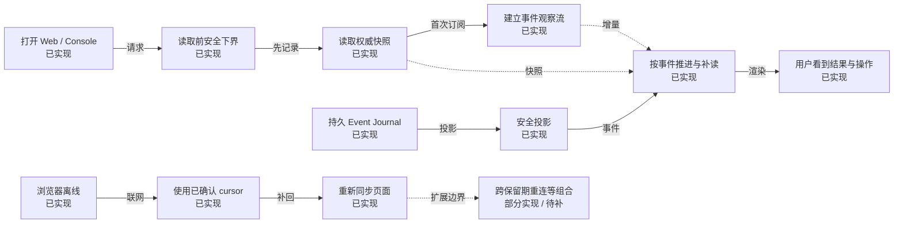
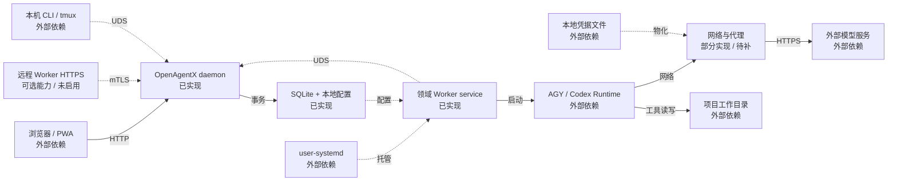
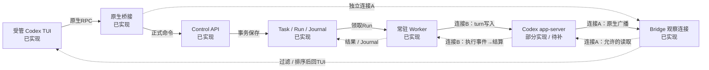

# OpenAgentX · 架构与关键流程

交互图：[打开 HTML 图册](current-architecture.html)；关联阅读：[事件协作与终端方案](event-collaboration.html)。快照日期：2026-10-03。
本图描述 OpenAgentX 任务后台。交易、行情等属于受管领域及业务工作区；不声称券商、交易所或真实交易执行已经接通。

## 要点

- 控制面是一个 daemon；每个领域有独立 Worker service。API、领域服务不是分别部署的微服务。
- SQLite 保存 Task、Run、投递与审计等权威事实；内存 Broker 只用于唤醒。Worker 通过正式 API 工作，不直接写库。
- 每次 Run 冻结角色、工作目录、输入与期限。AGY 每轮启动 CLI；Codex 由常驻 app-server 管理 thread/turn。原生 TUI 的写入经桥接进入正式调度，关闭界面不会终止 Worker。
- 问答成功表示完整回复已交付；执行任务的业务效果需独立核验。人工接受是独立 review，不改写原始执行事实。
- 当前原 Rhythm/Pay 已 managed active G3，保留原 thread；三项 query Task 与 7,973 字节完整答复、自动续办通过独立核查。原 Desktop 仅查历史，LLM heartbeat 已暂停。
- 此前独立身份的原生键盘输入、PTY 重连与 30 分钟空闲已验，本轮未重跑该矩阵；AGY 原生前台、精确工具取消和未知终态一键恢复仍待补。支付收费业务未实施。

## 当前版本与阅读方法

核对源码：`886ba7fd255a5f6632ee550d4bdcc786274f48fa`；当前安装工件来源：`886ba7fd255a5f6632ee550d4bdcc786274f48fa`。本图不是服务实时监控。后续文档提交不会自动改变安装来源。

实际安装二进制 SHA-256：`15fd8699c2f07af80966dc3edc355ee90f260e109c9715f402aedd16b90d97ca`。

当前证据：[当前原 Rhythm/Pay 迁入与只读闭环交付](../reports/validation/2026-10-03-rhythm-pay-managed/DELIVERY.md)、[当前原身份覆盖矩阵与未重验项](../reports/validation/2026-10-03-rhythm-pay-managed/COVERAGE.md)、[writer冲突、答复截断首败及复验](../reports/validation/2026-10-03-rhythm-pay-managed/EXECUTION-LOG.md)、[原身份三Task与7973字节答复独立核查](../reports/validation/2026-10-03-rhythm-pay-managed/evidence/independent-review.json)。此前独立身份原生输入/重连/空闲见 [历史独立身份：原生输入、重连与30分钟空闲](../reports/validation/2026-10-03-managed-collaboration/DELIVERY.md)；AGY 历史见 [AGY 22 组覆盖与未测边界](../reports/validation/2026-10-02-agy-workflow/COVERAGE.md)，Codex 早期边界见 [2026-10-02 历史：Codex 当前验收覆盖](../reports/validation/2026-10-02-codex-workflow/COVERAGE.md)。本轮 origin 由正式 Task API 发起；固定原生终端过程可见，不冒充本轮人工键盘输入重验。

实现状态与证据强度是两条轴：**已实现**、**部分实现 / 待补**、**待实现**、**可选 / 未启用**、**外部依赖**；证据标注 **D**（确定性）、**R**（真实 Runtime）、**I**（已安装环境）。绿色不等于全部 E2E 通过。

HTML 每次只显示一个子图；点击节点可见职责、限制和引用。虚线区分控制与拟议关系，以箭头文字和节点状态为准。

## 01 · 总览：一项工作如何穿过整个系统

**谁接收指令，谁持有状态，谁真正执行？** 一个 daemon 保存权威状态；领域 Worker 接单；原生输入与 managed 咨询都进入 Task / Run，再由 Runtime 执行。

[打开此图](current-architecture.html#overview)

| 节点 | 状态 | 关键职责 / 限制 | 证据范围 |
|---|---|---|---|
| Web 工作台 | 已实现 | 浏览器通过正式 HTTP API 提交任务、查看结果与控制取消。当前安装访问入口 127.0.0.1:18100。关闭浏览器不停止 Worker。 | 历史验收：AGY 既有 I＋R 日用；6b68eeb 的8项Web静态工件与HTTP响应 I 匹配；新版本交互验收另记。[浏览器观察与重连](../../web/src/main.jsx)、[AGY 历史安装 Web 日用证据](../reports/validation/2026-10-02-agy-workflow/evidence/installed-browser-9434479-daily01/README.md)、[2026-10-02 历史：6b68eeb 安装来源、Web 与网络重启核验](../reports/validation/2026-10-02-codex-workflow/evidence/installed-provenance01/README.md)、[2026-10-02 历史：Codex 当前验收覆盖](../reports/validation/2026-10-02-codex-workflow/COVERAGE.md) |
| 认证与 API | 已实现 | Web 使用 Cookie、RBAC、CSRF；Console 使用本地 UDS 与 CLI Token；Worker 使用其专用注册及写入约束。API 与领域服务处于同一 daemon。 | 源码已核对；真实覆盖见所列证据。[daemon 与 API 装配](../../cmd/openagentx/main.go)、[Overview 与安全观察投影](../../internal/api/panel/handler.go) |
| 控制面领域服务 | 已实现 | 同一 daemon 内处理任务、补充、取消、验收、网络与领域协作。managed consultation 经职责/peer/绑定检查原子生成 query Task；成功关联结果再生成请求方只读续办 Task。 | 本轮：原 Rhythm/Pay 三 query Task / 三 Run 成功，7973字节完整答复与自动续办；独立核查 PASS。[任务、补充与取消入口](../../internal/controlplane/command_service.go)、[托管咨询入任务与结果续办](../../internal/persistence/sqlite/managed_collaboration_repository.go)、[托管协作日用与限制](../operations/managed-collaboration.md)、[当前原 Rhythm/Pay 迁入与只读闭环交付](../reports/validation/2026-10-03-rhythm-pay-managed/DELIVERY.md) |
| SQLite 权威账本 | 已实现 | schema v5 保存 Task、Mailbox、Run、SessionBinding、代次与 Journal，以及职责目录、external 消息/回执和 managed_message_tasks。external 纯消息不伪造 Run；managed 咨询和结果消费创建真实 Task/Run。 | 本轮安装schema v5；原thread绑定、三Task/Run及消息Journal交叉核对。[事务化执行账本](../../internal/persistence/sqlite/worker_execution_repository.go)、[外部绑定与消息持久化](../../internal/persistence/sqlite/external_session_repository.go)、[schema v5 托管协作关系](../../internal/persistence/sqlite/migrations/005_managed_collaboration.sql)、[托管咨询入任务与结果续办](../../internal/persistence/sqlite/managed_collaboration_repository.go)、[当前原 Rhythm/Pay 迁入与只读闭环交付](../reports/validation/2026-10-03-rhythm-pay-managed/DELIVERY.md) |
| 原生终端 / 桥接 | 已实现 | Codex 原生 TUI 通过 native bridge 将 start/steer/interrupt 转正式 API，读取与事件观察连接 app-server。AGY 保留 Console。tmux 只承载前台，关闭前台不停止 Worker。固定入口 OAX:oneaxe-pay.0 与 OAX:rhythm.0，自动改名关闭。 | 历史独立身份：原生键盘输入、PTY关闭后后台继续/重连、忙时/离线和30分钟空闲已验；本轮未重跑该矩阵；本轮固定pane与真实过程已核对。[原生终端写入桥接](../../internal/nativebridge/bridge.go)、[原生终端入口](../../internal/cli/fleet/agent_native.go)、[历史独立身份：原生输入、重连与30分钟空闲](../reports/validation/2026-10-03-managed-collaboration/DELIVERY.md)、[当前原 Rhythm/Pay 迁入与只读闭环交付](../reports/validation/2026-10-03-rhythm-pay-managed/DELIVERY.md) |
| 常驻 Worker | 已实现 | 每个领域 Worker 独立接单，单 Agent 最多一个活动 Run。普通程序等待持久队列，有工作才启动模型；心跳和控制循环独立于模型执行。原 Desktop 的 LLM heartbeat 已暂停。 | 历史独立身份30分钟新增模型轮次/工具调用为0；本轮原身份自动执行已验。[Worker 执行与控制循环](../../internal/worker/runner.go)、[托管咨询入任务与结果续办](../../internal/persistence/sqlite/managed_collaboration_repository.go)、[历史独立身份：原生输入、重连与30分钟空闲](../reports/validation/2026-10-03-managed-collaboration/DELIVERY.md)、[当前原 Rhythm/Pay 迁入与只读闭环交付](../reports/validation/2026-10-03-rhythm-pay-managed/DELIVERY.md) |
| Runtime Adapter | 已实现 | AGY 与 Codex 共用冻结输入和权威账本。AGY 每 Run 启动 CLI；Codex Worker 经持久 app-server 管理明确 thread/turn。本轮原 Rhythm/Pay 已 managed active G3，保留原 thread；原 Desktop 仅查历史。 | 本轮：原 Rhythm/Pay 三 query Task / 三 Run 成功，7973字节完整答复与自动续办；独立核查 PASS。[AGY 进程与角色输入](../../internal/runtime/agy/adapter.go)、[Codex app-server 与取消边界](../../internal/runtime/codex/adapter.go)、[实际装配的 Runtime](../../internal/cli/worker/command.go)、[当前原 Rhythm/Pay 迁入与只读闭环交付](../reports/validation/2026-10-03-rhythm-pay-managed/DELIVERY.md)、[当前原身份覆盖矩阵与未重验项](../reports/validation/2026-10-03-rhythm-pay-managed/COVERAGE.md) |
| AGY / Codex 宿主 | 已实现 | AGY 通过 agy-graft 启动 CLI；Codex 使用领域专属 app-server，Worker 是受管 turn 写入者。native bridge 另建读取/事件观察连接，不另起模型轮询。AGY 原生前台仍待补。 | AGY历史R/I；Codex原身份本轮只读协作R及独立核验。[AGY 进程与角色输入](../../internal/runtime/agy/adapter.go)、[Codex app-server 与取消边界](../../internal/runtime/codex/adapter.go)、[原生终端写入桥接](../../internal/nativebridge/bridge.go)、[历史独立身份：原生输入、重连与30分钟空闲](../reports/validation/2026-10-03-managed-collaboration/DELIVERY.md)、[当前原 Rhythm/Pay 迁入与只读闭环交付](../reports/validation/2026-10-03-rhythm-pay-managed/DELIVERY.md) |
| Agent 入口 / Fleet | 已实现 | 日常 agent add/open/status/pause/resume；Codex join --prepare 离线保存交接，agent open --native 打开原生终端。新建 Codex Fleet pane 0 默认原生；已有活pane保留。本轮overview为既有普通shell，workspace预检拒绝，仅通过正式open新增两窗。 | 历史隔离Fleet原生输入已验；本轮不宣称fleet workspace/up通过。[登记与服务入口](../../internal/cli/fleet/agent.go)、[离线准备与交接入口](../../internal/cli/fleet/agent_join.go)、[原生终端入口](../../internal/cli/fleet/agent_native.go)、[历史独立身份：原生输入、重连与30分钟空闲](../reports/validation/2026-10-03-managed-collaboration/DELIVERY.md)、[writer冲突、答复截断首败及复验](../reports/validation/2026-10-03-rhythm-pay-managed/EXECUTION-LOG.md) |
| 用户级 systemd | 已实现 | 后台服务独立于浏览器和终端。受管服务提供进程组清理及故障重启。agent add/start 使用 start，不等于默认已经 enable 开机启动。 | AGY 既有证据：I：服务启停、角色冻结、排队暂停、Worker 崩溃恢复。[登记与服务入口](../../internal/cli/fleet/agent.go)、[安装入口、角色与故障恢复证据](../reports/validation/2026-10-02-agy-workflow/evidence/installed-17d5cd2-onboarding01-resume02/README.md) |
| 工作目录与产物 | 部分实现 / 待补 | 工具真实读写 Agent 的工作目录。业务产物在文件系统，不因模型回复就被自动验证；当前 Web 没有统一产物预览/下载入口。 **待补：产物可读写且已实测；文件浏览与验收展示仍待改善** | 源码已核对；真实覆盖见所列证据。[AGY 历史安装 Web 日用证据](../reports/validation/2026-10-02-agy-workflow/evidence/installed-browser-9434479-daily01/README.md)、[日用操作指南](../operations/agy-daily-workflow.md) |
| 外部模型服务 | 外部依赖 | AGY 与 Codex 各由其 Runtime 调用外部模型服务，依赖登录、模型与代理配置。OAX控制面不直接替代Runtime调用模型；供应商内部实现不在此图范围。 | AGY历史及Codex本轮真实模型链路；不扩大为所有模型参数已验。[AGY 进程与角色输入](../../internal/runtime/agy/adapter.go)、[Codex app-server 与取消边界](../../internal/runtime/codex/adapter.go)、[网络测试、发布与应用](../../internal/controlplane/network_workflow_service.go)、[当前原 Rhythm/Pay 迁入与只读闭环交付](../reports/validation/2026-10-03-rhythm-pay-managed/DELIVERY.md) |

- 原 Rhythm/Pay 已迁入 managed active G3、保留原thread；只读咨询→完整答复→自动续办通过，详见第02和07图。
- 绿色表示已实现；历史独立身份输入/重连/空闲证据，与本轮正式API发起的原身份闭环分开阅读。
- query不是写入沙箱；两业务仓库未改，支付接入、收费、回调或部署均未执行。

## 02 · 工作流：从用户指令到可继续的结果

**“已受理”“执行结束”“用户验收”分别意味着什么？** Task 表示一项工作，Run 表示一次执行。问答交付与文件变更验收采用不同完成规则。

[打开此图](current-architecture.html#work)

| 节点 | 状态 | 关键职责 / 限制 | 证据范围 |
|---|---|---|---|
| 用户提交工作 | 已实现 | 选择问答 query 或执行任务 mutation。带幂等键提交；用户界面不直接调用模型。继续工作会携带父任务目标和结果摘要。 | 源码已核对；真实覆盖见所列证据。[任务、补充与取消入口](../../internal/controlplane/command_service.go)、[AGY 历史安装 Web 日用证据](../reports/validation/2026-10-02-agy-workflow/evidence/installed-browser-9434479-daily01/README.md) |
| 事务保存与投递 | 已实现 | 同一事务保存工作和投递记录并追加 Journal。返回 Task ID 只证明已受理。持久 Mailbox 是领取来源，Broker 仅加速唤醒。 | 源码已核对；真实覆盖见所列证据。[任务、补充与取消入口](../../internal/controlplane/command_service.go)、[事务化执行账本](../../internal/persistence/sqlite/worker_execution_repository.go)、[真实 AGY 主链与取消证据](../reports/validation/2026-10-02-agy-workflow/evidence/live-f3cd7a3-main01/REPORT.md) |
| Worker 领取并开始 | 已实现 | 验证当前执行权，创建 RunAttempt，冻结角色内容/hash、cwd、网络版本、参数与截止时间。后续修改职责不会改变本次 Run。 | 源码已核对；真实覆盖见所列证据。[Task 内会话与输入冻结](../../internal/controlplane/worker_service.go)、[安装入口、角色与故障恢复证据](../reports/validation/2026-10-02-agy-workflow/evidence/installed-17d5cd2-onboarding01-resume02/README.md) |
| 执行模型与工具 | 已实现 | AGY 启动 CLI；Codex 在明确 thread 中启动 turn。运行中补充进入正式控制与账本路径，不用向终端注入按键代替调度。 | AGY：既有 R＋I；Codex：隔离正式 API 三轮及独立产物核验。[AGY 进程与角色输入](../../internal/runtime/agy/adapter.go)、[Codex app-server 与取消边界](../../internal/runtime/codex/adapter.go)、[原生终端写入桥接](../../internal/nativebridge/bridge.go)、[真实 Codex 主链独立核验](../reports/validation/2026-10-02-codex-workflow/evidence/real-workflow02/independent-verification.json) |
| 结束回报写账本 | 已实现 | Worker上报TurnResult并事务处理Run、Task、会话及Journal。完整最终答复独立保留至32KiB，事件/错误摘要仍4KiB；空输出、缺终态或真实超限不凭exit 0判成功。 | 本轮4KiB截断首败保留，修复后7973字节完整传播及超限回归。[事务化执行账本](../../internal/persistence/sqlite/worker_execution_repository.go)、[Task 内会话与输入冻结](../../internal/controlplane/worker_service.go)、[writer冲突、答复截断首败及复验](../reports/validation/2026-10-03-rhythm-pay-managed/EXECUTION-LOG.md) |
| 按意图判断结果 | 已实现 | 问答依据完整最终回复交付；执行任务还涉及实际业务效果。Runtime succeeded 与 Task succeeded 不是一个断言。 | 源码已核对；真实覆盖见所列证据。[问答与业务效果判定](../../internal/domain/task_completion.go)、[Task 内会话与输入冻结](../../internal/controlplane/worker_service.go)、[独立的人工结果验收](../../internal/api/panel/task_review.go)、[AGY 历史安装 Web 日用证据](../reports/validation/2026-10-02-agy-workflow/evidence/installed-browser-9434479-daily01/README.md) |
| 问答已交付 | 已实现 | 合法成功终态及完整FinalReply可结算query_result_delivered。只证明回复交付，不证明答案正确或提供只读沙箱；managed咨询成功后由后台关联结果并安排请求方续办。 | 本轮：原 Rhythm/Pay 三 query Task / 三 Run 成功，7973字节完整答复与自动续办；独立核查 PASS。[问答与业务效果判定](../../internal/domain/task_completion.go)、[托管咨询入任务与结果续办](../../internal/persistence/sqlite/managed_collaboration_repository.go)、[当前原 Rhythm/Pay 迁入与只读闭环交付](../reports/validation/2026-10-03-rhythm-pay-managed/DELIVERY.md)、[原身份三Task与7973字节答复独立核查](../reports/validation/2026-10-03-rhythm-pay-managed/evidence/independent-review.json) |
| 变更效果待验收 | 已实现 | 当前 AGY 未确认副作用（SideEffectsKnown=false）时，mutation 保留 uncertain/business_effect_unverified。Runtime 报告效果已知时可为 succeeded/mutation_effects_known，仍不等于系统独立业务验收。真实文件需另行检查。 | AGY 既有证据：I＋R：报告实际生成；原不确定执行记录保留。[问答与业务效果判定](../../internal/domain/task_completion.go)、[AGY 历史安装 Web 日用证据](../reports/validation/2026-10-02-agy-workflow/evidence/installed-browser-9434479-daily01/README.md)、[独立的人工结果验收](../../internal/api/panel/task_review.go) |
| 用户接受 / 拒绝 | 部分实现 / 待补 | 验收结论绑定对应 Run/版本，不改写原执行事实。当前详情可见用户已验收，列表仍可能显示 uncertain，这是已知体验欠缺。 **待补：验收落账已实现；列表与详情表达仍需统一** | 源码已核对；真实覆盖见所列证据。[独立的人工结果验收](../../internal/api/panel/task_review.go)、[AGY 历史安装 Web 日用证据](../reports/validation/2026-10-02-agy-workflow/evidence/installed-browser-9434479-daily01/README.md) |
| 继续此工作 | 已实现 | 用户“继续此工作”创建关联新Task并带目标/结果摘要，不重跑父任务；它与managed自动result_consumption是不同入口。managed续办固定请求方已登记backend/thread。 | 历史用户继续流程；本轮managed续办Task与原thread已核对。[任务、补充与取消入口](../../internal/controlplane/command_service.go)、[托管咨询入任务与结果续办](../../internal/persistence/sqlite/managed_collaboration_repository.go)、[托管协作日用与限制](../operations/managed-collaboration.md) |
| 运行中补充 | 已实现 | 符合结算条件时，已提交补充由下一 Run 消费；成功或明确失败可继续，效果未确认的 mutation 另要求完整有效回复。未知停止、坏协议结果或取消中不自动续跑。 | AGY 既有证据：R：query / mutation 补充与幂等消费；I 未单独重测。[真实 AGY 主链与取消证据](../reports/validation/2026-10-02-agy-workflow/evidence/live-f3cd7a3-main01/REPORT.md)、[95 秒续租与补充独立复核](../reports/validation/2026-10-02-agy-workflow/evidence/live-17d5cd2-lease02/REPORT.md)、[Task 内会话与输入冻结](../../internal/controlplane/worker_service.go) |
| 超时 / 崩溃 / 坏输出 | 已实现 | 超时、协议异常或失联时保留可信诊断与原始账本；是否停止进程要另行取证。不会靠重发旧任务制造“恢复成功”。 | 源码已核对；真实覆盖见所列证据。[AGY 22 组覆盖与未测边界](../reports/validation/2026-10-02-agy-workflow/COVERAGE.md)、[真实超时与后续任务证据](../reports/validation/2026-10-02-agy-workflow/evidence/live-f3cd7a3-timeout01/REPORT.md)、[周期恢复与裸进程清理边界](../reports/validation/2026-10-02-agy-workflow/evidence/live-17d5cd2-periodic01/REPORT.md) |
| 领域 Agent 发问 | 已实现 | Agent按职责目录发一次collaborate ask；peer、scope/owner和绑定检查决定是否接单。当前managed仅自动接受只读consultation，行动request不在范围。 | 本轮：原 Rhythm/Pay 三 query Task / 三 Run 成功，7973字节完整答复与自动续办；独立核查 PASS。[托管协作日用与限制](../operations/managed-collaboration.md)、[托管咨询入任务与结果续办](../../internal/persistence/sqlite/managed_collaboration_repository.go)、[当前原 Rhythm/Pay 迁入与只读闭环交付](../reports/validation/2026-10-03-rhythm-pay-managed/DELIVERY.md) |
| 对方持久 query Task | 已实现 | 咨询消息与query Task/Mailbox、SessionBinding及Journal在同一事务保存，去重key避免重复任务。忙时排队，离线待办不丢，Runtime就绪后由同一Worker领取。 | 本轮：原 Rhythm/Pay 三 query Task / 三 Run 成功，7973字节完整答复与自动续办；独立核查 PASS。[托管咨询入任务与结果续办](../../internal/persistence/sqlite/managed_collaboration_repository.go)、[历史独立身份：原生输入、重连与30分钟空闲](../reports/validation/2026-10-03-managed-collaboration/DELIVERY.md)、[原身份三Task与7973字节答复独立核查](../reports/validation/2026-10-03-rhythm-pay-managed/evidence/independent-review.json) |
| 成功答复关联回传 | 已实现 | 对方最终答复成功结算后，后台持久保存一条关联结果。失败、未知结果或职责/绑定/backend变化转needs_review，保留原始失败，不自动重做。 | 本轮：原 Rhythm/Pay 三 query Task / 三 Run 成功，7973字节完整答复与自动续办；独立核查 PASS。[托管咨询入任务与结果续办](../../internal/persistence/sqlite/managed_collaboration_repository.go)、[writer冲突、答复截断首败及复验](../reports/validation/2026-10-03-rhythm-pay-managed/EXECUTION-LOG.md)、[原身份三Task与7973字节答复独立核查](../reports/validation/2026-10-03-rhythm-pay-managed/evidence/independent-review.json) |
| 请求方自动续办 | 已实现 | 结果自动创建请求方query Task，固定原backend/thread，在本域职责内消费答案。消费结束不再协议回信；本轮仅一咨询一结果，无回复循环。 | 本轮：原 Rhythm/Pay 三 query Task / 三 Run 成功，7973字节完整答复与自动续办；独立核查 PASS。[托管咨询入任务与结果续办](../../internal/persistence/sqlite/managed_collaboration_repository.go)、[当前原 Rhythm/Pay 迁入与只读闭环交付](../reports/validation/2026-10-03-rhythm-pay-managed/DELIVERY.md)、[原身份三Task与7973字节答复独立核查](../reports/validation/2026-10-03-rhythm-pay-managed/evidence/independent-review.json) |

- query是回复交付语义，不是OS只读沙箱。自动咨询不等于行动委派或支付收费完成。
- 人工继续、同Task补充与managed结果续办是三个入口；都落到既有Task/Run，managed固定原thread。
- 原身份本轮三Task各一个Run，7973字节完整答复；首次writer冲突与截断失败仍保留。

## 03 · 领域初始化：从正在工作的 CLI 到长期领域

**哪些可以今天做到，哪些仍需补入口？** 保存领域身份、职责、工作目录与明确thread；原Rhythm/Pay已完成正式迁入，旧宿主必须先释放writer。

[打开此图](current-architecture.html#init)

| 节点 | 状态 | 关键职责 / 限制 | 证据范围 |
|---|---|---|---|
| 已有 CLI / Desktop | 外部依赖 | 已有CLI可join --prepare；external模式保留原宿主，只提供持久消息。原Rhythm/Pay已另经用户授权迁入managed active G3，保留原thread；原Desktop仅查历史，不同时派新任务。 **待补：原Desktop事件入站仍未验；不能将Worker迁入通过算作Desktop自动协作通过** | 历史external人工往返与heartbeat失败保留；本轮原身份managed自动闭环已验。[离线准备与交接入口](../../internal/cli/fleet/agent_join.go)、[外部原会话消息通道操作指南](../operations/external-session-entry.md)、[当前原 Rhythm/Pay 迁入与只读闭环交付](../reports/validation/2026-10-03-rhythm-pay-managed/DELIVERY.md)、[writer冲突、答复截断首败及复验](../reports/validation/2026-10-03-rhythm-pay-managed/EXECUTION-LOG.md) |
| 明确职责与工作目录 | 已实现 | 用户或当前 Agent 编写长期职责与交接文件。prepare 保存私密快照，受管 Run 冻结角色/cwd；不热改当前对话的系统提示。 | 源码已核对；真实覆盖见所列证据。[Task 内会话与输入冻结](../../internal/controlplane/worker_service.go)、[离线准备与交接入口](../../internal/cli/fleet/agent_join.go)、[Codex 登记与使用说明](../operations/codex-agent-entry.md) |
| 登记长期领域 | 已实现 | 保存身份、Profile、Worker 与 Fleet 配置，可导入已有 OpenAgentX identity / Worker YAML。此选项不启动 Worker，但可能启动 daemon 并完成登录。 | AGY 既有证据：源码＋已有入口 D/I；活 CLI 自注册专项未测。[登记与服务入口](../../internal/cli/fleet/agent.go)、[安装入口、角色与故障恢复证据](../reports/validation/2026-10-02-agy-workflow/evidence/installed-17d5cd2-onboarding01-resume02/README.md) |
| 稳定的 Agent 身份 | 已实现 | 身份和职责可跨进程保存。相同定义重复添加幂等，冲突不会静默覆盖。长期身份不要求永远复用同一个聊天 session。 | 源码已核对；真实覆盖见所列证据。[登记与服务入口](../../internal/cli/fleet/agent.go)、[安装入口、角色与故障恢复证据](../reports/validation/2026-10-02-agy-workflow/evidence/installed-17d5cd2-onboarding01-resume02/README.md) |
| 旧宿主释放 writer | 外部依赖 | 停止turn或显示idle不证明thread writer已释放。本轮Rhythm首遇writer冲突；通过正式App生命周期释放并核对notLoaded后迁入，未删锁、改数据库或重启共享Desktop。 | 首次失败与正式释放、69个结束子任务归档状态恢复证据保留。[离线准备与交接入口](../../internal/cli/fleet/agent_join.go)、[writer冲突、答复截断首败及复验](../reports/validation/2026-10-03-rhythm-pay-managed/EXECUTION-LOG.md) |
| 保存工作交接 | 部分实现 / 待补 | join --prepare 保存 ROLE/HANDOFF 私密快照及 local_prepared 回执；身份/Fleet 暂不就绪。当前轮结束后显式 resume，Worker 和网络通过后才启用 Fleet。 **待补：完整自动总结与任意 CLI 历史迁移不在本轮能力内** | R：离线准备幂等、零 connect/子程序启动；激活全链按覆盖表。[离线准备与交接入口](../../internal/cli/fleet/agent_join.go)、[真实 PTY 离线准备证据](../reports/validation/2026-10-02-codex-workflow/evidence/codex-cli-join-20261002T074001Z/README.md)、[Codex 登记与使用说明](../operations/codex-agent-entry.md) |
| 启动或恢复服务 | 已实现 | 交接后显式启动目标 Worker，检查在线状态并准备网络。底层调用 user-systemd，不通过向终端注入业务指令执行。 | 源码已核对；真实覆盖见所列证据。[登记与服务入口](../../internal/cli/fleet/agent.go)、[安装入口、角色与故障恢复证据](../reports/validation/2026-10-02-agy-workflow/evidence/installed-17d5cd2-onboarding01-resume02/README.md) |
| Worker 注册新代 | 已实现 | Worker 为已存在的领域身份注册实例和 generation。网络旧代回执不能证明当前代已就绪。 | 源码已核对；真实覆盖见所列证据。[Task 内会话与输入冻结](../../internal/controlplane/worker_service.go)、[安装入口、角色与故障恢复证据](../reports/validation/2026-10-02-agy-workflow/evidence/installed-17d5cd2-onboarding01-resume02/README.md) |
| 薄入口自初始化 | 已实现 | 2026-10-05 增量：Skill 已支持用户/工程安装、真实发现自检和结构化 brief；自动校验当前 thread，生成 ROLE/HANDOFF 并调用现有离线 prepare。启用与协作仍由管理侧另行完成。 | D/I：真实 CLI、软链、skills/list 与重放；R：独立 Codex 读取 Skill 并准备，thread 与原 CLI receipt 一致；不代表已托管协作。[领域 Agent 自初始化薄技能](../../skills/openagentx-join/SKILL.md)、[离线准备与交接入口](../../internal/cli/fleet/agent_join.go)、[接入 Skill 安装与真实准备验收](../reports/validation/2026-10-05-join-skill/DELIVERY.md) |
| 显式原生线程选择 | 部分实现 / 待补 | Codex显式选择thread，正式SessionBinding核对身份/原thread，受管写入由Worker仲裁。已撤销external且同身份/同原thread无冲突时才可迁入managed；active external和反向迁移仍拒绝。 **待补：AGY外部conversation迁入仍未实现；不抢占活跃宿主** | 本轮原Pay/Rhythm G3、原thread及职责保持；迁入回归与真实证据。[离线准备与交接入口](../../internal/cli/fleet/agent_join.go)、[托管咨询入任务与结果续办](../../internal/persistence/sqlite/managed_collaboration_repository.go)、[writer冲突、答复截断首败及复验](../reports/validation/2026-10-03-rhythm-pay-managed/EXECUTION-LOG.md)、[原身份三Task与7973字节答复独立核查](../reports/validation/2026-10-03-rhythm-pay-managed/evidence/independent-review.json) |
| 当前代网络准备 | 部分实现 / 待补 | inherit/direct 经正式测试与当前代应用。Codex 从持久代理配置保存私密 env；重启后 Worker/app-server 环境、CODEX_HOME 和 NO_PROXY 保持，正式网络绑定匹配新代且ready。 **待补：Codex named_profile 仍拒绝；坏代理修复和其他网络组合按覆盖表** | R＋I：实际进程环境及一次Worker重启持久性；不代表外网流量。[网络测试、发布与应用](../../internal/controlplane/network_workflow_service.go)、[持久代理与私密环境](../../internal/cli/fleet/agent_environment.go)、[实际 Worker 与 app-server 环境核验](../reports/validation/2026-10-02-codex-workflow/evidence/network-live01/README.md)、[2026-10-02 历史：6b68eeb 安装来源、Web 与网络重启核验](../reports/validation/2026-10-02-codex-workflow/evidence/installed-provenance01/README.md) |
| 固定原生终端就绪 | 已实现 | 本轮固定OAX:oneaxe-pay.0（@27/%54）与OAX:rhythm.0（@28/%55），窗口自动改名关闭。pane 0原生进程与原thread核对通过；原11窗口18pane保持。overview普通shell使Fleet预检拒绝，两新窗通过正式agent open --native打开。 | 本轮pane/进程/原窗保留已验；不宣称fleet up或人工键盘矩阵重验。[当前原 Rhythm/Pay 迁入与只读闭环交付](../reports/validation/2026-10-03-rhythm-pay-managed/DELIVERY.md)、[writer冲突、答复截断首败及复验](../reports/validation/2026-10-03-rhythm-pay-managed/EXECUTION-LOG.md)、[固定终端与正式迁入步骤](../operations/rhythm-pay-managed-handoff.md) |

- 本轮两业务身份已managed active G3；职责目录revision 5。原Desktop保留查历史，日常执行从固定OAX终端进入。
- join准备、writer释放、Runtime就绪、协作启用分别核对；仅Worker online不足以证明可接单。
- 不迁移任意活跃PTY；本轮只读验收未修改两业务仓库，也未执行支付接入。

## 04 · AGY 运行：AGY 的运行、取消与恢复

**停止请求、物理停止和账本恢复分别由谁负责？** 本子图展示 AGY 已实测的控制和恢复路径。Codex 共用控制面，但取消及未决状态的限制须另看 Codex 原生子图。

[打开此图](current-architecture.html#runtime)

| 节点 | 状态 | 关键职责 / 限制 | 证据范围 |
|---|---|---|---|
| 独立心跳循环 | 已实现 | Worker程序心跳维持Worker/Run lease；模型运行、控制与心跳独立。无任务时程序等待，不定时启动LLM查收件箱。原Desktop两版heartbeat共8轮0工具调用失败后已暂停。 | 历史独立身份1800秒新增模型轮次/工具为0；本轮原身份自动咨询通过。[Worker 执行与控制循环](../../internal/worker/runner.go)、[历史独立身份：原生输入、重连与30分钟空闲](../reports/validation/2026-10-03-managed-collaboration/DELIVERY.md)、[当前原 Rhythm/Pay 迁入与只读闭环交付](../reports/validation/2026-10-03-rhythm-pay-managed/DELIVERY.md) |
| 控制面执行权 | 已实现 | 当前代、租约和 fencing 限定有效执行权。旧实例迟到的写入必须被拒绝，不能覆盖新一代状态。 | 源码已核对；真实覆盖见所列证据。[Task 内会话与输入冻结](../../internal/controlplane/worker_service.go)、[事务化执行账本](../../internal/persistence/sqlite/worker_execution_repository.go) |
| 单个活动 Run | 已实现 | 单领域的有效活动 Run受约束。默认运行期限30分钟，可配置；心跳续租不会延长这次任务的截止时间。 | 源码已核对；真实覆盖见所列证据。[Task 内会话与输入冻结](../../internal/controlplane/worker_service.go)、[Worker 执行与控制循环](../../internal/worker/runner.go)、[AGY 22 组覆盖与未测边界](../reports/validation/2026-10-02-agy-workflow/COVERAGE.md) |
| AGY 与工具进程树 | 已实现 | Adapter 启动 AGY及其工具链并保留取消控制。取消不会撤销已经写出的文件。直接强杀裸 Worker 与systemd受管清理不同。 | AGY：源码已核对；真实覆盖见所列证据。[AGY 进程与角色输入](../../internal/runtime/agy/adapter.go)、[真实 AGY 主链与取消证据](../reports/validation/2026-10-02-agy-workflow/evidence/live-f3cd7a3-main01/REPORT.md)、[安装入口、角色与故障恢复证据](../reports/validation/2026-10-02-agy-workflow/evidence/installed-17d5cd2-onboarding01-resume02/README.md) |
| 用户取消 | 已实现 | 取消先记录请求。没有活动 Run 时，取消事务可同时收口 queued/waiting_input 与 Mailbox；活动 Run 经独立控制通道请求实际停止。运行补充的后续执行见工作流子图。 | 源码已核对；真实覆盖见所列证据。[任务、补充与取消入口](../../internal/controlplane/command_service.go)、[真实 AGY 主链与取消证据](../reports/validation/2026-10-02-agy-workflow/evidence/live-f3cd7a3-main01/REPORT.md)、[AGY 22 组覆盖与未测边界](../reports/validation/2026-10-02-agy-workflow/COVERAGE.md) |
| Worker 控制通道 | 已实现 | Worker 处理持久控制指令及任务取消，活动模型不能阻塞控制循环。queued steer和进程信号取消是当前AGY支持形式。 | AGY：源码已核对；真实覆盖见所列证据。[Worker 执行与控制循环](../../internal/worker/runner.go)、[AGY 进程与角色输入](../../internal/runtime/agy/adapter.go) |
| 取消或期限到达 | 已实现 | 显式取消触发进程信号与后代清理。超时也清理进程，但不能因此把未知业务效果判为成功或一概记为用户取消。 | AGY：R：活动取消全树观测上限约4秒；35秒timeout后可接下一query。[AGY 进程与角色输入](../../internal/runtime/agy/adapter.go)、[真实超时与后续任务证据](../reports/validation/2026-10-02-agy-workflow/evidence/live-f3cd7a3-timeout01/REPORT.md)、[真实 AGY 主链与取消证据](../reports/validation/2026-10-02-agy-workflow/evidence/live-f3cd7a3-main01/REPORT.md) |
| 停止结果回执 | 已实现 | 显式取消且真实进程停止确认，才正确收口canceled；清理失败、失联或结果无法确认时保留uncertain。UI区分请求与确认。 | AGY：源码已核对；真实覆盖见所列证据。[真实 AGY 主链与取消证据](../reports/validation/2026-10-02-agy-workflow/evidence/live-f3cd7a3-main01/REPORT.md)、[真实超时与后续任务证据](../reports/validation/2026-10-02-agy-workflow/evidence/live-f3cd7a3-timeout01/REPORT.md)、[AGY 22 组覆盖与未测边界](../reports/validation/2026-10-02-agy-workflow/COVERAGE.md) |
| 暂停 Agent | 已实现 | pause采用drain/stop语义：当前工作完成后Worker退出；排队任务保持未执行。它不是冻结一个模型进程。 | AGY：源码已核对；真实覆盖见所列证据。[登记与服务入口](../../internal/cli/fleet/agent.go)、[安装入口、角色与故障恢复证据](../reports/validation/2026-10-02-agy-workflow/evidence/installed-17d5cd2-onboarding01-resume02/README.md) |
| 恢复受管服务 | 已实现 | AGY 的 resume 启动新 Worker 代次；systemd受管崩溃清理已实测，不重放旧不确定任务。Codex 只能由空闲/正常关闭状态恢复；未决执行会持续隔离。 | AGY 既有证据：I：排队B无Run→恢复后单Run；崩溃后新query成功。[登记与服务入口](../../internal/cli/fleet/agent.go)、[安装入口、角色与故障恢复证据](../reports/validation/2026-10-02-agy-workflow/evidence/installed-17d5cd2-onboarding01-resume02/README.md)、[Codex app-server 与取消边界](../../internal/runtime/codex/adapter.go)、[2026-10-02 历史：6b68eeb 安装来源、Web 与网络重启核验](../reports/validation/2026-10-02-codex-workflow/evidence/installed-provenance01/README.md) |
| daemon 周期恢复 | 已实现 | daemon启动及周期调用同一保守恢复逻辑，按失效租约收口旧Task/Run。周期仅负责账本，不保证裸Worker的孤儿子进程自动被杀。 | AGY 既有证据：R：42.12秒自动收口；I服务故障约32.66秒。[daemon 周期恢复](../../cmd/openagentx/recovery.go)、[周期恢复与裸进程清理边界](../reports/validation/2026-10-02-agy-workflow/evidence/live-17d5cd2-periodic01/REPORT.md) |
| 保留未知事实 | 部分实现 / 待补 | AGY 旧任务保留uncertain，新代就绪后可接新工作；裸进程R遗留子进程曾由测试精确清理。Codex 的 running/starting/uncertain 状态重启后会持续隔离，普通resume不可清除。 **待补：AGY裸进程自动清理未证明；Codex未决状态的受控恢复入口待补** | AGY：源码已核对；真实覆盖见所列证据。[周期恢复与裸进程清理边界](../reports/validation/2026-10-02-agy-workflow/evidence/live-17d5cd2-periodic01/REPORT.md)、[安装入口、角色与故障恢复证据](../reports/validation/2026-10-02-agy-workflow/evidence/installed-17d5cd2-onboarding01-resume02/README.md)、[Codex app-server 与取消边界](../../internal/runtime/codex/adapter.go)、[2026-10-02 历史：Codex 当前验收覆盖](../reports/validation/2026-10-02-codex-workflow/COVERAGE.md) |

- 本图AGY历史控制与恢复证据保留；Codex精确工具取消、未知终态一键恢复仍待补，不因只读协作成功而转为已验。
- Codex 已验证空闲 Worker 重启后的来源与网络持久性；这不等于异常执行后解除隔离。
- Codex 的精确取消和异常恢复缺口见原生子图及覆盖矩阵。

## 05 · 观察与重连：页面如何得到可信的当前状态

**刷新、断网和历史任务很多时，怎样避免丢结果？** Web/Console 读取快照和持久Journal；原生TUI另收app-server事件。两者都不持有后台生命周期。

[打开此图](current-architecture.html#observe)

| 节点 | 状态 | 关键职责 / 限制 | 证据范围 |
|---|---|---|---|
| 打开 Web / Console | 已实现 | 登录成功与网络可达分别判断。Web初次session/overview暂时失败可重试；离线禁写，不把请求暗中排队后重发。 | 源码已核对；真实覆盖见所列证据。[浏览器观察与重连](../../web/src/main.jsx)、[AGY 历史安装 Web 日用证据](../reports/validation/2026-10-02-agy-workflow/evidence/installed-browser-9434479-daily01/README.md)、[AGY 22 组覆盖与未测边界](../reports/validation/2026-10-02-agy-workflow/COVERAGE.md) |
| 读取前安全下界 | 已实现 | Overview在读取任何投影之前采集安全下界。该值可用于首次订阅；不能把读完后latest_sequence当作首次安全起点。 | 源码已核对；真实覆盖见所列证据。[Overview 与安全观察投影](../../internal/api/panel/handler.go)、[前端游标规则](../../web/src/task-observation-state.js)、[AGY 历史安装 Web 日用证据](../reports/validation/2026-10-02-agy-workflow/evidence/installed-browser-9434479-daily01/README.md) |
| 读取权威快照 | 已实现 | 按当前数据库状态读取界面需要的投影。不是对所有投影宣称事务级快照，读取期间出现的新事件通过回放补齐。 | 源码已核对；真实覆盖见所列证据。[Overview 与安全观察投影](../../internal/api/panel/handler.go)、[浏览器观察与重连](../../web/src/main.jsx) |
| 建立事件观察流 | 已实现 | 此图是Web/Console的Journal观察：首次SSE从live_after_sequence订阅，重连使用已确认cursor。Codex原生TUI用bridge独立连接app-server接收线程事件，详见第07图；不是此SSE流。 | AGY 既有证据：I：267881首连在线；旧from0循环失败原件保留。[浏览器观察与重连](../../web/src/main.jsx)、[前端游标规则](../../web/src/task-observation-state.js)、[原生终端写入桥接](../../internal/nativebridge/bridge.go) |
| 持久 Event Journal | 已实现 | 事件由控制面事务持久记录。SQLite当前状态是权威；Journal用于审计与增量观察，不要求全量事件重放重建状态。 | 源码已核对；真实覆盖见所列证据。[事务化执行账本](../../internal/persistence/sqlite/worker_execution_repository.go)、[Overview 与安全观察投影](../../internal/api/panel/handler.go) |
| 安全投影 | 已实现 | 通过认证后的Observe API输出投影。模型输出与诊断并不应携带秘密。投影错误不能被静默跳过并伪称已同步。 | 源码已核对；真实覆盖见所列证据。[Overview 与安全观察投影](../../internal/api/panel/handler.go)、[AGY 22 组覆盖与未测边界](../reports/validation/2026-10-02-agy-workflow/COVERAGE.md) |
| 按事件推进与补读 | 已实现 | SSE建立/恢复后重新读取Overview、列表和已选Task以补齐；页面保留确认过的游标。新快照不会跳过离线期间事件。 | 源码已核对；真实覆盖见所列证据。[浏览器观察与重连](../../web/src/main.jsx)、[前端游标规则](../../web/src/task-observation-state.js)、[AGY 历史安装 Web 日用证据](../reports/validation/2026-10-02-agy-workflow/evidence/installed-browser-9434479-daily01/README.md) |
| 用户看到结果与操作 | 已实现 | 页面分别显示Run、Task与人工review。当前完整答复投影最多32KiB，事件/错误摘要4KiB；本轮7973字节正式API与关联消息正文一致。回复交付不等于业务验收。 | 本轮长答复协议值独立核查；历史Web日用证据保留。[独立的人工结果验收](../../internal/api/panel/task_review.go)、[当前原 Rhythm/Pay 迁入与只读闭环交付](../reports/validation/2026-10-03-rhythm-pay-managed/DELIVERY.md)、[原身份三Task与7973字节答复独立核查](../reports/validation/2026-10-03-rhythm-pay-managed/evidence/independent-review.json) |
| 浏览器离线 | 已实现 | 真实Offline期间Worker仍可执行任务。浏览器恢复后不自动提交离线草稿；用户要明确再次发送。 | AGY 既有证据：I：离线时后台完成追加；隔离R：草稿不自动提交。[AGY 历史安装 Web 日用证据](../reports/validation/2026-10-02-agy-workflow/evidence/installed-browser-9434479-daily01/README.md)、[AGY 22 组覆盖与未测边界](../reports/validation/2026-10-02-agy-workflow/COVERAGE.md) |
| 使用已确认 cursor | 已实现 | 已确认267966后断网，恢复仍从267966请求，而不是跳到新Overview的268049。这是该批实测数值。 | AGY 既有证据：I：重连补回期间可投影事件与完整结果。[前端游标规则](../../web/src/task-observation-state.js)、[AGY 历史安装 Web 日用证据](../reports/validation/2026-10-02-agy-workflow/evidence/installed-browser-9434479-daily01/README.md) |
| 重新同步页面 | 已实现 | 恢复online后看见追加结果；刷新仍显示验收结论，同Worker随后成功完成新query。 | 源码已核对；真实覆盖见所列证据。[AGY 历史安装 Web 日用证据](../reports/validation/2026-10-02-agy-workflow/evidence/installed-browser-9434479-daily01/README.md) |
| 跨保留期重连等组合 | 部分实现 / 待补 | 当前真实验证覆盖整网Offline及首连暂时503。仅切断SSE、跨retention清理边界与全部多Agent切换组合仍需专项验证/完善。 **待补：未完成全组合验证，不把已测Offline扩成全部网络场景PASS** | 源码已核对；真实覆盖见所列证据。[AGY 22 组覆盖与未测边界](../reports/validation/2026-10-02-agy-workflow/COVERAGE.md) |

- 这里展示观察流程，不会对正在运行的产品发请求；图本身是离线架构文档。
- Journal/SSE是持久观察通道；Codex原生广播是另一条实时观察路径。写命令仍走正式API，终端或浏览器关闭不停止Worker。
- 就绪原因来自身份、Worker和当前代网络事实；HTTP 200不等于用户已经能开始工作。

## 06 · 外部依赖：进程、存储、网络与部署边界

**运行依赖哪些外部东西，哪些只是可选能力？** 本机daemon、SQLite与领域Worker构成后台；AGY CLI或Codex app-server负责模型及工具。远程和其他Runtime另行标注。

[打开此图](current-architecture.html#dependencies)

| 节点 | 状态 | 关键职责 / 限制 | 证据范围 |
|---|---|---|---|
| 浏览器 / PWA | 外部依赖 | React前端构建后作为静态工件由daemon提供。Node/npm用于前端开发构建，不是已安装daemon执行任务所需的独立服务。 | 历史验收：6b68eeb Web静态工件 I；AGY旧版日用交互证据保留；新版本交互逐项验收。[daemon 与 API 装配](../../cmd/openagentx/main.go)、[2026-10-02 历史：6b68eeb 安装来源、Web 与网络重启核验](../reports/validation/2026-10-02-codex-workflow/evidence/installed-provenance01/README.md)、[AGY 历史安装 Web 日用证据](../reports/validation/2026-10-02-agy-workflow/evidence/installed-browser-9434479-daily01/README.md)、[2026-10-02 历史：Codex 当前验收覆盖](../reports/validation/2026-10-02-codex-workflow/COVERAGE.md) |
| OpenAgentX daemon | 已实现 | 当前已安装源码886ba7f、schema v5。HTTP服务Web/用户API；本地UDS承载Worker及external/managed协作入口。API、任务和协作服务在同一daemon内。 | 本轮canonical/daemon/Worker工件SHA一致；原身份协作证据。[daemon 与 API 装配](../../cmd/openagentx/main.go)、[仅本地 UDS 的外部消息 API](../../internal/api/external/handler.go)、[托管咨询入任务与结果续办](../../internal/persistence/sqlite/managed_collaboration_repository.go)、[当前原 Rhythm/Pay 迁入与只读闭环交付](../reports/validation/2026-10-03-rhythm-pay-managed/DELIVERY.md) |
| 远程 Worker HTTPS | 可选能力 / 未启用 | 代码提供受限Worker API、mTLS身份映射和远程传输；当前本机部署未启用远程listener。本图不把它作为默认依赖。 | 有实现及既有协议测试；本轮未做远程真实验收。[远程 Worker 路由边界](../../internal/api/workerapi/handler.go)、[daemon 与 API 装配](../../cmd/openagentx/main.go) |
| 外部模型服务 | 外部依赖 | 由AGY或Codex Runtime调用外部模型，依赖各自认证与网络。供应商内部架构、账户总体消耗及所有模型/effort组合不在本次验证范围。 | AGY历史主链；本轮Codex原身份真实工具与答复。[AGY 进程与角色输入](../../internal/runtime/agy/adapter.go)、[Codex app-server 与取消边界](../../internal/runtime/codex/adapter.go)、[当前原 Rhythm/Pay 迁入与只读闭环交付](../reports/validation/2026-10-03-rhythm-pay-managed/DELIVERY.md) |
| 本机 CLI / tmux | 外部依赖 | Console 使用 UDS；受管 Codex TUI 连接本地原生桥接。业务写入走 Control API/Task/Run，tmux 和 TUI 退出均不承担 Worker 存活责任。 | 源码已核对；真实覆盖见所列证据。[Console Attach 与工作台](../../internal/cli/console/application.go)、[原生终端入口](../../internal/cli/fleet/agent_native.go)、[原生终端写入桥接](../../internal/nativebridge/bridge.go)、[关闭原生终端后同线程接单](../reports/validation/2026-10-02-codex-workflow/evidence/real-native-next01/verdict.json) |
| 领域 Worker service | 已实现 | 当前入口采用一个领域身份一个受管Worker，共用daemon。Worker调用adapter，不直接绕过daemon修改SQLite。 | 源码已核对；真实覆盖见所列证据。[Worker 执行与控制循环](../../internal/worker/runner.go)、[安装入口、角色与故障恢复证据](../reports/validation/2026-10-02-agy-workflow/evidence/installed-17d5cd2-onboarding01-resume02/README.md) |
| AGY / Codex Runtime | 外部依赖 | AGY依赖wrapper/CLI；Codex依赖领域专属app-server。模型和工具在Runtime执行，Worker写入连接与原生桥接读取/事件连接共用同一Codex后台，关闭TUI不停止后台。 | 当前原身份闭环及历史独立身份原生输入/重连。[AGY 进程与角色输入](../../internal/runtime/agy/adapter.go)、[Codex app-server 与取消边界](../../internal/runtime/codex/adapter.go)、[原生终端写入桥接](../../internal/nativebridge/bridge.go)、[当前原 Rhythm/Pay 迁入与只读闭环交付](../reports/validation/2026-10-03-rhythm-pay-managed/DELIVERY.md) |
| 网络与代理 | 部分实现 / 待补 | 网络设置保存、正式测试和当前代应用是独立阶段。Codex 代理从持久配置进入私密 env，实际 Worker/app-server 已匹配；本地 provider 被 NO_PROXY 覆盖。AGY 命名 profile 恢复边界保留。 **待补：配置覆盖不能替代实际流量证明；Codex named_profile 未开放** | 历史代理链路与本轮安装后实际Worker/app-server环境保持；不扩大为所有网络组合。[网络测试、发布与应用](../../internal/controlplane/network_workflow_service.go)、[持久代理与私密环境](../../internal/cli/fleet/agent_environment.go)、[实际 Worker 与 app-server 环境核验](../reports/validation/2026-10-02-codex-workflow/evidence/network-live01/README.md)、[当前原 Rhythm/Pay 迁入与只读闭环交付](../reports/validation/2026-10-03-rhythm-pay-managed/DELIVERY.md) |
| user-systemd | 外部依赖 | 托管daemon和Worker。日用入口启动目标service，退出页面不影响后台；开机自启/用户linger取决于实际配置。 | 源码已核对；真实覆盖见所列证据。[登记与服务入口](../../internal/cli/fleet/agent.go)、[安装入口、角色与故障恢复证据](../reports/validation/2026-10-02-agy-workflow/evidence/installed-17d5cd2-onboarding01-resume02/README.md) |
| SQLite + 本地配置 | 已实现 | SQLite v5保存权威账本、职责目录、external消息/回执及managed消息到Task关系。identity、ROLE、Worker YAML与Fleet为本地配置；业务产物另存，query不会形成OS写入沙箱。 | 本轮schema及绑定/消息/Task/Run/Journal独立核对。[事务化执行账本](../../internal/persistence/sqlite/worker_execution_repository.go)、[schema v5 托管协作关系](../../internal/persistence/sqlite/migrations/005_managed_collaboration.sql)、[托管咨询入任务与结果续办](../../internal/persistence/sqlite/managed_collaboration_repository.go)、[当前原 Rhythm/Pay 迁入与只读闭环交付](../reports/validation/2026-10-03-rhythm-pay-managed/DELIVERY.md) |
| 项目工作目录 | 外部依赖 | 由Agent Profile固定cwd。需要额外业务API/交易工具时，它们是该任务工具链的额外依赖，是否接通要各自验收。 | 源码已核对；真实覆盖见所列证据。[Task 内会话与输入冻结](../../internal/controlplane/worker_service.go)、[AGY 历史安装 Web 日用证据](../reports/validation/2026-10-02-agy-workflow/evidence/installed-browser-9434479-daily01/README.md) |
| 本地凭据文件 | 外部依赖 | CLI登录、AGY登录与网络secret有各自边界。网络secret为本地受权限保护文件，不在图里展示值，不画成已接入外部Vault。 | 源码已核对；真实覆盖见所列证据。[网络测试、发布与应用](../../internal/controlplane/network_workflow_service.go)、[daemon 与 API 装配](../../cmd/openagentx/main.go) |

- 当前未装配完整ACP生产路径；CodeBuddy代码保留，本轮未增加专项/真实验收。
- 职责目录、peer/scope检查与managed只读协作已贯通；完整组织业务授权和自动行动request仍不在交付范围。
- 额外Nginx、公网入口、远程Worker、交易服务均不是本机AGY日用链的默认已启用依赖。

## 07 · Codex 原生：保留原生交互，写入进入正式调度

**原生 TUI 如何共享线程而不绕过 Task / Run？** 原生TUI经桥接发正式任务；Worker负责turn写入。app-server分别向Worker与bridge连接发事件，界面断开不影响账本结算。

[打开此图](current-architecture.html#native)

| 节点 | 状态 | 关键职责 / 限制 | 证据范围 |
|---|---|---|---|
| 受管 Codex TUI | 已实现 | Codex新建Fleet pane 0默认原生；现有活pane保留。原Pay/Rhythm固定终端经agent open --native连接同原thread；原Desktop仅查历史。关闭TUI不停止后台。 **待补：本轮origin经正式Task API发起，不冒充原身份人工键盘输入重验** | 历史独立身份：原生键盘输入、PTY关闭后后台继续/重连、忙时/离线和30分钟空闲已验；本轮未重跑该矩阵；本轮固定pane/原thread已核对。[原生终端入口](../../internal/cli/fleet/agent_native.go)、[历史独立身份：原生输入、重连与30分钟空闲](../reports/validation/2026-10-03-managed-collaboration/DELIVERY.md)、[当前原 Rhythm/Pay 迁入与只读闭环交付](../reports/validation/2026-10-03-rhythm-pay-managed/DELIVERY.md)、[固定终端与正式迁入步骤](../operations/rhythm-pay-managed-handoff.md) |
| 原生桥接 | 已实现 | native bridge在前台进程中拦截turn/start、steer、interrupt并转Control API，保证幂等/响应排序。另连同一app-server作允许的读取和线程通知观察；不绕过Worker创建turn。 | 源码两连接核对；历史原生输入、PTY断开/重连已验。[原生终端写入桥接](../../internal/nativebridge/bridge.go)、[原生通知过滤与响应排序](../../internal/nativebridge/event_order.go)、[历史独立身份：原生输入、重连与30分钟空闲](../reports/validation/2026-10-03-managed-collaboration/DELIVERY.md) |
| Control API | 已实现 | 原生写入通过认证、幂等与CAS进入正式任务/控制入口。managed只读咨询也走控制面事务创建Task；共享调度但不是向tmux注入命令。 | 本轮：原 Rhythm/Pay 三 query Task / 三 Run 成功，7973字节完整答复与自动续办；独立核查 PASS。[任务、补充与取消入口](../../internal/controlplane/command_service.go)、[原生终端写入桥接](../../internal/nativebridge/bridge.go)、[托管咨询入任务与结果续办](../../internal/persistence/sqlite/managed_collaboration_repository.go)、[当前原 Rhythm/Pay 迁入与只读闭环交付](../reports/validation/2026-10-03-rhythm-pay-managed/DELIVERY.md) |
| Task / Run / Journal | 已实现 | native thread选择与Task/Message/Mailbox同事务；managed咨询及result_consumption固定已登记backend/thread。完整回复32KiB，Journal事件摘要4KiB；真实超限保持uncertain。 | 本轮：原 Rhythm/Pay 三 query Task / 三 Run 成功，7973字节完整答复与自动续办；独立核查 PASS。[Task 内会话与输入冻结](../../internal/controlplane/worker_service.go)、[事务化执行账本](../../internal/persistence/sqlite/worker_execution_repository.go)、[托管咨询入任务与结果续办](../../internal/persistence/sqlite/managed_collaboration_repository.go)、[writer冲突、答复截断首败及复验](../reports/validation/2026-10-03-rhythm-pay-managed/EXECUTION-LOG.md) |
| 常驻 Worker | 已实现 | Worker及Codex Adapter持有受管turn写入连接，订阅该连接事件处理工具请求、结束回报并结算账本。普通程序接单，不轮询模型；前台退出后仍在线。 | 本轮：原 Rhythm/Pay 三 query Task / 三 Run 成功，7973字节完整答复与自动续办；独立核查 PASS；此前独立身份后台继续已验。[Worker 执行与控制循环](../../internal/worker/runner.go)、[Codex app-server 与取消边界](../../internal/runtime/codex/adapter.go)、[托管咨询入任务与结果续办](../../internal/persistence/sqlite/managed_collaboration_repository.go)、[当前原 Rhythm/Pay 迁入与只读闭环交付](../reports/validation/2026-10-03-rhythm-pay-managed/DELIVERY.md) |
| Codex app-server | 部分实现 / 待补 | Worker 经 Unix WebSocket 管理 app-server。取消先尝试匹配本轮工具并核验OS进程；无法证明停止时，自有专属host可全树清理兜底，可能影响同Agent旧后台工具。外部host不被终止，工具停止未确认则uncertain；ACK或interrupted均不足以证明停止。 **待补：C08：仅目标turn的精确取消仍有缺口。C09：未知状态持续隔离，普通resume/restart不可清除；受控恢复入口待补** | 历史Codex R/I：实际长工具取消兜底、延迟效果核验及后续query；本轮只读协作未重验取消矩阵。[Codex app-server 与取消边界](../../internal/runtime/codex/adapter.go)、[Codex 工具终止与自有宿主边界](../../internal/runtime/codex/tool_cancel.go)、[自有宿主进程身份与全树清理](../../internal/runtime/codex/process.go)、[Codex 失败及复验执行记录](../reports/validation/2026-10-02-codex-workflow/EXECUTION-LOG.md)、[2026-10-02 历史：Codex 当前验收覆盖](../reports/validation/2026-10-02-codex-workflow/COVERAGE.md)、[2026-10-02 历史：6b68eeb 安装来源、Web 与网络重启核验](../reports/validation/2026-10-02-codex-workflow/evidence/installed-provenance01/README.md)、[2026-10-02 历史：Codex 正式API与实际取消](../reports/validation/2026-10-02-codex-workflow/evidence/installed-api01/README.md)、[2026-10-02 历史：Codex 正式原生终端与重连](../reports/validation/2026-10-02-codex-workflow/evidence/installed-native01/SUMMARY.md) |
| Bridge 观察连接 | 已实现 | bridge独立DialRPC/Subscribe至同一app-server，收到第二路原生广播，过滤所选thread，并在start响应后返回通知给TUI。该连接不能替代Worker结束回报或业务效果证据。 | 源码：bridge Subscribe与Adapter Subscribe分开；历史真实原生过程/重连。[原生终端写入桥接](../../internal/nativebridge/bridge.go)、[原生通知过滤与响应排序](../../internal/nativebridge/event_order.go)、[历史独立身份：原生输入、重连与30分钟空闲](../reports/validation/2026-10-03-managed-collaboration/DELIVERY.md) |

- 图中两路事件来自同一app-server：A供bridge原生观察，B供Worker执行与结算；不是Web Journal/SSE，也不是两个模型轮询。
- 当前原Rhythm/Pay保留原thread，managed只读闭环已验；原Desktop事件入站未验、heartbeat暂停。
- 原生输入/PTY重连/30分钟空闲属于此前独立身份。AGY原生前台、精确工具取消和未知终态一键恢复仍待补。

## 调整优先级与未完成能力

| 能力 | 当前事实 | 建议最小调整 | 重新处理的触发条件 |
|---|---|---|---|
| 已有CLI自初始化（部分实现 / 待补） | Codex prepare/正式空闲交接已实现；原Rhythm/Pay迁入managed G3并保留原thread，writer冲突首败及正式释放证据保留 | 其他会话按同样正式生命周期核对，不凭idle或PID抢占 | 新增领域或迁入其他原会话 |
| 原生线程与外部会话（部分实现 / 待补） | 当前两固定原生终端与原thread已核对；历史独立身份输入/PTY重连已验，AGY原生前台及外部conversation导入未实现 | 按真实需求补AGY入口；不混用本轮原身份与历史独立身份验收 | 需要AGY原生终端或导入既有conversation |
| Codex 精确取消与异常恢复（部分实现 / 待补） | 自有host全树兜底已实测，可能影响旧后台工具；外部host停止未确认为uncertain，未决状态持续隔离 | 补足仅目标turn的精确取消和受控解除隔离入口；普通resume不清除未决状态 | 需要保留同host旧后台任务或恢复异常Agent接单 |
| 产物与验收体验（部分实现 / 待补） | 文件真实生成；review独立记录 | 统一产物打开/下载，协调列表状态与用户验收显示 | 日常查找文件或判读结果仍繁琐 |
| 网络与恢复组合（部分实现 / 待补） | AGY默认模式恢复/取消/超时有既有证据；Codex空闲重启环境及当前代网络 I 已通过 | 按需求补命名profile、误配纠正、仅断SSE/retention；Codex异常恢复另列缺口 | 扩大网络模式或进入更长时程使用 |
| 组织治理与自主委派（部分实现 / 待补） | 职责目录、peer/scope检查、managed只读咨询和自动续办已实现并经原身份验收；完整业务授权与自动行动request未开放 | 具体行动先明确领域授权与独立业务验收，不从只读咨询直接扩大权限 | 开始执行跨领域业务变更 |
| 其他Runtime与远程执行（可选能力 / 未启用） | Codex 已装配、已安装并有隔离R与来源/环境I；CodeBuddy保留，ACP和mTLS按既有边界 | Codex剩余用户流程按覆盖表验收；其他Runtime与远程通道按明确需求专项验证 | 确有其他 Runtime 或远程机器需求 |
| Desktop事件入站（部分实现 / 待补） | 原Desktop heartbeat两版8轮0工具调用，自动闭环未通过且已暂停；当前成功来自授权迁入managed Worker | 仅在仍需Desktop自动入站时单独验证正式事件入口，禁止恢复常驻LLM定时轮询 | 用户明确要求其他Desktop会话保留原宿主自动协作 |

## 源码与证据索引

- [登记与服务入口](../../internal/cli/fleet/agent.go)：`internal/cli/fleet/agent.go:73`。
- [AGY 进程与角色输入](../../internal/runtime/agy/adapter.go)：`internal/runtime/agy/adapter.go:241`。
- [Task 内会话与输入冻结](../../internal/controlplane/worker_service.go)：`internal/controlplane/worker_service.go:818`。
- [Worker 执行与控制循环](../../internal/worker/runner.go)：`internal/worker/runner.go:1`。
- [任务、补充与取消入口](../../internal/controlplane/command_service.go)：`internal/controlplane/command_service.go:53`。
- [事务化执行账本](../../internal/persistence/sqlite/worker_execution_repository.go)：`internal/persistence/sqlite/worker_execution_repository.go:1`。
- [Overview 与安全观察投影](../../internal/api/panel/handler.go)：`internal/api/panel/handler.go:164`。
- [前端游标规则](../../web/src/task-observation-state.js)：`web/src/task-observation-state.js:27`。
- [浏览器观察与重连](../../web/src/main.jsx)：`web/src/main.jsx:348`。
- [独立的人工结果验收](../../internal/api/panel/task_review.go)：`internal/api/panel/task_review.go:1`。
- [网络测试、发布与应用](../../internal/controlplane/network_workflow_service.go)：`internal/controlplane/network_workflow_service.go:1`。
- [daemon 周期恢复](../../cmd/openagentx/recovery.go)：`cmd/openagentx/recovery.go:12`。
- [实际装配的 Runtime](../../internal/cli/worker/command.go)：`internal/cli/worker/command.go:120`。
- [Console Attach 与工作台](../../internal/cli/console/application.go)：`internal/cli/console/application.go:190`。
- [daemon 与 API 装配](../../cmd/openagentx/main.go)：`cmd/openagentx/main.go:1`。
- [远程 Worker 路由边界](../../internal/api/workerapi/handler.go)：`internal/api/workerapi/handler.go:76`。
- [ADR-001：Worker 与 Runtime 边界](../decisions/ADR-001-resident-agent-worker-runtime-observability.md)：`docs/decisions/ADR-001-resident-agent-worker-runtime-observability.md:1042`。
- [AGY 22 组覆盖与未测边界](../reports/validation/2026-10-02-agy-workflow/COVERAGE.md)：`docs/reports/validation/2026-10-02-agy-workflow/COVERAGE.md:1`。
- [AGY 历史安装 Web 日用证据](../reports/validation/2026-10-02-agy-workflow/evidence/installed-browser-9434479-daily01/README.md)：`docs/reports/validation/2026-10-02-agy-workflow/evidence/installed-browser-9434479-daily01/README.md:1`。
- [安装入口、角色与故障恢复证据](../reports/validation/2026-10-02-agy-workflow/evidence/installed-17d5cd2-onboarding01-resume02/README.md)：`docs/reports/validation/2026-10-02-agy-workflow/evidence/installed-17d5cd2-onboarding01-resume02/README.md:1`。
- [真实 AGY 主链与取消证据](../reports/validation/2026-10-02-agy-workflow/evidence/live-f3cd7a3-main01/REPORT.md)：`docs/reports/validation/2026-10-02-agy-workflow/evidence/live-f3cd7a3-main01/REPORT.md:1`。
- [95 秒续租与补充独立复核](../reports/validation/2026-10-02-agy-workflow/evidence/live-17d5cd2-lease02/REPORT.md)：`docs/reports/validation/2026-10-02-agy-workflow/evidence/live-17d5cd2-lease02/REPORT.md:1`。
- [真实超时与后续任务证据](../reports/validation/2026-10-02-agy-workflow/evidence/live-f3cd7a3-timeout01/REPORT.md)：`docs/reports/validation/2026-10-02-agy-workflow/evidence/live-f3cd7a3-timeout01/REPORT.md:1`。
- [周期恢复与裸进程清理边界](../reports/validation/2026-10-02-agy-workflow/evidence/live-17d5cd2-periodic01/REPORT.md)：`docs/reports/validation/2026-10-02-agy-workflow/evidence/live-17d5cd2-periodic01/REPORT.md:1`。
- [AGY 历史安装来源（9434479）](../reports/validation/2026-10-02-agy-workflow/evidence/final-independent-9434479/result.json)：`docs/reports/validation/2026-10-02-agy-workflow/evidence/final-independent-9434479/result.json:1`。
- [真实 Console 与空闲采样](../reports/validation/2026-10-02-agy-workflow/evidence/installed-17d5cd2-console01/README.md)：`docs/reports/validation/2026-10-02-agy-workflow/evidence/installed-17d5cd2-console01/README.md:1`。
- [组织、岗位与授权模型](../../internal/domain/organization_contract.go)：`internal/domain/organization_contract.go:55`。
- [日用操作指南](../operations/agy-daily-workflow.md)：`docs/operations/agy-daily-workflow.md:1`。
- [问答与业务效果判定](../../internal/domain/task_completion.go)：`internal/domain/task_completion.go:26`。
- [Codex app-server 与取消边界](../../internal/runtime/codex/adapter.go)：`internal/runtime/codex/adapter.go:509`。
- [原生终端写入桥接](../../internal/nativebridge/bridge.go)：`internal/nativebridge/bridge.go:339`。
- [原生通知过滤与响应排序](../../internal/nativebridge/event_order.go)：`internal/nativebridge/event_order.go:27`。
- [离线准备与交接入口](../../internal/cli/fleet/agent_join.go)：`internal/cli/fleet/agent_join.go:1`。
- [持久代理与私密环境](../../internal/cli/fleet/agent_environment.go)：`internal/cli/fleet/agent_environment.go:1`。
- [原生终端入口](../../internal/cli/fleet/agent_native.go)：`internal/cli/fleet/agent_native.go:1`。
- [领域 Agent 自初始化薄技能](../../skills/openagentx-join/SKILL.md)：`skills/openagentx-join/SKILL.md:1`。
- [Codex 登记与使用说明](../operations/codex-agent-entry.md)：`docs/operations/codex-agent-entry.md:1`。
- [2026-10-02 历史：Codex 当前验收覆盖](../reports/validation/2026-10-02-codex-workflow/COVERAGE.md)：`docs/reports/validation/2026-10-02-codex-workflow/COVERAGE.md:1`。
- [2026-10-02 历史：Codex 交付与安装边界](../reports/validation/2026-10-02-codex-workflow/DELIVERY.md)：`docs/reports/validation/2026-10-02-codex-workflow/DELIVERY.md:1`。
- [Codex 失败及复验执行记录](../reports/validation/2026-10-02-codex-workflow/EXECUTION-LOG.md)：`docs/reports/validation/2026-10-02-codex-workflow/EXECUTION-LOG.md:1`。
- [真实 Codex 主链独立核验](../reports/validation/2026-10-02-codex-workflow/evidence/real-workflow02/independent-verification.json)：`docs/reports/validation/2026-10-02-codex-workflow/evidence/real-workflow02/independent-verification.json:1`。
- [真实 PTY 离线准备证据](../reports/validation/2026-10-02-codex-workflow/evidence/codex-cli-join-20261002T074001Z/README.md)：`docs/reports/validation/2026-10-02-codex-workflow/evidence/codex-cli-join-20261002T074001Z/README.md:1`。
- [关闭原生终端后同线程接单](../reports/validation/2026-10-02-codex-workflow/evidence/real-native-next01/verdict.json)：`docs/reports/validation/2026-10-02-codex-workflow/evidence/real-native-next01/verdict.json:1`。
- [实际 Worker 与 app-server 环境核验](../reports/validation/2026-10-02-codex-workflow/evidence/network-live01/README.md)：`docs/reports/validation/2026-10-02-codex-workflow/evidence/network-live01/README.md:1`。
- [原生桥接确定性验证与首败](../reports/validation/2026-10-02-codex-workflow/evidence/deterministic-native/README.md)：`docs/reports/validation/2026-10-02-codex-workflow/evidence/deterministic-native/README.md:1`。
- [2026-10-02 历史：6b68eeb 安装来源、Web 与网络重启核验](../reports/validation/2026-10-02-codex-workflow/evidence/installed-provenance01/README.md)：`docs/reports/validation/2026-10-02-codex-workflow/evidence/installed-provenance01/README.md:1`。
- [Codex 工具终止与自有宿主边界](../../internal/runtime/codex/tool_cancel.go)：`internal/runtime/codex/tool_cancel.go:1`。
- [自有宿主进程身份与全树清理](../../internal/runtime/codex/process.go)：`internal/runtime/codex/process.go:1`。
- [2026-10-02 历史：Codex 正式API与实际取消](../reports/validation/2026-10-02-codex-workflow/evidence/installed-api01/README.md)：`docs/reports/validation/2026-10-02-codex-workflow/evidence/installed-api01/README.md:1`。
- [2026-10-02 历史：Codex 正式原生终端与重连](../reports/validation/2026-10-02-codex-workflow/evidence/installed-native01/SUMMARY.md)：`docs/reports/validation/2026-10-02-codex-workflow/evidence/installed-native01/SUMMARY.md:1`。
- [2026-10-02 历史：Codex 正式桌面/窄屏与断线](../reports/validation/2026-10-02-codex-workflow/evidence/browser-installed01/README.md)：`docs/reports/validation/2026-10-02-codex-workflow/evidence/browser-installed01/README.md:1`。
- [外部原会话消息通道操作指南](../operations/external-session-entry.md)：`docs/operations/external-session-entry.md:1`。
- [历史 v3：external 消息通道交付](../reports/validation/2026-10-03-external-session/DELIVERY.md)：`docs/reports/validation/2026-10-03-external-session/DELIVERY.md:1`。
- [历史 v3：external API 无 Worker/Run 证据](../reports/validation/2026-10-03-external-session/evidence/README.md)：`docs/reports/validation/2026-10-03-external-session/evidence/README.md:1`。
- [仅本地 UDS 的外部消息 API](../../internal/api/external/handler.go)：`internal/api/external/handler.go:1`。
- [外部绑定与消息持久化](../../internal/persistence/sqlite/external_session_repository.go)：`internal/persistence/sqlite/external_session_repository.go:1`。
- [托管咨询入任务与结果续办](../../internal/persistence/sqlite/managed_collaboration_repository.go)：`internal/persistence/sqlite/managed_collaboration_repository.go:52`。
- [schema v5 托管协作关系](../../internal/persistence/sqlite/migrations/005_managed_collaboration.sql)：`internal/persistence/sqlite/migrations/005_managed_collaboration.sql:1`。
- [托管协作日用与限制](../operations/managed-collaboration.md)：`docs/operations/managed-collaboration.md:1`。
- [历史独立身份：原生输入、重连与30分钟空闲](../reports/validation/2026-10-03-managed-collaboration/DELIVERY.md)：`docs/reports/validation/2026-10-03-managed-collaboration/DELIVERY.md:1`。
- [当前原 Rhythm/Pay 迁入与只读闭环交付](../reports/validation/2026-10-03-rhythm-pay-managed/DELIVERY.md)：`docs/reports/validation/2026-10-03-rhythm-pay-managed/DELIVERY.md:1`。
- [当前原身份覆盖矩阵与未重验项](../reports/validation/2026-10-03-rhythm-pay-managed/COVERAGE.md)：`docs/reports/validation/2026-10-03-rhythm-pay-managed/COVERAGE.md:1`。
- [writer冲突、答复截断首败及复验](../reports/validation/2026-10-03-rhythm-pay-managed/EXECUTION-LOG.md)：`docs/reports/validation/2026-10-03-rhythm-pay-managed/EXECUTION-LOG.md:1`。
- [原身份三Task与7973字节答复独立核查](../reports/validation/2026-10-03-rhythm-pay-managed/evidence/independent-review.json)：`docs/reports/validation/2026-10-03-rhythm-pay-managed/evidence/independent-review.json:1`。
- [固定终端与正式迁入步骤](../operations/rhythm-pay-managed-handoff.md)：`docs/operations/rhythm-pay-managed-handoff.md:1`。
- [接入 Skill 安装与真实准备验收](../reports/validation/2026-10-05-join-skill/DELIVERY.md)：`docs/reports/validation/2026-10-05-join-skill/DELIVERY.md:1`。

## 下一步与维护

1. 先读总览，再进入工作流、初始化、运行恢复、观察、依赖或 Codex 原生子图；按每个节点的 D/R/I 证据阅读。
2. 原身份日常使用固定 OAX:oneaxe-pay.0 与 OAX:rhythm.0，原 Desktop 仅查历史。只读协作已经验收，后续支付业务开发需另列目标；精确取消和未知终态恢复保留缺口。
3. 编辑 `docs/design/architecture-map.json` 后运行 `python3 docs/design/render_architecture.py`，同时更新两份输出；需要同步阅读入口时追加 `--reading-dir /home/sky/Documents/ChatGPT/OpenAgentX`。更新节点时同步来源、证据版本与限制，避免架构文档再次落后实现。

本图记录本轮源码及证据快照，不代表实时服务状态；原架构与失败证据由 Git 及对应批次目录保留。
