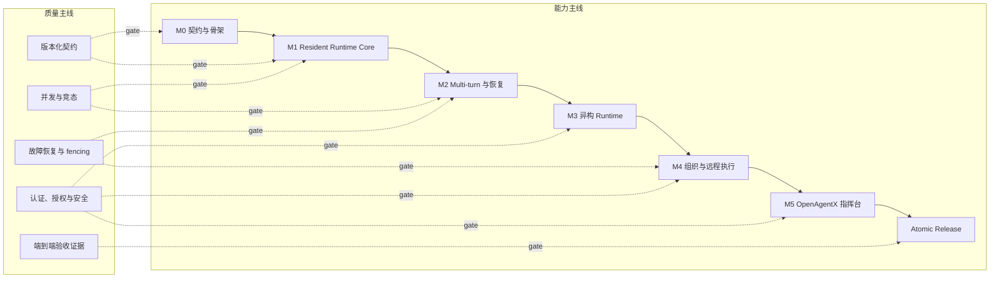

# OpenAgentX ADR-001 落地总体方案

## 1. 文档定位

本文定义 [ADR-001](../decisions/ADR-001-resident-agent-worker-runtime-observability.md) 的实施基线：把冻结的目标架构转换为可分阶段开发、可验证、最终一次切换的工程边界。本文不重新决策领域语义；实施中若发现必须改变 ADR-001，应先创建新 ADR，经确认后再调整计划。

实施同时沿两条主线推进：

1. **能力主线**：`M0 -> M1 -> M2 -> M3 -> M4 -> M5 -> Atomic Release`；
2. **质量主线**：契约、并发安全、故障恢复、安全和验收证据贯穿每个阶段。

任何里程碑只有在两条主线的退出条件同时满足后才能关闭。

## 2. 目标与非目标

### 2.1 目标

- daemon 只管理组织、业务事实、调度、lease、API 和观测，不直接驱动终端；
- Resident Worker 作为独立进程长期在线，Agent Runtime Backend 只在 turn 内运行；
- Task、Message、Approval 和 Cancel 只通过持久 Agent Mailbox 投递；
- 单 Agent 连续处理多个 Task，并在活动 turn 中并发接收合法控制输入；
- 本机 UDS Worker 和远程 mTLS Worker 使用同一协议与 conformance test；
- OpenAgentX 指挥台提供密码登录、组织观察、业务指挥、人工待办、Worker 运维和 PWA 安装能力；
- 正式发布只交付 `openagentx/OpenAgentX` 目标路径。

### 2.2 非目标

- 不提供 `agentbus` alias、环境变量 fallback、tmux 控制 fallback 或长期生产双栈；
- 不让 LLM turn 长期阻塞等待 Mailbox；
- 不在 V1 支持单个逻辑 Agent 多 Active Run；
- 不采用严格 Event Sourcing，不从 Event Journal replay 当前状态；
- 不接受 raw shell argv、任意环境变量或未声明 Backend 参数；
- 不把阶段性内部实现当作可独立上线的兼容版本。

## 3. 实施拓扑



能力里程碑建立可以独立测试的内部基线，质量门槛约束其是否可以成为下一阶段依赖。正式部署始终只有目标架构，不存在新旧业务投递路径并存。

## 4. 目标代码边界

目标 Go module 内按职责收敛为以下 package；实际文件可以在任务实施时细化，但依赖方向不得反转：

```text
cmd/openagentx
    -> api / controlplane / worker 装配

internal/domain
    -> 纯领域模型、状态机、不变量和稳定错误

internal/persistence/sqlite
    -> 版本化 migration、transaction repository、CAS 和 journal

internal/controlplane
    -> Command、Scheduler、Worker、Observe 和 Admin application service

internal/worker
    -> Heartbeat Loop、Mailbox Pump、Active Run Manager、Worker Control Loop

internal/runtime
    -> Adapter、TurnHandle、Registry、ExecutionSpec 与 conformance
internal/runtime/agy
internal/runtime/acp

internal/api
    -> Worker、Observe、Control、Admin 和 Auth 的版本化 DTO/handler

internal/transport
    -> UDS、HTTPS/mTLS、SSE 和 socket/listener binding

internal/auth
    -> Worker principal、Web Session、RBAC、CSRF 和密码策略

web/command-center
    -> Vite + React + TypeScript + PWA

deploy
    -> systemd、Nginx、mTLS/证书和原子切换配置
```

约束如下：

- `domain` 不导入 transport、SQLite、CLI 或具体 Adapter；
- Worker 只依赖稳定的 `WorkerControlClient` 和 Runtime Adapter 契约；
- 本机与远程 binding 不复制业务状态机；
- 浏览器只能访问 Auth、Observe、Control 和 Admin API，不能访问 Worker Control API；
- Adapter 不直接写 Task 或 Mailbox，只返回标准 Event 和 TurnResult；
- `EventBroker` 只做 best-effort wakeup，持久状态表和 Mailbox 才是权威事实。

## 5. 从当前实现到目标边界

| 当前能力 | 实施处理 | 目标归属 |
|---|---|---|
| SQLite WAL、事务与 CAS 测试骨架 | 保留思想并迁移到版本化 schema | `persistence/sqlite` |
| HTTP over UDS、socket 所有权清理 | 抽取为本机 Worker/API binding | `transport` |
| task-scoped EventBroker/long poll | 扩展为 Mailbox、WorkerCommand 和 SSE wakeup | `controlplane` |
| `service.Service` 直接依赖 connector | 拆分稳定 API 契约与 application service | `api` + `controlplane` |
| `TmuxConnector`、pane address 与通知注入 | 目标发布删除 | 无替代控制路径 |
| attach/bootstrap/ready pane 生命周期 | 目标发布删除 | Worker register/heartbeat/lease |
| `runtime agy-hook` Stop Gate | 目标发布删除 | Runtime Adapter + RunAttempt |
| Task 级单 active unique | 改为 Agent 级 Active RunAttempt 唯一约束 | `run_attempts` transaction invariant |
| task-scoped events | 改为全域 append-only journal | `event_journal` |

## 6. 分阶段能力基线

### M0：契约与测试骨架

冻结目标领域对象、状态机、schema 版本、API DTO、错误码、幂等键、CAS 前置条件和 conformance 接口；建立当前路径删除映射与目标测试 harness。M0 不新增可运行的生产路径。

### M1：Resident Runtime Core

实现 Transactional State、Event Journal、Durable Mailbox、Worker 注册/heartbeat/lease/fencing、最小 RunAttempt/SessionBinding、并发 Worker 四组件和 AGY Batch Adapter。本阶段必须证明 Worker 完成 Task A 后继续等待并自动领取 Task B，整个控制链不调用 tmux。

### M2：Multi-turn 与故障恢复

补全 `waiting_input`、`waiting_approval`、queued follow-up、Task 级 Cancel、native/preflight Approval、完成竞态、Worker/Backend crash reconcile、stale writer 拒绝和副作用不确定性。所有竞态以数据库线性化点和双向测试定义结果。

### M3：异构 Agent Runtime

实现 ExecutionSpec 解析、Adapter Registry、capability descriptor、ResolvedExecutionSpec 审计和 Generic ACP Adapter。AGY 与 ACP 必须通过同一核心 conformance，不支持的能力明确失败，不能静默降级。

### M4：组织、权限与远程执行

实现 Organization、Position、Role、ReportingLine、AuthorityPolicy、direct/coordinated dispatch；实现远程 Worker Gateway、mTLS、短期 Worker Session Token 和 Worker Control Channel/Admin 语义。本机和远程 Worker 保持完全相同的领域协议。

### M5：OpenAgentX 指挥台

实现 Web Auth、RBAC、CSRF、Observe/Control/Admin API、SSE read model，以及 mobile-first 的 Vite/React/TypeScript PWA。手机首屏以指挥和人工待办为核心，离线状态下所有写操作 fail closed。

### Atomic Release

完成 module、二进制、socket、数据库、环境变量、service、Manifest 和文档统一命名；删除 tmux/hook/旧 session 生命周期；部署目标 schema 和服务；将旧数据库只读归档；按发布清单一次开放新任务入口。

## 7. 贯穿式质量基线

| 质量面 | 每阶段最低要求 | 发布证据 |
|---|---|---|
| 契约 | schema/API/错误码/事件/状态机版本明确，破坏性变化显式更新计划 | 契约 diff、migration 与 conformance 结果 |
| 并发 | 共享状态用事务、CAS、lease 和 fencing 保护；关键双向竞态有确定结果 | `go test -race`、并发压力与竞态矩阵 |
| 恢复 | daemon、Worker、Backend、网络和 Broker 故障均定义恢复或 `uncertain` | fault-injection、重启和 stale writer 记录 |
| 安全 | 最小权限、结构化输入、direct argv、凭证不落日志、写请求 fail closed | 认证/授权负向测试、依赖与配置审计 |
| 可观测 | 每个可见状态变化进入 Event Journal，错误可定位到 control/worker/adapter/backend | Event sequence、日志与指挥台时间线 |
| 验收 | 每项任务留下自动化结果；涉及 UI 必须真实浏览器验证 | 阶段报告、截图/DOM/交互与发布清单 |

不得把 race、恢复、安全或真实浏览器验证统一推迟到 M5 或 Release。

## 8. 阶段门槛

- **G0**：目标 schema、领域状态、API 和测试接口可作为后续任务唯一契约；
- **G1**：Resident Worker + AGY + UDS 连续 Task 闭环通过，tmux 调用计数为零；
- **G2**：multi-turn、Message/Cancel/Approval 双向竞态和 crash/fencing 场景全部有确定结果；
- **G3**：ExecutionSpec 解析可审计，AGY 与 ACP conformance 通过；
- **G4**：组织授权、远程 mTLS Worker、WorkerCommand 和 lease revoke 通过正负向 E2E；
- **G5**：Web Auth、SSE、PWA、三视口和离线 fail-closed 通过真实浏览器验证；
- **GR**：目标命名/schema/部署一次切换，旧控制路径不可执行，回退方式仅为恢复旧版本和只读旧库，不做运行时双写。

## 9. 实施与验收纪律

1. 每个实施任务开始前确认依赖任务和阶段门槛已完成；
2. 每个任务同时提交实现、最小相关测试、文档更新和验收记录；
3. 数据状态转换必须在同一事务中更新权威表、必要 Mailbox/WorkerCommand 与 Event Journal；
4. 并发行为必须先写不变量和双向竞态测试，再写调度实现；
5. Adapter 必须先通过 fake backend conformance，再连接真实 Backend；
6. 远程安全先验证 principal、token、generation、lease、fencing 的拒绝矩阵，再做跨主机 E2E；
7. 前端每完成一个功能点都执行真实 DOM、渲染和交互验证；
8. 阶段完成后形成验证报告，主计划只在证据齐全时更新状态；
9. Release 前执行全量命名扫描、禁止路径扫描、schema 验证、部署演练和恢复演练。

## 10. 计划入口

详细任务、依赖和验收见 [ADR-001 实施计划](../plans/2026-08-30-openagentx-adr-001-implementation-plan.md)。

## 11. 相关文档

- [ADR-001](../decisions/ADR-001-resident-agent-worker-runtime-observability.md)
- [当前实现架构](../ARCHITECTURE.md)
- [实现讨论](../IMPLEMENTATION_DISCUSSION.md)
