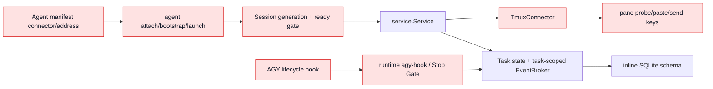

# OpenAgentX 当前实现到 ADR-001 目标架构映射

## 1. 目的

本文记录任务 01 的实现事实：当前 AgentBus/Tmux V0 的代码、配置、测试和文档入口如何迁移到冻结的 [ADR-001](../decisions/ADR-001-resident-agent-worker-runtime-observability.md)。它是后续任务的删除和复用清单，不改变 ADR-001，也不定义兼容路径。

映射使用四种处理结论：

- **保留思想**：保留已经验证的基础机制，但迁移到目标 package 和契约；
- **重构**：现有职责仍需要，但类型、状态或依赖方向必须改变；
- **Release 删除**：目标发布不得存在可执行入口或 fallback；
- **历史归档**：只保留历史证据，不得作为当前运行说明。

## 2. 当前依赖链



因此删除边界必须覆盖 Manifest、CLI、HTTP、service、store、测试和运行文档，不能只删除 `internal/connector/tmux.go`。

## 3. 代码与配置映射

| 当前位置 / 符号 | 当前职责 | 处理 | 目标位置 / 任务 | 最终证明 |
|---|---|---|---|---|
| `go.mod: module agentbus` | module identity | Release 删除 | canonical OpenAgentX module / 18 | module/import 扫描零命中 |
| `cmd/agentbus/main.go` | 唯一二进制入口 | Release 删除 | `cmd/openagentx` / 05、18 | 只构建 `openagentx` |
| `internal/cli/root.go` | AgentBus 命令树和旧帮助 | 重构 | `serve`、`worker run`、业务/API CLI / 02、05、18 | help 无旧命令或 alias |
| `internal/client.DefaultAgentBusDir` | 旧目录、socket、db 推导 | 重构 | OpenAgentX path resolver / 02、18 | 仅 `OPENAGENTX_*` 和目标路径 |
| `internal/client` 导入 `internal/service` DTO | client/application service 耦合 | 重构 | `internal/api` DTO + typed clients / 02、04 | client 不导入 controlplane 实现 |
| `internal/domain.Agent.Connector/Address` | pane 业务寻址 | Release 删除 | Agent/Profile/Position + Worker registration / 02、12、18 | Manifest/API 无 pane 字段 |
| `internal/domain.AgentManifest.Connector/Address` | tmux 启动配置 | Release 删除 | Agent Profile、Execution Profile、Worker config / 02、10、18 | strict manifest 拒绝旧字段 |
| `agents/*/agent.yaml` connector/address | 固定 pane 地址 | Release 删除 | organization/position/execution config / 12、18 | release scan 零命中 |
| `internal/domain.AgentSession` | pane session ready gate | 重构 | WorkerInstance + generation/lease + SessionBinding / 02、04、07 | Worker register/heartbeat 驱动 Connectivity |
| `internal/cli/agent.go` attach/bootstrap/launch | pane lifecycle | Release 删除 | `openagentx worker run` 自注册 / 05、18 | CLI 不暴露旧子命令 |
| `internal/cli/session.go` ready/show | LLM 自报 ready | Release 删除 | Worker health/lease + Observe API / 04、15、18 | 无 session-ready API |
| `internal/connector/tmux.go` | pane probe 与文本注入 | Release 删除 | 无控制面替代；tmux 只可外部看日志 / 18 | 禁止命令扫描零命中 |
| `internal/connector/tmux_test.go` | connector 行为测试 | 历史归档/删除 | Mailbox/Worker conformance / 04、05、18 | 不再编译 connector package |
| `internal/service.Service.connector` | service 直接依赖 tmux | 重构 | Command/Worker/Scheduler services / 03、04、18 | controlplane 无 connector import |
| `service.AttachAgent/BootstrapAgent/ReadySession` | pane bootstrap 和 ready gate | Release 删除 | Worker register/heartbeat/lease / 04、18 | routes 和 DTO 均不存在 |
| `service.SubmitTask/SendMessage` 调用 NotifyTask | 事务后终端通知 | 重构 | 同事务写 MailboxItem + Event Journal / 03、04 | command path 不启动 Backend/终端 |
| `service.EventBroker.Subscribe(taskID)` | task 级内存 wakeup | 保留思想 | Agent Mailbox、WorkerCommand、SSE topic broker / 04、14、15 | Broker 丢失不丢持久工作 |
| `server /api/v1/agents/*/attach|bootstrap` | pane lifecycle HTTP | Release 删除 | Worker API / 04、18 | route 404 且 release scan 零命中 |
| `server /api/v1/sessions/*/ready` | session ready HTTP | Release 删除 | register/heartbeat/health / 04、18 | 旧 route 不存在 |
| `server` Task/runtime routes | 混合业务和 hook API | 重构 | Worker/Observe/Control/Admin/Auth API / 02、04、15 | handler 按 API 边界分包 |
| `internal/cli/runtime.go` agy-hook | AGY ingress/Stop Gate | Release 删除 | AGY Batch Adapter + RunAttempt / 06、18 | CLI 与 hook 配置无 agy-hook |
| `integrations/agy/hooks.json.example` | Pre/Post/Stop 同步 hook | Release 删除 | Worker 启动 AGY Batch / 06、18 | 文件删除且 scan 零命中 |
| `internal/store.initSchema` 内联 SQL | 隐式 schema 初始化 | Release 删除 | versioned migrations / 02、03、18 | 旧 DB 明确拒绝 |
| `internal/store/schema.sql` 与内联重复 | 非权威重复 schema | 重构 | 单一 migration source / 02、03 | schema 无双份定义 |
| `uq_tasks_target_active` | Agent 只能有一个 queued/running Task | Release 删除 | Active RunAttempt unique / 03、18 | 多 Task 可积压、单 Active Run |
| `task_events(task_id)` | task-scoped event | 重构 | global append-only `event_journal` / 03 | sequence 跨领域单调 |
| `task_messages` 无持久 delivery item | 消息依赖通知注入 | 重构 | Message + MailboxItem 同事务 / 03、04 | delivery/claim/accept 可审计 |
| `Task queued/running/succeeded/failed/canceled` | 单 turn Task 状态 | 重构 | ADR Task + RunAttempt 状态机 / 02、07、08 | multi-turn 与 waiting 状态测试 |
| `Task ack/status/complete/fail` 由 CLI Agent 调用 | LLM 自报执行状态 | 重构 | Worker reconcile + Command Service / 05-09 | Backend exit 不直接等价成功 |

## 4. 可复用基础设施

| 当前机制 | 保留的不变量 | 目标任务 | 不可原样保留的部分 |
|---|---|---|---|
| SQLite WAL、foreign keys、busy timeout | 单机 durable state 和事务基础 | 03 | 内联 schema、单连接假设需重新验证并发 |
| `BeginTx` 状态转换 | 状态与关联事实原子提交 | 03、08 | 旧 Task 状态和 ready gate |
| 幂等 Task submit | 网络重试不重复创建业务事实 | 03、15 | key scope 与新 API 资源需重定义 |
| UDS HTTP server/client | 本机 Worker transport binding | 04 | 路由 DTO 和 application service 耦合 |
| socket ownership cleanup | 不删除他人替换的 socket | 04 | 日志和默认路径命名 |
| 非阻塞 EventBroker | best-effort wakeup | 04、14、15 | task-only topic 和权威队列误用 |
| Task watch/wait long poll | 超时后重查持久状态 | 04、15 | 不能替代 Agent Mailbox claim/ack |
| JSON API error envelope | 稳定机器错误 | 02 | 旧错误码和 service type 泄漏 |
| `go test -race` 与 socket race tests | 并发/所有权验证方法 | 全阶段 | 旧 pane/ready 断言 |
| direct argv `exec.CommandContext` | 禁止 shell 拼接 | 06、11 | tmux 命令本身必须删除 |

## 5. 测试迁移映射

| 现有测试 | 处理 | 目标测试 |
|---|---|---|
| `domain/domain_test.go` Agent/Task validation | 重写 | 目标 enum、ID、version、Task/Run 状态机契约 / 02 |
| Manifest validation | 重写 | strict Agent/Worker/Execution Profile，拒绝 connector/address / 02、10 |
| Store idempotency/authorization | 保留思想 | transaction repository、Command authorization / 03、12 |
| Single active Task/index | 删除并反向测试 | queued Task 可积压；Active RunAttempt 唯一 / 03 |
| Ready gate atomic fail closed | 重写 | Worker generation/lease/fencing 与 BeginAttempt gate / 04、09 |
| schema upgrade old DB | 删除 | 空库 migration + 旧 schema incompatible / 02、03、18 |
| connector notification tests | 删除 | Mailbox claim/order/lease/accept conformance / 04 |
| service delivery disposition/CAS | 重写 | Mailbox/Event transaction same-fate、Broker loss / 03、04 |
| service watch blocking | 保留思想 | Mailbox/WorkerCommand long poll 和 SSE replay / 04、14、15 |
| server live/stale/replaced socket | 保留 | UDS binding ownership tests / 04 |
| CLI attach/bootstrap/launch | 删除 | `worker run` register/health/stop tests / 05、14 |
| AGY hook Stop Gate tests | 删除 | AGY Adapter stream/cancel/reconcile tests / 06、08 |
| task wait tests | 保留思想 | Observe wait；不得承担 Worker inbox / 04、15 |
| full CLI workflow | 重写 | CLI/API -> Mailbox -> Worker -> Adapter E2E / 06 |

## 6. 文档与运行入口处理

| 当前文档/配置 | 处理 | 完成任务 |
|---|---|---|
| `README.md` | Release 改为唯一 OpenAgentX 使用入口 | 18 |
| `docs/ARCHITECTURE.md` | 当前实现基线在 Release 更新为目标已实现架构 | 18 |
| `docs/IMPLEMENTATION_DISCUSSION.md` | 标记为历史推演，只保留追溯价值 | 18 |
| `docs/design/AGENT_ROLE_BOOTSTRAP.md` | 历史归档，不作为当前生命周期说明 | 18 |
| `docs/design/AGY_HOOK_INTEGRATION.md` | 历史归档 | 18 |
| `docs/runtime/*` | 替换为 Worker/CLI 当前运行说明或归档 | 18、19 |
| 旧 plans 与 validation reports | 保留历史状态，不提供当前命令入口 | 18 |
| `integrations/agy/hooks.json.example` | 删除 | 18 |

历史文档可以描述 AgentBus 和 tmux，但必须具有历史状态或位于历史路径，且当前 README、架构和运行手册不得链接其命令作为现行操作。

## 7. ADR-001 原子切换逐项映射

| ADR-001 切换项 | 实施任务 | Release 验证 |
|---|---|---|
| 1. 产品、CLI、module、socket、db、env、service 全量命名 | 02、05、18 | naming scan + build/help |
| 2. 删除 TmuxConnector 和 pane 控制 | 18 | legacy release scan |
| 3. 业务命令只写状态/Mailbox/Journal | 03、04、12、15 | transaction + no-process tests |
| 4. Manifest 使用组织、Worker、Execution 配置 | 02、10、12、18 | strict manifest tests |
| 5. Organization/ReportingLine/AuthorityPolicy | 12 | authorization E2E |
| 6. Adapter Registry、ExecutionSpec、AGY、ACP | 06、10、11 | adapter conformance |
| 7. 并发 Worker、lease、控制通道、本机与远程 binding | 04、05、08、13、14 | race + UDS/mTLS E2E |
| 8. 删除 pane attach/bootstrap/launch | 18 | CLI/route negative tests |
| 9. 删除 runtime agy-hook/Stop Gate | 18 | hook/config scan |
| 10. 版本化目标 schema，旧库只读 | 02、03、18、20 | schema reject/archive evidence |
| 11. Worker systemd `Restart=on-failure` | 14、19 | controlled stop test |
| 12. Web Auth/RBAC/API/SSE/Nginx | 15、19 | security + proxy E2E |
| 13. PWA 与三视口 mobile-first | 16、17 | real browser evidence |
| 14. 无 tmux 调用、transport conformance、业务不寻址 Worker | 04、06、12、13、18、20 | full release suite |

## 8. 可机器执行的扫描

仓库脚本 [check-legacy-control-paths.sh](../../scripts/check-legacy-control-paths.sh) 提供两种模式：

```bash
# 任务 01：列出现有命中并建立基线，始终成功
./scripts/check-legacy-control-paths.sh --inventory

# 任务 18/20：任一可执行旧路径命中即失败
./scripts/check-legacy-control-paths.sh --release
```

扫描范围包括 Go/module、Manifest、AGY integration、当前 README、当前架构和 runtime instructions；冻结 ADR、实施计划和历史验证报告不参与 release 零命中判断。tmux 作为系统外日志查看工具不属于扫描失败项，只有 OpenAgentX 发起 pane probe、paste、send-keys、capture 或保存 pane address 才属于失败。

## 9. Task 02 入口条件

任务 02 应直接建立独立的 `domain`、`api`、Runtime contract 和 testkit，不延续 `client -> service DTO` 依赖。目标契约必须先覆盖 Worker identity/generation/lease/fencing、Mailbox 双 lane、RunAttempt active unique、SessionBinding、Cancel desired state、Approval scope 和 Event Journal，再开始持久化实现。

## 10. Task 01 扫描基线

2026-08-30 的 `--inventory` 结果如下。这些数字是后续任务的收敛基线，不是要求中间任务逐次单调下降；任务 18 和任务 20 的硬要求是所有类别及三个禁止路径归零。

| 类别 | 当前命中 |
|---|---:|
| 禁止路径 | 3 |
| `agentbus_runtime_naming` | 196 |
| `agentbus_current_docs` | 75 |
| `tmux_control` | 64 |
| `pane_manifest` | 6 |
| `pane_lifecycle` | 166 |
| `agy_stop_hook` | 51 |
| `legacy_schema` | 26 |
| `legacy_runtime_paths` | 55 |

`--release` 在该基线上返回退出码 `1`，共报告 11 个类别/路径失败，证明扫描器能够阻止当前 V0 被误判为目标发布版本。
