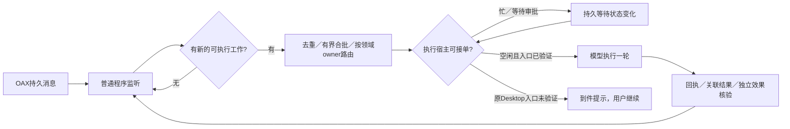

# 协作如何避免空闲 token 开销

2026-10-03 决策建议。当前两项 Desktop heartbeat 已暂停；下述事件调度补充尚未实施，两个原会话未迁移。

## 要点

- **空闲由程序等待，模型只处理工作。** 按每分钟一次、每次20万输入计算，单Agent每小时1,200万输入；假设全部命中一折缓存，输入费用相当于120万普通输入token，另计未命中和输出。这里只说明用户给定假设，不报价。本机两会话每两分钟各触发一次，8轮实际输入905,850、缓存902,656、输出845，且0工具调用，见[原始计数](../reports/validation/2026-10-03-desktop-collaboration/evidence/heartbeat01/token-usage.json)。
- **先复用现有监听。** `openagentx external inbox --agent <id> --watch`是普通Go进程，每2秒查询本机API，不调用模型。它只观察，不负责启动原Desktop会话。没有消息时可长期运行，不产生模型输入费用。
- **按消息驱动一次执行。** 建议以持久message_id去重、短窗口有界合批；每thread只允许一个执行者。忙时持久排队，在当前轮终态后处理；等待用户或审批时不强行续办。重连可重报结果，未知业务效果需核对，不能重复执行。现有ACK、receipt、recover和Journal可复用；合批、唤醒调度仍待实现。
- **长历史是第二个成本点。** 事件触发消除空醒，并不消除真正工作轮的历史输入。后续可让短协作会话只接收职责、当前问题、相关证据索引和必要摘要；与开发会话共享经核实的产物，不默认复制20万历史。这是另一种上下文组织选择，不能冒称保留完整原thread记忆。

## 用户可选的工作方式

| 方式 | 用户体验 | 当前证据与限制 |
|---|---|---|
| 原Desktop会话继续工作 | 原窗口、原上下文；收件后由用户让它继续 | 真实咨询/答复/ACK已证。程序到件提醒可作最小下一步；可靠的原Desktop事件排队入口尚未验证，不能承诺无人值守 |
| OAX托管执行＋原生终端 | 后台接单，终端可看过程并输入；结束终端后后台继续 | 已有真实managed链路及`open --native`证据。原宿主须结束本轮并交接执行权；external与managed互斥，迁移这两个真实Agent仍需具体交接验收 |
| 独立短上下文协作会话 | 协作执行成本更小，开发会话保留 | 尚未实施。需要明确同一领域的唯一owner、产物同步及写入串行；初期只读咨询，避免两个模型同时修改同仓库 |

**建议：无人值守是首要目标时，优先选择OAX托管执行＋原生终端；必须保留原Desktop宿主时，先接受到件提醒与一次人工继续。** 本轮不替用户切换宿主，不再用常驻LLM轮询弥补入口缺失。Skill帮助Agent正确接入、判断职责和恢复；它不能唤醒已经结束的模型轮。MCP收信工具同样不等于宿主自动续办。

## 最小执行流程（建议）

## 参考项目中可提取的机制

固定源码研究支持以下设计思路，不证明可以接管第三方正在运行的Desktop。

| 参考 | 只借这一小段机制 | 既有报告 |
|---|---|---|
| Holon | 等通知或deadline；无工作tick不运行模型 | [Holon](../reports/assessment/2026-09-26-holon/13-holon-reference.md) |
| Paseo | 先订阅事件再启动turn；按turn ID匹配；旧执行停止后再放行下一轮 | [Paseo](../reports/assessment/2026-09-23/07-paseo-reference.md) |
| Multica | 结果持久outbox；恢复时重报结果，避免重跑工作 | [Multica](../reports/assessment/2026-09-23/08-multica-reference.md) |
| Orca | 完成后回到idle；重启核对未知投递，不自动重新dispatch | [Orca](../reports/assessment/2026-09-25/11-orca-reference.md) |
| Buzz | 消息准入、分组与批量处理；仍保留OAX持久账本 | [Buzz](../reports/assessment/2026-09-26-buzz/14-buzz-reference.md) |

## 下一步及验收

1. 先确定原Desktop或OAX托管的执行权选择，再实现对应的最小投递环节。已有职责、收件、回执和恢复不需要重做。
2. 真实验收必须包括：空闲30分钟新增模型请求为0；单条消息触发一次有效处理；突发消息去重及有界合批；忙时无并行写者；审批等待不被越过；重启后待处理不丢、未知效果不盲目重做。保存实际进程日志、消息/turn ID、独立请求计数及产物，不能只用token汇总或mock判定通过。
3. 本轮已交付范围与缺口见[交付](../reports/validation/2026-10-03-desktop-collaboration/DELIVERY.md)及[覆盖矩阵](../reports/validation/2026-10-03-desktop-collaboration/COVERAGE.md)。
