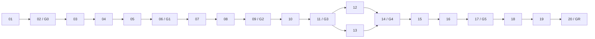

# OpenAgentX ADR-001 实施计划

## 1. 目标

按 [ADR-001](../decisions/ADR-001-resident-agent-worker-runtime-observability.md) 和 [落地总体方案](../design/OPENAGENTX_ADR_001_IMPLEMENTATION_BASELINE.md) 实现 OpenAgentX Resident Worker、异构 Agent Runtime、组织控制面和移动指挥台，并在全部内部里程碑验收后一次性切换正式运行路径。

本计划只定义目标架构实施，不建立 `agentbus` alias、tmux fallback、旧数据库在线迁移或长期双栈。

## 2. 两条主线

```text
能力主线：M0 -> M1 -> M2 -> M3 -> M4 -> M5 -> Atomic Release

质量主线：契约 -> 并发安全 -> 故障恢复 -> 安全 -> 端到端验收
           └──────────── 贯穿每个能力阶段 ────────────┘
```

后续任务只有在前一阶段的能力与质量门槛同时通过后才能开始。内部阶段产物用于集成和验证，不作为带旧路径兼容的生产版本发布。

## 3. 任务与依赖

| ID | 阶段 | 任务 | 依赖 | 状态 |
|---|---|---|---|---|
| 01 | M0 | [现状边界与删除映射](2026-08-30-openagentx-adr-001-implementation/01-current-boundary-and-removal-map.md) | ADR-001 | completed |
| 02 | M0 | [目标契约、schema 与测试骨架](2026-08-30-openagentx-adr-001-implementation/02-target-contract-schema-test-harness.md) | 01 | completed |
| 03 | M1 | [Transactional State 与 Event Journal](2026-08-30-openagentx-adr-001-implementation/03-transactional-state-event-journal.md) | 02 | completed |
| 04 | M1 | [Mailbox 与 Worker Lease API](2026-08-30-openagentx-adr-001-implementation/04-mailbox-worker-lease-api.md) | 03 | completed |
| 05 | M1 | [并发 Resident Worker](2026-08-30-openagentx-adr-001-implementation/05-concurrent-resident-worker.md) | 04 | completed |
| 06 | M1 | [AGY Batch + UDS 端到端闭环](2026-08-30-openagentx-adr-001-implementation/06-agy-uds-end-to-end.md) | 05 | pending |
| 07 | M2 | [RunAttempt、SessionBinding 与 multi-turn](2026-08-30-openagentx-adr-001-implementation/07-run-attempt-session-binding-multi-turn.md) | 06 | pending |
| 08 | M2 | [Message、Cancel 与 Approval 竞态](2026-08-30-openagentx-adr-001-implementation/08-message-cancel-approval-races.md) | 07 | pending |
| 09 | M2 | [恢复、fencing 与故障注入](2026-08-30-openagentx-adr-001-implementation/09-recovery-fencing-fault-injection.md) | 08 | pending |
| 10 | M3 | [ExecutionSpec 与 Adapter Registry](2026-08-30-openagentx-adr-001-implementation/10-execution-spec-adapter-registry.md) | 09 | pending |
| 11 | M3 | [Generic ACP Adapter 与 conformance](2026-08-30-openagentx-adr-001-implementation/11-generic-acp-adapter-conformance.md) | 10 | pending |
| 12 | M4 | [Organization 与 AuthorityPolicy](2026-08-30-openagentx-adr-001-implementation/12-organization-authority-policy.md) | 11 | pending |
| 13 | M4 | [远程 Worker mTLS binding](2026-08-30-openagentx-adr-001-implementation/13-remote-worker-mtls-binding.md) | 11 | pending |
| 14 | M4 | [Worker Admin 与运维控制](2026-08-30-openagentx-adr-001-implementation/14-worker-admin-operations.md) | 12, 13 | pending |
| 15 | M5 | [Web Auth、HTTP API 与 SSE](2026-08-30-openagentx-adr-001-implementation/15-web-auth-api-sse.md) | 14 | pending |
| 16 | M5 | [React mobile-first PWA](2026-08-30-openagentx-adr-001-implementation/16-react-mobile-first-pwa.md) | 15 | pending |
| 17 | M5 | [浏览器、安全与 PWA E2E](2026-08-30-openagentx-adr-001-implementation/17-browser-security-pwa-e2e.md) | 16 | pending |
| 18 | Release | [统一命名、目标 schema 与旧控制路径删除](2026-08-30-openagentx-adr-001-implementation/18-name-schema-legacy-removal.md) | 17 | pending |
| 19 | Release | [部署与原子切换演练](2026-08-30-openagentx-adr-001-implementation/19-deployment-cutover-rehearsal.md) | 18 | pending |
| 20 | Release | [原子发布验收与旧库归档](2026-08-30-openagentx-adr-001-implementation/20-atomic-release-acceptance.md) | 19 | pending |

M4 中任务 12 与 13 可在 G3 后并行；其他任务按依赖顺序推进。并行不允许复制领域规则或提前绕过尚未冻结的接口。

## 4. 阶段执行顺序



## 5. 里程碑退出门槛

### G0：实施契约可执行

- 目标领域对象、状态、错误码、API DTO、schema version 和 migration 规则已冻结；
- Worker/Adapter/transport conformance harness 可运行；
- 旧控制路径的删除清单有代码、配置、测试和文档映射。

### G1：Resident Worker 闭环

- daemon 与 Worker 是独立进程，Worker 完成 turn 后继续 long poll；
- 同一逻辑 Agent 连续完成 Task A、Task B，Task B 无需 tmux 或人工终端输入唤醒；
- daemon 重启不丢 pending MailboxItem，Broker wakeup 丢失不丢工作；
- `go test ./...`、`go test -race ./...` 和 AGY + UDS E2E 通过。

### G2：Multi-turn 与恢复正确

- `waiting_input`、native/preflight `waiting_approval` 和 queued follow-up 按 ADR 运行；
- Message、Cancel、Approval 与 finish 的双向竞态结果稳定；
- stale generation/lease/fencing 写入被拒绝；有副作用但无法核实时进入 `uncertain`；
- daemon、Worker、Backend crash 与网络断开故障注入通过。

### G3：异构 Runtime 契约统一

- ResolvedExecutionSpec 完整持久化，非法 Backend/model/reasoning/权限配置明确失败；
- AGY 与 Generic ACP Adapter 通过同一 conformance suite；
- `StartTurn`、TurnHandle 并发、事件归一化和 capability descriptor 行为一致。

### G4：组织与分布式执行闭环

- coordinated/direct dispatch 通过 AuthorityPolicy 校验并审计；
- 本机 UDS 与远程 mTLS binding 通过同一 Worker API conformance；
- WorkerCommand、drain、stop、health-check 和 lease revoke 的断线/重连行为可验证；
- 伪造 principal/token/generation/lease/fencing 的请求全部 fail closed。

### G5：指挥台可作为移动指挥入口

- 密码登录、RBAC、CSRF、幂等写入、SSE replay 和 Session 撤销通过；
- `指挥 / 待办 / 任务 / 组织` 在 390x844、412x915、1440x900 真实浏览器通过；
- PWA 可安装，Service Worker 不缓存敏感 API，离线时写操作禁用且不排队；
- 浏览器不能访问 Worker Control API，Observe API 无写能力。

### GR：正式原子切换

- 正式构建、CLI、socket、数据库、环境变量、service、Manifest 和当前文档只使用 `openagentx/OpenAgentX`；
- tmux connector、pane 生命周期和 AGY Stop Gate 不可执行；
- 目标 daemon 只接受目标 schema，旧数据库只读归档；
- 部署、恢复、证书、移动访问和连续任务实机验收完成后再开放业务入口。

## 6. 贯穿式质量规则

1. 每个任务必须同时交付实现、相关最小测试、文档同步和可复查验证结果；
2. 每个状态转换测试同一事务内权威状态、Mailbox/WorkerCommand 和 Event Journal 的同成同败；
3. 任何共享执行所有权都校验 generation、lease、fencing 和 version/CAS；
4. 任何并发语义至少覆盖正常顺序和相反顺序，不能只测单一路径；
5. 任何远程或 Web 写接口都包含认证、授权、幂等、前置版本和审计的负向测试；
6. Adapter 先使用 fake backend 通过 conformance，再连接真实 CLI/ACP；
7. 前端功能点完成后必须使用真实浏览器验证 DOM、渲染和交互；
8. 阶段门槛未通过时停止扩展下一阶段，不以待办项代替基础正确性。

## 7. 计划状态维护

- 独立任务开始时将其 front matter `status` 更新为 `active`；
- 完成后更新为 `completed`，记录测试命令、结果和验证报告链接；
- 主计划同步更新任务状态和阶段门槛；
- ADR-001 保持冻结；实施发现的新架构决策必须单独建 ADR；
- 具体任务文档只由本计划索引，不加入根级全局索引。

## 8. 发布原则

内部开发允许按 M0-M5 分阶段集成，但正式环境不部署混合控制路径。Release 阶段不做在线数据双写；停止旧入口、备份并只读归档旧库、部署目标 schema 和服务、验证 Worker ready 后，才开放新的 Task/Message 入口。任何关键验收失败都保持入口关闭并恢复到发布前版本，不在运行中启用 tmux fallback。
