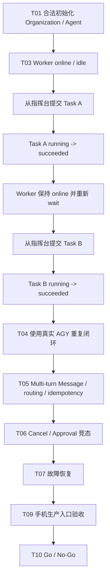

# OpenAgentX ADR-001 测试计划

## 1. 目标

本计划验证冻结的 [ADR-001](../decisions/ADR-001-resident-agent-worker-runtime-observability.md) 是否真实实现以下结果：

```text
LLM sleeps
Worker waits
Mailbox wakes
```

最终验收不是“进程能够启动”，而是同一个逻辑 Domain Agent 在不依赖 tmux、pane 地址、键盘注入或永久 LLM turn 的前提下，连续处理任务、接收运行中控制、经历故障后恢复，并可由手机指挥台安全操作。

ADR-001 保持冻结。本计划只定义测试顺序、证据、失败处理和 go/no-go 门槛。

## 2. 测试原则

1. 测试按 T01-T10 顺序执行，前一关未通过不得进入依赖它的下一关；共享代码发生影响时，历史关卡必须回开并重新验证。
2. 不直接写 SQLite 建立 Organization、Agent、Task、Approval 或 Worker 状态；测试必须走公开 CLI/API/服务入口。
3. 控制面先使用确定性的 Fake Adapter，再测试 AGY 和 ACP，避免把 Runtime 波动误判为控制面问题。
4. 每个测试记录输入、预期、实际结果、Event sequence、相关日志、截图和提交版本；测试运行中的源码 commit、二进制 SHA-256、配置版本和 schema 版本必须一致。
5. 失败先形成缺陷记录；修复后完整重跑当前关卡，不以临时绕过标记通过。
6. 故障注入使用隔离数据库和隔离端口；生产 HTTPS 入口只执行非破坏性最终验收。
7. 前端每个功能必须使用真实浏览器验证 DOM、渲染、交互和移动视口。
8. 每个关卡固定采用“一个实现批次 → 一次完整测试矩阵 → 一次独立审计 → 独立提交”；不得将重复审计或重复长测作为默认流程。

## 3. 环境分层

| 环境 | 用途 | 数据 | 允许的操作 |
|---|---|---|---|
| 单元/竞态测试 | 状态机、CAS、事务、竞态 | 临时 SQLite | 故障注入、并发、超时 |
| 本机隔离 E2E | daemon、UDS、Fake/AGY Worker | 独立测试库 | 启停、kill、断连、重启 |
| 远程 binding E2E | mTLS Worker API | 独立证书和测试身份 | 伪造凭据、证书拒绝 |
| 生产入口验收 | Nginx、HTTPS、PWA、手机指挥 | 正式目标库 | 非破坏性业务验收 |

生产入口为 `https://agentx.oneaxe.cn/`；本机 daemon 通过 Tailscale 地址 `rtx4090:18100` 提供 Web 控制面，并通过 Unix Socket 服务本机 Worker。

## 4. 任务与依赖

| ID | 测试任务 | 依赖 | 状态 |
|---|---|---|---|
| T01 | [测试准备、身份初始化与环境门槛](2026-08-30-openagentx-adr-001-testing/01-test-fixture-and-preflight.md) | ADR-001 | passed |
| T02 | [Web 登录、安全、SSE、PWA 与离线](2026-08-30-openagentx-adr-001-testing/02-web-auth-security-pwa.md) | T01 | passed |
| T03 | [Fake Worker 连续任务闭环](2026-08-30-openagentx-adr-001-testing/03-fake-worker-consecutive-tasks.md) | T01 | passed |
| T04 | [AGY Worker 真实连续任务闭环](2026-08-30-openagentx-adr-001-testing/04-agy-worker-consecutive-tasks.md) | T03 | passed |
| T05 | [Multi-turn、Message 与 queued steer](2026-08-30-openagentx-adr-001-testing/05-multiturn-message-steer.md) | T03,T04-runtime-gate | passed |
| T06 | [Cancel、Approval 与 finish 竞态](2026-08-30-openagentx-adr-001-testing/06-cancel-approval-races.md) | T05 | passed |
| T07 | [恢复、lease、generation 与 fencing](2026-08-30-openagentx-adr-001-testing/07-recovery-lease-fencing.md) | T06 | passed |
| T08 | [mTLS、组织权限与 Worker Admin](2026-08-30-openagentx-adr-001-testing/08-mtls-authority-worker-admin.md) | T03 | passed（远程 HTTPS listener stop/shutdown 修复并通过重复/race 矩阵） |
| T09 | [手机与 PC 生产指挥台端到端](2026-08-30-openagentx-adr-001-testing/09-production-command-center-e2e.md) | T02,T04,T06,T08 | passed（真实 AGY A/B/C 与 sleep30 取消、双 Session、离线 fail-closed、beforeinstallprompt、graceful Worker release/restart 均通过；产品 owner 已确认真实手机 PWA 安装） |
| T10 | [全量回归、证据归档与 Go/No-Go](2026-08-30-openagentx-adr-001-testing/10-final-regression-go-no-go.md) | T07,T09 | passed |

## 5. 核心正向流程



连续任务的必要断言：

- Task A 和 Task B 指向相同逻辑 `agent_id`；
- Task A 完成后 Worker PID/WorkerInstance 仍在线并再次 long poll；
- Task B 的 wakeup 来源是持久 Mailbox + Broker/long poll；
- 全链路没有 TmuxConnector、pane 地址或人工终端注入；
- 两个 Task 分别拥有独立 RunAttempt，状态和 Event Journal 可追溯。

## 6. 统一证据格式

每个测试任务完成后，在 `docs/reports/validation/` 建立对应报告，至少包含：

- Git commit、二进制 hash、schema version；
- 测试环境、配置文件和脱敏后的身份；
- 命令/API 输入与 HTTP 状态；
- Task、MailboxItem、RunAttempt、Worker generation/fencing 和 Event sequence；
- systemd/Worker/daemon 关键日志；
- PC 与移动端截图、DOM 和交互结果；
- PASS/FAIL/BLOCKED 结论及剩余风险。

任何凭据、密码、Session Token、私钥和完整 Cookie 不进入报告或 Git。

证据按强度分层，不能互相替代：

| 等级 | 证据 | 可证明范围 |
|---|---|---|
| L1 | 单元、仓储、`go test -race`、`go vet` | 局部状态机、事务和并发不变量 |
| L2 | 隔离 daemon + UDS/HTTP E2E | 真实服务边界、凭据、Mailbox 和恢复 |
| L3 | 真实 `agy-graft`/其他 Runtime E2E | CLI argv、NDJSON、模型/推理参数、退出码和业务副作用 |
| L4 | 生产 HTTPS + 真实浏览器 | Nginx、认证、SSE、PWA、PC/手机交互 |

报告必须标注每条结论所需的最低证据等级。

## 7. Runtime Contract Gate（T04 前置）

在真实 AGY 测试前必须固定并记录 Runtime 契约：`agy-graft` 版本、完整 argv、stdin/NDJSON、stdout/stderr、退出码、超时、工作目录、模型、reasoning effort、权限配置及代理环境。只有正式 wrapper 和正式代理环境下的实测结果才能作为 T04 证据。

## 8. 当前剩余测试前置缺口

T01 已提供正式初始化和 Agent apply 入口。后续关卡仍需验证：

1. `orchestrator` 配置声明 ACP，但当前 Worker 组装入口仅组装 `agy-batch` 和 `fake`。
2. Approval Decision 后端路径存在，但手机页面的审批操作必须在 T02/T06 中确认真正接通。

这些缺口均在对应关卡修复和重测，不允许手工写库绕过。

## 9. 失败处理

- **FAIL**：实现行为与 ADR 断言不一致，立即停止依赖关卡并建立缺陷修复。
- **BLOCKED**：缺少受支持入口、外部 Runtime 或安全凭据；保留证据，不伪造 PASS。
- **FLAKY**：同一测试至少重复 20 次并定位非确定性来源，未消除前按 FAIL 处理。
- **安全失败**：认证、授权、CSRF、fencing、mTLS 或离线写入任一 fail-open，直接判定 no-go。
- **数据不确定**：存在潜在副作用而无法确认结果时必须进入 `uncertain`，不得自动重试为成功。
- **历史关卡回开**：后续共享代码或配置影响已通过关卡时，标记受影响关卡为 `retest_required`，先完成回归并更新报告，再恢复依赖关系。

## 10. 最终 Go/No-Go

只有 T01-T10 全部 PASS，且冻结 ADR 未修改、工作树可解释、生产服务 active、远程 HTTPS 正常、测试证据完整，才可判定 Go。任一核心流程、安全边界、连续任务、恢复或手机指挥入口失败，均判定 No-Go。
