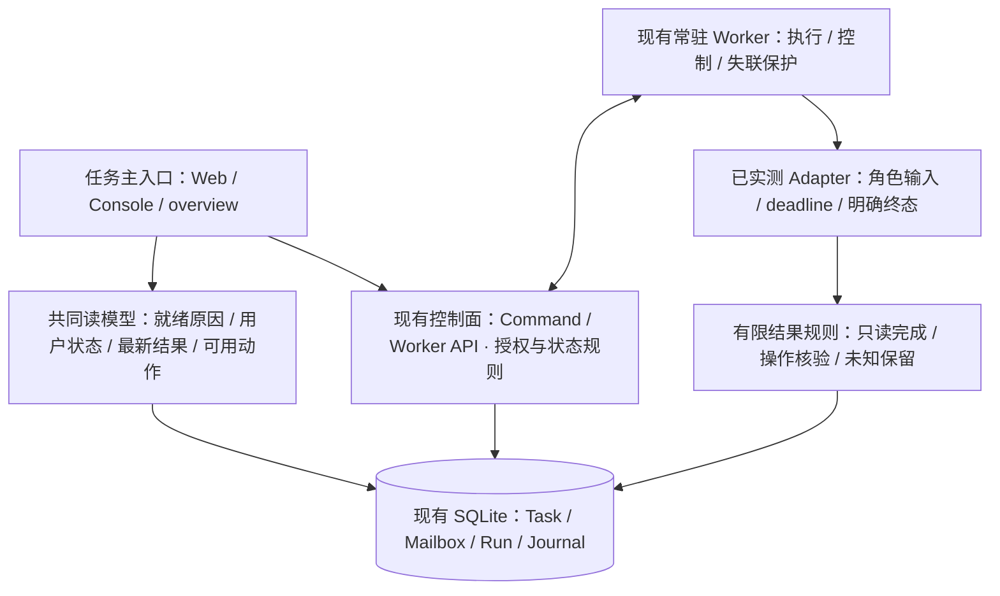

# 00 OpenAgentX 全盘设计与可用性评估

## 结论

- **架构骨架清楚，产品闭环不清楚。** Web/Console → Control API → SQLite/Mailbox → 常驻 Worker → Runtime 的边界合理且真实贯通；但“Agent 是否可执行、任务有没有完成、如何追问/取消/恢复”在模块之间没有形成一致契约。
- **用户对“过度设计、核心单薄、衔接不顺”的判断成立，但不应据此全盘重写。** 已落地的事务、幂等、lease/fencing、Journal 确有价值；问题是尚未消费的组织/适配抽象、暴露给用户的内部阶段，以及未完成的基本退出与结果路径。
- **总体尚未达成一个顺畅、可可靠日用的协作产品。** 当前可以执行真实任务、显示过程与回复、连续领下一任务；取消、就绪引导、终态收口、角色输入、最新结果和瞬断恢复都有确认缺口。完整组织授权/自主委派也不能算已交付。
- **真实 E2E 并非完全没有，而是不充分、没有稳定覆盖最常见用户失败路径。** 本批 Go 检查覆盖40个package，其中36个现有测试通过、4个没有测试文件；Web 17个单元断言通过，仍复现多处主流程缺陷；历史的阶段通过不能替代当前产品验收。
- **本次新贯通真实 Chrome → daemon → 正式 Worker → AGY → 文件效果 → 同 Worker 下一项。** 两项 Run 均 succeeded、文件经独立读取核对；两项 Task 仍 uncertain。这证明执行链成立，同时准确暴露当前业务结果设计没有收口。
- **建议先修一个完整用户旅程，再做局部重构。** 把“首次进入能开始、随时知道等什么、能取消、能看最新结果、能继续下一步”作为一批结果；暂缓多 Runtime、组织治理和更多通用框架。

## 1. 评估边界与阅读入口

本批开始于 2026-09-23 00:26（Asia/Shanghai），总预算100分钟；逐模块首次35分钟，联合真实浏览器链额外有界20分钟，两个开源研究各25分钟并行进行，均受总截止限制。只产出文档、图的事实修订及隔离证据，没有实施产品修复、改变冻结ADR、重启正式服务或改正式任务。发现的严重度是后续排程依据，不自动扩张本批范围。

| 报告 | 回答的问题 |
|---|---|
| [01 控制面与状态](01-control-plane-and-state.md) | 事务/安全做得怎样，为什么取消失败，组织授权是否真的接入 |
| [02 Worker与Runtime](02-worker-and-runtime.md) | 真Agent能否连续工作，角色/结果/timeout/适配能力有没有兑现 |
| [03 Web与PWA](03-web-and-pwa.md) | 真实浏览器能做什么，首用/移动/离线/重连/结果有哪些缺陷 |
| [04 Console与Fleet](04-console-fleet-and-onboarding.md) | OAX为何空、上手为何绕、状态可见性和退出返回是否可用 |
| [05 网络工作流](05-network-workflow.md) | 配置为何复杂、测试证明什么、代际恢复和秘密边界 |
| [06 部署与可观测性](06-deployment-and-observability.md) | 实际跑哪个版本、文档能否执行、维护与测试怎样收敛 |
| [07 Paseo研究](07-paseo-reference.md) | 会话与turn产品如何组织、哪些交互和测试方法可借鉴 |
| [08 Multica研究](08-multica-reference.md) | 人机任务协作如何组织、哪些闭环可借鉴及复杂度边界 |

当前架构另见 [Markdown](../../../design/CURRENT_ARCHITECTURE.md) 与[离线HTML图](../../../design/current-architecture.html)。图已根据本批证据收紧“已实现”描述，不把模块连接图等同功能验收。

## 2. 先说清楚“当前”是哪一个版本

| 层次 | 本批核对结果 |
|---|---|
| 报告所在主线 | 起点 `e8d7ea9`；产品实现仍落后于安装旁支 |
| 固定评估源码 | `34053c02042ca7448587ff8c20bdd82c11ed870c`，独立副本防并行漂移 |
| 已安装Go | `6d599aca8ce7c32fe11f23244478b495a0a78e68`，modified=false；对固定源Go/go.mod/go.sum diff为空 |
| 已安装Web | `ee46038102ebd44d387e26ab912001f26b89ade5`，独立构建资产与现场hash一致 |
| 正式进程 | daemon/quote-service Worker active/running，安装与两进程SHA-256一致 |
| ADR-006开发 | `dcd8fd6` 开始持久化explicit intent；尚未安装，不算本次现有能力 |

每份模块报告的源码行号以固定 `34053c0` 为准；本地main同名文件可能更旧。证据中的测试时间为本次，历史报告另行标注。没有把旁支最新提交自动判为发布，也没有覆盖历史关卡结论。

## 3. 功能兑现程度

| 能力 | 当前判定 | 关键证据/限制 |
|---|---|---|
| 持久任务投递与单Agent常驻执行 | 已贯通 | 真AGY两组连续任务，Worker无需tmux注入；事务/lease/fencing已有测试 |
| 进度、回复和审计 | 已贯通但有展示缺陷 | 真浏览器过程可见；多轮最新Run选错，首页忙闲受访问历史影响 |
| 明确任务完成/未知结果 | 未完整交付 | 真只读和文件任务都uncertain，外部独立核验没有平台收口入口 |
| 等待输入时继续 | 部分成立 | fake浏览器/TUI多轮通过；真Adapter普通完成与queued follow-up存在终态障碍 |
| 完成后自然追问 | 不成立于当前默认用户路径 | terminal Task禁止steer；文档却示意终态后追问；缺明确新Task续上下文入口 |
| 取消 | 有严重缺口 | queued/waiting_input HTTP400；取消后失联恢复Task=canceled、Run=uncertain |
| Agent角色与组织协作 | 模型多于真实能力 | ROLE.md无确定性注入；AuthorityPolicy未接CommandService；自主委派未见完整链 |
| 入口认证与Worker身份保护 | 实现较好 | session/token撤销、CSRF/scope/role、generation/fencing、安全优先级测试通过；非渗透审计 |
| 网络配置→应用 | 已贯通、用户成本高 | UI测试/发布/回执成立；首用缺前置提示，测试不证明模型调用 |
| Web/PWA | 部分可用 | 移动390px、内容安全、离线不重放、已连接后重连通过；首连故障、审批详情、OS外壳仍有缺口/未测 |
| Console/Fleet | 管理路径成立，日常体验薄弱 | 真PTY/tmux、退出后Worker继续、graceful stop通过；overview空、状态裁切、恢复绕路 |
| 多Runtime/远程执行 | 不能整体宣称可用 | 真AGY验证；CodeBuddy存在空成功/timeout缺陷；ACP未装配；远程mTLS本轮未真跨机验收 |
| 部署与恢复 | 可追溯但入口分散 | 进程hash一致；旧cutover/失效文档命令、schema兼容边界仍需收敛 |

不提供完成百分比：各能力的验收权重不同，增加模块/测试数量不会使一次无法撤回的任务变得可用。

## 4. 为何会形成“哪哪都不顺”

### 4.1 设计以机制完成为单位，用户旅程没有统一负责人

网络模块能证明binding applied，Worker能证明Run结束，持久层能证明事务提交，UI能画Task详情；但这些事实没有共同回答“我的工作完成了吗”。同样，“Worker online”被用于可发送判断，实际上Backend仍可能因网络绑定缺失不可执行。用户承担了把多个正确局部结果拼成完整流程的成本。

**后果链：** 未就绪仍可发 → 长期排队但看不懂原因 → 再发/尝试取消 → queued取消失败 → 配好网络后旧工作可能继续执行。任一单模块成功都不能掩盖这条用户路径失败。

### 4.2 安全边界是对的，但没有配套完成和恢复路径

不信任模型自报副作用、拒绝旧代写入、限制终态任务变更都有明确价值。问题是没有同时提供只读任务成功准则、action核验入口、终态后的新问题入口、网络重启恢复入口。于是保守边界表现为“永远不确定”和“处处不能做”，用户只能绕路。

更危险的是规则还不一致：正常finish对未知结果保守，cancel recovery却仅凭取消意图把Task写成canceled。应统一这条有限结算规则，而不是再增一个通用状态机层。

### 4.3 抽象承诺超出接线程度

组织岗位/汇报链、AuthorityPolicy、ROLE.md、Execution override、ACP descriptor都向读者或调用者表达了能力；其中一些只存储不消费，一些接受后丢弃，一些根本未装配。它们增加配置、文档和测试维护，却未改善第一项任务。应明示不支持/实验状态，避免继续扩展同类抽象。

### 4.4 测试过于顺着实现验收

恢复测试断言Task=canceled，于是固化了误报确定结果；成功Console fixture预先发布网络，绕开首次用户实际卡点；Web辅助函数单测不经过真实API排序和DOM，错选旧Run仍全绿。测试需要围绕用户结果选反例，不能只照着实现枚举输入。

## 5. 必要复杂度与应收敛部分

| 判断 | 机制 | 原因与处理 |
|---|---|---|
| 保留 | Task/Run分层、Mailbox、lease/fencing、CAS/幂等、事务内Journal | 防丢工作、重复执行、迟到Worker和未知副作用；已有现实收益 |
| 保留 | Web/CLI认证分离、scope、CSRF、安全投影、秘密引用保护 | 当前入口与多进程本来就存在；简化UI不等于移除安全边界 |
| 隐藏普通操作细节 | generation、binding revision、Run ID、worker实例、发布/应用内部阶段 | 主界面只讲任务/Agent是否就绪、结果/阻塞/下一步，诊断展开后仍可查 |
| 局部合并 | Task最新结果与readiness投影、终态决策、错误原因映射 | 已有跨界面重复计算和不一致证据；不必建立通用框架 |
| 暂缓并标明未支持 | 未接线的完整组织治理、无消费者registry、ACP多产品能力目录 | 当前没有完整用户链收益；开放前须证明真实协议/权限 |
| 降低耦合 | Console必须OAX/pane0、Fleet无用DB路径前置、安装形状与所有操作绑定 | UI位置不是业务身份；先给清楚导航，按实际需求支持独立Console |
| 不采纳 | 微服务化、换数据库、全量事件溯源、新工作流DSL、大一统核验框架 | 本批证据指向局部契约/接线/产品问题，不支持这些大重写 |

## 6. 建议的简化设计

建议以现有进程/存储边界为基础，不增加服务层数：

这个图中的“共同读模型”和“有限结果规则”是建议的局部责任边界，不是新增独立服务；也不预先规定必须新建同名类。

- **用户对象收敛为Agent和Task。** 每个Task主区固定显示当前状态、最近有意义进度、最新回复/产物、一个明确下一步。Run/Worker/网络版本放诊断。
- **就绪事实来自调度实际条件。** API统一输出原因与允许动作，Web/Console不各自猜online是否可执行。可排队与可立即执行分别说明。
- **角色输入必须可追溯。** 当前注册的instructions在执行前固定内容版本/摘要，以Adapter实际支持形式注入；不能靠模型碰巧打开文件。
- **只读与有副作用完成规则分开。** 对接正在实施的ADR-006；先交付一个只读完成与一个可验证文件操作，不扩成万能核验器；未知仍不自动重试。
- **Task终态保持不可随意重开。** “继续问”可以形成关联的新Task并明确是否复用上下文；是否复用、权限和session能力须明确，不以偷偷修改terminal状态实现对话感。

## 7. `OAX:overview` 应该展示什么

**当前为空的原因已经确认：它只是被创建并保留的窗口，运行zsh；不是已有渲染程序坏了。** `internal/fleet/workspace.go:445` 对overview直接返回；ADR只约束窗口存在，没有完整总览交付。首次attach落在空窗口，让用户把“布局已建成”误解为“产品没有工作”。

建议先做一个小而有用的只读导航页：

| 主区 | 必须回答 | 数据来源/交互 |
|---|---|---|
| Agent列表 | 谁可立即执行、谁在忙、谁需要配置 | 正式Observe/Console投影；显示具体阻塞原因，不只online |
| 需要我处理 | 哪些任务待输入/审批/未知结果 | 对应Task与明确操作入口；不把等待隐藏在诊断 |
| 最近任务 | 最近结果是什么、是否成功、下一步在哪 | 权威latest Run/Task outcome；选择后打开Agent Console/任务详情 |
| 连接与恢复 | daemon断开还是Worker/网络未就绪 | 简短状态、一次重连/配置导航；技术ID按需展开 |
| 首次空状态 | 现在应添加Agent、登录还是启用网络 | 只显示当前缺的一步，给正确命令/入口 |

最小验收：从新用户首次attach开始30秒内能找到任务入口并知道是否ready；任务完成后返回能看到最新结果；配置未就绪时给恢复入口；断线不显示陈旧状态为实时。它不应变成第二套调度器，不应在tmux中运行模型，也不需要先做统计大屏、拓扑动画或全组织编辑。

## 8. 后续处理顺序与独立验收

以下是评估建议，不是本批已开始的实现队列；每批完成后独立提交和交付，不并成一次大重构。

| 批次 | 用户可感知结果 | 最小处理范围 | 验收与风险 |
|---|---|---|---|
| A：可靠撤回与结果 | 可以取消尚未执行/等待输入任务；能看最新结果；未知取消不误报完成 | CORE-01/02、WEB-03/04；复用现有事务与有限结算规则 | queued/waiting_input取消不再执行；active取消失联保持unknown；多轮不同回复显示最新；随后下一任务可执行 |
| B：真正完成一项工作 | 真AGY问答有合理终态，action能核验，角色实际生效，接受的补充有去向 | RUN-01/04，对接ADR-006旁支；Execution未贯通先明确拒绝CORE-03 | 真实浏览器→角色marker→只读结果→可核验文件→下一步；Run/Task/Journal/文件同时检查；不能默认信模型 |
| C：从零到日用 | 首次进入不空白，未就绪可恢复，瞬断能重连，退出后能回来 | NET-01/02、WEB-05/07/08、CONS-01/03/04/05；小型共同投影与导航 | 不预埋network binding的新用户；一次配置后原任务执行；首次503恢复不重复提交；80×24/390px能到达结果 |
| D：按支持范围补齐 | 启用的Adapter不假成功且有timeout；发布可追溯 | CodeBuddy启用前RUN-02/03；OPS-01/02；详情审批按真实支持能力补齐 | 空/矛盾终态拒绝；超时回收并能执行下一任务；安装指南可执行 |
| 条件触发 | 多用户/组织、跨机、更多Adapter | CORE-04业务授权、远程mTLS、ACP、ADR-007、schema回滚/秘密加密边界 | 开放对应能力前重新评估；不能把当前纯函数/源码研究当已验收 |

若当前环境立即启用CodeBuddy，RUN-02/03应前移；若立即开放operator/多组织，CORE-04成为开放前阻断。当前单owner真AGY路径优先完成A/B/C。不因P1标签把所有条件风险同时扩成实现任务。

## 9. 测试到底证明了什么

| 层次 | 本批结果 | 不能据此推出 |
|---|---|---|
| 全Go包 | 分工运行覆盖40个package：36个现有测试通过、4个无测试文件；重点包race通过 | 所有用户流程正确、所有平台/配置可用 |
| Web确定性测试 | 17/17辅助状态断言通过，build通过；PWA脚本只检查source markers | DOM、真实接口排序、OS PWA完整验收 |
| 隔离缺陷复现 | 控制面5项特征测试命中4根因；Runtime3项预期失败反例 | 特征测试PASS不代表功能PASS；fixture编译错误不算产品缺陷 |
| 真CLI/TUI控制链 | PTY/tmux/daemon/Worker、幂等、连续任务、退出/stop得到证据 | fake Runtime、systemd shim不能当真模型或真实user-systemd链 |
| 真浏览器+fake Worker | 多轮、最新结果错误、取消失败、网络上手、503、移动/离线/内容安全 | 真实模型工具效果与审批能力 |
| 真AGY Worker独立链 | 正式wrapper/模型，写文件+只读，两次连续，Journal/SessionBinding，短时空闲等待 | 真取消/失联恢复/长时稳定性 |
| 真浏览器+真AGY联合链 | 网络test/publish，A写21字节文件、B只读，43秒量级；同generation两Run succeeded、两Task uncertain；独立核文件与持久记录 | 平台Task已成功、query语义已修好、模型真实多轮resume已验证 |
| 正式部署只读 | 进程来源与hash/状态/health一致，外部登录页可达 | 正式业务任务、部署切换或整体ADR最终通过 |

完整覆盖清单为 [package-coverage-inventory.json](evidence/package-coverage-inventory.json)。联合证据为 `web-real-e2e.json`、`runtime-web-final.json`、`web-21`至`web-27`截图；独立真实Worker证据为 `runtime-live-test.txt`。每个模块保留命令、时间、失败、源码与未覆盖，不用一个总绿灯掩盖差异。

本批未覆盖真实AGY取消后崩溃/lease丢失、真实同Task多轮session恢复、CodeBuddy真实模型、ACP真实协议、跨主机Worker、完整审批E2E、实体手机PWA/软键盘/锁屏、长期负载/备份降级。以上不能用单元测试替代，也不能据此否定已经确认的部分能力。

## 10. 开源对照的裁决边界

Paseo与Multica分别由符合要求的`gpt-6-astra / high`子代理固定版本研究，完整来源、许可证、测试是否实际运行见07/08。借鉴目标是减少用户协调成本、完善核心任务/会话闭环及测试选例，不能按star数量判质量，也不能拿第三方的“completed”直接替换OpenAgentX对业务效果的审慎判定。

两个报告都应转化为可单独验证的小结果：可理解的任务入口、清晰的等待/结果/取消、可恢复交互、实际角色输入和少量真实provider回归。保留当前持久执行基础；是否搬代码须先核对许可证与技术栈。完整移动relay、团队管理或自动化工作流都不能因为第三方已有就立即成为当前必做范围。

| 对照项目 | 最值得借鉴 | 不应直接采用 | 本次证据边界 |
|---|---|---|---|
| Paseo `4c05138` | 明确turn结果归属、完成后继续、取消反馈/停止作用域、权威历史补齐 | 会话idle代替Task业务成功；默认内存timeline/Provider历史替换本项目持久Journal；全套native/relay技术栈 | 固定源码研究；两个原有单元套件7项通过；没有启动其服务、真实Provider或浏览器 |
| Multica `90e0bdf` | 角色指令真正到达Provider、Issue/Run/Chat分层、结果与续接指针原子保存、首连失败重试与明确修复提示 | 自动接受审批、未知副作用任务自动重跑、整套团队/工作流/托管复杂度 | 固定源码研究；两组原样纯逻辑race测试通过；没有真实Provider或整套系统E2E |

Paseo 主体为Apache-2.0（第三方代码另看其许可）。Multica使用附加商业/品牌条件的Multica License，不能当作纯Apache-2.0自由移植；本轮以产品方法和契约设计为参考，没有将第三方实现并入产品。两个项目都有fake/fixture测试，Multica默认CI还排除真实Agent集成；Paseo另有真实Provider与浏览器用例但会按环境跳过。应借鉴它们具体的主路径用例，不能据此宣称它们整体E2E已经由本轮验证。

## 下一步

1. 先按A/B批打通“可撤回、可信结果、明确下一步”的真实AGY闭环，复用本批失败反例和联合E2E；ADR-006工作与本批证据对齐后再判上线。
2. 随后用C批收敛overview、网络就绪、恢复和状态可见性，统一Web/Console用户语义；只在这些变更需要时做局部重构。
3. 保留其余问题的具体触发条件，暂缓新的组织/多Runtime/平台工程；每个小结果提交、安装、真实验收后独立交付。
