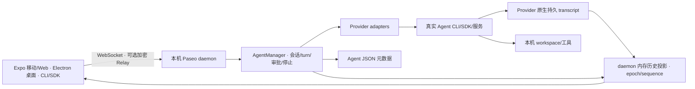

# 07 Paseo 独立源码研究与借鉴建议

## 结论要点

- **值得借鉴，优先借鉴完整用户路径与边界内的实现方法。** Paseo 围绕“创建会话 → 发送 → 过程/审批 → 本轮结果 → 继续 → 停止/恢复”组织产品。OpenAgentX 当前最需要补齐的正是这些衔接，而不是再增加一层组织或编排抽象。
- **不建议整体迁移，也不建议把 Paseo 的 idle 当成 OpenAgentX 的业务成功。** Paseo 是编码 Agent 会话工作台；OpenAgentX 另有持久任务、Worker 执行权、组织授权与副作用审计。两者验收对象不同。
- **直接可借鉴的重点是 turn 身份、Provider 能力、停止边界、历史补齐及错误反馈。** 它们分别对应旧 Run 结果误选、未装配能力被误解、停止后下一轮竞态、断线恢复和“在线但不能运行”的体验缺口。
- **Paseo 也并不简单。** 固定版本有 4,850 个跟踪文件、4,271 个 JS/TS 文件（含测试），AgentManager 单文件 5,304 行；插件、语音、终端、Git、跨端同步都引入维护成本。这些数量仅说明迁入规模，不能证明代码质量高低。
- **测试投入值得学习，但必须检查测试替身。** 一些名为 Codex E2E、daemon restart 的测试默认注入 fake provider；另有明确的真实 Provider 测试及浏览器测试，且部分真实测试会按环境跳过。仓库中存在测试不等于本次运行通过。
- **本次只完成固定源码研究和两个低成本原有单元套件：7 项通过。** 未安装全套依赖、未启动 Paseo 服务、未调用真实模型、未操作用户数据；没有 Paseo 浏览器、真机、真实 Provider 或当前 CI 运行通过的结论。

## 1. 范围、版本与证据等级

| 项目 | 本次事实 |
|---|---|
| 目标仓库 | `https://github.com/getpaseo/paseo`，用户指定的开源项目 |
| 固定 commit | `4c051388e1e00bdcad002e07aa7ce43e3f692caa` |
| commit 时间/主题 | 2026-09-22 17:20:31 +02:00；`Reach every Codex conversation in Import session (#5174)` |
| 根 package 版本 | `0.9.0`；这是源码 package 字段，未核实商店/发行安装版本 |
| 临时只读研究副本 | `/tmp/paseo-assessment-20260923`；检查后 `git status --porcelain` 为空 |
| 研究预算 | 本子任务最多 25 分钟；在母任务截止前交付，不扩展为安装/迁移项目 |
| OpenAgentX 比较基线 | 本批 README 固定的已安装 Go `6d599ac`、Web `ee46038`，模块报告 01–06；ADR-006 旁支已在建但未安装，不能计入当前能力 |
| 产物边界 | 仅本报告及 `evidence/paseo-*`；无产品、部署、ADR 或其他报告修改 |

证据分为三类：**源码确认**表示已阅读固定 commit 的实现；**测试设计确认**表示已检查测试及 Provider 注入/跳过条件；**本次动态通过**仅指第 7 节的 7 项单元测试。本文引用的 OpenAgentX 现场缺陷复用本批其他模块的证据，不冒充本子任务再次执行。

取证清单：[版本与摘要](evidence/paseo-manifest.json)、[定向源码摘录](evidence/paseo-source-excerpts.txt)、[测试输出](evidence/paseo-unit-tests.txt)、[测试命令](evidence/paseo-check-commands.txt)、[隔离测试配置](evidence/paseo-vitest.config.mjs)、[上游许可证](evidence/paseo-LICENSE.txt)。摘录保留上游版权来源；源码跳转均固定到上述 commit。

## 2. 定位与核心架构

Paseo 的 README 将产品定义为 Claude Code、Codex、Copilot、OpenCode、Pi 的统一界面。`docs/product.md` 明确把“给 Agent 任务、理解它在做什么、提供方向、检查结果”作为功能取舍标准；要求安装并认证一个受支持 CLI 后即可开始，额外插件不应成为第一次成功的前置条件。[P1]

- **服务端实际装配**：Provider registry 有 Claude、Codex、Copilot、OpenCode、Pi 等真实工厂，不只是文档 descriptor；另有通用 ACP、自定义 Provider 和开发用 mock。[P2]
- **Provider 契约**：以 session 对象封装 `startTurn`、订阅、`interrupt`、权限响应、恢复句柄和能力旗标；Provider 内部承担协议差异，客户端使用统一 timeline。[P2][P3]
- **数据持久化**：Agent 保存 provider、workspace/cwd、配置、native session handle、状态和 attention 等；JSON 写入按 Agent 串行并用临时文件 rename。默认 daemon 的 Timeline 是内存投影，持久 transcript 权威来自 Provider 历史，恢复时重建；`bootstrap.ts` 未注入 AgentManager 可选的 `durableTimelineStore`。因此不能把它描述为 OpenAgentX 式持久 Event Journal，也不能把 WebSocket 在线时收到的文本当唯一历史。[P4]
- **多客户端连接**：桌面自动管理本地 daemon；移动/Web 可直连或经过可选 Relay。文档和代码另有 daemon principal、credential、语义权限，不能概括成“完全无权限的个人聊天工具”；但其授权目前是 daemon-wide，不能替代 OpenAgentX 的组织/资源边界。[P1][P12]

### Provider 实现差异

| Provider | 实际源码路径/协议形态 | 对 OpenAgentX 的启示 |
|---|---|---|
| Claude | `providers/claude/agent.ts`，Claude Agent SDK + CLI；显式追加 system prompt，传权限回调 | 角色指令应进入真实 Provider 调用，并记录所用版本/内容摘要；仅注册文件无效果 |
| Codex | `codex-app-server-agent.ts`，app-server RPC，thread/turn 身份与 resume | 会话恢复和新一轮不能混成新逻辑 Agent；结果必须归属于明确 turn |
| Copilot | `copilot-acp-agent.ts`，ACP adapter | 复用协议适配，但只宣称确实装配并验证的能力 |
| OpenCode | SDK v2 client 与受管服务，session-wide abort | 取消协议的作用域决定下一轮准入；不能统一假设 kill 一次就已安全停止 |
| Pi | `pi/agent.ts` 与 RPC runtime | 共用上层会话契约，底层保留 Provider 特性和能力限制 |

上述为装配与源码能力，不是本机真实 Provider 实测。Paseo 没有提供当前 OpenAgentX 所用 AGY/CodeBuddy 的直接替代实现；引入任何新 Provider 仍需独立契约与实际副作用验证。

## 3. 核心用户路径：哪里更完整，哪里不能照搬

### 3.1 连续会话与结果身份

Paseo 的 Agent 生命周期以 `initializing/idle/running/error/closed` 为主，`closed` 仍可从持久 handle 恢复；完成一个 turn 后回到 idle，后续输入可以继续同一会话。[P3][P4]

`runProviderTurn` 先订阅再启动 turn，对启动返回前到达的事件缓冲，得到 `turnId` 后过滤其他 turn 事件；`AgentManager.runAgent` 从本轮 timeline 生成 `finalText`，对失败抛错，并单独携带 canceled。该实现针对“并发事件归属”和“本轮结果选取”有可直接复用的思路。[P5]

**与 OpenAgentX 的差异：** Paseo 的 turn completed/idle 没有承诺业务系统被正确修改。其返回文本、工具记录与 UI attention 都不是独立副作用验证。OpenAgentX 的 `Run succeeded`、`Task uncertain/business_effect_unverified` 不能通过套用 idle 状态解决。

**最小借鉴：** 统一 Task 详情投影中的 `activeRunId/latestRunId/resultRunId` 或等价明确身份，Web/Console 共用；在用户层提供“继续此会话”动作，再按领域规则新建或关联下一 Task，而非强行向已终态 Task 追加可执行消息。只读问答与更改任务的终态规则由 ADR-006 的独立流程处理，保留更改结果无法证实时的 uncertain。

### 3.2 角色与执行配置必须到达 Provider

Paseo 的 Agent 配置可持久化 `systemPrompt`。Claude adapter 将统一 prompt 与 daemon append prompt 合成后，作为 `claude_code` preset 的 append 传入 SDK；Codex resume 将组合指令送入 `developerInstructions`。[P6]

这不能证明模型必然服从指令，但能证明“配置已走到执行接口”。对 OpenAgentX `ROLE.md` 强制注册却未由 Worker 加载的问题，最小改法是明确角色是否为运行输入：若是，读取/版本化并放进实际 ExecutionSpec 与 adapter；若不是，移出首次可运行的强制前置。验收应检查 adapter 实参和有界角色行为用例，不只检查文件存在。

### 3.3 审批与取消

Paseo `respondToPermission` 按 requestId 防并发重复提交，先交 Provider，再更新 pending permission、持久快照和客户端事件。它也处理某些 Provider 的审批响应需要新 follow-up prompt 的差异。[P7]

取消有 `not_running/settled/refused` 结果。没有运行时可返回 not_running；interrupt 失败/超时且执行未结束时返回 refused，替换/重载需拒绝继续。OpenCode 进一步等待“旧 turn 终态 + 所有 session abort 请求完成”，避免迟到 abort 杀掉新一轮。[P7][P8]

**需要保留的差异：** AgentManager 在 interrupt 已获确认但终态超时后，存在合成 `turn_canceled` 的兜底；OpenCode interrupt 又允许达到 2 秒上限后先返回，底层 stop gate 继续约束新运行。因此 Paseo 的用户可见 canceled 不能直接作为 OpenAgentX 已证明外部副作用停止的证据。

**最小借鉴：** 取消前先区分未领取 Task、活动 Run、已经终态；queued 的取消应在现有事务中使 Task/Mailbox 一致失效，不需要搬来 Paseo 的会话调度器。活动 Run 保留确认/拒绝/仍待确定的明确反馈；下一轮准入必须尊重 adapter 的实际停止边界。不要把前端隐藏取消按钮当修复。

### 3.4 断线恢复与结果可见性

Paseo 文档明确区分实时流和权威历史；timeline 用 epoch + sequence 处理去重、空洞、分页和重建。`planTimelineResumeFetch` 在有 cursor 时请求 after，否则取 tail；error 或仍有 newer 数据时不把补齐视为完成。`viewed-timeline-sync` 用 generation 避免迟到响应覆盖新恢复过程；后台回前台/重连后恢复权威视图，而不是只把连接灯改成 Online。[P9]

测试中还有“隐藏标签页期间重启 daemon，再返回前台”的浏览器场景。它模拟 `visibilitychange`，不是手机锁屏真实系统行为。Paseo 的这些设计与 OpenAgentX 已有 Journal cursor/SSE 思路相容，最小处置应补好首个 snapshot 失败后的恢复、旧 cursor 和结果归属，**不必把 SSE 全部换成 WebSocket**。

## 4. 桌面与移动体验：借信息架构，暂不搬技术栈

Paseo 的 Expo/React Native 客户端与 Electron 桌面共享核心界面。源码明确区分平台能力和紧凑布局，移动端以 Agent 列表、当前会话、文件视图三个互斥目标组织导航；紧凑屏用 sheet，宽屏用侧栏/面板，手势临时位移不替代持久导航意图。[P10]

输入逻辑将空输入、正在运行时排队、实际发送和发送失败分开。发送失败恢复文本与附件，避免丢草稿；停止按钮考虑连接和正在取消状态。这里的运行中消息队列不等同于 OpenAgentX 服务端持久 Mailbox，不能据此证明离线提交或可靠投递。[P10]

| OpenAgentX 当前问题 | 可借鉴的产品方法 | 最小范围 |
|---|---|---|
| online 但网络未 ready，发送后长期 queued | 首次成功前的前置条件和当前阻断原因可见 | 统一 readiness 读模型，原位指向网络恢复流程，保留 test/publish/ack 后端契约 |
| Task 终态后没有自然继续入口 | Agent 会话长期存在，一轮完成后仍能继续 | 明确新 Task 与会话关联动作；不重开已完成 Task |
| 结果卡选旧 Run | 结果/状态跟随明确 turn 身份 | 后端投影或单一选择器，跨 Web/Console 共用 |
| Console overview 空壳、Web 状态受浏览历史影响 | 围绕“待处理、执行中、结果可读”组织入口 | 一份可靠摘要投影替代各页面临时推导 |
| 审批不在任务详情主路径 | 审批作为当前会话内联操作 | 详情显示当前请求和明确反馈，支持超过首页截断数量 |
| 网络页大量内部标识占首层 | 通用入口 + 按需展开诊断 | 首层展示阻断与下一动作，generation/revision 放详情 |

本轮没有运行 Paseo app，也没有查看实际桌面/移动渲染，不给“比 OpenAgentX 更流畅”“所有真机可用”的评价。OpenAgentX 现有 PWA 足以验证上述信息架构，不应先付出 Expo/Electron/native port 成本。

## 5. E2E 投入：确有真实测试，不能只读文件名

### 已核对的测试层次

| 测试/配置 | 实际边界（源码确认） | 本次是否执行 |
|---|---|---|
| `provider-runner.test.ts` | FakeTurnRunner 验证早到事件缓冲、过滤其他 turn、失败、文本合并 | 是，4 项通过 |
| `jsonl-frame-decoder.test.ts` | 有界 JSONL/chunk 解码单元测试 | 是，3 项通过 |
| `daemon-restart-resume.e2e.test.ts`、`two-cycle-resume.e2e.test.ts` | `createDaemonTestContext()` 默认注入 `createTestAgentClients()`，是 daemon/client + fake provider；测试名有 Codex 不代表真实 Codex | 否 |
| `permissions-codex.e2e.test.ts` | 同一 fake 默认 context；虽然验证文件创建/拒绝副作用，仍不能充当真实 Codex 审批协议验收 | 否 |
| `user-message-contract.real.e2e.test.ts` | 显式真实 Claude/Codex/OpenCode/Pi client，核对单次提交对应的 provider user_message 与状态 | 否 |
| `send-during-tool-call-codex.real.e2e.test.ts` | 显式真实 Codex client，核对 steer 不新开 turn、不误取消既有工具、replacement 不出现假 idle | 否 |
| `opencode-send-interrupt.real.e2e.test.ts`、`pi.real.e2e.test.ts` | 专项真实 Provider 路径与 Provider 特性 | 否，仅定向读取/定位 |
| `permission-steer.real.spec.ts` | 浏览器 Claude/Codex 审批期间改指令、回复可见性及刷新后的呈现 | 否 |
| `acp-permission-choices.real.spec.ts` | 浏览器 Kimi ACP 三选项展示、选择及后续回复；ACP 不能一概说无真实路径 | 否 |
| `background-reconnect.spec.ts` | 隔离 daemon + 真实浏览器拟定流程，模拟 hidden，重启和前台恢复 | 否 |

源码证据：[fake 默认 context](https://github.com/getpaseo/paseo/blob/4c051388e1e00bdcad002e07aa7ce43e3f692caa/packages/server/src/server/test-utils/daemon-test-context.ts#L35)、[真实 Provider 工厂与可运行判定](https://github.com/getpaseo/paseo/blob/4c051388e1e00bdcad002e07aa7ce43e3f692caa/packages/server/src/server/daemon-e2e/real-provider-test-config.ts)、[真实 user_message 契约测试](https://github.com/getpaseo/paseo/blob/4c051388e1e00bdcad002e07aa7ce43e3f692caa/packages/server/src/server/daemon-e2e/user-message-contract.real.e2e.test.ts)、[真实 Codex steering](https://github.com/getpaseo/paseo/blob/4c051388e1e00bdcad002e07aa7ce43e3f692caa/packages/server/src/server/daemon-e2e/send-during-tool-call-codex.real.e2e.test.ts)、[真实浏览器审批 steering](https://github.com/getpaseo/paseo/blob/4c051388e1e00bdcad002e07aa7ce43e3f692caa/packages/app/e2e/browser/permission-steer.real.spec.ts)、[Kimi 浏览器审批](https://github.com/getpaseo/paseo/blob/4c051388e1e00bdcad002e07aa7ce43e3f692caa/packages/app/e2e/browser/acp-permission-choices.real.spec.ts)。

### 真实 Provider 覆盖的实际限制

- `real-provider-test-config.ts` 的共享列表含 Claude/Codex/OpenCode/Pi/OMP；上述 user_message 契约矩阵只含前四者。不能从 README 五种 Provider 或某个 `allProviders` 名字推断全功能矩阵覆盖；未确认 Copilot 有等价的核心用户路径真实测试。
- 共享 `canRunRealProvider` 对 Claude/Codex/OpenCode 检查 OpenRouter 凭据和命令可用性，测试的 `beforeEach` 可直接 skip；共享真实路径中部分模型调用经 OpenRouter。它证明“真实 CLI/协议路径的设计”，不自动证明官方直连、用户当前 OAuth 路径或全部模型。
- CI 的 server job 安装 Claude/OpenCode 并注入模型相关 secret；浏览器 job 安装 Claude、指定 Codex `0.105.0`、OpenCode，Playwright 分 ordinary/real-provider/relay-deployment 项目。**这些是运行配置，不是当前 commit 的 test report。** 本次没有获取 Actions run、逐项 skip/pass 数或完整日志。[P11]
- 原生移动测试、截图和真机工作流在仓库中存在；未验证它们本版本是否执行，更未做本机 iOS/Android 验收。

对 OpenAgentX 最值得借鉴的是：围绕真实“发送 → 回复 → 继续/打断 → 恢复”建立少量稳定回归，而不是复制测试数量。至少分别报告控制面/fake、真实 adapter、浏览器、实际副作用四层，避免局部绿灯相互代替。

## 6. 取舍矩阵与最小落地顺序

### 可直接借鉴、只借思想、不适合迁入

| 类别 | 项目 | 原因与限制 |
|---|---|---|
| 可直接借鉴实现方法 | turn/session 身份、早到事件缓冲、当前结果选择器 | 与旧 Run 误选直接相关；在现有 Go/JS 内小范围实现，不需要搬整个 TS AgentManager |
| 可直接借鉴实现方法 | 明确 cancel result、Provider 停止作用域、替换前 gate | 直接减少“已取消”误报与下一轮被旧取消杀掉；OAX 仍以 lease/fencing/领域结果为准 |
| 可直接借鉴实现方法 | 单一 timeline/readiness 状态拥有者、cursor 补齐、迟到响应隔离 | 减少 Web/Console 多处推导和恢复分叉；复用 OAX 既有 Journal/SSE |
| 可直接借鉴测试方法 | 真实 Provider 与 fake 明确分层、主链 browser spec、失败保存证据 | 使“绿了什么”可解释；不复制无关测试基建 |
| 只借思想 | 会话优先的继续交互、inline 审批、草稿失败恢复、诊断渐进展开 | 需映射 OAX Task/Run 领域，不能把会话状态覆盖任务结果 |
| 只借思想 | Provider registry + capability + 实际运行目录/模型发现 | OAX 已有 adapter/descriptor，先修装配与宣称不一致，不新增第二套注册体系 |
| 只借思想 | 按实际用户结果裁剪核心功能，专业能力后置 | 与 AGENTS 的范围治理一致；无需先做插件平台来实现“后置” |
| 不适合本轮迁入 | 文件 JSON 持久化替换 SQLite/事务、内存生命周期替换 Mailbox/lease/fencing | 无法等价覆盖 OAX 的复合事务、失效 Worker、可靠投递和审计验收 |
| 不适合本轮迁入 | Expo/Electron 全栈、语音、Relay、terminal、Git 工作台、通用插件宿主 | 不解决当前终态/取消/结果缺陷，新增跨端与执行边界成本 |
| 不适合直接迁入 | daemon-wide permission 取代 OAX 组织/资源授权；以 canceled/idle 代表业务成功 | 缩窄了实际安全/业务保证，且并未取得改变目标的授权 |

### 最优先的三个借鉴项

| 优先项 | OpenAgentX 最小变更 | 完成证据 |
|---|---|---|
| 1. 当前 turn/结果的单一身份与连续会话入口 | 修最新 Run 选择；终态后“继续”创建关联下一 Task，保持原审计与 SessionBinding | 真实两轮后显示第二轮结果，第一轮可追溯；更改任务独立核验副作用 |
| 2. 明确取消结果与下一轮停止边界 | 修 queued 无 active Run 的事务分支；活动 Run 的确认/拒绝/不确定由 adapter 和领域规则决定 | queued 取消后永不被领取；运行中取消后无迟到执行/错误启动下一轮 |
| 3. 统一就绪与历史恢复投影 | Web/Console 共用阻断原因、恢复动作、最新结果；snapshot 首次失败自动恢复、cursor 补齐 | 新用户无需隐藏脚本即可启动；短暂失败和重连后状态/结果不丢、不旧、不重复 |

### 建议顺序（建议，不是本批实施授权）

1. **先补“能发、能停、看对结果、能继续”的同一条路径。** 合并处理 queued 取消、最新 Run 归属、终态后的新 Task/同会话入口、ROLE 执行输入及明确终态规则。角色/结果语义依其现有 ADR/范围分别裁决，避免把一次 UI 修复扩大为完整组织模型重构。验收是一个真实 AGY workspace 中连续两项任务、当前结果正确、未领取取消不再执行；只读问答和更改结果分别判定。
2. **再统一就绪和恢复投影。** 让 Web/Console 同时说明“现在可运行吗、卡在哪里、如何恢复”；补首个 overview/snapshot 失败、断线追赶、审批入口。保留当前网络 test/publish/ack 与 generation 边界，先减少用户操作/理解成本，网络跨代自动继承另按 ADR-007 裁决。
3. **最后固化少量正式用户路径 E2E，再按重复成本局部拆分。** 新用户从零配置到首次成功、第二轮继续、queued 取消、运行中取消/审批、断线恢复、Worker 重启后可解释恢复。只有这些用例通过且出现明确新增场景，才评估 Codex/Claude adapter、插件或 native 客户端。

上述顺序不要求重写控制面。它减少的是使用者和客户端重复承担的状态协调成本，保留已经承担真实可靠性责任的领域机制。对于强权限/副作用问题，仍按本批主报告的风险排序先处置；Paseo 的参考顺序不能覆盖母任务的已确认阻断裁决。

## 7. 本次检查、许可证与未覆盖

| 检查 | 结果 | 能证明/不能证明 |
|---|---|---|
| 固定源码 clone、commit 与洁净状态 | 完成，commit 与文件摘要入证据 | 可重复定位研究对象；不是发行部署来源验证 |
| README/产品/架构/实际适配器/持久化/取消/恢复/测试注入 | 定向源码审查完成 | 支撑本文限定结论；非全仓安全审计 |
| 原有 `provider-runner.test.ts` | 4/4 通过 | FakeTurnRunner 下的归属/缓冲/失败/文本行为 |
| 原有 `jsonl-frame-decoder.test.ts` | 3/3 通过 | 解码局部行为；不代表真实 Agent 输出全契约 |
| 完整 daemon、模型调用、真实 app/手机、Relay | 未执行 | 不宣称可用性、性能、真机或 E2E 本次通过 |
| 上游 Actions 最新执行记录 | 未核实 | 只报告配置和源码覆盖，不报告最新 CI 全绿 |
| 本地修改 | 仅独立报告和证据；研究 clone 洁净 | 无产品修复、无修复 commit、无部署 |

执行环境为 Node `v20.19.4`、隔离下载的 Vitest `3.2.4`。用自定义配置仅运行两个无服务依赖的原有测试文件，跳过仓库 dotenv setup，未加载模型凭据，也未安装项目 workspace 依赖。与上游 CI 的 Node 22/全构建环境不同，不能替代 upstream build/typecheck/full suite。

许可证为 **Apache-2.0**，上游说明第三方部分仍遵循各自许可证。若以后复制具体代码，需保留相应版权/许可证、修改标记，并检查所复制部分的第三方归属；本次全仓文件名扫描未见 NOTICE 文件，不代表下游依赖没有额外声明。Apache-2.0 不授予 Paseo 商标使用权。[P13]

### 下一步

- 主报告将本研究作为局部改进参考，与模块 01–06 的实际失败证据合并排序；不要另开整体迁移项目。
- 下一实施批从真实用户主链选一个小结果收口，并保留 fake/真实 Provider/浏览器/业务证据的分层记录。
- 若将来要正式采用 Paseo 或其 Provider 代码，再单独执行固定版本真实服务、模型权限、取消副作用、重启恢复与许可证核对；本报告不能充当采用验收。

## 8. 固定源码索引

- **P1 产品与入口**：[README](https://github.com/getpaseo/paseo/blob/4c051388e1e00bdcad002e07aa7ce43e3f692caa/README.md)、[产品取舍](https://github.com/getpaseo/paseo/blob/4c051388e1e00bdcad002e07aa7ce43e3f692caa/docs/product.md)、[架构](https://github.com/getpaseo/paseo/blob/4c051388e1e00bdcad002e07aa7ce43e3f692caa/docs/architecture.md)。
- **P2 实际装配与能力**：[provider registry](https://github.com/getpaseo/paseo/blob/4c051388e1e00bdcad002e07aa7ce43e3f692caa/packages/server/src/server/agent/provider-registry.ts#L196)、[SDK 契约](https://github.com/getpaseo/paseo/blob/4c051388e1e00bdcad002e07aa7ce43e3f692caa/packages/server/src/server/agent/agent-sdk-types.ts#L182)。
- **P3 会话生命周期**：[生命周期说明](https://github.com/getpaseo/paseo/blob/4c051388e1e00bdcad002e07aa7ce43e3f692caa/docs/agent-lifecycle.md)、[AgentManager](https://github.com/getpaseo/paseo/blob/4c051388e1e00bdcad002e07aa7ce43e3f692caa/packages/server/src/server/agent/agent-manager.ts#L2278)。
- **P4 持久状态**：[AgentStorage](https://github.com/getpaseo/paseo/blob/4c051388e1e00bdcad002e07aa7ce43e3f692caa/packages/server/src/server/agent/agent-storage.ts#L153)、[原子文件写](https://github.com/getpaseo/paseo/blob/4c051388e1e00bdcad002e07aa7ce43e3f692caa/packages/server/src/server/atomic-file.ts)、[内存 Timeline store](https://github.com/getpaseo/paseo/blob/4c051388e1e00bdcad002e07aa7ce43e3f692caa/packages/server/src/server/agent/agent-timeline-store.ts)、[实际 daemon 装配](https://github.com/getpaseo/paseo/blob/4c051388e1e00bdcad002e07aa7ce43e3f692caa/packages/server/src/server/bootstrap.ts#L922)。
- **P5 本轮结果归属**：[provider runner](https://github.com/getpaseo/paseo/blob/4c051388e1e00bdcad002e07aa7ce43e3f692caa/packages/server/src/server/agent/providers/provider-runner.ts)、[原有测试](https://github.com/getpaseo/paseo/blob/4c051388e1e00bdcad002e07aa7ce43e3f692caa/packages/server/src/server/agent/providers/provider-runner.test.ts)。
- **P6 指令执行输入**：[Claude prompt append](https://github.com/getpaseo/paseo/blob/4c051388e1e00bdcad002e07aa7ce43e3f692caa/packages/server/src/server/agent/providers/claude/agent.ts#L3230)、[Codex resume instructions](https://github.com/getpaseo/paseo/blob/4c051388e1e00bdcad002e07aa7ce43e3f692caa/packages/server/src/server/agent/providers/codex-app-server-agent.ts#L3949)。
- **P7 审批/取消**：[权限响应与取消结果](https://github.com/getpaseo/paseo/blob/4c051388e1e00bdcad002e07aa7ce43e3f692caa/packages/server/src/server/agent/agent-manager.ts#L2943)、[权限 follow-up](https://github.com/getpaseo/paseo/blob/4c051388e1e00bdcad002e07aa7ce43e3f692caa/packages/server/src/server/agent/permission-response.ts)。
- **P8 OpenCode stop gate**：[interrupt 上限](https://github.com/getpaseo/paseo/blob/4c051388e1e00bdcad002e07aa7ce43e3f692caa/packages/server/src/server/agent/providers/opencode-agent.ts#L3456)、[awaitRunnerQuiescence](https://github.com/getpaseo/paseo/blob/4c051388e1e00bdcad002e07aa7ce43e3f692caa/packages/server/src/server/agent/providers/opencode-agent.ts#L3610)。
- **P9 断线与历史**：[同步契约](https://github.com/getpaseo/paseo/blob/4c051388e1e00bdcad002e07aa7ce43e3f692caa/docs/timeline-sync.md)、[sync plan](https://github.com/getpaseo/paseo/blob/4c051388e1e00bdcad002e07aa7ce43e3f692caa/packages/app/src/timeline/timeline-sync-plan.ts#L54)、[viewed sync](https://github.com/getpaseo/paseo/blob/4c051388e1e00bdcad002e07aa7ce43e3f692caa/packages/app/src/timeline/viewed-timeline-sync.ts#L550)、[后台重连浏览器用例](https://github.com/getpaseo/paseo/blob/4c051388e1e00bdcad002e07aa7ce43e3f692caa/packages/app/e2e/browser/background-reconnect.spec.ts)。
- **P10 移动/输入体验**：[移动面板](https://github.com/getpaseo/paseo/blob/4c051388e1e00bdcad002e07aa7ce43e3f692caa/docs/mobile-panels.md)、[布局能力](https://github.com/getpaseo/paseo/blob/4c051388e1e00bdcad002e07aa7ce43e3f692caa/packages/app/src/constants/layout.ts)、[发送和失败恢复](https://github.com/getpaseo/paseo/blob/4c051388e1e00bdcad002e07aa7ce43e3f692caa/packages/app/src/composer/submit.ts)。
- **P11 CI/浏览器边界**：[CI 配置](https://github.com/getpaseo/paseo/blob/4c051388e1e00bdcad002e07aa7ce43e3f692caa/.github/workflows/ci.yml#L135)、[Playwright 分组](https://github.com/getpaseo/paseo/blob/4c051388e1e00bdcad002e07aa7ce43e3f692caa/packages/app/playwright.config.ts#L38)。
- **P12 授权边界**：[daemon permissions](https://github.com/getpaseo/paseo/blob/4c051388e1e00bdcad002e07aa7ce43e3f692caa/docs/permissions.md)、[操作到语义权限的实际映射](https://github.com/getpaseo/paseo/blob/4c051388e1e00bdcad002e07aa7ce43e3f692caa/packages/server/src/server/authorization/operation-permissions.ts)。
- **P13 许可证**：[LICENSE](https://github.com/getpaseo/paseo/blob/4c051388e1e00bdcad002e07aa7ce43e3f692caa/LICENSE)。

本批 OpenAgentX 对照：[01 控制面](01-control-plane-and-state.md)、[02 Worker/Runtime](02-worker-and-runtime.md)、[03 Web/PWA](03-web-and-pwa.md)、[04 Console/Fleet](04-console-fleet-and-onboarding.md)、[05 网络](05-network-workflow.md)、[06 部署](06-deployment-and-observability.md)。
