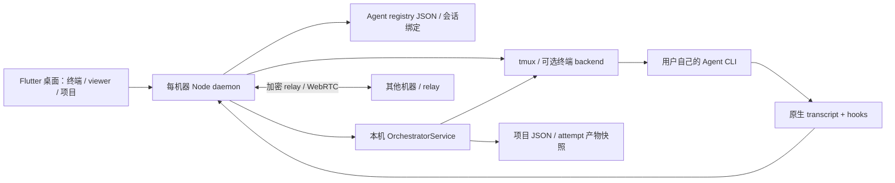

# 09 OpenHarness 独立源码研究与借鉴建议

## 结论要点

- **值得借鉴，但它主要是跨机器 Agent 终端／会话工作台，不是 OpenAgentX 的组织任务控制面替代品。** 它把真实 CLI、tmux、原生桌面、领域工具和结果查看连接起来；另有已经接入 daemon 的 Director／specialist DAG 编排，不能只称为概念或 SDK。
- **最值得借鉴的是执行上下文实际装配、消息交付不确定性、按 attempt 固定结果与有限能力声明。** 这些机制能帮助 OpenAgentX 补齐 ROLE 输入、旧 Run 结果误选、未知投递不重放和“配置了但不能运行”的断点；不需要引入第二套编排平台。
- **不能把 `turn_ended`、`finish`、`ready` 或 `cancelled` 当作独立业务效果证据。** 编排不会用 idle 自动成功，但 `finish` 仍接受 Agent 的声明，允许空产物列表；产物 hash 只保证交接内容。编排取消先落 `cancelled` 再异步发 Ctrl-C，与另一个确认 PID／pane 停止的 Pause 路径不同。
- **“支持 14 种 engine”不等于 14 种都能编排。** 固定源码的初始 prompt 契约只有 Claude、Codex、OpenCode，AGY 明确为 `null`；AGY 的 transcript／hook 观察适配不能替代 OpenAgentX 正式 `agy-graft` 执行契约。跨引擎角色装配测试也不证明真实模型读入或服从。
- **本次运行 119 个不同的原有局部测试，结果必须保留环境边界。** 首轮 118 通过、1 个 corrupt-state 夹具因本机 `umask 002` 生成可组写目录而失败；不改上游源码，以 `umask 077` 复跑编排套件 46/46 通过。另两套原有 49、24 项通过证据复用；未部署、未登录、未调用模型、未做桌面或跨机 E2E。
- **MIT 许可方便独立借鉴，但完整迁入成本很高。** 固定版本有 6,067 个跟踪文件，涵盖 Flutter、Node、tmux、MongoDB／Redis relay、E2EE／WebRTC、领域工具及硬件；其中 hosted Web 客户端文档明确不在此仓库。保留 OpenAgentX 的 SQLite 事务、Mailbox、Journal、lease/fencing 和未知副作用不自动重跑原则。

## 1. 版本、范围与证据等级

| 项目 | 本次事实 |
|---|---|
| 用户指定仓库 | <https://github.com/autonomous-ai/openharness> |
| 固定 commit | `a53351bd1a2c33c2976b7df6869e3666578fdd7d` |
| commit 时间／标题 | `2026-09-24T08:07:10-07:00`；`Merge pull request #313 from autonomous-ai/fix/pane-header-details-left-of-model` |
| 临时研究副本 | `/tmp/oax-openharness-assessment-20260924`，浅 clone；源码未修改，取证结束 `git status --porcelain` 为空 |
| 源码 package 版本 | CLI `0.0.1`，backend `0.1.0`；不是核实过的发布版本，release 使用 tag/manifest 版本 |
| 时间预算 | 单项目首次研究最多 25 分钟；达到固定源码、局部测试、许可证和三项建议后收口 |
| 对照基线 | 上批 Go `6d599ac`、Web `ee46038`；本批主代理复核安装 Go 仍为 `6d599ac`；ADR-006 旁支已到 `d0fd561`，未安装，不写成“根本未实施” |
| 非目标 | 不运行 installer／make install-cli，不启动 daemon／relay／桌面，不访问账号或模型，不改 OAX 产品、配置、数据库、冻结 ADR，不重跑 OAX 测试 |

**源码确认**是固定 commit 的实现与接线；**测试设计确认**是已阅读 fixture、mock、真实调用及门禁；**本次动态证据**只包含第 8 节原有局部测试。上游报告、截图、注释中的 measured/live 是上游历史材料，不升级为本次实测。OAX 的 Chrome→真实 AGY→文件→同一 Worker 下一项已贯通但 Task 仍 uncertain、取消／结果／首连问题，复用[上一批总评估](../2026-09-23/00-overall-assessment.md)，不重述为本轮重跑结果。

取证文件：[manifest 与源码/测试 SHA-256](evidence/openharness-manifest.json)、[定向源码摘录](evidence/openharness-source-evidence.txt)、[测试命令与边界](evidence/openharness-check-commands.md)、[首轮输出](evidence/openharness-targeted-tests.txt)、[限定环境复跑](evidence/openharness-orchestrator-umask077.txt)、[原始 MIT 许可](evidence/openharness-LICENSE.txt)。

## 2. 先看产品实际解决的问题

README 的主路径是：安装原生桌面 → 在每台机器安装 CLI、登录、设置 remote password、启动 daemon → Link Machine → 打开 engine／项目／分屏 → 在真实终端工作。默认前提是用户自己的 coding CLI 和其认证已经可用。它没有把原 CLI 换成自有聊天协议；主要用进程发现、vendor hook 和原生 transcript 观察会话，通过终端输入驱动 CLI。[H1][H2]

DSH（domain-specific harness）增加 `harness.json`、指令、skills、模板／工具链、检查与 viewer；用户可在聊天旁看到 CAD、PDF、场景等实际产物。Director 入口进一步让普通 Agent 规划小型 DAG，启动 specialist，各自有工作目录，依赖交接只取显式提交的产物。后者是可运行源码，不只是 README 规划，但不是跨机器持久 Worker 分发体系。[H3][H4]

| 层次 | 实际实现与定位 | 不能推断的能力 |
|---|---|---|
| CLI／daemon | Node/TypeScript；主入口 `cli.ts`，真实终端与 hook/transcript normalizer | 支持观察一个 CLI，不等于支持全部 prompt／resume／审批功能 |
| 桌面 | Flutter/Dart，终端 pane、键盘导航、viewer、编排工作区 | 本次未运行 macOS/Linux app，不评价实际流畅度、触控或移动体验 |
| Relay | Fastify、Prisma/MongoDB、Redis，SSO、机器路由、WebSocket，E2EE／P2P | 没有开展密码学／网络安全审计，架构声明不等于所有传输组合已实测 |
| Provider 子项目 | 独立 JSON-RPC/SSE 协议，reference 是确定性实现，example 可调用 Claude | 这不是本机 tmux 引擎层的同一契约，不用其 conformance 证明本机 AGY 已支持 |
| 编排 | daemon 本机状态目录与 workspace，create/send/cancel 复用现有 engine 路径 | 未见本层 OAX 式持久 Mailbox、Worker lease/fencing 或组织资源授权语义，不能等价替换 |

文档说 hosted Web 位于 `harness.autonomous.ai`，且**不在此 repository**。因此 README“app/CLI/daemon/relay/device 都在仓库”的表述不能扩大为“所有线上客户端源码均可审计”。[H2]

## 3. 执行输入：哪些真正到了 engine

### 3.1 DSH 上下文有明确接线，但不是强制语义沙箱

`prepareHarnessLaunch` 在启动前读取并保存每会话 `runtime.json`，包含 engine、指令正文、env、args、skill 路径；生成会话专用 `CONTEXT.md`，用 `HARNESS_CONTEXT_FILE/HARNESS_SKILLS_DIR` 指向它，在已有项目指令文件中保留原内容并追加通用 bootstrap。[H5]

适配表声明各 engine 读取的项目指令位置：Claude 的 `CLAUDE.md`，Codex 的 `AGENTS.override.md/AGENTS.md`，AGY 的 `AGENTS.md/GEMINI.md` 等。Claude 另追加 `--append-system-prompt`，Pi 传 context 文件；其他主要依赖项目指令 bootstrap 让模型读上下文。失败时返回 `DSH_RUNTIME_FAILED`，不会静默丢角色继续启动。[H5][H6]

这比“数据库保存 ROLE.md 路径但执行不消费”更完整。已有 snapshot 被用作重启／fork 的权威输入，包更新不会无声更换该会话的 engine/指令/env/args；不过 skill 内容通过链接引用原安装目录，不能把整个技能树称为内容不可变快照。项目指令文件被保留也不证明所有引擎真实读入，更不证明模型必然服从。原有 runtime 套件 49 项验证文件/env/argv、隔离与冲突拒绝，不调用模型。

**对 OAX：** 沿已有 ExecutionSpec/adapter 固定 ROLE 正文或内容版本与最终模型/effort/cwd，验证正式 wrapper 实参；保留用户 workspace 指令。先解决一个已支持 AGY 的确定性输入路径，不建设 harness store 或通用 skill 安装器。

### 3.2 能力逐项声明，不能用 engine 总数代替

`FIRST_PROMPT_ARGS` 只对 Claude、Codex、OpenCode 给出已声明的初始 prompt 形式，其余包括 AGY 都是 `null`；`supportsFirstPrompt` 同时限制 Director 与 specialist catalog。backend 的 create 还会 probe engine 是否已安装。它选择在没有契约时拒绝，而不是把参数接收后丢弃。[H7][H4]

| 声明面 | 固定源码判断 | 对 OAX 的参考 |
|---|---|---|
| 14 种 engine 观察／终端 | 有对应 normalizer、transcript/hook 或数据库 reader | 逐项区分可发现、可输入、可观察终态、可恢复、可审批 |
| Director / specialist 初始 prompt | Claude、Codex、OpenCode；AGY 不进入这条创建路径 | 不能搬 AGY normalizer 就宣称支持 AGY 编排 |
| permission mode | 普通 New Harness 默认 engine 的 auto；有 ask/readOnly/full 等差异 | 不统一叫 skip-all；也不把普通默认值当编排默认值 |
| 编排权限 | StartSpec `bypassPermission=false`，prompt 明示未启用 unattended；实际传到 create | 无授权不迁入更宽权限默认值 |
| resume | 按 engine 契约构造，Devin 没有已知 resume flag | UI 应解释可恢复的是终端、会话还是上下文 |

AGY adapter 注释记录的是上游 AGY `1.1.14` 的 transcript/hook/TUI 观察；OAX 正式路径还有 `agy-graft`、模型和代理环境，必须继续按本项目实测契约验收。本轮没有运行任何已安装 engine 的 help 或登录态命令。[H8]

## 4. 工作、会话和结果的边界

### 4.1 Stable agent、engine session、task attempt 各有身份

registry 的 `agentId` 面向 pane／用户，`sessionId` 是可轮换的 engine 会话绑定；daemon 重启与 `/clear` 不必重新创建用户可见身份。编排 Task 另有 `attempt`、`agentId`、`cwd`、`inputs` 与 artifacts；依赖明确记录被消费的上游 attempt，而不是每次读 latest。[H9][H3]

新计划先验证所有依赖、循环、重复 ID 和 harness 可用性，再启动；最多 64 task、每次增加 32、并行 1–6。相同 project creation ID 但不同 fingerprint 拒绝；同任务换指令不能复用 ID。启动前先存 `launching`，重启遇到此状态变成 blocked/uncertain，不自动重造进程。[H3]

**可借鉴点：** 当前结果必须属于明确 Run/attempt，后续输入用独立 receipt；这与 OAX 修复旧 Run 误选相容。无需把 OAX Task 改名为其 Project。OpenHarness 的 completed project 可以 chat 后回到 active，是自身产品取舍；OAX 终态 Task 应继续通过关联新 Task 续问，不直接重开终态。

### 4.2 显式 finish 比 idle 强，但仍不足以证明业务完成

`turn_ended` 只影响 Director 忙闲与对话投影，specialist 不会因此自动成功。`finish(project, task, attempt, summary, paths)` 验证当前 attempt/state，快照指定文件后写 succeeded；`complete` 要求每个 Task 显式 succeeded。原有测试直接验证 idle 不等于 success。[H3][H10]

`snapshotArtifacts` 只接收 workspace 内的普通文件，拒绝路径穿越／外部符号链接，限制个数和大小；复制后核对大小和 SHA-256，设只读，依赖复制时再验 hash。结果提交在通知 Director 与放行依赖之前，revision 修改保留新 task ID／attempt 文件夹。[H11]

需要保留三个限制：

1. `paths=[]` 是允许的，非空 summary 也不要求机器可验证的 acceptance 记录；模型可以直接调用 finish。文件存在、SHA-256 相同不能证明代码正确、PDF内容完整或业务系统已更新。
2. `.harness/verdict.json` 是领域脚本／Agent 写入后由 watcher 读取的 ready/findings/artifact 投影；通用 `finish` 不检查 verdict，也不会自动执行领域核验器。[H12]
3. 产物目录 rename 与项目 JSON 保存不是 OAX 式跨实体数据库事务；本层没有证明产物、任务、审计在崩溃／落盘故障时整体回滚。只读文件权限也不是同 OS 用户下的隔离沙箱。

**对 OAX：** 可以借“确切 attempt + 产物路径/hash + 检查结果来源”，但应接入已有 ADR-006 intent/verifier 工作。query 的可交付回复与 mutation 的效果核验分别判断；不能为了减少 uncertain 把 Agent finish 当成外部核验。本次不建议新增通用 DAG 或万能 artifact 平台。

## 5. 取消、超时和审批：不能混淆的三种保证

| 操作 | 固定实现 | 边界与 OAX 裁决 |
|---|---|---|
| 编排 cancel | 先把 queued/running/launching/blocked 标 cancelled、保存，再 `deps.cancel(agent)`；迟到 finish 被拒绝 | queued 可终止编排继续派发；running 的标签不是外部执行已停止证明 |
| 实际编排中断接线 | `backendSocket` → `onCancel` → `cancelAgent` → `SessionInputController.cancel`，异步发送 `C-c`，没有等待进程终态 | 不把此分支当可靠取消范本；OAX 保留活动 Run 停止确认/unknown 及下一项准入边界 |
| Pause / stopAgentService | 保存 resume 身份在先，核对 PID/startMarker、会话及 route，等待 pane kill 和进程停止都成功才移除 live row；并发 stop 合并 | 值得借鉴“先留历史、确认同一目标、确认停止后再发布”，但本次仅 mock 终止测试，未真杀 CLI |
| 工具审批／提问 | vendor permission mode 与真实 TUI；QuestionController 把问题映射给设备／桌面并向原终端回答 | 不同于 OAX 审批票据/RBAC；无统一工具审批事务的等价证据 |
| 超时 | 编排命令请求默认 30 秒；消息 FIFO 有 TTL/确认窗口；restore 启动预算默认 10 分钟 | 这些不是 Task 的执行 deadline；本编排 model/service 未提供普遍 task deadline 或超时杀进程 |

代码：[编排 cancel][H3]、[真实取消接线][H13]、[C-c 行为][H14]、[确认 Pause][H15]。`cancelConfirmed` 也只判断键操作 dispatch 为 executed，不能因此声称外部业务效果已停止。即使生产进程确实停止，也不会撤销已发生的文件／网络副作用。

编排 `retry` 拒绝 `uncertain`、拒绝仍在 launch 或已被下游消费的结果；这是良好边界。但 active cancel 立即生成 cancelled 且通常未设 uncertain，理论上可进入 retry；前一个进程只得到 C-c，仍可能继续。这是源码上不能迁入的取消／重试语义，不是本次真实 Provider 竞态复现。OAX 应先修已有 queued/waiting_input 取消，再保留 lease/fencing 与失联不误报成功，不能照抄该状态转换。

## 6. 持久化、恢复和可见性

| 机制 | 实际行为 | 借鉴与保留 |
|---|---|---|
| Agent registry | JSON，私有权限、锁、写文件 fsync + rename + 目录 fsync；持久进程身份与 session 绑定 | 不是“只有内存”；但名为 `transaction` 的方法是延迟 save，不提供异常回滚，不能代替 OAX SQLite 事务 |
| Project state | JSON 临时文件 rename；高频 assistant 文本可延迟 200ms，消息最多 200 条 | 不能作为无限历史／持久 Event Journal；OAX 继续以 Journal 为权威 |
| 启动重启 | starting director→paused；launching task→blocked/uncertain；accepted/queued delivery→unknown | 不确定动作不盲目重发；和 OAX 的安全边界一致 |
| queued 恢复 | 恢复项目在 `snapshot/status` 被请求时再 pump 与 dispatch | 看状态本身可能推进执行；不能描述为纯只读投影，OAX 不借这种查询副作用 |
| 消息投递 | 先存 accepted 再交 SessionInput；receipt 区分 pending/queued/delivered/started/failed/unknown | receipt 是收到／开始证据，不是结果；未知交付不自动重送值得保留 |
| 终端恢复 | 同 agentId 重建 pane，优先 native resume；一般 restore 失败可 fresh fallback，`resumeOnly` 明确禁止 fallback | 需显示 continuity gap；不能把新进程当原上下文已经恢复 |
| UI 恢复 | controller watch 后持续 status 读，单一在途 refresh，revision 防旧响应覆盖；失败保留 draft 和重试 messageId | 可借单一投影、消息幂等与草稿保护，不必把 OAX SSE 换 WebSocket |

来源：[registry][H9]、[编排持久化/receipt][H3]、[restore][H16]、[controller][H17]。桌面 WebSocket 有首连失败进入重连、1–30 秒退避与明确认证/配对拒绝；终端按键不会跨重连自动排队。[H18]

UI 将 task/error/attempt/产物放在 specialist pane，将 Director 对话与失败/unknown receipt 放在同一工作区；关闭视图只停止观察，不删除或停止后台任务。这个“关闭窗口不等于停止工作”可直接帮助 OAX Console/overview 的信息架构，但源码中的“view 只读”注释与服务端 status 会 pump 的事实要分开。领域 viewer 提供可直接检查的产物，比仅看工具日志更接近用户目标；OAX 可先为已支持文件结果提供小型查看入口，不引入 49 种 DSH。[H17][H19]

## 7. 复杂度与许可证

[manifest](evidence/openharness-manifest.json) 记录 6,067 个跟踪文件，1,196 个 Dart、770 个 TS、698 个 MJS；`cli.ts` 7,002 行、`backendSocket.ts` 2,681 行、registry 2,119 行、OrchestratorService 447 行。数量含测试／工具／资源，只说明迁入与维护面，不能当质量评分。看似简洁的终端 UI 背后要维护每家 CLI 的 process identity、hook、transcript、输入确认和终端变化；AGY idle 还需要特定 footer/hook backstop。它把兼容复杂度集中在运行层，不能说没有复杂度。

根 [LICENSE][H20] 是 MIT，版权 `Copyright (c) 2026 Autonomous, Inc.`，复制实质代码需要保留版权与许可。README 同时说明上游工具保留各自许可证；DSH、vendored code、CAD/媒体依赖不能一概视为 MIT。本次只在研究 evidence 保存有来源与许可的摘录，没有复制第三方实现进 OAX 产品。

E2EE／WebRTC、跨机器 pairing、Flutter 原生终端、Grid/local model、DSH store、自更新、硬件各自可能有产品价值；当前 OAX 的首要缺口不是这些。大规模采用会新增 Node/Flutter/MongoDB/Redis 与多协议运维面，而 OAX 已有安全持久执行链，不建议全盘迁移或复刻。

## 8. 测试与 CI：本次执行和上游材料分别记账

### 8.1 本次有界验证

运行前检查 `package.json`、Vitest config/setup、三份测试及依赖路径。仅临时 clone 的 `cli/` 执行 `npm ci --ignore-scripts --no-audit --no-fund`，安装 124 个包；没有执行任何 install 生命周期脚本。测试使用 `env -i` 仅保留 Node PATH/LANG；原有 setup 将 data/runtime/auth/DSH 指向临时目录，catalog 指向 loopback 拒绝端口。进程停止依赖均 mock；DSH 中的 shell 仅检查临时文件和环境，没有调用真实 engine。

| 原有测试 | 首轮 | 后续 | 实际证明 |
|---|---:|---:|---|
| `orchestrator/service.spec.ts` | 45 通过，1 失败 | `umask 077` 46/46 通过 | fixture create/send/cancel，真实临时文件，DAG、stale attempt、产物交接、未知投递/恢复；不是真 Provider |
| `dsh/runtime.spec.ts` | 49/49 通过 | 已通过未重复 | 指令/env/args 接线、session snapshot、fork、用户文件保留、冲突拒绝；不证明模型读入 |
| `lib/stopAgentService.spec.ts` | 24/24 通过 | 已通过未重复 | mocked pane/process stop 的保存顺序、竞态与失败；不证明实际 CLI 被停止 |

首个测试启动还曾因净化 PATH 没包含 NVM Node 而退出 127，没有执行用例；[原错误](evidence/openharness-test-path-preflight.txt)保留。随后显式指定 `/home/sky/.nvm/versions/node/v20.19.4/bin`。

唯一实际用例失败在 `service.spec.ts:286`：fixture `mkdirSync(...,{recursive:true})` 未指定 mode，本机 `umask 002` 得到 0775，`secureStateDirectory` 拒绝可组写目录，未进入原预期的 corrupt JSON 分支。**这是测试环境/夹具假设暴露，不是证实产品拒绝损坏状态有错；产品安全拒绝本身按源码预期发生。** 仅用进程级 `umask 077` 重跑该 service 套件，没有修改上游实现／测试或用户全局 umask。复跑 46/46，通过只限这个环境。119 个不同用例分别具备通过记录，不能伪写为“默认环境一遍全绿”或“全套 CI 通过”。本机 Node 20.19.4 符合源码 `>=20`，但不同于 CI/release pin 22.23.2。

### 8.2 已核查但未执行的边界

| 上游材料 | 已核查事实 | 本次不能宣称 |
|---|---|---|
| `desktop/test/orchestrator_local_e2e_test.dart` | 真实本地 socket/tmux/viewer；peer 默认注入 `orchestrator-fixture-engine.ts` 和 engine probe | 真实 Claude/Codex 调用或生产 interactive input 路径通过 |
| `orchestrator-live-project.ts` | `HARNESS_ORCHESTRATOR_LIVE=1` 门禁，真实账号/模型、次数与时间预算，检查文件头/尺寸/hash/任务状态 | 本次未运行；该脚本本身不足以证明 CAD 几何正确 |
| `orchestrator-live-engine.ts` | 明确是 headless test bridge；与生产 interactive launch 不同，手工转发 fixture-event | live 字样不能覆盖生产 hook/transcript/TUI 输入链 |
| `verify-orchestrator-live-cad.py` | 独立重导入 STEP，计算几何有效性、尺寸、体积、间隙、相交与上游实体保真 | 良好的领域效果验收范例；本次未装 CAD 工具/运行，不能称自动通用 verifier |
| `docs/reliability-2026-09-16.md` | 上游历史报告区分 deterministic sign-in/model、真实 tmux、未覆盖真 OAuth/付费模型和部分 engine | 不移用历史测试数量到当前 commit；该日的实现缺口也不一概当当前缺口 |
| `.github/workflows/ci.yml` | 核心 CLI suite 仅 workflow_dispatch/workflow_call，无 PR/push；真实 engine suites 有 RUN 开关默认跳过 | 不能写成每次 PR 都由真实 Provider E2E 把关 |
| experience / authoring browser workflows | 对指定 store 路径有 PR/push，浏览器操作与导出物独立检查 | 不能反过来说仓库完全没有自动 CI；也不等于 coding engine 用户旅程全覆盖 |

源码索引：[测试 peer][H21]、[live bridge][H22]、[live project][H23]、[CAD独立核验][H24]、[核心 CI][H25]、[体验 CI][H26]、[浏览器 CI][H27]。本次没有查 Actions run 历史，没有启动 Flutter／后台服务／真实 Provider，也没有桌面可视、跨机、网络故障、密码学、硬件或长期运行结论。

## 9. 借鉴裁决与优先三个小结果

| 裁决 | 内容 | 最小范围／不采纳原因 |
|---|---|---|
| 直接借鉴思想和机制 | session 专属上下文、实际能力拒绝、当前 attempt 身份、投递 receipt、unknown 不重发 | 在现有 OAX ExecutionSpec／Task/Run/Journal 中实现，不复制库和协议栈 |
| 直接借鉴验收方法 | fixture 和真 engine 分层；从产物重新读取/核对而非只信 Agent 文本 | 对接现有 ADR-006 intent/verifier，先一个只读和一个文件 mutation |
| 有条件借鉴 | 按 attempt 固定产物/hash、viewer、依赖输入版本 | 用户确有文件交接需求时做小型结果投影；跨 Agent DAG 另行裁决 |
| 不迁入 | tmux/pane 作为执行身份、JSON batch-save 代替事务、status 查询推进执行 | 不等价于现有 Mailbox/lease/fencing/Journal 与正式入口边界 |
| 不迁入 | fire-and-forget C-c 后立刻 cancelled/retry；finish/ready 自报替代业务核验 | 对应误报停止、重复执行、假成功的关键风险 |
| 本轮后置 | Flutter 整体迁移、relay/P2P、Grid、DSH marketplace、硬件、跨领域完整编排 | 不能解决当前取消、结果、角色和首连阻断；仅在明确业务需求出现时重评 |

前三项应合入上一批 A/B/C 小结果，不另开平台重写队列：

1. **当前执行、可靠撤回与投递结果明确（A）。** 用户现在触发 queued/waiting_input 取消或多轮详情时会遇到失败/旧 Run；先在原事务修取消与最新 Run 投影，活动取消保留已确认／unknown，沿用 Mailbox receipt。验收：未领取任务取消后绝不再执行；waiting_input 不残留可执行续投；活动失联不误报 canceled；两轮不同回复显示第二轮，旧 Run 可追溯；下一项正常领取。借 stable identity/unknown receipt，拒绝复制上游 C-c 结算语义。
2. **角色和有限效果证据到达真实执行（B，衔接 ADR-006）。** 当前 ROLE 未确定性注入会让身份配置失真；将冻结角色输入和最终 wrapper/model/effort/cwd 记录到现有执行契约，明确回复/产物属于哪个 Run。验收：正式 AGY 路径的受控角色 marker、只读问答完成、低副作用文件独立内容/hash 检查、Run/Task/Journal 一致，未知结果不自动重跑；第二项工作仍由同一常驻 Worker 执行。不以 DSH 文件构造单测替代模型与副作用证据。
3. **首用和恢复时知道下一步（C）。** 网络前置隐蔽、初连 503 不恢复时，提供共同 readiness/当前结果/允许动作投影，初连失败也恢复后读权威 snapshot，草稿失败保留，同一次请求复用幂等 ID。验收：不预埋 network binding 的入口给具体配置动作；恢复后原任务不重复提交；overview/任务详情可到最新结果；终态续问创建关联新 Task，不重开旧终态。保留现有 Web/Console/SSE，先把真实 390px/桌面路径做完整。

## 下一步

1. 主代理复核本报告固定源码引用、失败记录和前三项与既有 A/B/C／ADR-006 的一致性，仅提交研究文档。
2. 后续获准实施时，每个小结果独立完成实现、针对性失败/竞态验证与正式 AGY 用户链验收；本研究不自动启动产品改动、安装或第三方试运行。

[H1]: https://github.com/autonomous-ai/openharness/blob/a53351bd1a2c33c2976b7df6869e3666578fdd7d/README.md
[H2]: https://github.com/autonomous-ai/openharness/blob/a53351bd1a2c33c2976b7df6869e3666578fdd7d/docs/architecture.md
[H3]: https://github.com/autonomous-ai/openharness/blob/a53351bd1a2c33c2976b7df6869e3666578fdd7d/cli/src/orchestrator/service.ts
[H4]: https://github.com/autonomous-ai/openharness/blob/a53351bd1a2c33c2976b7df6869e3666578fdd7d/cli/src/backendSocket.ts#L488
[H5]: https://github.com/autonomous-ai/openharness/blob/a53351bd1a2c33c2976b7df6869e3666578fdd7d/cli/src/dsh/runtime.ts
[H6]: https://github.com/autonomous-ai/openharness/blob/a53351bd1a2c33c2976b7df6869e3666578fdd7d/cli/src/dsh/adapters.ts#L18
[H7]: https://github.com/autonomous-ai/openharness/blob/a53351bd1a2c33c2976b7df6869e3666578fdd7d/cli/src/lib/engineLaunch.ts#L88
[H8]: https://github.com/autonomous-ai/openharness/blob/a53351bd1a2c33c2976b7df6869e3666578fdd7d/cli/src/engines/agy/normalizer.ts#L1
[H9]: https://github.com/autonomous-ai/openharness/blob/a53351bd1a2c33c2976b7df6869e3666578fdd7d/cli/src/lib/registry.ts#L1901
[H10]: https://github.com/autonomous-ai/openharness/blob/a53351bd1a2c33c2976b7df6869e3666578fdd7d/cli/src/orchestrator/service.spec.ts#L121
[H11]: https://github.com/autonomous-ai/openharness/blob/a53351bd1a2c33c2976b7df6869e3666578fdd7d/cli/src/orchestrator/artifacts.ts#L17
[H12]: https://github.com/autonomous-ai/openharness/blob/a53351bd1a2c33c2976b7df6869e3666578fdd7d/cli/src/dsh/verdict.ts#L1
[H13]: https://github.com/autonomous-ai/openharness/blob/a53351bd1a2c33c2976b7df6869e3666578fdd7d/cli/src/cli.ts#L4514
[H14]: https://github.com/autonomous-ai/openharness/blob/a53351bd1a2c33c2976b7df6869e3666578fdd7d/cli/src/lib/sessionInput.ts#L309
[H15]: https://github.com/autonomous-ai/openharness/blob/a53351bd1a2c33c2976b7df6869e3666578fdd7d/cli/src/lib/stopAgentService.ts#L41
[H16]: https://github.com/autonomous-ai/openharness/blob/a53351bd1a2c33c2976b7df6869e3666578fdd7d/cli/src/lib/restoreAgents.ts
[H17]: https://github.com/autonomous-ai/openharness/blob/a53351bd1a2c33c2976b7df6869e3666578fdd7d/desktop/lib/orchestrator/orchestrator_controller.dart#L42
[H18]: https://github.com/autonomous-ai/openharness/blob/a53351bd1a2c33c2976b7df6869e3666578fdd7d/desktop/lib/ws/ws_conn.dart#L192
[H19]: https://github.com/autonomous-ai/openharness/blob/a53351bd1a2c33c2976b7df6869e3666578fdd7d/desktop/lib/orchestrator/orchestrator_workspace.dart
[H20]: https://github.com/autonomous-ai/openharness/blob/a53351bd1a2c33c2976b7df6869e3666578fdd7d/LICENSE
[H21]: https://github.com/autonomous-ai/openharness/blob/a53351bd1a2c33c2976b7df6869e3666578fdd7d/cli/scripts/orchestrator-e2e-peer.ts
[H22]: https://github.com/autonomous-ai/openharness/blob/a53351bd1a2c33c2976b7df6869e3666578fdd7d/cli/scripts/orchestrator-live-engine.ts#L1
[H23]: https://github.com/autonomous-ai/openharness/blob/a53351bd1a2c33c2976b7df6869e3666578fdd7d/cli/scripts/orchestrator-live-project.ts
[H24]: https://github.com/autonomous-ai/openharness/blob/a53351bd1a2c33c2976b7df6869e3666578fdd7d/cli/scripts/verify-orchestrator-live-cad.py
[H25]: https://github.com/autonomous-ai/openharness/blob/a53351bd1a2c33c2976b7df6869e3666578fdd7d/.github/workflows/ci.yml
[H26]: https://github.com/autonomous-ai/openharness/blob/a53351bd1a2c33c2976b7df6869e3666578fdd7d/.github/workflows/experience-checks.yml
[H27]: https://github.com/autonomous-ai/openharness/blob/a53351bd1a2c33c2976b7df6869e3666578fdd7d/.github/workflows/authoring-browser-checks.yml
