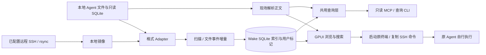

# 10 Wake：会话资料库对 OpenAgentX 的参考价值

## 结论

- **Wake 不是 OpenAgentX 的同类替代品。** 它把本地 Coding Agent 历史变成可搜索、可定位、可交回原工具续接的资料库；其后台工作是索引与同步，不是常驻 Agent Worker、任务队列或业务执行调度。
- **最值得借鉴的是“同一份历史、同一个位置、明确的下一步”。** 搜索索引、正文、MCP 引用共用会话 key 和消息 seq；CLI/MCP 共用查询实现；可续接与不可续接有能力边界。这些方法可减少 OpenAgentX 的旧 Run 误选、结果定位与后续入口分叉。
- **它对未知副作用的局部处理有参考价值。** 文件清理先持久记录 `Moving`，确认后写 `Moved`；中断的 `Moving` 不当作成功，只对已确认移动的记录重试索引事务。这个原则与 OpenAgentX 的 `uncertain` 相容，但不是通用 Agent 任务完成协议。
- **“只读、本地”必须按入口理解。** MCP 工具通过只读连接查询；GUI 的显式删除会移动源文件，CLI `index/refresh` 会写 Wake 索引，启用远程主机会执行 SSH/rsync。把历史交给模型后如何使用，仍由连接的 Agent 决定。
- **本次 136 项原有局部测试通过，证据均为合成数据与临时库。** 包括实际 `wake-mcp` 子进程的 stdio 契约；没有启动 GUI、调用真实 Provider、恢复真实会话、连接远程主机或操作系统回收站，不能称整套产品或真实 Agent E2E 通过。
- **建议借产品契约，不引入第二套执行状态库。** 优先映射既有 A/B/C 批次中的结果定位、明确继续和就绪恢复；跨 Provider 全盘扫描、独立 FTS/MCP 平台、GPUI 客户端与远程镜像均后置。保留 OpenAgentX 的事务、Mailbox、Journal、lease/fencing 和未知副作用不自动重跑边界。

## 1. 固定版本、方法和对照基线

| 项目 | 本次核对 |
|---|---|
| 仓库 | `https://github.com/iAmCorey/Wake` |
| 固定源码 | `269c50b466b023a0f38cc14e34105ab27b983dd2`，提交日期 2026-09-23；workspace 版本 `0.8.1` |
| 本地只读研究副本 | `/tmp/oax-wake-assessment-20260924`；研究后 Git 工作树 clean，保留供复核 |
| 技术形态 | Rust workspace：`wake-core` 数据/CLI/MCP，`wake` GPUI 桌面；macOS 优先，Linux/Windows 在 README 中标 beta |
| 许可证 | MIT，见 [固定版本 LICENSE][license] 和 [本地副本](evidence/wake-LICENSE.txt) |
| 本批预算 | 按 [任务说明](README.md)执行，单项目首轮最多 25 分钟；不部署、不读取用户 Agent 数据、不调用模型，不重跑 OpenAgentX 测试 |

本次直接核对 README、Cargo manifests、数据模型、adapter/scanner/watcher、SQLite、resume、MCP、清理流程与测试/CI。文档中的历史叙述不直接作为当前实现证据：`PRODUCT.md` 仍有旧版本号、四工具等旧描述，`docs/session-cleanup-design.md` 仍写“0.7.0 尚未发布”；本文按固定源码的五个 MCP 工具和已存在清理实现描述，不据旧文档判断发布状态。[产品入口][readme]、[manifest][cargo]、[清理设计][cleanup-design]。

OpenAgentX 对照复用 [上一批总报告](../2026-09-23/00-overall-assessment.md)及模块证据：已安装 Go `6d599ac` / Web `ee46038` 的真实 Chrome → Worker → AGY 连续两项任务与文件独立核验已经贯通，但两项 Task 仍为 `uncertain`；queued/waiting_input 取消、旧 Run 选择、首次 503 后不恢复、ROLE 未确定性注入、网络隐蔽前置已有复现。本批主代理只读刷新确认安装 Go 仍为 `6d599ac`；ADR-006 旁支已到 `d0fd561`，尚未安装。**不能将这些问题写成完全没有实现，也不能把旁支能力算作安装验收。**

## 2. 真实定位与首次用户路径

Wake 的产品目标是“几秒内找到一段过去对话并继续”。输入已经存在于 Claude/Codex 等工具的私有目录；它没有先创建组织、岗位、Task 再派给 Worker 的路径。[README][readme]、[AgentAdapter][adapter]。

| 首次步骤 | 实际实现/限制 | 对 OpenAgentX 的意义 |
|---|---|---|
| 安装后打开主窗 | 构造 Store 与 adapter roster，启动本地扫描；已有配置的远程同步独立运行 | 先交付可见内容和进度；没有历史时说明来源/路径，不让入口空白 |
| 按 Agent / Project 浏览或搜索 | 自有 SQLite 索引；FTS5 trigram，少于 3 字符时降级；命中带 seq，可跳到正文 | 列表、搜索、正文应引用同一结果身份；不需要先扫描所有外部工具 |
| 打开会话 | 通过拥有该路径的 adapter 现场解析源文件，正文过滤 Meta、折叠工具；解析失败显示错误 | “有一条索引记录”与“内容可读”分开，错误不能静默变空白 |
| 点击 Open In | 根据会话类型列出支持的终端/应用或远程 Copy SSH command | 能力来自真实支持范围；不能用一个统一按钮暗示所有 Adapter 都支持 resume |
| CLI/MCP 首次使用 | 索引缺失/版本过旧有明确错误；`wake-cli index` 可首次建库，`refresh` 在 GUI 未持锁时刷新 | 把缺什么、谁负责修复、如何继续做成入口契约 |

[主窗装配][workbench-start]、[正文加载][load-detail]、[CLI 入口][cli-bin]、[resume][resume]。

### 2.1 `resume ok` 不是 Agent 已恢复成功

`resume_args` 按 Agent 生成命令：Codex `resume <id>`、Claude `--resume <id>`、AGY `--conversation=<id>` 等；Hermes 还带 profile。OpenClaw、Kiro、Gemini、WorkBuddy、ZCode 等因没有已支持的按会话续接形制返回 `None`。DeepSeek Harness 则打开 workspace 的 web surface，不能定点跳到该会话。[resume-args][resume-args]

本地路径先找 CLI、检查某些 Provider 必需的 cwd、按终端方言引用参数；失败提供具体原因和手工命令。`ResumeOutcome.ok` 只反映终端/深链启动，远程分支只反映剪贴板写入。**它不消费后续 Provider 输出、会话恢复确认或工作区副作用。** 本轮没有运行其中任何真实命令，不能证明当前所安装 AGY/Codex 的实际 argv 契约兼容。[resume][resume]、[远程命令][ssh-resume]

对 OpenAgentX 可以借“当前支持什么、下一动作是什么”的呈现方式，但终态后的继续仍应通过正式 Control API 建立关联新 Task/SessionBinding，不能直接启动一个游离于 Worker、lease/fencing 与 Journal 之外的 CLI。

## 3. 架构：可重建资料库，不是执行状态机



### 3.1 身份与结果定位

`SessionMeta.key` 为本地 `{agent}:{native_id}`，远程增加 host；`id` 保留原生会话 id 给 resume。`TranscriptMessage.seq` 是搜索与正文定位锚点；`AgentAdapter` 的列表/详情解析共用核心 parser，原有 `seq_contract_holds_for_all_agents` 核对索引单元与正文同号、同角色，关键元数据一致。[模型][models]、[adapter][adapter]、[seq 测试][seq-tests]

这给 OpenAgentX 的直接启示是：最新结果、旧历史、日志跳转、追问来源都用明确 Task/Run/事件身份，不能各页面独立按时间或列表首项猜测。Wake 的 seq 是解析视图中的位置，并没有替代 OpenAgentX 已有 Journal cursor、RunAttempt 和不可变领域身份的保证。

### 3.2 常驻、调度与生命周期

- GUI 活跃时 watcher 阻塞等待文件事件，800ms 去抖；Drop 时停止事件源并 join 线程，避免旧 roster 在新配置后写回已移除来源。事件溢出会申请补扫。[watcher][watcher]
- `SCAN_GATE` 只串行化进程内扫描；跨进程由索引文件锁协调 GUI 与 CLI。CLI `refresh` 可以交给用户自己的 systemd timer/launch agent；Wake 本身没有 Agent 任务调度循环。[scanner][scanner]、[GUI 索引锁][gui-lock]
- MCP 是客户端启动的 stdio 子进程，阻塞读到 EOF；它不索引、不发模型请求、不认领工作。[MCP 装配][mcp]
- JSONL 来源有文件监听；数据库型来源的更新主要靠启动/手动刷新或外部安排的 `refresh`。因此“GUI 常驻”不能推成所有来源都实时。[新鲜度说明][mcp-doc]

不能把上述“后台常驻”当作 OpenAgentX Worker 完成一项后继续领下一项、fencing 防迟到写入或进程取消的证据。

### 3.3 持久化与恢复

自有索引保存 session/messages/FTS、父子关系、memory、收藏/置顶、来源配置、删除墓碑与清理历史。正常重建只清派生数据，保留用户数据；写 session 与搜索单元在事务里完成，副本胜者比较与写入也在同一事务，避免先查后写竞态。[SQLite][db-write]、[DB 测试](evidence/wake-db-roundtrip-tests.txt)

首次建库先在相邻临时库扫描，成功后用不覆盖既有文件的 `hard_link` 占位；中途死掉不会把半成品误认为完整索引。重扫的 `ScanFinale` 在退出/展开异常时发送 `scanning=false`，避免 UI 永远锁在扫描中。这是“每条退出路径都有用户可见收场”的可借鉴方法，不是业务成功判据。[scanner][scanner]

需要保留两处限制：

1. `open_or_rebuild` 遇索引打开失败会保留旧主库到 `.corrupt` 再建库，并明确提示收藏、置顶、来源设置丢失；“一切可重建”只适用于派生历史，不涵盖全部用户状态。[重建实现][db-rebuild]
2. GUI 的 `index_lock::take` 在获取锁本身报错时会记录日志并继续无锁运行。这是资料库的可用性取舍，不能迁入 OpenAgentX 的 lease/fencing/权威写入入口。[GUI 索引锁][gui-lock]

## 4. 角色、记忆与上下文：看到不等于执行时生效

Wake 读取部分 Agent 自有记忆，以及用户/项目级 CLAUDE.md、AGENTS.md、GEMINI.md 等指令文件，提供搜索与 `wake://memory/...` 引用。会话输出默认省略注入的 Meta、工具大块输出/思考按选项展开，分页限制消息数与字符数，来源带 key/seq。[MCP 工具][mcp-tools]、[MCP 文档][mcp-doc]

项目参数按精确路径、最长祖先、子项目集合匹配；未命中不退化成全库搜索。这能降低模型把邻近项目内容当成本项目事实的风险。CLI 将参数转换后交给同一个 `tools::invoke`，不重写一份查询逻辑。[项目匹配][context]、[CLI 入口][cli-bin]

但 Wake 的 `Role` 是历史消息的 user/assistant/system，子 Agent 信息也是已有历史结构；它没有 OpenAgentX 岗位职责、授权或确定性 ROLE 输入注入机制。Skill、MCP initialize instructions、文档中的 SessionStart hook 会鼓励/辅助 Agent 读取历史，**并不证明模型每次都使用了正确版本的角色或上下文**。

若 OpenAgentX 将来提供历史读取，应先利用自己的 Task/Run/Journal 和正式授权范围，输出来源、截断/未知、历史时间与本次输入版本。跨 Provider 历史仅能作为可核对资料，不能把旧对话中的命令升级为当前执行授权，也不能以“文件可搜索”替代本轮 ROLE 实际到达 Adapter 的验收。

## 5. 审批、取消、timeout 与副作用

### 5.1 Agent 执行控制不在它的职责内

Wake 不接管原 Agent 的工具审批、取消、执行超时、模型选择或退出码解释；恢复后由原终端/Agent 管理。其没有 queued/running/waiting_input Task 领域，因此不能直接解决 OpenAgentX 已复现的 queued/waiting_input 取消、Run 终态与 Task `uncertain` 收口问题。

SSH 采用 BatchMode 和 10 秒连接 timeout；rsync 配 120 秒 I/O timeout。同步失败记到 host 状态并继续消费旧缓存；只有可识别的“源在探测与复制之间消失”重探/重试一次。它们是远程资料复制边界，既不是整个作业的统一绝对 deadline，也不是重跑 Agent 任务。[remote][remote]

### 5.2 显式清理是一个值得单独看的小闭环

固定代码的本地清理流程比“只读查看器”多了一条有副作用的用户路径：[清理实现][cleanup]

| 阶段 | 实际处理 | 可借鉴之处 |
|---|---|---|
| 审阅 | adapter 显式允许独立文件，检查完整会话树、共享路径、符号/硬链接、元数据和源快照 | 准入依具体对象能力，不按 Provider 名称笼统开放 |
| 确认后执行 | 移动前生成内容摘要并持久化；每目标先记 `Moving` 再调用 Trash，验证原位置已消失后记 `Moved` | 意图、已尝试、已确认效果分别记录 |
| 取消 | 在下一棵会话树开始前检查取消；不会把未开始的树标为已移动 | 取消作用域明确，取消不等于回滚 |
| 部分失败 | 逐目标保留 Moved/Failed；整树未全部确认则不作完整删除结算 | 不用总体 completed 遮住部分副作用 |
| 崩溃后 | `Moving` 保持歧义；`retry_index_updates` 只处理持久确认为 Moved 的记录 | **补记账不等于重做外部动作** |
| 用户在系统恢复后 Check | 核对路径、类型、长度、内容摘要和会话，再清除属于该批次的墓碑；旧日志证据较弱 | 恢复也要核验对象与版本，不能只看文件重新出现 |

原有 29 项合成文件测试在本次通过，包括取消、部分失败、索引冲突重试、同大小同时间替换、较晚删除不能被旧恢复清除；使用 fake Trash/临时移动，**没有验证本机系统回收站**。[测试输出](evidence/wake-cleanup-tests.txt)

建议只借“有限确认规则 + 未知保持未知 + 回报/记账可重试”的思想。OpenAgentX 已有事务和 Journal，不应照搬 Wake 的 pref JSON 日志另建第二条权威状态链；动作核验仍与 ADR-006 旁支和既有 A/B 批次对齐。

## 6. 观察、体验与真实边界

源码中的信息架构围绕 Agent/项目范围、会话列表和正文三栏，搜索可直接定位消息；工具调用折叠，来源/模型/主机保留标识；不支持的 resume 不出无效入口，找不到 CLI/cwd 给可理解原因。[DESIGN][design]、[主窗][workbench]

还有三个适合 OpenAgentX 的小方法：

- 异步分页携带 generation，迟到响应不能覆盖新范围；失败停住，避免触底无限重试。这与 Web 旧结果/恢复竞态的治理方向一致，但不能直接作为首次 SSE 503 自动恢复实现。[分页][pagination]
- CLI/MCP 返回索引覆盖到的最新会话活动时间；正文现场读源文件，远程正文只反映最近镜像。**最大活动时间不是最近一次完整扫描成功时间，也不是每个来源都已新鲜的证明**；OpenAgentX 的在线/readiness/snapshot freshness 应继续分开。[latest_activity][freshness]
- setup/查询失败直接说明索引未建、版本过旧、来源关闭或文件不可读；路径修复发生在相应入口，不让用户猜测后台步骤。[MCP open][mcp-open]、[CLI][cli-bin]

隐私边界也应如实呈现：读取源 SQLite 的代码以只读方式打开，必要时复制三件套到临时目录再读；远程按会话/侧档白名单同步，排除已知凭据文件。这不证明任意 transcript 都不含秘密，也不能保证并发复制远程 DB/WAL 得到事务级快照。[SQLite 读取][sqlite-ro]、[remote][remote]

另一个实现细节是：MCP 工具以只读连接工作，但默认索引路径解析会创建 Wake 数据目录，旧 `vibex` 索引存在时还会作本地迁移复制；不能把“查询只读”扩大成“进程绝无文件写入”。[默认路径实现][default-path]

MCP 是本地 stdio，不自行发送模型请求；但工具返回全文后，调用它的 Agent 可能把内容送到其 Provider。OpenAgentX 若接入类似能力，须沿用原有权限/脱敏/资源范围，不能拿“本地只读”推导“无数据外发”或给所有 Agent 开全机历史。

**本轮未启动桌面应用，也没有真实浏览器/GPUI 交互证据。** 上述为源码设计判断，不评价实际流畅度、键盘可达性、跨平台原生体验或移动适用性；OpenAgentX 当前 Web/PWA/Console 已足够承载对应改进。

## 7. 测试到底证明什么

### 7.1 本次实际命令与结果

环境：Rust `1.89.0`、Cargo `1.89.0`、Linux；先读 `scripts/test.sh`，未运行其 `--smoke`（会扫描真实用户数据）。首个原 workspace 命令：

```text
cargo test -p wake-core --locked --offline --test db_roundtrip
```

退出 101，尚未编译测试：workspace 解析需要本地没有的 GPUI git 依赖。没有反复尝试全量 GUI 构建；改用 `/tmp/oax-wake-core-tests-20260924`，原样复制整个 `wake-core`，根 workspace 只移除 `crates/wake` 成员。依赖只下载公开 Rust crates，不访问用户凭据、模型或第三方账号。副本源文件 SHA-256 全部一致，裁剪后的 lock 没有新增 package identity；只是 911 个锁定包减少为 129 个，未替换核心依赖版本。[初次失败](evidence/wake-test-initial-failure.txt)、[副本清单](evidence/wake-test-copy-manifest.json)、[workspace](evidence/wake-test-workspace.toml)、[lock 比对](evidence/wake-test-lock-compare.json)

| 原有测试命令（裁剪 workspace） | 实际结果 | 边界 |
|---|---|---|
| `cargo test -p wake-core --test db_roundtrip` | exit 0，34 passed | 临时 SQLite，搜索 seq、事务/墓碑、重建用户数据、排序、锁与源配置 |
| `cargo test -p wake-core --offline --test adapter_contracts --test mcp_stdio` | exit 0，71 + 2 passed | 合成 Agent 文件/SQLite；实际 MCP binary/stdin/stdout；无模型/真实用户数据 |
| `cargo test -p wake-core --offline --lib cleanup::tests:: -- --skip system_trash_cleanup_round_trip` | exit 0，29 passed，106 filtered out | cleanup 局部测试，fake Trash/临时文件；排除系统回收站 |

合计 136 项通过。完整输出：[DB](evidence/wake-db-roundtrip-tests.txt)、[Adapter/MCP](evidence/wake-adapter-mcp-tests.txt)、[Cleanup](evidence/wake-cleanup-tests.txt)。源证据见 [摘录](evidence/wake-source-excerpts.txt)，来源与环境见 [provenance](evidence/wake-provenance.json)。没有修改第三方源码/测试来使其通过，也没有因此宣称原 workspace 全套构建通过。验证后已删除临时 core 测试副本与构建产物，三个测试命令均已结束；固定 clean clone 保留，本次没有启动服务。

### 7.2 上游测试与 CI

| 测试层 | 固定源码的实际边界 | 本次运行 |
|---|---|---|
| Adapter contracts | 合成 fixtures、临时假 home/SQLite；多 Provider 解析语义，不是 Provider 调用 | 71 项 |
| MCP stdio “end-to-end” | 合成扫描 → 实际 `wake-mcp` 子进程 → JSON-RPC；核对定位、分页、错误与库字节不变 | 2 项 |
| CLI “end-to-end” | 实际 CLI 子进程与共用工具输出逐字节比对；仍为合成历史 | 未跑 |
| Scanner finale | fake adapter/临时 Store，退出事件、解析失败、重复来源与关系恢复 | 未跑 |
| Remote pipeline “end-to-end” | **fake SSH + 真 rsync + 合成远端**；另有 `#[ignore]` 且需 `WAKE_LIVE_REMOTE_HOST` 的真实主机用例 | 都未跑 |
| Cleanup | 默认 fake 文件移动；独立 ignored 系统 Trash 往返测试只用合成文件 | 仅上述 29 项 |
| UI | 除纯逻辑测试外，`#[gpui::test]` 使用 TestAppContext/VisualTestContext 模拟窗口点击/选区 | 未跑；不能说仓库只有静态 UI 检查，也不能当原生人工验收 |
| CI | macOS/Ubuntu/Windows：fmt、core test、app test/build；Linux/Windows 显式系统 Trash fixture；macOS 另编译 Intel target | 仅读 workflow；未查当前 Actions run 或 pass/skip 明细 |

固定来源：[CI][ci]、[测试脚本][test-script]、[MCP 用例][mcp-tests]、[CLI 用例][cli-tests]、[remote 用例][remote-tests]、[GPUI 用例][ui-tests]。

Wake 没有调用 Provider 的主业务，因此没有真实模型任务 E2E 不能按 OpenAgentX 的执行产品标准直接判为缺陷；同样，解析支持十九种 Agent 也绝不等于十九种执行 Adapter、审批与 resume 都得到真实验证。

## 8. 复杂度与许可证

`wake-core` 与 UI 两 crate 分界有效：本次能独立验证核心，不必引入 GPUI。但固定源码 `workbench.rs` 9,639 行、`db.rs` 3,285 行、`cleanup.rs` 2,349 行，十九家私有历史格式/平台终端/数据库兼容仍有真实维护成本；行数只说明边界集中度，不是缺陷判据。库的核心价值在于始终围绕“找回历史”收敛，而非抽象层越少越好。

如果 OpenAgentX 全量接入 Wake 式外部历史，会立即新增格式漂移、历史敏感内容、源新鲜度、跨 host 身份和权限映射成本，却不能先解决 queued 取消与任务完成。这不是当前最短路径。其手写同步 MCP 子集也只应在工具范围稳定时参考，不能为统一而替换已有协议栈。[manifest][cargo]、[MCP][mcp]

许可证是 MIT，允许使用、修改和分发，复制实质代码时需保留版权与许可声明；上游依赖与品牌图标不自动由这份许可覆盖。本次只产出研究文档与验证证据，没有向 OpenAgentX 产品移植实现、安装 Wake 或使用其品牌资产。[LICENSE][license]

## 9. 借鉴裁决与前三个小结果

| 裁决 | 内容 | 最小处置或重新评估触发条件 |
|---|---|---|
| 可立即借鉴方法 | 统一结果身份、来源锚点、能力驱动动作、失败原因与恢复入口 | 直接融入既有 A/B/C，不新建平台 |
| 可借思想 | 历史和正文共用查询语义、上下文有界读取、项目不匹配不放大范围 | 先基于 OAX 自己的授权 Task/Run/Journal；确有跨 Agent 历史需求才评估外部源 |
| 可借有限机制 | 逐对象效果证据、取消作用域、未知状态不重做、仅重试记账 | 对接既有完成/取消事务；先确认具体丢回报窗口，不另起通用恢复框架 |
| 不直接迁入 | 可重建索引替代权威 DB、GUI 无锁退化、打开终端即报告任务成功 | 不满足 OAX 的可靠执行/安全/效果语义 |
| 后置 | 全盘历史扫描、第二份 FTS 状态库、远程会话镜像、整套 MCP/GPUI/Insights | 核心 A/B/C 收口后，出现明确用户历史检索需求与授权模型再裁决 |

按上一批总报告 A/B/C 排序，下面是建议，**不是本次已实施或获准部署的修复**：

1. **结果能定位、当前与历史不会串（A/B）。** 把 Task 当前 Run、当前回复和日志锚点作为一份共同投影；旧历史可跳回对应执行，不按列表默认顺序选结果。触发是已复现旧 Run 误选；不做会让用户依据错误结果继续操作。最小验收：真实两轮回复明确不同，Web/Console 都展示第二轮；第一轮仍可追溯；刷新与迟到响应不回退，Journal/Run 对应一致。
2. **继续动作说明实际支持与上下文来源（B）。** 终态后通过正式入口创建关联新 Task，明确是复用实际 Provider session，还是带授权历史新开；角色输入仍要确定性装配，不能以 Wake 式“可搜索 ROLE 文件”替代。触发是完成后追问入口不成立；不做会逼用户绕开 Worker。验收：正式 wrapper/model/cwd 下完成后继续，关联/输入来源可追溯；不支持 resume 明示；只读/文件效果按 ADR-006 与独立核验判定，未知不重跑。
3. **overview/首次就绪与恢复有明确下一步（C）。** 借 Wake 的来源状态、缺前置条件提示和新鲜度分层，让 OAX overview/任务入口展示真实 readiness、当前阻断与恢复动作；沿用既有网络 test/publish/ack 和 SSE。触发是空 overview、隐蔽网络前置和初连 503；不做会形成“已发但不会动”的体验。验收：未预埋网络的新用户知道缺哪一步；配置后能执行；首连短暂 503 恢复后重取权威快照且不重复提交，陈旧结果不伪装实时。

取消与未知效果仍按 A/B 的既有优先级处置；Wake 的清理例子只补充验收思想，不因其 FTS/MCP 能力成熟而把跨 Provider 历史接入排到这些已确认阻断之前。

## 下一步

1. 主代理集中复核本报告固定引用、136 项测试边界与 A/B/C 对应，和 OpenHarness/Paseo/Multica 一起形成取舍；本研究不追加产品修复。
2. 下一实现批只选一个已确认用户结果，用真实支持的 AGY 路径验收 Task/Run/Journal 与实际效果；Wake 原生体验、真实 resume/SSH/回收站和完整构建若将来采用再单独验证。

[readme]: https://github.com/iAmCorey/Wake/blob/269c50b466b023a0f38cc14e34105ab27b983dd2/README.md#L11
[cargo]: https://github.com/iAmCorey/Wake/blob/269c50b466b023a0f38cc14e34105ab27b983dd2/Cargo.toml#L1
[license]: https://github.com/iAmCorey/Wake/blob/269c50b466b023a0f38cc14e34105ab27b983dd2/LICENSE#L1
[adapter]: https://github.com/iAmCorey/Wake/blob/269c50b466b023a0f38cc14e34105ab27b983dd2/crates/wake-core/src/adapters/mod.rs#L31
[models]: https://github.com/iAmCorey/Wake/blob/269c50b466b023a0f38cc14e34105ab27b983dd2/crates/wake-core/src/models.rs#L215
[seq-tests]: https://github.com/iAmCorey/Wake/blob/269c50b466b023a0f38cc14e34105ab27b983dd2/crates/wake-core/tests/adapter_contracts.rs#L1952
[workbench-start]: https://github.com/iAmCorey/Wake/blob/269c50b466b023a0f38cc14e34105ab27b983dd2/crates/wake/src/workbench.rs#L2524
[load-detail]: https://github.com/iAmCorey/Wake/blob/269c50b466b023a0f38cc14e34105ab27b983dd2/crates/wake/src/workbench.rs#L1563
[cli-bin]: https://github.com/iAmCorey/Wake/blob/269c50b466b023a0f38cc14e34105ab27b983dd2/crates/wake-core/src/bin/wake_cli.rs#L1
[resume-args]: https://github.com/iAmCorey/Wake/blob/269c50b466b023a0f38cc14e34105ab27b983dd2/crates/wake-core/src/services/terminal/mod.rs#L151
[resume]: https://github.com/iAmCorey/Wake/blob/269c50b466b023a0f38cc14e34105ab27b983dd2/crates/wake-core/src/services/terminal/mod.rs#L267
[ssh-resume]: https://github.com/iAmCorey/Wake/blob/269c50b466b023a0f38cc14e34105ab27b983dd2/crates/wake-core/src/services/terminal/mod.rs#L232
[watcher]: https://github.com/iAmCorey/Wake/blob/269c50b466b023a0f38cc14e34105ab27b983dd2/crates/wake-core/src/watcher.rs#L12
[scanner]: https://github.com/iAmCorey/Wake/blob/269c50b466b023a0f38cc14e34105ab27b983dd2/crates/wake-core/src/scanner.rs#L35
[gui-lock]: https://github.com/iAmCorey/Wake/blob/269c50b466b023a0f38cc14e34105ab27b983dd2/crates/wake/src/index_lock.rs#L1
[db-write]: https://github.com/iAmCorey/Wake/blob/269c50b466b023a0f38cc14e34105ab27b983dd2/crates/wake-core/src/db.rs#L705
[db-rebuild]: https://github.com/iAmCorey/Wake/blob/269c50b466b023a0f38cc14e34105ab27b983dd2/crates/wake-core/src/db.rs#L342
[mcp]: https://github.com/iAmCorey/Wake/blob/269c50b466b023a0f38cc14e34105ab27b983dd2/crates/wake-core/src/mcp/mod.rs#L1
[mcp-open]: https://github.com/iAmCorey/Wake/blob/269c50b466b023a0f38cc14e34105ab27b983dd2/crates/wake-core/src/mcp/mod.rs#L224
[mcp-tools]: https://github.com/iAmCorey/Wake/blob/269c50b466b023a0f38cc14e34105ab27b983dd2/crates/wake-core/src/mcp/tools.rs#L1111
[mcp-doc]: https://github.com/iAmCorey/Wake/blob/269c50b466b023a0f38cc14e34105ab27b983dd2/docs/mcp.md#L118
[context]: https://github.com/iAmCorey/Wake/blob/269c50b466b023a0f38cc14e34105ab27b983dd2/crates/wake-core/src/services/context.rs#L8
[cleanup-design]: https://github.com/iAmCorey/Wake/blob/269c50b466b023a0f38cc14e34105ab27b983dd2/docs/session-cleanup-design.md#L1
[cleanup]: https://github.com/iAmCorey/Wake/blob/269c50b466b023a0f38cc14e34105ab27b983dd2/crates/wake-core/src/cleanup.rs#L713
[remote]: https://github.com/iAmCorey/Wake/blob/269c50b466b023a0f38cc14e34105ab27b983dd2/crates/wake-core/src/remote.rs#L273
[design]: https://github.com/iAmCorey/Wake/blob/269c50b466b023a0f38cc14e34105ab27b983dd2/DESIGN.md#L1
[workbench]: https://github.com/iAmCorey/Wake/blob/269c50b466b023a0f38cc14e34105ab27b983dd2/crates/wake/src/workbench.rs#L5179
[pagination]: https://github.com/iAmCorey/Wake/blob/269c50b466b023a0f38cc14e34105ab27b983dd2/crates/wake/src/workbench.rs#L885
[freshness]: https://github.com/iAmCorey/Wake/blob/269c50b466b023a0f38cc14e34105ab27b983dd2/crates/wake-core/src/db.rs#L692
[sqlite-ro]: https://github.com/iAmCorey/Wake/blob/269c50b466b023a0f38cc14e34105ab27b983dd2/crates/wake-core/src/adapters/sqlite_ro.rs#L19
[ci]: https://github.com/iAmCorey/Wake/blob/269c50b466b023a0f38cc14e34105ab27b983dd2/.github/workflows/ci.yml#L1
[test-script]: https://github.com/iAmCorey/Wake/blob/269c50b466b023a0f38cc14e34105ab27b983dd2/scripts/test.sh#L1
[mcp-tests]: https://github.com/iAmCorey/Wake/blob/269c50b466b023a0f38cc14e34105ab27b983dd2/crates/wake-core/tests/mcp_stdio.rs#L1
[cli-tests]: https://github.com/iAmCorey/Wake/blob/269c50b466b023a0f38cc14e34105ab27b983dd2/crates/wake-core/tests/cli.rs#L1
[remote-tests]: https://github.com/iAmCorey/Wake/blob/269c50b466b023a0f38cc14e34105ab27b983dd2/crates/wake-core/tests/remote_sync.rs#L1
[ui-tests]: https://github.com/iAmCorey/Wake/blob/269c50b466b023a0f38cc14e34105ab27b983dd2/crates/wake/src/workbench.rs#L1845

[default-path]: https://github.com/iAmCorey/Wake/blob/269c50b466b023a0f38cc14e34105ab27b983dd2/crates/wake-core/src/db.rs#L3264
