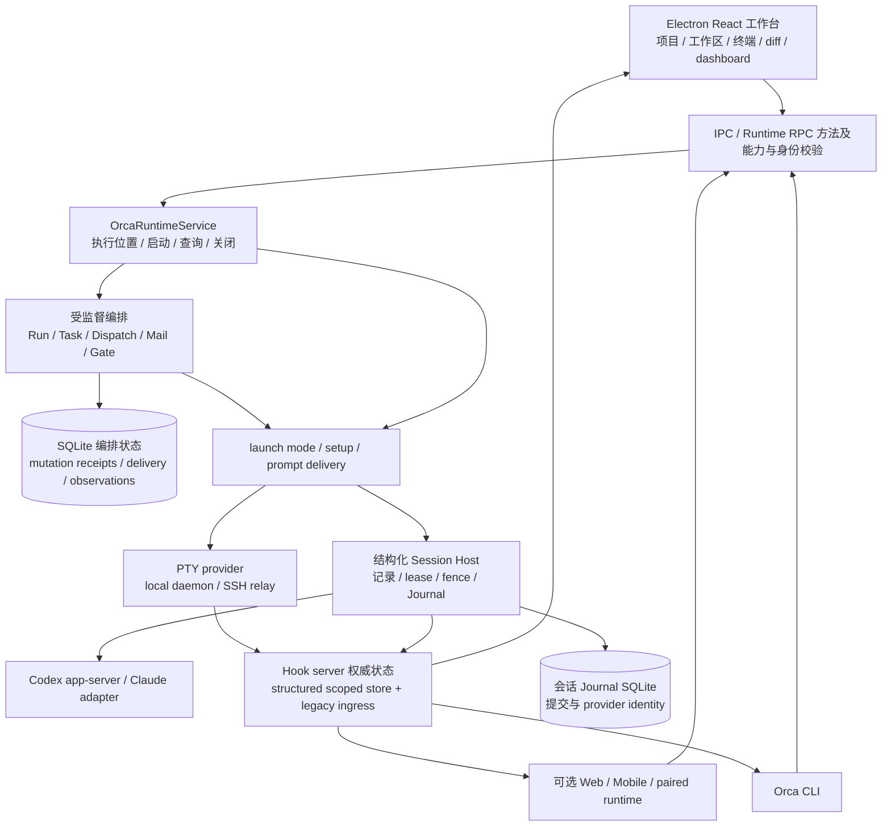

# 11 Orca 固定源码对照研究

## 结论

- **Orca 首先是围绕项目、worktree 和 Agent 会话组织的开发工作台，同时已有实质性的编排控制面。** 它把编辑、终端、diff、任务来源和继续对话放在同一上下文里；不能简化成“只有 PTY 外壳”，也不能把普通会话默认视为受监督 Task。
- **最有价值的参考是执行证据与用户动作的接线。** 精确 Dispatch/进程归属、停止未确认、`finished_unverified`、未知提交不自动重发、结束后的复用或归档，都与 OpenAgentX 当前 A/B/C 的缺口直接相关。
- **它没有证明“完成标签就是业务效果”。** `worker_done` 有身份、事务和冲突校验，接受后可以结算 Task；报告内容及文件变更是否满足用户目标仍需外部判断。其进程、turn、产物和报告证据的分离值得借鉴，不能把报告自述提升为 OAX 的 mutation（有副作用任务）核验。
- **核心实现厚实，但复杂度也很高，且收敛仍在进行。** PTY 与结构化会话、多个入口和执行主机、legacy 编排兼容、原生桌面/移动/浏览器/远程同时存在。状态存储处于明确的 PR 2A 边界，统一启动执行器也尚未覆盖所有入口；这些不是再给 OAX 增设一套平台的理由。
- **本轮只有源码研究与隔离测试。** 11 个原有测试文件、112 项断言通过；另一个 preamble 套件因最小运行器缺依赖未收集，首轮也保留配置依赖失败。未启动 Orca UI、真实 Provider、远程或移动链，不能宣布体验、整套 E2E 或发布质量优于 OAX。

## 1. 固定对象、证据与非目标

| 项目 | 本轮值 |
|---|---|
| 用户指定仓库 | `https://github.com/stablyai/orca` |
| 固定 HEAD | `122b8c25d7c16f76e395bf9a65887d7c4bc5003b` |
| commit 时间/说明 | `2026-09-24T00:50:03-07:00`；`fix(terminal): let Linux IMEs keep the candidate key for a preedit they own (#22607)` |
| 声明版本 | `orca 1.4.197`；Node `24`、pnpm `12.0.0` |
| 研究副本 | `/tmp/oax-orca-assessment-20260925`；shallow clone，固定 HEAD，未修改 tracked 文件 |
| 有界验证运行器 | `/tmp/oax-orca-test-runner-20260925`，独立 npm 依赖；Node `24.13.0`、Vitest `4.1.11` |
| OAX 比较基线 | [总体评估](../2026-09-23/00-overall-assessment.md)、[OpenHarness/Wake](../2026-09-24/README.md)。主代理本次只读刷新安装 Go 仍 `6d599ac`，Web 沿用 `ee46038`；ADR-006 旁支 `d0fd561` 未安装。没有把旁支或前批测试当成本批交付 |

研究遵守本批 [README](README.md) 的范围和停止预算；没有运行 installer、应用构建、真实账号登录/模型调用、用户会话扫描，也没有改 OAX 产品、配置、数据库、正式服务或冻结 ADR。源码链接全部固定到上列 commit，不使用浮动 `main`。来源/测试文件 SHA-256 及命令见 [manifest](evidence/orca-provenance.json)、[源码摘录](evidence/orca-source-excerpts.txt) 和[验证说明](evidence/orca-check-commands.md)。

## 2. 产品定位与第一次使用

README 的中心承诺是把 Codex、ClaudeCode、OpenCode、Pi 等 CLI Agent 放在并行 worktree 中，同时提供终端分屏、源码编辑、diff 批注、浏览器设计选择器、GitHub/Linear、SSH 和手机伴随入口。它服务的最小动作是“选项目和 Agent，开始一段工作，查看变化并继续”，不是先建立组织结构。README 的“任何 CLI”仅说明终端可承载，不能推出每个 Agent 都有等价状态、审批、结构化历史和恢复能力。[产品入口](https://github.com/stablyai/orca/blob/122b8c25d7c16f76e395bf9a65887d7c4bc5003b/README.md#L20-L186)

首次使用从默认 Agent、主题、可选集成、Windows 终端、通知进入添加首个项目。已检测 Agent 优先显示；未安装仍允许选作默认，并明确提示稍后安装或使用空终端。这里减轻了入口压力，但“已选默认 Agent”不等于已认证、模型可用或能完成任务。GitHub 提示只对 GitHub 项目出现，Git 被作为工作区管理硬依赖；用户不必为 GitLab 路径先配置 GitHub。[步骤](https://github.com/stablyai/orca/blob/122b8c25d7c16f76e395bf9a65887d7c4bc5003b/src/renderer/src/components/onboarding/use-onboarding-flow-types.ts#L1-L14)、[Agent 提示](https://github.com/stablyai/orca/blob/122b8c25d7c16f76e395bf9a65887d7c4bc5003b/src/renderer/src/components/onboarding/AgentStep.tsx#L67-L133)、[预检](https://github.com/stablyai/orca/blob/122b8c25d7c16f76e395bf9a65887d7c4bc5003b/src/renderer/src/components/landing-preflight-issues.ts#L31-L82)

| 用户动作 | 源码接线 | 对体验的含义与边界 |
|---|---|---|
| 添加项目/选 Agent/输入工作 | composer 检查项目、连接、setup、禁用 Agent、错误与取消；随后进入创建 | 依赖条件在开始处消费，失败可保留原因；没有实测首次认证失败后恢复 |
| 创建 worktree 或文件夹工作区 | launch 根据设置与执行主机能力选择 PTY/structured；新工作区先建好才能询问 host | 支持能力拒绝可以给明确降级回执，不假装所有模式等价 |
| 观察工作 | sidebar/dashboard 关联工作区与 Agent 状态，任务 ID 可指向当前 Dispatch 终端 | 把任务和执行位置连起来；不是靠 tab 标题判业务成功 |
| 查看修改并继续 | 同工作区内终端/实验 Chat UI、diff、批注、结果与 follow-up | 产品信息架构有连续性；未实测 DOM、按键、390px、离线或重连 |
| 受监督协作 | 显式启用实验 orchestration，Run→Task→worker-start→check/ack→worker_done→复用/释放 | 普通 terminal send 与受监督工作区分，避免每个一句话任务都承担整套 DAG 成本 |

[任务导航实现](https://github.com/stablyai/orca/blob/122b8c25d7c16f76e395bf9a65887d7c4bc5003b/src/renderer/src/components/terminal-pane/terminal-orchestration-task-links.ts#L51-L75)、[composer](https://github.com/stablyai/orca/blob/122b8c25d7c16f76e395bf9a65887d7c4bc5003b/src/renderer/src/hooks/composer-state/full-submit-orchestration.ts#L57-L118)、[模式选择](https://github.com/stablyai/orca/blob/122b8c25d7c16f76e395bf9a65887d7c4bc5003b/src/main/agent-launch/agent-launch-mode.ts#L1-L97)、[实验编排使用方式](https://github.com/stablyai/orca/blob/122b8c25d7c16f76e395bf9a65887d7c4bc5003b/docs/site/content/docs/cli/orchestration.mdx#L8-L104)。全新设置中 `experimentalNativeChat`、`experimentalStructuredNativeChat` 和 `nativeChatResumeWorkOnRestart` 均为 false；因此本报告不会把结构化会话与自动重启继续当成默认新用户能力。[默认值](https://github.com/stablyai/orca/blob/122b8c25d7c16f76e395bf9a65887d7c4bc5003b/src/shared/default-global-settings.ts#L130-L143)

## 3. 实际架构与装配

这张图表示固定源码中已接线的职责，**不表示所有分支默认开启或本次已运行**。`initializeMainProcessRuntime` 注入 local/SSH provider、hook status snapshot、structured status sink、claim signer 和远程 transport；RPC methods 总表同时注册 orchestration 与 structured session。[主进程装配](https://github.com/stablyai/orca/blob/122b8c25d7c16f76e395bf9a65887d7c4bc5003b/src/main/startup/main-process-runtime-service.ts#L45-L128)、[方法表](https://github.com/stablyai/orca/blob/122b8c25d7c16f76e395bf9a65887d7c4bc5003b/src/main/runtime/rpc/methods/index.ts#L45-L80)

结构化分支有真实 Host/Adapter 装配，不能被较旧的 “Chat UI 是 PTY transcript 外壳”文档覆盖：运行时按需创建 record store、Journal、Codex adapter、Claude adapter/router、owner probe，并暴露带能力门禁的 `agentSession.*`。[host 装配](https://github.com/stablyai/orca/blob/122b8c25d7c16f76e395bf9a65887d7c4bc5003b/src/main/runtime/structured-agent-session-runtime.ts#L1-L126)、[RPC 门禁](https://github.com/stablyai/orca/blob/122b8c25d7c16f76e395bf9a65887d7c4bc5003b/src/main/runtime/rpc/methods/structured-agent-session.ts#L1-L145)。PTY Chat UI 与独立结构化执行是不同路径，实验开关、平台、命令覆盖和执行主机支持均会影响实际选择。

编排不是 renderer 临时数组：`OrchestrationDb` 使用 SQLite WAL、busy timeout、schema 迁移与文件权限加固；Run、Task、Dispatch、worker resource、mailbox delivery、mutation receipt 和 attempt observation 有持久化契约。[DB 初始化](https://github.com/stablyai/orca/blob/122b8c25d7c16f76e395bf9a65887d7c4bc5003b/src/main/runtime/orchestration/db/orchestration-db.ts#L1-L50)

## 4. 角色、上下文与衔接

受监督 worker 在接收业务 spec 前会收到具体 preamble：Task ID、Dispatch ID、coordinator/worker handle、生命周期 capability、准确 CLI、结果回报、heartbeat、ask 和读取 follow-up 的规则。Task+Dispatch 双归属防止旧轮报告/heartbeat结束或刷新新尝试；嵌套派发提示由 depth cap 决定。相同 preamble 分别经 PTY prompt delivery 或 structured session send 送入实际执行路径，而不是只把“角色”存到配置里。[preamble](https://github.com/stablyai/orca/blob/122b8c25d7c16f76e395bf9a65887d7c4bc5003b/src/main/runtime/orchestration/preamble.ts#L6-L162)、[正式投递](https://github.com/stablyai/orca/blob/122b8c25d7c16f76e395bf9a65887d7c4bc5003b/src/main/runtime/rpc/methods/orchestration/worker/deliver-worker-dispatch-preamble.ts#L13-L63)

这是“协调者/派发 worker/普通终端 Agent”职责和协议的接线，不等于实现了任意企业岗位、组织 RBAC 或模型必然遵守的行为约束。preamble 对模型的“报告恰好一次”提示本身不是幂等保证；必须连同数据库身份、事务和回执看。模型/effort 支持由实际 Agent 和 host 决定；不能因 CLI schema 接受就宣称所有 provider 等价支持。

续接分两层。普通 Session 继续发消息；监督工作在接受 `worker_done` 后，prompt-returning Agent 应回到空闲 prompt，下一次接收新 preamble/TASK，不循环轮询旧任务。终端可以复用，也可以先归档再释放。用户可读 worker 输出与“进程仍占资源”分离，完成后的 cleanup 不必牺牲结果可访问性。[完成后规则](https://github.com/stablyai/orca/blob/122b8c25d7c16f76e395bf9a65887d7c4bc5003b/src/main/runtime/orchestration/preamble.ts#L164-L230)、[worker release](https://github.com/stablyai/orca/blob/122b8c25d7c16f76e395bf9a65887d7c4bc5003b/src/main/runtime/rpc/methods/orchestration/worker/worker-release-completion.ts#L20-L116)

对 OAX 的意义：把“角色真的进了 Runtime”“本轮回复属于哪次尝试”“继续形成哪项工作”一起验收。不要新增与 Task/RunAttempt 并行的 Orca Run/Dispatch 存储。

## 5. 任务结果、幂等与误报成功边界

| 层次 | Orca 实际判定 | 不能提升成什么 |
|---|---|---|
| 进程或 turn 结束 | `projectAttemptOutcome` 在没有 accepted worker report 时给 `finished_unverified` | 用户工作已成功 |
| Artifact/Git 观察 | 与 process/turn、liveness、worker report、coordinator ack 分 facet 保存 | 文件满足需求；或当前尝试确实完成 push |
| accepted worker report | 可把 attempt 投影为 succeeded/failed | 独立核验过模型报告的真实性 |
| Task 结算 | Task/Dispatch 归属、活跃 sibling、过期 Dispatch 与重复报告校验；事务/savepoint更新 | 对任意外部系统副作用实现 exactly-once |
| 请求重复 | caller fingerprint + request ID + method/payload hash；相同输入可回放receipt，不同输入拒绝 | 收到响应前所有外部写都可安全重试 |

[attempt outcome](https://github.com/stablyai/orca/blob/122b8c25d7c16f76e395bf9a65887d7c4bc5003b/src/main/runtime/orchestration/db/attempt-outcome-projection.ts#L72-L159)、[worker report 结算](https://github.com/stablyai/orca/blob/122b8c25d7c16f76e395bf9a65887d7c4bc5003b/src/main/runtime/orchestration/db/dispatch-context/worker-report-settlement.ts#L55-L228)、[durable mutation executor](https://github.com/stablyai/orca/blob/122b8c25d7c16f76e395bf9a65887d7c4bc5003b/src/main/runtime/rpc/orchestration-mutation-executor.ts#L46-L157)

它有比“终端 idle→完成”强得多的模型：没有报告时保留未核实、存在并行活跃 sibling 时不把单次成功投影为整个 Task 成功。但其 `succeeded` 仍接受通过生命周期校验的 worker 自报，报告中的 `files-modified` 或产物信息不能自动证明业务正确。这正适合给 OAX 的 ADR-006 提供呈现和归属例子，不应取代 OAX query/mutation（有副作用任务） 的有限结算规则。

## 6. 取消、审批、超时

**worker-stop 是当前最直接的 A 类参考。** 它先记录 stopping，检查 exact worker identity 和 resource ownership，然后关闭对应终端；PTY close 返回 `ptyKilled=false` 会保留 `stop_unknown`，结构化 worker 同样要求已证明退出。远程 stop 先检查对端 verdict capability，并绑定 pairing revision；断线、异常、能力缺失都不能推断“已经停掉”。同 runtime 对同 Dispatch 的并发 stop 会合并，进程退出与 close 竞态有状态再读。[停止实现](https://github.com/stablyai/orca/blob/122b8c25d7c16f76e395bf9a65887d7c4bc5003b/src/main/runtime/rpc/methods/orchestration/worker/worker-stop.ts#L15-L272)、[持久停止事务](https://github.com/stablyai/orca/blob/122b8c25d7c16f76e395bf9a65887d7c4bc5003b/src/main/runtime/orchestration/db/worker-dispatch/worker-dispatch-stop.ts#L34-L150)

特殊的 context-only Dispatch 没有受监督进程所有权，停止可以只释放 assignment，但返回明确 warning，不能把该 receipt读成进程停止。`worker-release` 是已结算 worker 的资源回收，先核 identity、归档输出、复查 lease，再关闭；`release_pending`/`release_unknown` 保留恢复说明。它不是用“完成后自动关掉所有终端”代替资源归属。[release](https://github.com/stablyai/orca/blob/122b8c25d7c16f76e395bf9a65887d7c4bc5003b/src/main/runtime/rpc/methods/orchestration/worker/worker-release-completion.ts#L112-L320)

结构化 Codex turn cancel 会等待 `turn/interrupt` 回执和本轮进程处置，期间暂存 completion 通知；失败后恢复正常 completion 路径，不永久吞掉结束事件。这是实现策略的源码证据，**本次没调用真实 Codex，也未验证其所有子进程/平台场景**。[turn cancellation](https://github.com/stablyai/orca/blob/122b8c25d7c16f76e395bf9a65887d7c4bc5003b/src/main/codex/codex-structured-turn-cancellation.ts#L91-L171)

审批不是只有开关：Codex 有 command/file approval 与多问题输入的 registry，限制 decision 集合和回答归属，过期 claim 拒绝，发送前 forget 防重复应答。编排 decision gate 则由 Run/coordinator 身份约束，不能把模型工具审批与业务问题 gate 混为一谈。[prompt 回复](https://github.com/stablyai/orca/blob/122b8c25d7c16f76e395bf9a65887d7c4bc5003b/src/main/codex/codex-structured-prompt-replies.ts#L26-L121)、[gate](https://github.com/stablyai/orca/blob/122b8c25d7c16f76e395bf9a65887d7c4bc5003b/src/main/runtime/rpc/methods/orchestration/gates/gates.ts#L86-L167)

然而全新 TUI 默认 `DEFAULT_TUI_AGENT_ARGS = YOLO_TUI_AGENT_ARGS`，含 Claude 的 `--dangerously-skip-permissions`、Codex 的 `--dangerously-bypass-approvals-and-sandbox`；Manual 写入空参数能覆盖默认。Onboarding 也暴露该选项且默认 true。**这是已确认的默认产品取舍，不建议迁入 OAX。** 工作区/worktree 隔离只是路径与 Git 工作隔离，不等于 OS sandbox。[默认参数](https://github.com/stablyai/orca/blob/122b8c25d7c16f76e395bf9a65887d7c4bc5003b/src/shared/tui-agent-launch-defaults.ts#L12-L20)、[解析与覆盖](https://github.com/stablyai/orca/blob/122b8c25d7c16f76e395bf9a65887d7c4bc5003b/src/shared/tui-agent-launch-defaults.ts#L114-L156)、[YOLO 映射](https://github.com/stablyai/orca/blob/122b8c25d7c16f76e395bf9a65887d7c4bc5003b/src/shared/tui-agent-permissions.ts#L1-L40)

超时也按阶段区分：worker start 的 timeout/setup/readiness 有回执；无法确认投递时写 `start_unknown` 并把 Task 阻塞，给 show/abandon 导航。ask 等待 timeout 不删除持久问题，要求拿原 message ID resume；结构化 adapter区分 accepted/admitted/rejected/unknown，admitted 队列不能仅凭时间变 unknown。没有据此推断一个全局模型执行 SLA。[启动回执](https://github.com/stablyai/orca/blob/122b8c25d7c16f76e395bf9a65887d7c4bc5003b/src/main/runtime/rpc/methods/orchestration/worker/worker-start-receipt.ts#L14-L70)、[投递契约](https://github.com/stablyai/orca/blob/122b8c25d7c16f76e395bf9a65887d7c4bc5003b/src/main/native-chat/agent-session-wire/structured-agent-session-adapter.ts#L92-L112)、[ask策略](https://github.com/stablyai/orca/blob/122b8c25d7c16f76e395bf9a65887d7c4bc5003b/src/shared/orchestration-ask-timeout.ts#L1-L14)

旧 CLI `run/run-stop`（coordinator-start/stop）已退役，handler直接返回 migration 错误且不产生副作用；内部残留 coordinator handler不能当作现行停止全部 worker 的产品承诺。[退役入口](https://github.com/stablyai/orca/blob/122b8c25d7c16f76e395bf9a65887d7c4bc5003b/src/cli/handlers/orchestration/dispatch-handlers.ts#L68-L84)

## 7. 持久化、恢复与安全边界

结构化 Journal 在重启边界把无法回答的 pending submission转为 unknown；恢复只用 provider history收窄为 accepted/rejected，**恢复器不 dispatch**。只比较可可靠关联的纯文本，已消费的 provider item排除，附件或进行中的 turn不能靠“历史里没找到”推断未投递。拒绝后的重新发送由用户 Retry产生新client ID；未知副作用没有自动重跑。[重启unknown](https://github.com/stablyai/orca/blob/122b8c25d7c16f76e395bf9a65887d7c4bc5003b/src/main/native-chat/agent-session-journal/journal-pending-submission-recovery.ts#L1-L31)、[历史核对](https://github.com/stablyai/orca/blob/122b8c25d7c16f76e395bf9a65887d7c4bc5003b/src/main/native-chat/agent-session-journal/journal-restart-reconciliation.ts#L1-L122)

Hook状态恢复也不是“读到缓存就在线”：last-status读取校验、7天TTL、`restoredUnconfirmed`，等待本代观测确认。structured canonical store与unbound PTY/relay legacy ingress仍共存；`AGENT_STATUS_2A_SERVING_READINESS.servingReady=false`，不会提前advertise run-serving capability。应借鉴“缓存、观测和能力分别呈现”，不能声称一切状态已经完全统一。[hydrate](https://github.com/stablyai/orca/blob/122b8c25d7c16f76e395bf9a65887d7c4bc5003b/src/main/agent-hooks/server/server-hydration.ts#L22-L111)、[serving gate](https://github.com/stablyai/orca/blob/122b8c25d7c16f76e395bf9a65887d7c4bc5003b/src/shared/agent-status-serving-readiness.ts#L1-L35)、[当前2A边界](https://github.com/stablyai/orca/blob/122b8c25d7c16f76e395bf9a65887d7c4bc5003b/docs/reference/agent-status-store.md#L1-L19)

有一项具体恢复残余：structured worker release源码说明，重启后虽然按需安装host以支持观察与停止，但 worker hold/redrive subscription重新绑定仍后置；存活worker可能没有hold，停放mail要等下一到达而非settle edge。这是有界的接线缺口，不是“整个持久恢复不可用”的证据。[明确后置注释](https://github.com/stablyai/orca/blob/122b8c25d7c16f76e395bf9a65887d7c4bc5003b/src/main/runtime/rpc/methods/orchestration/worker/worker-release-completion.ts#L87-L106)

权限链有可借鉴的结构：Dispatch capability随机生成、只存hash、timing-safe比较，且绑定pane/process incarnation；重发capability同时增加consumer generation并fence旧delivery。移动配对有device token及E2EE transcript形状校验；远程执行host拥有其process和文件事实。以上不等于本轮完成渗透审计或证明企业多租户隔离。[capability](https://github.com/stablyai/orca/blob/122b8c25d7c16f76e395bf9a65887d7c4bc5003b/src/main/runtime/orchestration/db/dispatch-context/dispatch-capability.ts#L1-L115)、[mobile auth](https://github.com/stablyai/orca/blob/122b8c25d7c16f76e395bf9a65887d7c4bc5003b/src/main/runtime/rpc/mobile-e2ee-auth-validation.ts#L1-L60)、[主机边界](https://github.com/stablyai/orca/blob/122b8c25d7c16f76e395bf9a65887d7c4bc5003b/docs/reference/ssh-execution-boundary.md#L1-L95)

Orca正常产品还有账号、凭据、Provider transcript和AI Vault接入面；本研究未启动这些路径，未读取用户历史。源码中有身份签名和secret-store机制，并不因此推断所有密钥存储、遥测、云端或移动实现均已审计。

## 8. 体验与复杂度评价

| 判断 | 具体依据 | 对 OAX 的启示 |
|---|---|---|
| 核心链不单薄 | composer/preflight→workspace→真实prompt输入；结果/尝试归属；停止与释放不同；归档后可读 | 围绕用户结果串接现有模块，而非增加更多只存不消费的角色字段 |
| 就绪与降级可解释 | Agent未安装提示；host支持检查；mode receipt说明为什么退回PTY | 将ready原因和允许动作在Web/Console/overview统一消费 |
| 相邻动作有入口 | Task ID导航、dashboard状态、同workspace diff和继续 | 当前结果旁给可用下一步，避免用户重组内部ID |
| 状态收敛正在做 | host单权威方向；2A未advertise完整run-serving；legacy桥未删 | 不先复制第二套cache再争议哪个状态正确 |
| 启动仍分叉 | `agent-launch-executor`注释明确只有`agent.launch`已迁入，orchestration/mobile/CLI/desktop仍有各自sequencing | 能力决策共享不代表执行顺序已一致；OAX应优先贯通当前默认路径 |
| 产品面很宽 | Electron、PTY daemon、SSH、paired runtime、mobile、cloud、computer use、浏览器、账号、编辑器、编排 | 维护成本明显高于单控制面；不要以功能菜单数量当核心闭环优劣 |
| 文档有代际差异 | PTY Chat UI说明与structured host并存；旧coordinator已退役仍留内部代码 | 依实际入口/feature gate/注册链判断，不能只摘README或注释 |

[启动执行器的实际覆盖](https://github.com/stablyai/orca/blob/122b8c25d7c16f76e395bf9a65887d7c4bc5003b/src/main/agent-launch/agent-launch-executor.ts#L1-L25)、[确定拒绝才降级](https://github.com/stablyai/orca/blob/122b8c25d7c16f76e395bf9a65887d7c4bc5003b/src/main/agent-launch/agent-launch-executor.ts#L130-L160)。同一文件也保留“startup terminal失败后恢复，但旧warning仍可能显示”的known gap，这说明UI文案与最终效果仍可能脱节；本次没运行该场景，不升级为现场复现。[warning边界](https://github.com/stablyai/orca/blob/122b8c25d7c16f76e395bf9a65887d7c4bc5003b/src/main/agent-launch/agent-launch-executor.ts#L155-L177)

因此，对用户“核心单薄/过度设计/衔接”的判断应拆开：Orca核心执行和交付语义值得学，它的广度并不能证明更简洁；OAX保留事务、Mailbox、lease/fencing和Journal，先把日常小流程补全，更符合当前收益。

## 9. 测试、CI与本轮实际验证

本轮先读`package.json`、Vitest config及setup。普通`pnpm test`会运行`ensure-native-runtime`；`postinstall`重建native deps；`build:cli`还调用`install-dev-cli`。未执行这些命令。独立runner只安装Vitest、Zod与Electron Toolkit的**TypeScript配置包**（不是Electron桌面运行时），均`--ignore-scripts`；测试源码与产品源码未改，使用明确的Node-only配置，没有加载上游fake secret store/host setup。Vitest/Zod/tsconfig版本与上游lock一致，但独立npm运行器解析到Vite `8.3.1`，上游lock使用`rolldown-vite 7.3.1`；因此只称原样测试文件的隔离执行，不称官方锁定依赖环境复现。

| 批次 | 实际结果 | 证明范围 |
|---|---|---|
| 首次9文件 | 全部collect失败，0断言：缺`@electron-toolkit/tsconfig/tsconfig.node.json` | 最小runner依赖不足，不是产品失败 |
| 补配置包后原样重跑 | 9文件85断言通过，3.44s | 状态reopen/归属与时钟、fleet投影、serving gate、权限mode、ask timeout、真实SQLite fixture中的attempt结算和stopping guard |
| 恢复补充 | 2文件27断言通过；1个preamble文件collect失败，缺`remark-parse` | Journal实际临时SQLite/文件恢复与fixture provider history；不是实际Provider恢复；preamble只保留源码证据 |
| 总计 | **11个不同文件、112项已执行断言通过；2类依赖收集失败完整保留** | 不能称原workspace全套通过，不能称真实模型或UI E2E |

[pipeline首失败](evidence/orca-local-tests.txt)、[85项重跑](evidence/orca-local-tests-rerun.txt)、[恢复批次含失败](evidence/orca-recovery-tests.txt)、[执行配置](evidence/orca-local-test-config.mjs)、[恢复配置](evidence/orca-recovery-test-config.mjs)。缺remark依赖后未继续装依赖或删测试变绿；已通过证据复用，没有重跑长测试。

上游测试的范围也必须分层：

- **CI组织确实较完整：** Node单元测试8分片；Electron E2E预构建、多分片、真实Electron/Chromium fixture、trace/screenshot、无retry。部分native shell/PTY与relay测试从通用unit排除后另设lane；PR classifier可按变更范围跳过重型任务。源码配置不等于该SHA的CI已全部通过，本次未取CI运行结论。[unit workflow](https://github.com/stablyai/orca/blob/122b8c25d7c16f76e395bf9a65887d7c4bc5003b/.github/workflows/unit-tests.yml#L1-L105)、[E2E workflow](https://github.com/stablyai/orca/blob/122b8c25d7c16f76e395bf9a65887d7c4bc5003b/.github/workflows/e2e.yml#L27-L174)、[Playwright配置](https://github.com/stablyai/orca/blob/122b8c25d7c16f76e395bf9a65887d7c4bc5003b/tests/playwright.config.ts#L1-L60)
- **真实产品组件 + fake Agent：** golden TUI launch明确用stub Agent，验证键盘/多行composer；worker settlement/release E2E启动fake Codex并调用编译CLI，覆盖实际应用与事务接线，不能当真实模型完成工作。[golden](https://github.com/stablyai/orca/blob/122b8c25d7c16f76e395bf9a65887d7c4bc5003b/tests/e2e/golden-agent-tui-launch.spec.ts#L1-L31)、[settlement fixture](https://github.com/stablyai/orca/blob/122b8c25d7c16f76e395bf9a65887d7c4bc5003b/tests/e2e/orchestration-worker-settlement-release-cli.spec.ts#L18-L102)
- **真实CLI + fixture provider：** Pi runtime workflow安装固定Pi CLI，但smoke本地HTTP服务返回固定SSE文本，是实际CLI/命令规划与扩展协议验证，不是付费模型业务验收。[Pi workflow](https://github.com/stablyai/orca/blob/122b8c25d7c16f76e395bf9a65887d7c4bc5003b/.github/workflows/pi-provider-runtime.yml#L1-L28)、[本地SSE](https://github.com/stablyai/orca/blob/122b8c25d7c16f76e395bf9a65887d7c4bc5003b/tests/tools/pi-provider-runtime-smoke.mjs#L12-L45)
- **real-binary也不自动是真provider：** Codex resume integration依CLI存在决定skip，隔离home使用`127.0.0.1:9`无认证provider，验证rollout与TUI恢复；Claude real TUI resume在未认证时skip，认证路径另有真实环境依赖。两类本次均未运行。[Codex](https://github.com/stablyai/orca/blob/122b8c25d7c16f76e395bf9a65887d7c4bc5003b/src/main/codex/codex-tui-resume-real-binary.integration.test.ts#L14-L116)、[Claude条件](https://github.com/stablyai/orca/blob/122b8c25d7c16f76e395bf9a65887d7c4bc5003b/src/main/claude/claude-tui-resume-real-binary.integration.test.ts#L150-L185)

未覆盖：完整构建/typecheck/lint、真实UI/触控/离线/首次连失败、真实CLI版本矩阵及模型调用、真实取消与子进程回收、远程SSH/paired/mobile、崩溃跨代恢复、实际账号权限/遥测/云部署、长期负载。测试计数不消除这些边界。

## 10. 许可证与依赖限制

仓库根许可证为 **MIT，Copyright (c) 2026 Lovecast Inc.**；复制实质代码时须保留版权与许可。本批没有移入第三方产品代码，保留的源码摘录仅用于研究证据。[LICENSE](https://github.com/stablyai/orca/blob/122b8c25d7c16f76e395bf9a65887d7c4bc5003b/LICENSE#L1-L21)

MIT根许可不等于所有发行物、Provider服务和依赖权利相同。项目声明Electron `43.7.0`、`@anthropic-ai/claude-agent-sdk 0.3.251`、`node-pty`、`agent-browser`、SSH、原生watcher、xterm、浏览器/editor、语音native包等；macOS/Windows/Linux还有本机ABI、系统权限和打包限制。它们会增加迁入成本；本次没有做完整SBOM或依赖许可合规审计，也没有验证README全平台承诺。[package声明](https://github.com/stablyai/orca/blob/122b8c25d7c16f76e395bf9a65887d7c4bc5003b/package.json#L1-L30)、[依赖](https://github.com/stablyai/orca/blob/122b8c25d7c16f76e395bf9a65887d7c4bc5003b/package.json#L166-L330)

## 11. 前三项借鉴与明确不采纳

| 顺序/既有批次 | Orca参考 | OAX最小处理与验收 |
|---|---|---|
| **1 / A：可靠取消与当前结果** | exact Dispatch/进程/resource；`stop_unknown`；attempt归属、证据时间和finished_unverified | 修现有取消事务与当前Run投影；queued/waiting_input取消后不得执行；活动取消失联不假称停止；两轮回复定位正确，同Worker还能处理下一项 |
| **2 / B：真正完成与续接** | preamble真正送入；Task+Dispatch报告结算；终态后复用或归档；未知submission不自动重发 | 对接ADR-006现有intent/verification，让角色marker、query回复、可核文件及下一步贯通；浏览器→正式Worker/Runtime→Task/RunAttempt/Journal/实际内容共同验收，mutation（有副作用任务）不能只靠模型worker_done |
| **3 / C：首次就绪与恢复** | Agent检测/未安装说明；host能力与mode receipt；缓存未确认；任务ID导航 | 用现有查询投影展示Agent ready原因、当前工作、最近结果、可用下一步；新用户首项任务、首连失败恢复不重复提交、80×24与390px结果/继续入口真实验收 |

不采纳：复制整套Electron/编辑器/浏览器/手机/relay/SSH/federation；让PTY或外部transcript替代OAX业务权威；引入第二套Run/Dispatch/mailbox；默认绕过审批；未知副作用自动重试；把provider完成、worker自报或UI完成标签等同业务成功。Orca存在相近事务和lease机制，进一步说明OAX应改善消费和用户动作，不应为“简化”删掉已有保护。

## 下一步

1. 把停止未确认、旧轮报告、结果归属和缓存未确认作为A批验收反例；由主代理裁决实施，不在研究批改产品。
2. B批围绕ADR-006交付一个真实只读结果和一个可核文件效果，再验证新任务续上下文；按实际Adapter能力记录角色与session。
3. C批补最小overview/readiness/恢复；只有实际用户需要多机/大量历史或原生集成时，才重评额外平台复杂度。
