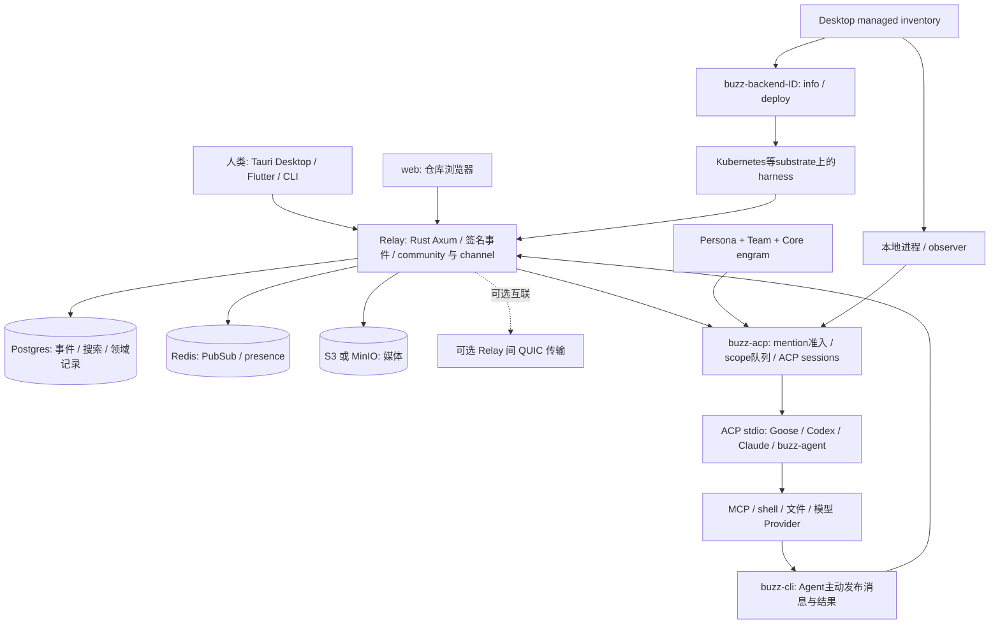

# 14 Buzz：协作工作区、长期身份与 OpenAgentX 对照研究

## 结论

- **Buzz 最接近“人和 Agent 共用的自托管协作工作区”。** Relay 保存签名事件、频道、线程、搜索与身份；ACP harness 托管 Agent，另有自带模型工具循环。它覆盖聊天、代码、工作流与远程部署，不是单纯 CLI 管理器，也不等于已经建立完整的业务任务控制面。
- **长期领域负责人类比部分成立。** 稳定公钥、owner、persona 指令、频道职责和加密 engram 支持长期协作；community/domain 是租户和 URL 边界，persona 是角色与运行配置，均不自动保证业务领域独占、文件隔离或结果验收。
- **最值得借鉴的是诚实的状态与控制反馈。** 身份、本机管理来源、部署记录、presence、当前 turn 分开；取消需要关联回执，超时保持 `unconfirmed`；远程 Shutdown 明说未确认停止。这直接服务 OAX 的 A 与 C。
- **其任务入口明确承认完成边界。** `buzz-acp run` 的 `completed`/exit 0 表示 ACP turn 正常返回，包含 `max_tokens`、`refusal`，不是业务成功；`taskId` 不是幂等键，重复启动可能重复效果。OAX 仍需自己的持久任务、RunAttempt、结果证据与副作用核验。
- **源码中既有细致工程，也有尚未闭环的产品能力。** 角色注入、作用域取消、Kubernetes 部署冲突收敛有实际代码；Workflow approval 遇到后明确 `Failed/approval_not_supported`。不能把功能清单或协议数量当作端到端完整性。
- **本批仅固定版本源码研究与独立局部测试。** 不部署 Buzz、不接账号/Provider、不跑真实 UI/模型链；测试结果与剩余边界见第 10 节，不能合称“Buzz E2E 通过”。

## 1. 固定来源与研究边界

| 项目 | 本批核对 |
|---|---|
| 官方仓库 | <https://github.com/block/buzz> |
| 固定源码 | `781d39510cf23cfe224e8f521ae06a23377e06de`；只读副本 `/tmp/oax-buzz-assessment-20260926` |
| 提交时间/主题 | 2026-09-26 01:57:49 UTC；`feat(push): support configurable HTTP(S) delivery URLs (#7877)` |
| 版本 | Desktop `0.5.25`；Rust workspace package `0.1.0`；[工具链][toolchain]锁定 Rust `1.95.0`、[包管理器][package] `pnpm@11.4.0`。README 的 Rust 1.88+/pnpm 10+ 是较宽入门文字，不替代锁定配置 |
| 预算 | 2026-09-26 10:22–11:02 Asia/Shanghai，最多 40 分钟，沿用本批原预算 |
| 证据方法 | 根 AGENTS/产品文档提供意图，固定源码提供接线事实，独立测试提供有限动态证据；旧 ARCHITECTURE 的 single-relay/no-replication 叙述不覆盖当前可选 mesh/multi-community 实现 |
| 非目标 | 不改产品、冻结 ADR、配置、数据库和正式服务；不调用真实 Provider，不读用户历史，不部署、不做完整安全审计 |
| OAX 基线 | 本批 README 链接的八项目比较与主代理只读安装证据；A 可靠取消/当前结果 → B 可信完成/继续 → C 就绪/overview/恢复，顺序不变 |

证据：[provenance](evidence/buzz-provenance.json)、[引用文件 SHA-256](evidence/buzz-source-hashes.json)、[精选源码摘录](evidence/buzz-source-excerpts.txt)、[LICENSE 原文](evidence/buzz-LICENSE.txt)。公开 issue/PR 元数据只作维护上下文，不当作已复现缺陷。

## 2. 实际架构与对象映射

[当前 README][readme]将默认部署定义为一个 URL 选择一个 community；托管运营方可在共享基础设施上服务多个 community。源码已有 [host 绑定][tenant]和 [relay mesh crate][workspace]，因此不能笼统写成“只有单 relay，不能多租户或互联”。[buzz-relay-mesh][mesh-transport]负责 relay runtime 间 QUIC 连接、隧道与 Redis lease/fencing；这不证明事件数据库复制，也不能与共享模型算力合并成一个机制。共享算力是另一能力。普通自托管不需要先部署整套 mesh。

图据 [crate map][crate-map]、[ACP 契约][acp-readme]、[provider 实现][backend]与 [Kubernetes dispatch][k8s-entry]。`web/` 是 relay 提供的仓库浏览器，不等同完整 Desktop 的浏览器版本；Desktop 依赖 Tauri native API，浏览器 E2E 另有 mock bridge。自带 `buzz-agent` 是 ACP LLM+MCP loop，`buzz-dev-mcp` 提供 shell/file tools；`sprig` 打包 harness、agent 和 dev MCP。Buzz 同时有协议桥接与自有 runtime，不能只取一层概括全系统。

| Buzz 对象 | 实際含义 | OAX 对照及限制 |
|---|---|---|
| Community / relay URL | 主机名选择的租户工作区；relay 为服务与事件入口 | 比 OAX 单一控制面更宽；不是 Agent 的业务 domain |
| Agent pubkey / owner | 签名身份与所有者关系，人和 Agent 使用同类密钥机制 | 接近稳定 Agent 身份；不是 Worker instance、PID 或 session |
| Persona / AgentDefinition | 无私钥的可复用指令、模型、运行时与 MCP 配置 | 接近 ROLE+运行配置模板；同 persona 的实例仍是不同身份 |
| ManagedAgent record | 当前设备确切公钥对应的管理记录、backend、运行配置 | 接近管理来源和执行绑定；owner 或在线不自动授予本机 Start/Stop |
| ACP pool slot / process | 承载一个或多个 scoped sessions 的执行资源 | 接近 Worker/Runtime 的部分职责；不等于一个永久业务负责人 |
| SessionScope / turn | 默认 channel 会话，可选 thread 会话；一次模型调用轮 | 接近 SessionBinding/Run 内活动；turn 结束不等于 Task 完成 |
| Nostr event / thread | 签名消息、时间线与审计材料 | 接近事件和用户输入；并非持久 Mailbox 领取、任务事务和完成证明 |
| Local task document | 单次 prepared prompt、身份绑定、deadline、correlation ID | 能接外部调度；自身不提供持久任务服务、幂等领取或结果 ledger |
| Workflow run | YAML 触发器与步骤执行记录 | 与 OAX Task 部分相交；approval suspension 尚未完整接线 |

## 3. “每个 Agent 长期负责一个 domain”成立到哪里

| 能力 | 固定版本事实 | 结论 |
|---|---|---|
| 稳定身份 | pubkey、owner、签名事件、个人资料、频道成员关系 | 有长期可寻址主体，不是一次聊天实例 |
| 长期职责输入 | persona `system_prompt` 实际进入 harness；team instructions 分层 | 有指令机制；职责内容仍由用户定义 |
| 持久记忆与公共历史 | relay 历史，Agent-owner 加密 core/cold engram | 可延续经验；不等于完整模型上下文永久恢复 |
| 限定谁可唤醒 | `owner-only` 默认 author gate，允许 owner 与已验证同 owner sibling；另有 allowlist/anyone/nobody | 真正入口准入，不只是 prompt 里的“只听 owner” |
| 限定可见数据 | community host binding、channel membership、scope 与读取过滤 | Relay 数据权限有实现；不证明任意 MCP/shell 都受相同隔离 |
| 领域独占与交付责任 | 本批未见通用的 Domain 独占资源/业务完成校验器 | 需要角色约定与上层任务验收，不由 persona 名称自动获得 |
| 进程/工作区隔离 | 可本机执行，也可远端 substrate | 是否隔离取决于部署与工具权限；一把独立身份密钥不等于 OS sandbox |

因此，Buzz 提供“长期协作者驻留的房间、身份与输入”；Holon 更直接提供长期 Agent 的工作记录与自有宿主；OAX 则应先把既有 Task/Worker/Runtime 的交付与控制闭环做牢，再取所需交互。

## 4. 角色、记忆与实际执行输入

**不要混淆展示简介和实际指令。** [AgentDefinition][definition] 的 `description` 是公开、最多 280 字符的简介，排除在 persona restart hash 之外；另有真正的 `system_prompt`。同 persona 新旧公钥不是别名，明确 pubkey 的 profile 导航不可悄悄换成另一个本机实例（[身份规则][profile]）。

Desktop persona 的实际输入链：在共享 spawn 边界一次 [resolve_effective_config/require_resolved][spawn-resolve] → 写入 [`BUZZ_ACP_SYSTEM_PROMPT`][spawn-prompt] → harness [Config 读取][config-prompt] → [base/workspace/agent-instructions framing][framing] → [session_new_full 实际调用][persona-session]。支持 `systemPrompt` 的 adapter 在 `session/new` 接收；legacy adapter 在首条用户消息获得 standing context，[会话重建重新投递][standing]。文件 persona pack 是另一个配置入口，[resolve_one_persona][persona-resolve]将正文解析为 system_prompt；本批不把它与 Desktop persona 存储写成未经证明的串行调用链。这些实际注入路径不依赖模型偶然打开角色文件。

但 persona 配置也不是最终输入的全部：[user env 最后覆盖][spawn-env]具有明确优先级。角色、team、workspace、model/effort、adapter、owner、实际 spawn snapshot 都应一起看；不能看到 persona 卡片就断言正在运行的实例已经应用最新配置。变化通常需要下一次 spawn/session 才进入相应层，不是任意在线编辑都即时生效。

[core engram fetch][engram]以 Agent 和 owner 的密钥关系解密并验证事件；读取失败、无法解析/解密和明确不存在分开。明确无 core 才给创建提示；不可达时省略该段并继续 session，避免把真实但暂不可读的记忆覆盖成空白。core 在新 session 构造时载入、随后作为 standing context；其他 cold memory 由 Agent 使用 CLI 读取。`base_prompt.md` 的“every turn”措辞不能推导为每轮重新拉取最新 core。

自带 [buzz-agent Session][agent-session]在进程内保存 history/MCP/session 状态，context handoff 压缩与 relay 持久历史是不同层。远端 [诚实成本说明][remote-cost]明确 checkout、文件与 session-local scratch 只有 substrate 另行持久化才可保留；跨机器复用身份不代表完整执行现场无损迁移。

**对 OAX：** 最小借鉴是显示 ROLE 来源/版本、实际执行输入与生效时点，并用两次真实 Runtime 任务证明输入被消费。先不引入 Buzz 的全部 persona/team/engram 协议。

## 5. 消息、单任务与完成证据

会话链是：成员频道事件 → mention 与 author gate → scope 队列 → ACP prompt → Agent 使用 Buzz CLI 发布回复。[ACP README][acp-readme]明确工具发布结果，不能将 agent stdout 的一段文本视为频道用户已收到答复。消息 accepted、Agent 开始工作、turn 结束、用户收到回复和外部副作用完成分别需要证据。

| 边界 | 源码/契约行为 | 能证明什么、不能证明什么 |
|---|---|---|
| 默认排队 | [CLI 配置][dedup]当前默认 `queue`，默认 session policy 为 channel；[内存队列][queue]有每 scope/每 channel 上限，溢出丢最旧事件 | 顺序批处理与资源上限；不是持久任务 admission。queue.rs 头部“Drop default”注释陈旧，本文以实际 CLI 默认为准 |
| relay overflow recovery | [恢复代码][recovery]限速重订阅，REQ 写出后退休对应丢失 cursor；源码明说非 EOSE/consumer receipt | 尝试重放事件；不是已经消费或业务 exactly-once |
| observer `turn_completed` | [RAII guard][turn-end]在所有退出路径发出，payload 为空 | UI 活动结束，不能解释成 successful task |
| `buzz-acp run --task` | [v1 task][task-input]本地文件/stdin、身份精确匹配、输入限制与 deadline，fresh process/session | 适合上层调用；URL task endpoint/job queue 尚未实现 |
| terminal record | [TASKS.md][task-result]及 [run_task 分支][run-result]：stdout 单 JSON，正常 ACP 返回写 `completed` | `end_turn/max_tokens/max_turn_requests/refusal`均可正常结束；exit 0 不保证交付、文件修改正确或业务成功 |
| correlation/idempotency | `taskId` 仅关联；文档说明 host 被杀可能无记录，重复启动可能重复执行 | 不是结果 ledger、幂等键、lease 或事务领取 |

这里不把“completed 不是业务成功”定性为偷偷误报：项目已明确写出窄语义。风险来自调用方抹掉 `stopReason` 或把该结果直接映射成业务完成。OAX 应保留现有 `uncertain` 与有限结算规则、结果来源和正式副作用验收，不复制一个含义较窄但名字相似的完成状态。

## 6. 取消、恢复与远程生命周期

Desktop [取消等待器][cancel-ui]在发送前订阅回执并启动超时，只匹配 `type=cancel_turn`、`requestId`、`channelId`；transport 挂住也能超时为 `unconfirmed`，旧回执不能结算新请求。harness [控制入口][control-auth]再次校验签名、owner 和时间窗口；[取消分支][cancel-harness]在频道多 scope 歧义时返回 `ambiguous_target`，否则只在成功发出 in-flight signal 后回 `sent`。**`sent` 仍不是“工具和外部进程全部停止”。**

聊天命令是另一条有界路径：[owner `!cancel`][chat-cancel]按 channel/thread policy 解析精确 scope；默认 channel 不代表多 thread 下可以任意替用户挑一个。`!shutdown` 请求 harness 退出，`!rotate` 使 scoped session 失效。 [requeue 分支][requeue]明确 Cancel/Rotate 丢弃当前 batch，Steer/Interrupt/SwitchModel 才在 Queue 模式重排；不能写成“所有取消都会自动重试”。重排输入也不证明此前产生的外部效果已回滚。正向清理能力也存在：[AcpClient shutdown][process-cleanup]在可用的 Unix 路径杀 process group 并最多等 5 秒回收，其他情况退到 direct child；这项源码机制不能替代本批未做的跨平台真实工具收尾验收。

远程 backend 有很清楚的代价：[provider 调用][backend]是一次进程读取 JSON stdin、输出 JSON stdout；Desktop 先暂存并校验 provider 的 info，再用相同 bytes 执行 deploy。响应有输出上限、超时、退出码检查与脱敏；provider 是持有 Agent key 的受信代码，不是恶意插件沙箱。

[Kubernetes deploy][k8s-reconcile]使用确定身份的 pod 名、每次尝试 generation Secret、UID/resourceVersion 删除前提与冲突败者只观察。成功边是 harness container 正在 running；这强于“只写出部署对象”，仍弱于 relay 可用、可领下一项工作、真实任务成功。不能把 K8s 局部 CAS 解释为跨所有 launcher 的业务执行 fencing。

部署后没有通用 substrate `status/exec/kill` backchannel；[UI Shutdown][remote-stop]发送 `!shutdown` 并明确“未确认停止”。删除远端管理记录也可能留下 orphan，界面对此有提示。失联、卡死或不处理消息的 Agent 需要 substrate TTL/运维兜底，relay presence 不能提供紧急 kill 保证（[remote contract][remote-contract]）。本批未实测远程部署与回收。

## 7. 身份、权限与可信状态

[tenant binding][tenant]先根据 connection host 解析 community，未知/空 host 或查询失败均拒绝，不落默认租户。签名只证明作者，后续仍有 [ingest scope/auth/channel 门禁][ingest]和 [fanout 阅读权限过滤][fanout]。[author gate][author-gate] 的 `owner-only` 包含 owner 本人与经过 NIP-OA 验证的同 owner sibling，并非只收 owner 本人；它决定哪些作者能触发模型；这些不同于运行时工具的 host 权限。

尤其要区分 **工具权限请求与真人批准**：[buzz-agent permission broker][permission]遇超时、错误/未知响应等 fail closed，先请求再执行；但本版本 [buzz-acp ACP client][auto-permission]会选择 `allow_once` 自动批准，有该协议不等于产品中每次都有人审核。公开 shell/file MCP 的权限仍取决于执行环境，不能由频道 membership 推导“只能访问本领域文件”。

[management provenance][management]规定本机成功加载的 exact-pubkey managed inventory 决定“由本机管理”；云形标记只表示 owner 身份没有该本机记录，不证明物理云部署。 [availability 代码][availability]在断线/失败时返回 unknown，成功 presence 快照缺项才代表 offline；online 阻止重复 Start 的某些路径，但不授予生命周期控制，也不能由 offline 推导绝无活动实例。

这比把“已部署”“在线”“忙”“可控制”折叠成一个绿色 badge 更可靠。对 OAX C，先以现有 Worker lease/instance、Runtime probe 与控制权限提供同类证据分层，不建立平行权威状态机。

## 8. 首次用户旅程与逐模块取舍

从 [README 入门][readme]可还原：安装 Desktop → 指向可用 relay/community → 身份与成员准入 → 建频道/选择 persona/配置 runtime 和模型 → 启动或部署 Agent → 加入频道并精确 mention → 在频道核对回复与实际产物 → 控制当前 turn/观察状态。内部 Block 构建预配置不能当 OSS 新用户零配置能力；源码自托管还需要 Postgres/Redis/对象存储、Rust/Node/pnpm 等工具链。本批只做源码旅程审查，没有真实点击、触控、离线、重连或 Provider 证据。

| 模块 | 明确收益 | 成本/边界 | 对 OAX |
|---|---|---|---|
| relay + 签名事件 | 人/Agent统一时间线、作者与搜索证据 | Nostr kinds/tags、租户路由、存储/实时投影增加理解成本 | 借交付回执与来源，不换协议底座 |
| Desktop 身份/状态 | exact key、owner、managed来源、presence分清 | 多事实投影需一致更新；native与mock UI不可混同 | A/C优先参考 |
| persona/team/core | 可复用职责、实际注入、跨session记忆 | 配置来源/覆盖/生效时间复杂；不是权限隔离 | 小步补输入证据 |
| ACP harness | 接既有Agent，作用域/排队/取消/恢复集中 | 外部ACP差异、legacy首消息、auto permission与工具副作用 | 保留OAX Adapter边界，别直接照搬 |
| 本地task runner | 结构化输入/终态、deadline、stdout卫生 | 无持久任务ledger/幂等；completed语义较窄 | B接入时必须重新解释验收 |
| 自有buzz-agent/MCP | 协议和工具循环掌握在项目内 | 再承担模型适配、上下文、权限、进程清理与平台差异 | 暂不替换OAX外部Runtime路线 |
| remote/K8s | provider可替换，部署CAS与冲突收敛有设计 | Secret与pod运维，无通用紧急kill，scratch可能丢 | 后置到有真实远程需求 |
| workflows/git/media/voice/mobile/mesh | 覆盖工作区范围广、沟通材料集中 | 广泛领域、协议、平台、CI矩阵；功能有未闭环部分 | 不纳入本轮A/B/C实现 |

“复杂度过高”应按用途判断：建设团队协作产品，这些模块有用户价值；只为修好 OAX 的取消和可信交付而复制 Postgres/Redis/Nostr/K8s/移动端，则明显超出最小结果。当前 [workflow approval][approval]生成 token 后尚未持久化/发送，入口 [finalize][approval-fail]将该 run 明确失败为 `approval_not_supported`；这是静态确认的未接线能力，不是本批动态复现，更不是授权修改 OAX 的理由。

## 9. 前三项借鉴与 A/B/C 最小验收

1. **取消回执与当前结果分层。** 在 A 里沿现有任务/运行 ID 关联 request、target、ack 和最终停止证据。最小验收：旧回执不结算新操作，错误目标/多候选拒绝，send 成功但无 runtime 回执保持 unknown，取消与自然结束竞态不覆盖已确认结果；真实 Runtime 检查工具/进程收尾与后续任务领取。
2. **角色输入与结果契约可检查。** 在 B 显示实际 ROLE/配置来源、session 生效时点、当前结果来源和 stop reason。最小验收：两次真实任务证明角色被消费，refusal/max_tokens/空输出/无终态不能映射业务成功；重复继续不重放已知副作用，未知效果留给显式核验。
3. **就绪、在线、忙与管理权各自有证据。** 在 C 用现有 Worker/Runtime 权威记录投影，而不是只靠 heartbeat。最小验收：断网变 unknown，presence不授予Stop，部署记录不冒充ready；重启后显示正确当前运行与旧结果，Worker闲置等待且完成后能领取下一项。

下一步限于将这些机制写入 OAX 既有 A/B/C 的验收；不因参考仓库多出功能而开新平台改造。重新评估远程 backend 的条件是真实远程执行需求；Relay 间 mesh 需实际多节点 relay 传输需求，共享算力另按实际模型算力共享需求评估，不能因多个 community 就自动引入；加密记忆则需明确跨设备记忆需求。

## 10. 测试证据、未覆盖与许可证

仓库 CI 分层：Rust 单元/性质与组件检查；[Desktop smoke][ci-smoke]使用浏览器 mock Tauri bridge；[relay integration][ci-relay]启动服务并运行 relay-backed 测试；另有 Windows/Tauri/native检查与 [可选真实ACP guide][testing]。根 workspace [排除 Desktop Rust crate][workspace]，只跑 root cargo 不能宣称涵盖 Tauri。CI 配置存在不等于本批重新运行或当前远端全绿。

独立测试已收口，见 [测试汇总](evidence/buzz-tests-summary.md) 与 [执行命令](evidence/buzz-check-commands.md)：Desktop 取消回执 8、reconciliation 6、runtime status/pair 7、消息语义 8，共 **29 pass**。消息语义首次缺 `nostr-tools` 收集失败，保留原记录；补齐锁定版本 `2.23.12` 后仅复验该 8 项通过。沿用原测试 loader 的既有 stubs，本轮未另造 stub/test。另将原源码 `ifc-core` 在临时独立 crate 运行，**5 个 unit/property tests + 2 个 doctests pass**（含预期 compile-fail），按测试函数计数，不将性质生成样本夸成更多测试。该原语在本批检索中未发现其他 Agent/Relay production crate 消费，只能证明独立信息流模型低层；它不是 Buzz 授权接线通过。临时 manifest 展开 workspace 元数据，测试 Rust `1.89` 与项目锁定 `1.95` 不同，完整清单/锁和限制已留证。Desktop纯函数也不能上推真实浏览器或native行为。

本批未跑：全量 Rust/Tauri、真实 relay/Postgres/Redis、完整 Desktop/Flutter/browser、真实模型/ACP工具副作用、K8s、mesh、鉴权部署、长时空闲资源与下一任务生命周期。因此本文是可追溯研究与局部验证，不是生产选型或上线通过意见。源码陈旧注释、README版本范围与审批未接线已限定，不扩成新实现任务。

[LICENSE][license]为 Apache-2.0，原文已保存。可研究并按许可证复用；实际代码搬运应保留版权/许可证与适用通知、标识修改，并另核依赖许可。本批只新增研究报告与证据，没有复制为 OAX 产品代码。

[mesh-transport]: https://github.com/block/buzz/blob/781d39510cf23cfe224e8f521ae06a23377e06de/crates/buzz-relay-mesh/src/lib.rs#L1
[process-cleanup]: https://github.com/block/buzz/blob/781d39510cf23cfe224e8f521ae06a23377e06de/crates/buzz-acp/src/acp.rs#L420
[toolchain]: https://github.com/block/buzz/blob/781d39510cf23cfe224e8f521ae06a23377e06de/rust-toolchain.toml#L1
[package]: https://github.com/block/buzz/blob/781d39510cf23cfe224e8f521ae06a23377e06de/package.json#L1
[readme]: https://github.com/block/buzz/blob/781d39510cf23cfe224e8f521ae06a23377e06de/README.md#L27
[workspace]: https://github.com/block/buzz/blob/781d39510cf23cfe224e8f521ae06a23377e06de/Cargo.toml#L27
[tenant]: https://github.com/block/buzz/blob/781d39510cf23cfe224e8f521ae06a23377e06de/crates/buzz-relay/src/tenant.rs#L61
[crate-map]: https://github.com/block/buzz/blob/781d39510cf23cfe224e8f521ae06a23377e06de/AGENTS.md#L96
[acp-readme]: https://github.com/block/buzz/blob/781d39510cf23cfe224e8f521ae06a23377e06de/crates/buzz-acp/README.md#L1
[backend]: https://github.com/block/buzz/blob/781d39510cf23cfe224e8f521ae06a23377e06de/desktop/src-tauri/src/managed_agents/backend.rs#L509
[k8s-entry]: https://github.com/block/buzz/blob/781d39510cf23cfe224e8f521ae06a23377e06de/crates/buzz-backend-kubernetes/src/main.rs#L88
[definition]: https://github.com/block/buzz/blob/781d39510cf23cfe224e8f521ae06a23377e06de/desktop/src-tauri/src/managed_agents/types.rs#L16
[profile]: https://github.com/block/buzz/blob/781d39510cf23cfe224e8f521ae06a23377e06de/docs/agent-profile-identity.md#L1
[persona-resolve]: https://github.com/block/buzz/blob/781d39510cf23cfe224e8f521ae06a23377e06de/crates/buzz-persona/src/resolve.rs#L194
[spawn-resolve]: https://github.com/block/buzz/blob/781d39510cf23cfe224e8f521ae06a23377e06de/desktop/src-tauri/src/managed_agents/runtime.rs#L507
[spawn-prompt]: https://github.com/block/buzz/blob/781d39510cf23cfe224e8f521ae06a23377e06de/desktop/src-tauri/src/managed_agents/runtime.rs#L682
[config-prompt]: https://github.com/block/buzz/blob/781d39510cf23cfe224e8f521ae06a23377e06de/crates/buzz-acp/src/config.rs#L284
[framing]: https://github.com/block/buzz/blob/781d39510cf23cfe224e8f521ae06a23377e06de/crates/buzz-acp/src/pool.rs#L2160
[standing]: https://github.com/block/buzz/blob/781d39510cf23cfe224e8f521ae06a23377e06de/crates/buzz-acp/src/pool.rs#L2708
[spawn-env]: https://github.com/block/buzz/blob/781d39510cf23cfe224e8f521ae06a23377e06de/desktop/src-tauri/src/managed_agents/runtime.rs#L777
[engram]: https://github.com/block/buzz/blob/781d39510cf23cfe224e8f521ae06a23377e06de/crates/buzz-acp/src/engram_fetch.rs#L28
[agent-session]: https://github.com/block/buzz/blob/781d39510cf23cfe224e8f521ae06a23377e06de/crates/buzz-agent/src/lib.rs#L56
[remote-cost]: https://github.com/block/buzz/blob/781d39510cf23cfe224e8f521ae06a23377e06de/VISION_REMOTE_AGENTS.md#L47
[dedup]: https://github.com/block/buzz/blob/781d39510cf23cfe224e8f521ae06a23377e06de/crates/buzz-acp/src/config.rs#L351
[queue]: https://github.com/block/buzz/blob/781d39510cf23cfe224e8f521ae06a23377e06de/crates/buzz-acp/src/queue.rs#L26
[recovery]: https://github.com/block/buzz/blob/781d39510cf23cfe224e8f521ae06a23377e06de/crates/buzz-acp/src/relay/recovery.rs#L1
[turn-end]: https://github.com/block/buzz/blob/781d39510cf23cfe224e8f521ae06a23377e06de/crates/buzz-acp/src/pool.rs#L5143
[task-input]: https://github.com/block/buzz/blob/781d39510cf23cfe224e8f521ae06a23377e06de/crates/buzz-acp/TASKS.md#L17
[task-result]: https://github.com/block/buzz/blob/781d39510cf23cfe224e8f521ae06a23377e06de/crates/buzz-acp/TASKS.md#L98
[run-result]: https://github.com/block/buzz/blob/781d39510cf23cfe224e8f521ae06a23377e06de/crates/buzz-acp/src/run_task.rs#L245
[cancel-ui]: https://github.com/block/buzz/blob/781d39510cf23cfe224e8f521ae06a23377e06de/desktop/src/features/agents/lib/cancelTurnOutcome.ts#L43
[control-auth]: https://github.com/block/buzz/blob/781d39510cf23cfe224e8f521ae06a23377e06de/crates/buzz-acp/src/lib.rs#L1570
[cancel-harness]: https://github.com/block/buzz/blob/781d39510cf23cfe224e8f521ae06a23377e06de/crates/buzz-acp/src/lib.rs#L1781
[chat-cancel]: https://github.com/block/buzz/blob/781d39510cf23cfe224e8f521ae06a23377e06de/crates/buzz-acp/src/lib.rs#L3392
[requeue]: https://github.com/block/buzz/blob/781d39510cf23cfe224e8f521ae06a23377e06de/crates/buzz-acp/src/pool.rs#L4793
[k8s-reconcile]: https://github.com/block/buzz/blob/781d39510cf23cfe224e8f521ae06a23377e06de/crates/buzz-backend-kubernetes/src/reconcile.rs#L1
[remote-stop]: https://github.com/block/buzz/blob/781d39510cf23cfe224e8f521ae06a23377e06de/desktop/src/features/agents/lib/managedAgentControlActions.ts#L126
[remote-contract]: https://github.com/block/buzz/blob/781d39510cf23cfe224e8f521ae06a23377e06de/VISION_REMOTE_AGENTS.md#L19
[ingest]: https://github.com/block/buzz/blob/781d39510cf23cfe224e8f521ae06a23377e06de/crates/buzz-relay/src/handlers/ingest.rs#L2349
[fanout]: https://github.com/block/buzz/blob/781d39510cf23cfe224e8f521ae06a23377e06de/crates/buzz-relay/src/handlers/event.rs#L99
[permission]: https://github.com/block/buzz/blob/781d39510cf23cfe224e8f521ae06a23377e06de/crates/buzz-agent/src/permission.rs#L1
[auto-permission]: https://github.com/block/buzz/blob/781d39510cf23cfe224e8f521ae06a23377e06de/crates/buzz-acp/src/acp.rs#L1981
[management]: https://github.com/block/buzz/blob/781d39510cf23cfe224e8f521ae06a23377e06de/docs/agent-management-provenance.md#L1
[availability]: https://github.com/block/buzz/blob/781d39510cf23cfe224e8f521ae06a23377e06de/desktop/src/features/agents/lib/useAgentAvailability.ts#L9
[approval]: https://github.com/block/buzz/blob/781d39510cf23cfe224e8f521ae06a23377e06de/crates/buzz-workflow/src/executor.rs#L725
[approval-fail]: https://github.com/block/buzz/blob/781d39510cf23cfe224e8f521ae06a23377e06de/crates/buzz-workflow/src/lib.rs#L229
[ci-smoke]: https://github.com/block/buzz/blob/781d39510cf23cfe224e8f521ae06a23377e06de/.github/workflows/_ci-desktop.yml#L167
[ci-relay]: https://github.com/block/buzz/blob/781d39510cf23cfe224e8f521ae06a23377e06de/.github/workflows/_ci-relay.yml#L590
[testing]: https://github.com/block/buzz/blob/781d39510cf23cfe224e8f521ae06a23377e06de/TESTING.md#L238
[license]: https://github.com/block/buzz/blob/781d39510cf23cfe224e8f521ae06a23377e06de/LICENSE#L1
[author-gate]: https://github.com/block/buzz/blob/781d39510cf23cfe224e8f521ae06a23377e06de/crates/buzz-acp/src/lib.rs#L210
[persona-session]: https://github.com/block/buzz/blob/781d39510cf23cfe224e8f521ae06a23377e06de/crates/buzz-acp/src/pool.rs#L1490
