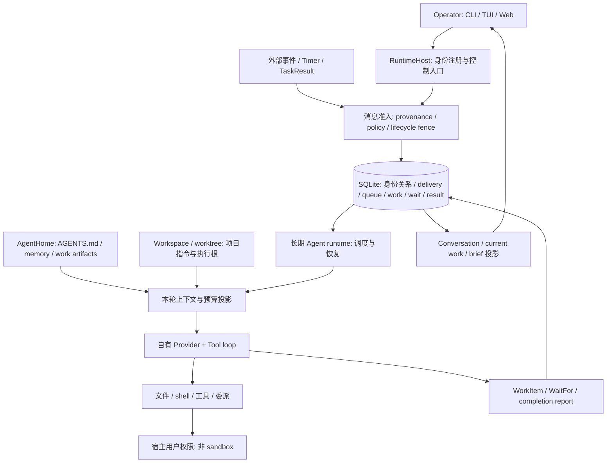

# 13 Holon：长期 Domain Agent 与 OpenAgentX 对照研究

## 结论

- **“一个 Agent 负责一个 domain”的类比基本成立，但 domain 不是沙箱。** Holon 有稳定 Agent 身份、独立队列、AgentHome、指令和记忆；业务职责、可自主决定什么、何时请示主要由角色契约表达。workspace、AgentHome 和角色名称不形成 OS 权限隔离，也没有一个自动保证领域独占/事务边界的 `Domain` 对象。
- **它比“多个聊天窗口”更接近长期负责人。** WorkItem 保存目标、计划、待办、等待条件和交付记录；条件到来后唤醒同一身份。长期 peer 与受监督 child 的消息、结果和生命周期责任分开，不需要为每项小工作永久增设一个角色。
- **它与 OpenAgentX 的底座不同。** Holon 的 Rust runtime 自己组装上下文、调用 Provider 并运行工具循环；OpenAgentX 主要是控制面、Mailbox 和常驻 Worker 托管既有 CLI Runtime。理念相近不意味着可以低成本替换底座。
- **最值得借鉴：职责输入真正接线、可恢复工作记录、明确交付责任。** 保存角色文件只是第一步；应知道本次实际用了哪些输入、当前工作在等谁、收到了消息还是收到了可验收结果。沿用 OpenAgentX A/B/C，不另建一套 WorkItem/Task 状态链。
- **持久化和结果结构较完整，业务完成仍需独立核实。** `CompleteWorkItem` 要求当前 execution binding 和面向用户的报告，并准备事务收口；这不是对文件、远端操作或测试结果的普遍核验。消息 accepted、peer wait completed、Task cancelled 各有窄语义，不能上升为业务完成或进程已停止。
- **本批是固定版本源码研究与有界局部验证，不是部署验收。** 独立测试代理运行 4 份原有 Conversation SDK 测试，53 pass、0 fail、0 skip；未启动 Holon、未登录 Provider、未跑真实 UI/模型用户链。仓库有 fixture、真实 daemon+stub Provider、可选真实模型 canary 等多层 CI，不能合成一个“真实 E2E 已通过”的结论。

## 1. 固定来源与本批边界

| 项目 | 核对结果 |
|---|---|
| 官方仓库 | <https://github.com/holon-run/holon> |
| 固定源码 | `7c0ebbdfbf2f38adf41968051ed3440bc5ddb774`；只读 clone `/tmp/oax-holon-assessment-20260926` |
| 版本 | [Cargo][version] 与英文 README 为 `0.45.0`；[中文 README][chinese] 仍推荐 `v0.29.0`，不能据旧入口描述现版本能力 |
| 当前规范来源 | 读取根 AGENTS、当前 RFC、核心源码与主代理保存的最新 issue 元数据；RFC 的 draft/accepted 标签不代替实现证据 |
| 时间预算 | 2026-09-26 00:55–01:35（Asia/Shanghai）；首稿目标 01:16，最终目标 01:25；不重置既有研究预算 |
| 验收 | 架构/入口、domain 边界、角色/记忆、协作、工作/等待/结果/恢复、交互、复杂度、测试/许可证均有固定来源；明确前三项借鉴与最小验收 |
| 非目标 | 不部署、不读用户 Agent 历史、不调用模型、不改 OpenAgentX 产品/冻结 ADR/配置/数据库/正式服务；研究代理不运行 tests，不 commit |
| OAX 比较基线 | 复用前批模块审计与[本日只读安装核对](../2026-09-26/evidence/openagentx-comparison-baseline.json)；历史真实 E2E 不计为本批重跑 |

证据入口：[源码与许可证 provenance](evidence/holon-provenance.json)、[精选源码摘录](evidence/holon-source-excerpts.txt)、[引用文件哈希](evidence/holon-source-hashes.json)、[LICENSE 原文](evidence/holon-LICENSE.txt)、[issue 元数据](evidence/holon-open-issues.json)。

## 2. 实际架构：长期身份宿主，不只是 CLI 管理器

[README][readme] 的正常路径是 `holon onboard` → `holon daemon start` → `holon tui` 或浏览器 `localhost:7878`。CLI、TUI、Web 是进入同一 Host/Agent runtime 的表面；关闭客户端不等于停止 daemon。当前运行主体是 Rust binary，`holonbot` 是独立 Node 服务资产，不能将旧 Go/Claude SDK 路径当主架构。

依据：[服务入口][entry]、[AgentProvider 接口][provider]、[队列事务][queue-tx]、[Agent run loop][sleep]、[安全边界][security]。图表示源码结构，不表示本批已经真实启动。[AppStorage][storage] 在共享 RuntimeDb 上以 `agent_id` 分区；每 Agent 的 home/队列不等于每 Agent 独立数据库或 OS 进程。OAX 的常驻 Worker 进程与 Holon 同 Host 内多个 Agent runtime 也不能混同。

| Holon 对象 | 实际含义 | OpenAgentX 对照及不能等同之处 |
|---|---|---|
| Host / daemon | 一进程宿主、注册、控制、配置、多个 Agent runtime | 接近 OAX daemon + 部分 Worker 管理；不能一对一映射一个远程 Worker |
| Agent identity | 稳定路由/审计 ID，持久 home、队列、状态与上下文 | 接近 OAX Agent；不是 tmux pane，也不是一次运行或一份 prompt |
| AgentHome | Agent 角色、记忆、材料及 runtime-owned 隐藏状态的根 | OAX ROLE/工作区约定的参考；不等于权限独立的 domain |
| WorkItem | 持续目标、计划、待办、阻塞/等待、最终报告 | 在用户目标层接近 OAX Task；不能再平行加一套权威状态 |
| Task | 受监督异步执行：命令、child invocation、peer message wait 等 | 更接近 OAX Run/受控子工作中的部分职责；与 OAX Task 同名不同义 |
| Turn / assistant round | 一次激活中的模型与工具交互，和 execution binding 关联 | 接近 Run 内执行轮；不能用 round 结束替代 Task 完成 |
| Brief | 面向 operator 的结果/等待报告，和内部 trace 分开 | 参考 FinalReply/结果投影；内容仍可为模型自报 |
| WaitFor / wake | 持久条件与恢复触发，区分等人/任务/外部/定时 | 参考 waiting_input 和正式事件唤醒；不是 tmux 注入 |
| Peer / supervised child | 独立长期协作者 / 带监督及清理义务的临时协作者 | 对 OAX Domain Agent 与委派可参考；当前未验收的组织权限不能因此算已交付 |

## 3. domain 类比：哪些已形成机制

| “一个 domain”可能想表达的能力 | Holon 固定版本证据 | 判断 |
|---|---|---|
| 一个长期负责主体 | [Agent identity/relations][identity]，每 Agent 状态与路由，AgentHome | **是机制**：跨客户端/turn 的稳定身份 |
| 有自己的输入与待办 | delivery ledger 与队列事务、WorkItem 的 `agent_id`、revision | **是机制**：持久归属、可追溯投递；不保证业务请求一定被正确理解 |
| 记住这个领域的经验 | AGENTS.md 确定性加载、memory/operator.md/self.md 预算注入 | **机制+维护责任**：内容需持续整理，不是无限或无损记忆 |
| 只处理某类领域业务 | [官方角色说明][role]：职责、决策边界、请示范围写入角色契约 | **主要是指令约定**：本批未见通用领域路由/领域独占校验器 |
| 只能访问本领域数据 | [安全文档][security] 明确 path/write/network/secret confinement 不强制 | **不是现有保证**：同 OS 用户的 shell 可越过 workspace 组织边界 |
| 能否调用某类原生工具 | [dispatcher][tool-gate] 消费 agent_capability_policy；配置策略不允许 required family 时返回 `agent_capability_not_allowed` | **是真正工具 family 门禁**，不是只写角色文字；允许 shell 后仍不形成路径/OS 隔离 |
| 能否联系别的 Agent | canonical message policy、caller principal/route、生命周期 fence | **是真正准入机制**；不由 display name 或 AGENTS 文本直接授予 |
| 谁对委派结果负责 | persistent peer 与监督 child 的 Task 类型、relation、结果/清理协议 | **协议有区别**；最终业务验收仍需 owner/operator 明确落实 |
| 一个领域一个进程/容器 | Host 内多个长期 runtime，默认 host-local 执行 | **不能如此类比**：Agent 独立身份不表示 OS/进程级隔离 |

重要限定：官方文字直接说明 `AGENTS.md` 记录既有授权，修改文本不扩大实际权限；一个 Agent 还可绑定多个 workspace（[角色与项目区别][role]）。因此更准确的说法是：**Holon 给长期领域负责人提供了身份、记忆、收件与工作恢复容器；领域职责要由用户定义，资源隔离要由真实执行边界保障。**

旧 [agent-profile-model RFC][profile] 已写 supersession note；不能继续用 `private_child/public_named` 推导现状。[新统一身份 RFC][identity-rfc] 本身仍标 draft，但 [canonical relation 持久化][relations] 和 [InvokeAgent 拒绝旧字段][legacy-input] 已在源码中出现。本文以实际类型/调用链为准，不把新 RFC 每条目标都当实现完毕。

## 4. 长期角色、AgentHome 与上下文

[AgentHome 布局 RFC][agent-home] 区分可编辑的 AGENTS.md、memory、notes、work、skills 与 runtime-owned `.holon/`；这是一套存储所有权约定，并不阻止同权限 shell 修改这些路径。

指令接线清楚：[runtime 加载][load] → [agents_md.rs][instruction] 读取 user-global `.agents/AGENTS.md`、agent-home AGENTS.md、workspace-anchor AGENTS.md → [prompt sections][prompt] 进入实际模型请求构造。workspace 仅在 AGENTS 不存在时 fallback CLAUDE；读取/解码错误不冒充文件缺失。它不是依赖模型碰巧打开角色文件，也不随临时 shell cwd 随意换根。

[记忆加载][memory] 对 operator.md 与 self.md 默认各取 1500 字符并暴露 truncation，其余通过 MemorySearch/MemoryGet 获取；[上下文选择][context-select] 还按当前工作选择历史。长期日志、可编辑记忆、当前 WorkItem refs、模型上下文压缩是不同层。不能把“日志保留”说成“每轮完整记住”，也不能将旧 [Long-Lived Memory RFC][context] 的所有设计视为当下验收，文件自身标注部分被 WorkItem refs 替代。

**对 OAX：** 借鉴 ROLE 版本和实际输入来源可查看、角色与项目规则分层、当前工作/历史证据分开；先用现有 Adapter 贯通两次真实任务，暂不复制检索索引、episode、全部上下文预算框架。当前必须解决的是输入是否被消费，不是先拥有更多记忆文件。

## 5. 跨 Agent：peer 协作与 child 委派不是同一契约

| 操作 | 当前源码行为 | 成功回执能证明什么 |
|---|---|---|
| CreateAgent | 建立独立身份及规范关系，创建与 bootstrap/repair 分开 | 身份创建；不是目标执行完成 |
| SendAgentMessage | [工具][send] 绑定 caller 和 tool-call idempotency，走统一 delivery service | 消息被 durable admission 接受；不是收件 Agent 回复或业务完成 |
| InvokeAgent(existing_agent) | [实际分支][invoke] 建 `AgentMessageWait`，锚定 request delivery rowid，等目标后来发来的消息；显式写 `business_completion=false` | 选定发送者在边界之后的一条消息到达；不等于相关目标的最终答复，更不是共享业务事务 |
| InvokeAgent(new_subagent) | [child 分支][child] 创建受监督的结果型 invocation Task，支持 workspace/worktree 参数 | 有父方 Task 结果路径；仍需核验结果内容及外部效果 |

canonical relations 将 lineage、supervision、durability、lifecycle attachment、capability policy、message policy 分开保存。血缘不自动授予所有权限，operator 可见也不等于 peer 可调用；长期 peer 不因一次 invocation 被收归 caller 生命周期。新 child 的 invocation 完成不应从概念上等同删除，监督/保留/清理另有责任；旧 helper 中保留 `private` 命名不是当前公共产品分类。

[准入源码][delivery] 在同一事务视图核对目标 identity/state/policy，拒绝删除中、已删除、stopped 和不授权目标；相同 idempotency scope/key 且请求不同报冲突，成功重放复用既有 receipt；[投递与队列][delivery-tx] 走统一 commit。它解决重复**投递**和生命周期竞争，不能推出 shell/远端工具副作用全局 exactly-once。

**规范与实现差异需保留：** 当前代码给 active + persistent + independent 目标的 `agent_invocation` **及 `agent_message`** 提供 derived peer grant，不能照旧 RFC 表声称纯 peer send 一概默认拒绝。规则按 [rule_index][rule-order] 读取，admission 使用首个匹配 rule；本路径未体现[当前 draft RFC 的规范][policy-rfc]所述通用“最具体/deny 优先”算法。这里记录静态差异，不宣称已证明可利用权限漏洞，也不扩大本批为安全修复；后续若开放多主体细粒度消息策略，应先用组合规则验证真实优先级。

**对 OAX：** 先区分“投递到负责人”和“委派一项有验收的子任务”；不要以消息到达或子代理自报代替父任务完成。跨领域工作应指明 owner、关联工作、预期交付和谁验收，而不是仅约定某角色名字后让模型自行协调。

## 6. WorkItem、等待与可信完成

[WorkItemRecord][work-record] 有 owner Agent、workspace、revision、objective、plan artifact/hash、todo、work refs、blocked_by、recheck、result brief 等。持久生命周期 [Open/Completing/Completed][work] 与 Runnable/WaitingTask/WaitingOperator 等调度投影分开；普通问答不要求每次都建完整 WorkItem。它有助于长期 domain Agent 处理多项工作，不必把所有状态塞进聊天文本。

[WaitFor][wait] 要求 reason、wake、delivery，区分 operator/task/external/timer/system；owner 优先从实际 execution binding 选择，并披露与请求 work_item_id 不一致的情况。`delivery=final` 缺最终报告时先返回 deferred，不先把“已交代给用户”当作成立。wait/queue/task expectations 在 [事务验证][queue-tx] 中结合。

[wake matching][wake] 区分 expected wait、operator override、terminal TaskResult reentry、仅 liveness 信号；收到无内容的系统 tick 不一律重新调用模型。[run loop][sleep] 在无可执行工作时等待 Notify 或明确 recheck deadline，是事件驱动实现证据；本批未运行长期空闲测试，不能据源码说绝无 busy-loop，尤其 open issue 中已有 queued_available 空转报告。

[CompleteWorkItem][completion] 不能仅传 id 就无条件完成：需要当前 execution binding；没有同轮面向 operator 的报告时，先要求 final_text_only，再 prepare。后续 [prepare_work_item_completion_with_report][completion-prepare] 检查 owner、已有状态、非空文本，建立带工作/turn/消息来源的 result brief；收口接入 revision/authority 验证与统一事务。

它证明的是 **“谁在本次执行中提交了哪份完成报告，状态和交付如何一起结算”**。本次未见该链独立重新读取任意文件/远端 API 来核验所有验收项；[未完成 todo][todo-warning] 也只是 warning。因此不能直接替换 OAX query/mutation 的有限完成规则，更不能用模型报告清除未知副作用状态。OAX 可借鉴报告归属和收口原子性，业务效果仍依其已授权验收和证据裁定。

## 7. 取消、崩溃恢复与重复副作用

| 当前机制 | 有价值的部分 | 边界/剩余问题 |
|---|---|---|
| [Task stop][cancel] | 活动命令先发 cancel，必要时 force-stop；有 handle 时显示 Cancelling | [handle 缺失分支][cancel-missing] 可直接写 Cancelled；该状态不能独立证明 OS 进程/远端操作停止 |
| [重启任务收口][restart] | 对未恢复的任务记录 Interrupted、prior status、原因和时间，并投递终态结果 | Interrupted 不是业务失败/回滚证明；部分 supervised child/消息等待可恢复监控，不是所有任务统一重跑 |
| [终态结果提交][result-tx] | Task transition 携带 terminal result，避免先终态后丢结果的分离写入 | 本次未注入真实崩溃，不能宣称所有 failure window 已覆盖 |
| [恢复 snapshot][recovery] | 保存 replay messages、active tasks/timers、WorkItems/delegations；外部 wait 无恢复路径有诊断 | 外部事件可能本来不可补取；必须披露 weak/no-fallback，而非假装一定会醒 |
| delivery 幂等与 revision | 稳定 key、request digest、状态版本与生命周期 fence | 去重范围是正式投递/转换；模型恢复后重复 shell、重复 HTTP mutation 仍需业务幂等或核验 |

OpenAgentX 应继续保留 Mailbox/Journal/lease/fencing 和未知副作用不盲重跑规则。这里不建议把 Holon 的 Cancelled 或重入策略直接移植，只借鉴“请求停止/正在停止/实际结果”“恢复了哪份证据”“谁还欠清理动作”的可见性。

## 8. 首次体验与逐模块得失

[onboard][first-agent] 在文档中将 Provider 配置显式前置；[Web][webguide] 有 Agent 列表、创建、工作区和详情入口，[TUI][tuiguide] 有 `/onboard` 等命令。相比 OAX 空 overview/隐藏 network 条件，最值得参考的是从入口直接回答“可否执行、当前在等什么、结果在哪里”，而不是复制菜单数量。

| 模块 | 优点（源码/文档） | 缺点与不宜直接移入部分 |
|---|---|---|
| Host/Agent 身份 | 多客户端共享稳定身份；生命周期、关系与持久状态明确 | 自有 Provider/toolloop 与 OAX 托管 CLI 架构不同，替换需重做适配与运行证据 |
| 角色/AgentHome | 实际 prompt 消费，有来源和错误状态；角色与项目规则分开 | 无 domain OS 隔离；记忆质量由维护与检索决定，需避免内容无限累积 |
| 工作/调度 | 显式 WorkItem、wait 与唤醒归属，可长期跟进 | WorkItem/Task/turn/activation/execution/brief 层次多，投影若不收敛会再让用户理解内部状态 |
| 协作 | peer delivery 与 child result 分开，存在真实准入与幂等 | peer message wait 非相关业务最终答复；角色协商仍需 owner/验收契约；规范与policy代码存在差异 |
| 结果/恢复 | 完成报告归属、事务 prepare/settle、Interrupted 与 weak wait 诊断 | 不核验任意业务副作用；取消丢 handle 分支仍不能作为进程停止证据 |
| Web/TUI | 当前工作、待处理和报告独立于内部 trace；支持真实 daemon 观察路径 | 本批没操作 UI；不能声称视觉/触控/中文首次旅程顺畅；中文 README 版本滞后 |
| 测试/工程 | fixture 与 live canary 分层，release attestation 校验源码与镜像归属 | 真实模型 canary 常为条件/非阻断；编译和多端栈成本高，本批不能完整安装验证 |
| 许可证 | 固定根 LICENSE 为 Apache-2.0，Cargo 声明一致 | 仍须遵循保留声明/NOTICE 等条件；第三方依赖、模型服务、数据许可另计 |

[Current work 浏览器测试][web-current] 覆盖等待人/任务/定时、结果就绪、background ownership、390px 布局；[cold start][web-cold] 覆盖 handshake→snapshot→SSE。**这只是测试源码内容**，而且 current-work 用 route fixture，不能写成本次真实功能通过。独立产品判断应待实际 UI+Provider 用户链。

最新 issue 首 35 条元数据中，#3194 标题报告 queued_available 空转，#3078 报 runtime.sqlite 无界增长，#3225 报上下文 cache 成本回退，#2944 报当前 WorkItem 缺失与跨工作历史放大，#3026 报历史 last_failure 易误读，#2795 仍讨论无 initial_message 的 bootstrap。它们是**上游待办/用户报告线索，未在本批复现，不是本文确认的全部现行缺陷**；但足以反对“长期模型和层次越多就一定更可靠/省成本”的推断。

## 9. 测试、CI 与本次证据边界

| 层次 | 源码可见安排 | 本批状态 |
|---|---|---|
| Rust unit/integration | delivery 幂等/重启、relation、WaitFor、Task、WorkItem、HTTP；[示例测试][delivery-tests] | 未执行主 Rust 套件；工具链/缓存可行性由测试代理记录 |
| Conversation SDK CI | [Makefile][sdk-make] 在 Node 测试后显式启用 ignored Rust HTTP/SSE 集成；[测试][sdk-http] 为真实 RuntimeHost/axum+StubProvider、人工会话数据 | 本批仅运行 Node 部分；CI 并非只有 fake SDK 单测，真实 HTTP/SSE 也不等于真实模型 |
| 默认 Web E2E | PR/push Chromium P0，使用 fixture server/route；有 production-bundle 检查 | 未运行 Playwright；不是模型执行证明 |
| Real daemon Web | [.github/workflows/web-e2e.yml][web-ci] 定时/手动跑实际 binary、生产资产、SSE、restart catch-up、abort | [默认 Provider stub][web-stub] 返回错误而非真模型；真实 daemon 不等于真实 Provider |
| Deterministic scheduler E2E | [CI required job][ci-required] Docker+fixture profile，检查 acceptance/coverage reports | 未执行；可证明时应称确定性 runtime/调度链 |
| Live scheduler canary | [PR 标签条件][ci-live] 且 job continue-on-error；[nightly][nightly] 有真实模型/凭据配置，provider/live步骤可非阻断；手动触发另有 success 要求 | 有真实模型自动检查的设计，不能笼统说没有；本批未查询历史 run/artifact，也未运行 |
| Release E2E | [attestation][release] 校验报告 pass、candidate SHA、image digest，另列 canary | 来源/工件校验值得借鉴；定义存在不等于固定 commit 的已通过证据 |
| 本次有界局部验证 | 原 Conversation SDK 的 controller/state/decode-client/sse 四份测试，原样复制隔离运行 | **53 pass、0 fail、0 skip**；TypeScript 构建通过；约 0.81 秒；研究代理未重复运行 |
| 真实 UI / Provider /完整业务效果 | 浏览器操作、真实模型、独立文件/外部效果与恢复 | **本批全部未运行**；OAX 2026-09-23 历史 E2E 仅作为比较基线 |

实际验证见 [测试总结](evidence/holon-tests-summary.md)、[命令](evidence/holon-check-commands.md)、[环境与逐文件哈希](evidence/holon-test-environment.json)、[原始输出](evidence/holon-tests-sdk.log)。隔离 Node 24.14.0 + TypeScript 5.9.3，原 SDK 源码逐字一致，无自造探针。测试通过假客户端、注入 fetch/summary/batch 与内存 SSE 驱动，支持旧代拒绝、终态防复活、完整 batch checkpoint、重连/reset、撤权缓存清理；不证明持久身份、消息准入事务或真正停止。

主 Rust 冷构建有 470 个锁定 registry 包、仅 33 个精确版本缓存、437 个缺失且无 target，故未启动 cargo test；这不是测试失败。缺前端 dist 也不是 Rust 编译硬阻断（嵌入允许缺资源）。未出现 test failure 不等于所有套件通过；本批没有依赖大构建、失败重试或新 Runtime 长测试。

## 10. 许可证与本次处理

固定 [LICENSE][license] 是 Apache License 2.0，Cargo 同样声明 `Apache-2.0`；本批保存原文和 SHA-256。与 Multica 的附加条件许可不同，未在这份根 LICENSE 看到额外托管/品牌限制；这不免除再分发通知、变更说明、NOTICE 等适用义务，也不代表所有依赖和 Provider 服务受相同许可。

本批只读第三方源码并写研究/证据，没有移植实现；没有因存在 Apache 许可就建议换底座。

## 11. 最值得借鉴的三项与 A/B/C 落点

| 顺序 | 可感知结果与最小范围 | 对齐原批次 | 最小验收 |
|---|---|---|---|
| 1 | **同一工作有明确 owner、当前结果和停止状态。** 用已有 Task/Run/Journal 表达消息已接受、运行结束、结果待核、停止已请求；结果绑定当前运行，peer到信不冒充子工作完成 | A：可靠撤回与当前结果 | queued 取消后不执行；active 取消失联保留未知；迟到旧轮不覆盖新轮；消息/结果/文件三层证据分别检查 |
| 2 | **长期 domain 职责实际进入执行，任务交付后能明确继续。** ROLE 与项目规则分层，记录输入来源/版本；工作目标、交付报告和上下文继承明确，复用既有 ADR-006/Task | B：可信完成与继续 | 真 AGY 两次连续任务验证角色 marker/约束；query 有回复、mutation 独立核效果；同Task或关联新Task的继续入口有明确契约，不默认信模型报告 |
| 3 | **用户知道在等谁，并能恢复到正确工作。** overview/Web/Console 统一显示就绪原因、当前工作、waiting reason、最近结果和下一步；只在当前确有等待需求处持久化关联 | C：首次就绪与恢复 | 无预埋配置首次进入能定位阻塞；等人/任务/外部可区分；首次503恢复不重复投递；重启/回连读取权威快照，80×24/390px到得了结果 |

只有真正出现多个长期职责主体和跨领域工作时，再增加“谁能发给谁、谁负责验收、child 谁清理”的最小关系与验证。此时可以参考 Holon canonical relations，但不以补全所有 relation 轴、重造 Provider、加第二状态机或迁入多端应用为先决条件。

## 下一步

1. 主代理把本报告接入七项目比较；保留 domain 类比中的职责、执行主体、权限隔离三层区别。
2. 独立复核检查关键结论、固定引用与测试边界；完成后仅交付研究，不开始产品修复或部署。

[readme]: https://github.com/holon-run/holon/blob/7c0ebbdfbf2f38adf41968051ed3440bc5ddb774/README.md#L7
[version]: https://github.com/holon-run/holon/blob/7c0ebbdfbf2f38adf41968051ed3440bc5ddb774/Cargo.toml#L1
[chinese]: https://github.com/holon-run/holon/blob/7c0ebbdfbf2f38adf41968051ed3440bc5ddb774/README.zh-CN.md#L138
[entry]: https://github.com/holon-run/holon/blob/7c0ebbdfbf2f38adf41968051ed3440bc5ddb774/src/main.rs#L868
[provider]: https://github.com/holon-run/holon/blob/7c0ebbdfbf2f38adf41968051ed3440bc5ddb774/src/provider/mod.rs#L580
[identity]: https://github.com/holon-run/holon/blob/7c0ebbdfbf2f38adf41968051ed3440bc5ddb774/src/domain/agent.rs#L9
[capability]: https://github.com/holon-run/holon/blob/7c0ebbdfbf2f38adf41968051ed3440bc5ddb774/src/domain/agent.rs#L95
[relations]: https://github.com/holon-run/holon/blob/7c0ebbdfbf2f38adf41968051ed3440bc5ddb774/src/runtime_db/agent_relations.rs#L413
[rule-order]: https://github.com/holon-run/holon/blob/7c0ebbdfbf2f38adf41968051ed3440bc5ddb774/src/runtime_db/agent_relations.rs#L989
[delivery]: https://github.com/holon-run/holon/blob/7c0ebbdfbf2f38adf41968051ed3440bc5ddb774/src/runtime_db/agent_message_delivery.rs#L182
[delivery-tx]: https://github.com/holon-run/holon/blob/7c0ebbdfbf2f38adf41968051ed3440bc5ddb774/src/runtime_db/transitions.rs#L1476
[queue-tx]: https://github.com/holon-run/holon/blob/7c0ebbdfbf2f38adf41968051ed3440bc5ddb774/src/runtime_db/transitions.rs#L1570
[profile]: https://github.com/holon-run/holon/blob/7c0ebbdfbf2f38adf41968051ed3440bc5ddb774/docs/rfcs/agent-profile-model.md#L1
[identity-rfc]: https://github.com/holon-run/holon/blob/7c0ebbdfbf2f38adf41968051ed3440bc5ddb774/docs/rfcs/agent-identity-relations-and-message-delivery.md#L8
[role]: https://github.com/holon-run/holon/blob/7c0ebbdfbf2f38adf41968051ed3440bc5ddb774/docs/website/blog/what-is-holon.md#L85
[security]: https://github.com/holon-run/holon/blob/7c0ebbdfbf2f38adf41968051ed3440bc5ddb774/docs/website/concepts/security-and-execution-boundaries.md#L13
[policy]: https://github.com/holon-run/holon/blob/7c0ebbdfbf2f38adf41968051ed3440bc5ddb774/src/system/host_local_policy.rs#L10
[agent-home]: https://github.com/holon-run/holon/blob/7c0ebbdfbf2f38adf41968051ed3440bc5ddb774/docs/rfcs/agent-home-directory-layout.md#L8
[instruction]: https://github.com/holon-run/holon/blob/7c0ebbdfbf2f38adf41968051ed3440bc5ddb774/src/agents_md.rs#L12
[prompt]: https://github.com/holon-run/holon/blob/7c0ebbdfbf2f38adf41968051ed3440bc5ddb774/src/prompt/mod.rs#L993
[load]: https://github.com/holon-run/holon/blob/7c0ebbdfbf2f38adf41968051ed3440bc5ddb774/src/runtime.rs#L3895
[memory]: https://github.com/holon-run/holon/blob/7c0ebbdfbf2f38adf41968051ed3440bc5ddb774/src/agent_memory.rs#L9
[context]: https://github.com/holon-run/holon/blob/7c0ebbdfbf2f38adf41968051ed3440bc5ddb774/docs/rfcs/long-lived-context-memory.md#L1
[context-select]: https://github.com/holon-run/holon/blob/7c0ebbdfbf2f38adf41968051ed3440bc5ddb774/src/runtime/turn/context_management.rs#L36
[invoke]: https://github.com/holon-run/holon/blob/7c0ebbdfbf2f38adf41968051ed3440bc5ddb774/src/runtime/agent_services.rs#L125
[child]: https://github.com/holon-run/holon/blob/7c0ebbdfbf2f38adf41968051ed3440bc5ddb774/src/runtime/agent_services.rs#L203
[legacy-input]: https://github.com/holon-run/holon/blob/7c0ebbdfbf2f38adf41968051ed3440bc5ddb774/src/tool/tools/invoke_agent.rs#L107
[send]: https://github.com/holon-run/holon/blob/7c0ebbdfbf2f38adf41968051ed3440bc5ddb774/src/tool/tools/send_agent_message.rs#L28
[work]: https://github.com/holon-run/holon/blob/7c0ebbdfbf2f38adf41968051ed3440bc5ddb774/src/domain/work_item.rs#L21
[work-record]: https://github.com/holon-run/holon/blob/7c0ebbdfbf2f38adf41968051ed3440bc5ddb774/src/domain/work_item.rs#L171
[wait]: https://github.com/holon-run/holon/blob/7c0ebbdfbf2f38adf41968051ed3440bc5ddb774/src/tool/tools/wait_for.rs#L96
[wake]: https://github.com/holon-run/holon/blob/7c0ebbdfbf2f38adf41968051ed3440bc5ddb774/src/runtime/wake_matching.rs#L19
[sleep]: https://github.com/holon-run/holon/blob/7c0ebbdfbf2f38adf41968051ed3440bc5ddb774/src/runtime.rs#L5850
[completion]: https://github.com/holon-run/holon/blob/7c0ebbdfbf2f38adf41968051ed3440bc5ddb774/src/tool/tools/complete_work_item.rs#L57
[completion-prepare]: https://github.com/holon-run/holon/blob/7c0ebbdfbf2f38adf41968051ed3440bc5ddb774/src/runtime/tasks.rs#L4114
[todo-warning]: https://github.com/holon-run/holon/blob/7c0ebbdfbf2f38adf41968051ed3440bc5ddb774/src/tool/tools/complete_work_item.rs#L239
[cancel]: https://github.com/holon-run/holon/blob/7c0ebbdfbf2f38adf41968051ed3440bc5ddb774/src/runtime/tasks.rs#L2367
[cancel-missing]: https://github.com/holon-run/holon/blob/7c0ebbdfbf2f38adf41968051ed3440bc5ddb774/src/runtime/tasks.rs#L2444
[restart]: https://github.com/holon-run/holon/blob/7c0ebbdfbf2f38adf41968051ed3440bc5ddb774/src/runtime/tasks.rs#L2000
[result-tx]: https://github.com/holon-run/holon/blob/7c0ebbdfbf2f38adf41968051ed3440bc5ddb774/src/runtime/task_state_reducer.rs#L499
[recovery]: https://github.com/holon-run/holon/blob/7c0ebbdfbf2f38adf41968051ed3440bc5ddb774/src/storage/recovery.rs#L8
[first-agent]: https://github.com/holon-run/holon/blob/7c0ebbdfbf2f38adf41968051ed3440bc5ddb774/docs/website/getting-started/first-agent.md#L209
[webguide]: https://github.com/holon-run/holon/blob/7c0ebbdfbf2f38adf41968051ed3440bc5ddb774/docs/website/guides/use-web-gui.md#L43
[tuiguide]: https://github.com/holon-run/holon/blob/7c0ebbdfbf2f38adf41968051ed3440bc5ddb774/docs/website/reference/tui.md#L76
[web-current]: https://github.com/holon-run/holon/blob/7c0ebbdfbf2f38adf41968051ed3440bc5ddb774/web-gui/app/e2e/current-work.spec.ts#L1
[web-cold]: https://github.com/holon-run/holon/blob/7c0ebbdfbf2f38adf41968051ed3440bc5ddb774/web-gui/app/e2e/cold-start.spec.ts#L1
[web-ci]: https://github.com/holon-run/holon/blob/7c0ebbdfbf2f38adf41968051ed3440bc5ddb774/.github/workflows/web-e2e.yml#L30
[web-stub]: https://github.com/holon-run/holon/blob/7c0ebbdfbf2f38adf41968051ed3440bc5ddb774/web-gui/app/e2e/real-daemon/daemon-fixture.ts#L56
[ci-live]: https://github.com/holon-run/holon/blob/7c0ebbdfbf2f38adf41968051ed3440bc5ddb774/.github/workflows/ci.yml#L669
[ci-required]: https://github.com/holon-run/holon/blob/7c0ebbdfbf2f38adf41968051ed3440bc5ddb774/.github/workflows/ci.yml#L790
[nightly]: https://github.com/holon-run/holon/blob/7c0ebbdfbf2f38adf41968051ed3440bc5ddb774/.github/workflows/e2e-scheduler-nightly.yml#L119
[nightly-optional]: https://github.com/holon-run/holon/blob/7c0ebbdfbf2f38adf41968051ed3440bc5ddb774/.github/workflows/e2e-scheduler-nightly.yml#L165
[nightly-manual]: https://github.com/holon-run/holon/blob/7c0ebbdfbf2f38adf41968051ed3440bc5ddb774/.github/workflows/e2e-scheduler-nightly.yml#L257
[release]: https://github.com/holon-run/holon/blob/7c0ebbdfbf2f38adf41968051ed3440bc5ddb774/.github/workflows/release-e2e.yml#L317
[license]: https://github.com/holon-run/holon/blob/7c0ebbdfbf2f38adf41968051ed3440bc5ddb774/LICENSE#L1
[delivery-tests]: https://github.com/holon-run/holon/blob/7c0ebbdfbf2f38adf41968051ed3440bc5ddb774/src/runtime_db/agent_message_delivery.rs#L844
[tool-gate]: https://github.com/holon-run/holon/blob/7c0ebbdfbf2f38adf41968051ed3440bc5ddb774/src/tool/dispatch.rs#L151
[policy-rfc]: https://github.com/holon-run/holon/blob/7c0ebbdfbf2f38adf41968051ed3440bc5ddb774/docs/rfcs/agent-identity-relations-and-message-delivery.md#L342
[storage]: https://github.com/holon-run/holon/blob/7c0ebbdfbf2f38adf41968051ed3440bc5ddb774/src/storage/mod.rs#L68
[sdk-make]: https://github.com/holon-run/holon/blob/7c0ebbdfbf2f38adf41968051ed3440bc5ddb774/Makefile#L55
[sdk-http]: https://github.com/holon-run/holon/blob/7c0ebbdfbf2f38adf41968051ed3440bc5ddb774/tests/conversation_sdk_e2e.rs#L45
