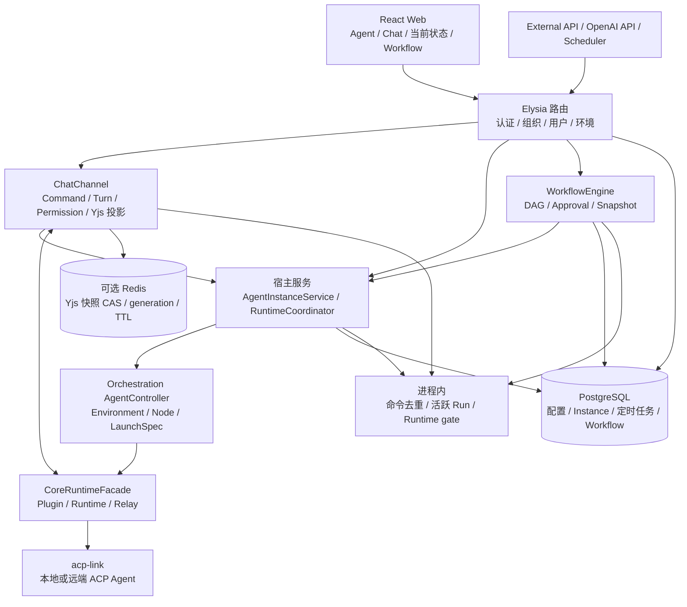

# 12 FenixAgent 固定源码对照研究

## 结论

- **FenixAgent 是企业 Agent 控制平台，核心并非只有配置界面。** 组织/用户/环境、持久 Agent Instance、运行时协调、ACP 连接、Chat 当前轮投影、审批与取消都已有接线；工作流和定时任务也真正调用执行链。它比轻量客户端承担更宽的产品目标，不能用功能数量判断是否更适合 OpenAgentX。
- **最值得借鉴的是当前会话的动作闭环。** 服务端绑定目标 session、按 turn 归属结果、统一结束回复/工具/待审批状态、区分取消请求与未确认中断、认证错误与连接错误分开显示，都能直接服务既有 A/B/C。
- **完成判据仍有具体薄弱点，且入口之间不一致。** 定时 Agent executor 把任意 truthy `stopReason` 当作成功，有限事件流无终态也返回成功；本批隔离反例确认 `cancelled`、`max_tokens`、`error` 和空流均可得到 `success`。这不能扩大成“全部 Chat 没有失败处理”，更不能迁入 OAX 的业务结算。
- **恢复与幂等机制有真实实现，也有清楚上限。** Chat 的 Redis 快照有 CAS 与 generation 防旧写；Runtime 协调器失联/停止失败保留 `unknown`。但命令去重和运行协调主要是进程内状态，Workflow 对远端孤儿 Agent 标为取消、配置重试后可再次执行，不等于跨重启恰好一次或已确认副作用停止。
- **对 OAX 的建议仍是补现有主链，而非复制平台。** 借用配置到运行输入、当前轮收口、明确恢复动作；保留 OAX 的事务、Mailbox、Journal、lease/fencing，不搬第二套工作流 DSL、Yjs/Redis 权威状态、模型网关、知识库、Sites 与沙盒集群作为日常任务的前置。
- **证据限于固定源码与隔离局部验证。** 未启动 Fenix 服务/浏览器、真实模型、PostgreSQL/Redis 或远端节点；不能宣称其完整 E2E、多租户安全或实际体验优于已安装 OAX。

## 1. 固定对象、范围和证据

| 项目 | 本轮值 |
|---|---|
| 指定仓库 | `https://github.com/HuangPuStar/FenixAgent` |
| 固定 HEAD | `da5eb543bf17aa0c772eebbf0961e4dc2daac0e8` |
| 提交时间/说明 | `2026-09-11T11:32:09+08:00`；`Merge pull request #272 from HuangPuStar/feature/20260910` |
| 根版本/技术栈 | `fenix 0.1.0`；Bun / TypeScript / Elysia，React / Vite，PostgreSQL / Drizzle；可选 Redis |
| 研究副本 | `/tmp/oax-fenix-assessment-20260926`；固定 commit，tracked 文件未改 |
| 比较基线 | [全面评估](../2026-09-23/00-overall-assessment.md)、[Orca](../2026-09-25/11-orca-reference.md)；本批主代理只读刷新 OAX 安装 Go `6d599ac`、Web `ee46038`，ADR-006 `d0fd561` 未安装 |
| 本批范围 | 实际入口、首次使用、角色配置、任务/会话/结果、取消/审批、恢复/幂等、权限、UI、复杂度、测试和许可 |

本报告遵守 [本批任务说明](README.md) 的预算与非目标；未运行安装器、正式服务或真实 Agent，未读取用户历史、密钥或改变 OAX 产品。固定源码引用全部锚定该 commit；文件 SHA-256、研究库存与选取摘录见 [provenance](evidence/fenix-provenance.json)、[源码摘录](evidence/fenix-source-excerpts.txt)。源码注释中的“已修复”“幂等”“恰好一次”只作定位提示，结论以实际调用/存储机制为准。

## 2. 产品定位与首次使用

README 将其定位为多团队统一运行与治理平台，列出 OpenCode、Peri、Claude Code、CCB、DSH，入口包括 Web Chat、OpenAI 兼容 API、工作流和定时任务。默认推荐 Compose 启动控制服务与 PostgreSQL；首次生成系统管理员并把初始密码写入部署侧文件；本地开发还需 Bun、Docker 和 Agent 引擎。文档明确建议 OpenCode `1.17.12`，警告更高版本可能不兼容，不能据“ACP 通用协议”推断任意引擎版本都等价。[产品与启动][readme]

| 用户动作 | 已接线内容 | 优点、缺口与 OAX 取舍 |
|---|---|---|
| 启动并登录 | `src/index.ts` 初始化 DB、环境、管理员、迁移、可选网关/沙盒、Core、Scheduler；管理员/组织/成员记录在 DB 事务创建 | 第一身份和资源归属明确；运行依赖比 OAX 单控制面更重，不能把 Compose 起容器等于可调用模型 |
| 配模型、Agent、执行位置 | AgentConfig → Environment → 用户 Instance；最小路径没有模型会抛明确配置错误 | 可以解释“还缺什么”；未实测从空系统配置到首项任务，不声称 onboarding 已顺畅 |
| 进入会话 | Chat 先等认证就绪，再按用户/环境/实例构造会话标识、ensure runtime、连接 Yjs/Relay | 认证未就绪不抢连错误命名空间，启动错误有分类；local 节点 `online` 本身仍不是模型可用证明 |
| 发送、等待与查看当前结果 | 当前会话回复、工具、待审批、Todo/Peri 子任务/改动集中展示 | 相邻动作接线可借鉴；改动列表来自投影与消息派生，并非独立核验工作区 |
| 继续与找回 | 同 session 发新 prompt；按能力提供 list/load/resume；可见性恢复只重连可恢复故障 | 不要求用户手动拼内部 ID；依赖 Agent 的会话能力与持久历史，不承诺每种引擎相同恢复能力 |

[主入口][entry]、[管理员事务][admin]、[缺模型拒绝][model-readiness]、[认证三态][chat-auth]、[ACP 会话能力检查][session-capabilities]。OAX 可借鉴的是“状态原因与下一步在同一入口消费”，无需引入整套企业资源中心。

## 3. 实际架构与运行装配

图表示**固定源码装配关系，不表示所有模块默认启用或本次已运行**。根 `start/dev` 实际调用 `src/index.ts`，不是另一个轻量 CLI。Core 默认注册 OpenCode / Claude / CCB 本地插件，远端节点通过 `RemoteRuntime` 和 transport 动态注册；README 列出的 Peri / DSH 主要还有远端镜像/节点路径，不能把表格直接读作这三个本地插件之外也已同样注册。[脚本][package]、[Core 装配][core]、[编排装配][orch]

`spawnInstanceViaController` 获取同源节点快照，构造运行输入，经 Core 启动后登记宿主补充状态；若登记失败会走回滚清理，防止已经启动的进程成为不可见孤儿。这说明实例模型并非仅存储。另一方面，controller 的 LaunchSpec 与宿主 `buildLaunchSpec` 仍双轨，代码明确注明当前宿主实现承载真实 skill/knowledge/model 注入、重复构建属于过渡。这是可见维护成本，而非一张分层图已完成统一。[实际启动/回滚][spawn]、[保留的权威 builder][builder-boundary]

| 模块 | 实现优点 | 有界缺口 / 不应照搬 |
|---|---|---|
| 配置与资源 | 显式 AgentLaunchSpec，模型/角色/MCP/Skills 有消费者 | 并非文档列出的每个配置都映射到每个引擎；迁移中的双 builder 增加漂移面 |
| Runtime 生命周期 | 按 instance UID 串行/优先级仲裁；generation、失联 unknown、停止失败 unknown | gate 存在进程内 Map；不能据命名认作数据库持久 lease 或跨服务器锁 |
| Chat Channel | Command / turn / permission / 投影职责分开，当前轮归属和统一退出有实质价值 | Yjs 事务、内存去重、Redis CAS 各自范围不同，不能一起称端到端事务 |
| Workflow / Scheduler | DAG 快照、节点输出、审批、定时持久定义都已落地 | 成功/中断语义不统一；完整 DAG 不是 OAX 普通任务的必要前置 |
| Remote / sandbox | 独立执行节点、sandbox resolver、远端 epoch/generation | 本批未跨机/重启/恶意租户实测；工作目录不同不是 OS 隔离 |
| 知识库 / 记忆 / 网关 / Sites | 作为可选业务能力接入，输入和资源有组织归属 | 宽产品范围会增加部署、升级与权限组合，不因功能齐全就迁入 |

## 4. 角色、上下文与配置是否真正注入

**角色 prompt 有真实传递链。** 宿主把 AgentConfig 的名称与用户 prompt 合成 `finalPrompt`，写入 `AgentLaunchSpec.agent.prompt`；OpenCode builder 将其写进所选 agent 的 `prompt`，环境准备写 `.opencode/opencode.json`；Claude runtime 把相同字段写入 workspace 的 `CLAUDE.md`。模型、MCP 和安装后的 Skills 也有明确准备步骤。这比只登记角色文件名更完整，但写出配置不等于模型已遵循，本批没有真实角色 marker 任务。[prompt 合成][prompt]、[LaunchSpec 输出][launch-output]、[OpenCode 配置][opencode-config]、[环境物化][opencode-env]、[Claude 角色文件][claude-env]

同时应区分“平台身份提示”与业务角色：默认模板含不提底层引擎的品牌指令，OAX 无需照搬。对新会话复用实例时，`startPromptTurn` 可以调用 `prepareNewSession` 刷新环境与 Skills；load 已有 session 保留原会话快照，不能期待修改 AgentConfig 后所有历史会话立即等效更新。[新会话准备][turn-start]

模型配置还做了明确失败检查：未知协议、失效 provider/model、网关未配置或预算耗尽会拒绝启动。应借鉴这种“接受的配置最终到运行输入”闭环；不必为了角色生效同时建设模型网关。[模型解析][model-resolution]

**权限配置须逐引擎核实。** 用户文档描述 allow/ask/deny 与工具规则；当前 Agent 可设置字段列表也不包含 permission，`AgentLaunchSpec` 没有独立权限字段，已检查的 OpenCode runtime config 与 Claude `buildSettings` 未输出平台权限策略。服务层仍有 `permission` 验证残余，验证分支本身不证明可保存，更不能据此承诺这份旧说明中的权限策略已经注入正式本地引擎。此判断限于已读启动路径，未验证远端自定义 Plugin；真实 ACP 权限请求/人工应答仍另外存在，不能混为“完全无审批”。[权限说明][permission-doc]、[可设置字段][agent-fields]、[LaunchSpec][launch-types]、[Claude settings][claude-settings]

## 5. Task、Session、Turn 与结果判据

Fenix 中几个“任务”不是同一个对象：`ScheduledTaskV2` 是 cron 定义；execution log 是定时触发结果；Workflow run/node 有自己的 DAG 状态；Chat turn 是一次 prompt；Peri task 是引擎上报的子任务视图。**它们不能直接一一替换 OAX 的 Task / RunAttempt / SessionBinding。**

| 入口/层次 | 固定源码的结束标准 | 能证明与不能证明 |
|---|---|---|
| Web Chat | JSON-RPC error 按 pending prompt ID 归入 turn_failed；`stopReason=cancelled` 转 turn_cancelled，其他含 stopReason 的结果转 turn_completed | 能定位当前轮/拒绝旧轮污染；completed 是对话投影结束，不是文件或业务目标独立核验 |
| 定时 Agent | 收到任意 truthy stopReason 即退出循环；循环自然结束后同样 `status: success`，提取最多 2000 字符纯回复 | 本批反例确认取消/error/截断/空流误报成功；不应采用该判据 |
| Workflow Agent transport | transport error、relay_closed、顶层 JSON-RPC error、result.error、stopReason=error 返回 exit_code=1；其他 result 返回 0；意外流结束也返回 0 | 比定时入口更细，但缺终态仍可成功；不能把节点成功提升为业务完成 |
| Workflow/定时记录 | PostgreSQL 持久事件/快照/输出、日志与 lastStatus | 存储结果确有实现；定时 log 与 lastStatus 分开写，后者 catch 仅记日志，不是一个事务结算 |
| Runtime state | running/stopped/unknown 反映实例生命周期 | Runtime stopped 不回答任务效果；反过来 turn completed 也不要求停止共享 Runtime |

[Chat 结果归属与错误][relay-results]、[stopReason 规范化][normalize-result]、[定时 executor][scheduled-executor]、[Workflow transport][workflow-result]、[定时落库][scheduled-store]。

`PromptTurn` 对 update 用 session ID、对响应使用单调递增 RPC ID 过滤，避免同实例并发会话串流；这值得迁入 OAX 的最新结果/旧轮处理思路。其 event queue 达 5000 时丢最旧消息，是内存保护，不是无损 Journal。[turn 归属与队列][turn-filter]

另有一项握手边界：`startPromptTurn` 在 30 秒无 session/new/load 回执时会生成 fallback session ID；新会话响应缺 ID 也走 fallback。接口允许 `onMessage` 缺失时同样回退，但已检查的本地 OpenCode/Claude 和 Remote relay 实现提供 `onMessage`，所以**不把接口兜底分支当作默认现场故障**。实际可达的无回执超时仍不应视为已经建立可恢复会话；本批未实跑该 30 秒/真实引擎场景。[握手处理][handshake]、[本地 relay][local-relay]、[远端 relay][remote-relay]

## 6. 取消、超时与审批

**Web Chat 的取消比“点击即成功”更细。** 前端显式带当前 session ID，服务端发 cancel 后把当前 turn 改为 `cancelling`；10 秒仍未确认则为 `interrupted`，timer 再次检查 active turn ID，防旧取消影响新工作；统一退出函数同时收口 assistant entry、工具与 pending permissions，避免无限转圈。[出站动作][chat-actions]、[取消计时][chat-cancel]、[退出收敛][turn-exit]

ACP dispatcher 调用 SDK `connection.cancel()` 返回后发 `{cancelled:true}`；这是协议层取消确认，**不是平台独立观察进程与所有外部副作用停止**。OAX 借鉴 cancelling/interrupted 和结果归属，但仍须用正式 Worker/Runtime、RunAttempt/Journal 与效果检查验收。[ACP cancel][acp-cancel]

Runtime Coordinator 另有更保守的规则：失联置 unknown；unknown 只允许 stop，阻止 ensure/restart/delete；stop/关闭失败保留 unknown。同 UID 相同操作共享 promise，高优先级操作 fence 旧 generation。该层优点不能被 Workflow 恢复策略的问题掩盖，但内存 gate 不替代 OAX 的持久 lease/fencing。[生命周期协调][runtime-coordinator]

权限应答对 `pending→resolved` 做 CAS，重复应答不再发 RPC，并检查 turn/tool 归属；到期统一收口。此处先改投影再发送 relay，二者并非同一持久事务；若发送失败，不能仅因投影 resolved 宣称 Agent 已收到授权。Workflow 的人工审批是另一种节点 gate，不是工具授权。[应答与发送顺序][chat-command]、[权限收敛][permission-state]

定时 timeout 在 `openAgentSession` 返回、prompt 发出后才建立，实例启动与 session 握手不在这段计时里；finally 的 `turn.dispose()` 释放请求 relay/listener，而 `openAgentSession` 明确保留由 Coordinator 管理的共享 Runtime。**超时响应不能直接等同停止确认。** 本批 5 ms timeout / 40 ms 合成打开延迟探针得到 42 ms 的 success，复现启动阶段不计入 timeout；没有实际模型或子进程停止证据。[定时 timeout][scheduled-executor]、[共享 Runtime 归属][open-session]

## 7. 持久化、重启恢复与幂等

| 状态 | 实际存储/恢复 | 边界与可借鉴点 |
|---|---|---|
| 组织/配置/环境/持久 Instance | PostgreSQL repositories；重新 ensure runtime | 业务身份和一次运行分开有价值；DB 行存在不等于 Agent 正在线 |
| Chat 投影 | Yjs 内存；配置 Redis 后 CAS 合并快照、generation fence、滑动 TTL，默认 7 天 | 专用 Redis 连接避免 WATCH 污染；无 Redis 时没有这层快照持久化，不能宣称默认跨重启保留全部 Chat 投影 |
| Chat command 回执 | 每 rcsSessionId 的 Map；accepted / committed / duplicate，串行有界队列 | accepted 不等于执行成功很有价值；重启/释放后去重消失，不能承诺端到端 exactly-once |
| Runtime lifecycle | Coordinator 内存 generation/operation；远端重连清旧实例引用后再 launch | 能防进程内竞态和幽灵计数；不是完整跨进程接管证明 |
| Workflow | PG event/snapshot/output，显式 recover API 重放，activeRuns 在内存 | 能恢复流程状态；节点实际效果与 orphan 重试仍需单独处置 |
| Cron | DB 任务定义在启动时重新 schedule；runningTasks 是内存 Set | 避免单实例正常重复触发；没有本批多副本调度或崩溃恰好一次证据 |

[缓存默认值][cache]、[Yjs 快照 CAS][snapshot-cas]、[快照 TTL][snapshot-config]、[Doc 创建路径][doc-manager]、[命令回执][commands]、[定时调度][scheduler]、[组织级 Workflow 装配][workflow-service]。

CommandCoordinator 在 execute 抛错时清除去重记录，让同 commandId 可重试。代码注释假设“失败即副作用未发生”，这不是通用保证；例如 relay 已收但提交回执未到、投影更新后发送失败，都需要按具体边界核对。OAX 应保留已有持久幂等与未知状态，不复制这种全局假设。

Workflow recover 对已终态 run 直接返回，对待审批保留暂停；对孤儿 Agent 明确写“无法可靠检测远程 agent，直接取消”，随后若节点 `retry.count>0` 又设为 PENDING 重新调度。shell 尝试按 PID 清理；loop/subworkflow 标记 recovery_not_supported。**有快照恢复实现不等于可靠确认远端停止；未知有副作用节点的重跑不适合 OAX。** 该路径由正式 `/web/workflow-runs/:runId/recover` 调用，并非仅存在于测试辅助代码。[恢复流程][recovery]、[孤儿处置][recovery-orphans]、[recover 路由][recover-route]

## 8. 多租户与安全边界

认证与数据隔离不是纯文档承诺：HTTP/WS 共用认证结果；API key 恢复组织上下文时查询成员关系，查询失败保守拒绝；Chat WS 验证确定性 session 标识，并同时比较环境的 organizationId 与 userId；service 注入可信 workspace；ScheduledTaskV2 按 user+org 查询；Workflow 按组织创建 storage/transport。[认证][auth]、[Chat WS 归属][ws-auth]、[可信 cwd][chat-command]、[任务隔离][task-isolation]、[Workflow 存储][workflow-storage]

这些是可确认的入口保护，**不是本批多租户渗透测试或所有路由审计**。本地引擎准备目录仍与进程/OS 权限关联，只有启用并验证 sandbox 才能进一步讨论执行隔离。默认 Core 的本地节点与可选远端/Sandbox 不是同一隔离强度。[执行节点选择][orch]、[Core 本地节点][core]

密钥方面，根 README 的 DSH 路径提到 API Key 不落盘，但不能泛化到所有 Plugin：OpenCode 的 runtime config 含模型 apiKey 且写 JSON 文件；Claude settings 注入 env 后也写入 workspace 配置。该发现只说明引擎路径差异，本批没有读取任何实际密钥、检查生产目录 mode 或做全仓秘密审计。[OpenCode 配置][opencode-config]、[写文件][opencode-env]、[Claude settings][claude-settings]

## 9. 体验、核心薄弱点与复杂度判断

| 观察 | 实际依据 | 对 OAX 的裁决 |
|---|---|---|
| 角色配置真正被消费 | builder→runtime config / CLAUDE.md | 借鉴 B：证明当前角色内容版本到正式 Adapter，不新建角色平台 |
| 当前会话信息集中 | 输入区上方聚合 Todo、Peri tasks、changedFiles；空面板不显示 | 借鉴 A/C：当前结果与下一动作集中，诊断 ID 按需展开 |
| 故障可理解 | 认证 loading/failed/ready 独立于 WS；不可恢复配置故障不自动重连 | 借鉴 C：首连失败与配置未就绪给不同恢复动作 |
| 退出有单一收敛点 | assistant、工具、审批统一关闭，旧 turn 不能终结新 turn | 借鉴 A：减少“停止了但一直转圈”和错选旧回复 |
| 同一能力跨入口语义漂移 | Chat、Scheduler、Workflow stopReason/error/timeout 不一致 | B 优先统一已有有限判据，不借功能宽度绕过缺终态规则 |
| 权威状态种类偏多 | PG、Yjs/Redis、Runtime Map、activeRuns、Command Map、Agent 历史 | 对既有企业产品有理由；OAX 不应为改善 UI 再创建一套状态权威 |
| 迁移接线未完全收敛 | 两个 LaunchSpecBuilder、Controller/Core/registry 补充状态、兼容协议帧 | 可以局部收敛已证实重复；不以此推导应重写整个系统 |
| 平台面宽 | 16 个根 workspace 包，另含 Sites/知识库/记忆/网关/沙盒/Slurm 等宿主能力 | 这些数量说明维护面，不是性能测量；当前 OAX 日用闭环不需全部迁入 |

[当前会话面板][status-panel]、[恢复策略][visible-reconnect]、[出站失败反馈][chat-actions]。本轮未开浏览器，因此没有 DOM/390px/触控/软键盘/离线/重连的真实体验结论；React 辅助函数或 happy-dom 测试不能替代这些验证。

对用户“核心单薄/过度设计”的判断应具体化：Fenix 的 Chat 和 Runtime 并不单薄，值得学的是已经串起来的小动作；它的定时结果判据与恢复副作用边界仍薄弱，广平台和迁移状态又提高维护成本。OAX 可据此补自己的短板，不必追齐菜单。

## 10. 测试、CI 与本批实际证据

上游 CI 固定 Bun `1.3.14`，分别执行格式、lint、后端/前端 typecheck，以及 src、packages、web 三组 Bun 测试；本批没有取该 SHA 的 CI 成功结论。根 `bunfig.toml` 默认 preload 全局 setup/mocks，包含 DB、auth 和业务 service seam，因此“bun test 通过”也不能直接理解成真实 PostgreSQL/认证/模型链。[CI 配置][ci]、[全局 preload][bunfig]、[测试替身][mocks]

本批测试由独立验证代理执行，研究代理未重复运行。结果为 **9 个上游原测试文件合计 104 项通过，另有 6 项自编行为探针通过（含 1 项正向对照）**，二者不混为上游覆盖；修复 commit 不适用，本批没有修复第三方产品。完整过程见 [测试说明](evidence/fenix-tests-summary.md)、[命令与隔离配置](evidence/fenix-check-commands.md)、[环境清单](evidence/fenix-test-environment.json) 和 [进程收尾](evidence/fenix-test-process-check.json)。

| 本批已收到结果 | 结果与证明边界 |
|---|---|
| 8 个原有测试文件 | 102 pass / 0 fail / 291 expect：ACP cancel、命令去重、权限 CAS、session action、snapshot CAS、snapshot recovery、Workflow agent executor、timeout 错误归类 |
| 定时 executor 反例 + 原有用例 | 6 个自写行为探针（含 1 个正向对照）和 2 个原有 scheduler 用例通过；后两项验证 scheduled 来源映射；反例“通过”表示确认当前不安全行为，**不表示产品功能通过** |
| 反例观察 | cancelled / max_tokens / error stopReason、空有限事件流→success；error 是防御性合成字符串，不声称 ACP 定义此枚举；session 启动延迟超过指定短 timeout 仍 success |
| 替身范围 | Chat 用 fake relay + Y.Doc；Redis CAS 用替身；Workflow recovery 主要内存 storage/mock executor，其中一个 shell 测试生成真实临时 sleep 子进程但含提前 return/catch，不能抬升为可靠进程回收验收；scheduler 替换 openAgentSession，不接模型；timeout helper 复制了内联判断，不能算真实 HTTP executor 覆盖 |

测试环境另有限制：独立 runner 使用 Bun 1.3.14、关闭宿主默认 preload，只装必要依赖子集；`ioredis` 预备版本与上游 lock 不同，且没有连接真实 Redis。首轮空 preload 配置被 Bun 拒绝，改为不声明该字段后复验一次通过；失败日志保留，属于研究 runner 配置问题，不是产品失败。真实 Runtime integration 的上游默认配置关闭；仓库内有手动 enabled 入口，但不能算本次已运行或默认 CI 的 Provider 验收。

未覆盖：完整 install/build/typecheck/lint、真实 HTTP/WS→Provider 链、UI、真实角色与文件副作用、取消后进程/工具停止、真实 Redis/PG 事务与崩溃、多副本调度/跨重启幂等、多租户攻击面、远端/沙盒/网关/Sites、长期空闲与连续任务。局部结果用于支撑已执行分支，不形成整个平台发布结论。

## 11. 许可证与依赖限制

根 `LICENSE` 是完整标准 **Apache License 2.0**，README 明确 Community Edition 采用该许可；本批检查根许可、README、CONTRIBUTING 与 tracked 许可文件，未发现 Multica 式附加商业限制，不应照其他项目的许可结论套用。再分发仍需保留许可和适用通知、标明修改，商标权并不随版权许可授予。[根许可][license]、[README 许可][license-readme]

包级元数据并不全一致：`acp-link` 与 `@fenix-agent/acp-runtime-cli` 的 package.json 标注 MIT，而本次 tracked 树只发现一份根 LICENSE；因此本报告仅确认根 Apache-2.0 与这两处包声明差异，实际复制/分发这些包应再核对发布物许可和版权归属，不把整仓无条件统称单一 Apache 授权。[acp-link 声明][link-package]、[runtime-cli 声明][cli-package]

Bun、PostgreSQL、Redis、ACP SDK、Agent 引擎、可选 LiteLLM/知识库/沙盒服务仍有各自部署与许可要求。本批没有完成依赖 SBOM/完整许可审计，也未把第三方产品代码迁入 OAX；保留的摘录仅为研究证据。

## 12. 前三项借鉴与明确不采纳

| 顺序 / 既有批次 | Fenix 参考 | OAX 的最小落点与验收 |
|---|---|---|
| **1 / A：可靠取消与当前结果** | session/turn 精确归属；cancelling→interrupted；统一收口回复/工具/审批；当前会话状态面板 | 修现有取消事务和最新 Run 投影：未领取取消不再执行，活动失联不假称停止，旧轮迟到不覆盖新回复，停止后同 Worker 能执行下一项；必须真实 Runtime 验证 |
| **2 / B：可信完成与继续** | 实际 prompt 物化、会话能力检查、accepted/committed 区分；同时把宽松 stopReason 与空流当反例 | 对齐 ADR-006 query/mutation 与 SessionBinding，真实角色 marker、回复/可核文件、Task/Run/Journal 及后续提问共同验收；不移入其自动成功或未知副作用重跑策略 |
| **3 / C：就绪、overview 与恢复** | 认证与连接失败分开，配置故障有分类；前后台恢复只针对可恢复原因；任务/结果聚合入口 | 用现有 API 显示谁 ready、缺什么、当前工作和下一步；首次503恢复不重复提交，80×24 / 390px 可到当前结果；无需先部署 Redis/Yjs 或企业资源目录 |

不采纳：以 Agent/SDK 完成标签代替业务效果核验；取消协议回执代替进程与副作用停止；未知有副作用 Workflow 自动重试；把内存去重当持久幂等；照搬完整企业治理/沙盒/网关/知识库/记忆/Sites/Slurm 与新工作流 DSL；用新的投影库取代 OAX 正式 SQLite / Journal 权威链。

## 下一步

1. A/B 将本报告的取消未确认、旧轮迟到、缺终态、错误 stopReason、启动超时和未知副作用恢复作为验收反例；研究批不改产品。
2. C 复用现有观察 API，把登录、连接、Agent 就绪、当前结果与恢复入口串成小闭环，不让用户理解内部启动层数。
3. 仅当真实多组织、远端隔离或 DAG 业务需求出现，再有界评估 Fenix 对应模块，补真实环境与许可证据。

<!-- 固定源码引用；行号按研究 commit 校验。 -->
[readme]: https://github.com/HuangPuStar/FenixAgent/blob/da5eb543bf17aa0c772eebbf0961e4dc2daac0e8/README.md#L3-L171
[entry]: https://github.com/HuangPuStar/FenixAgent/blob/da5eb543bf17aa0c772eebbf0961e4dc2daac0e8/src/index.ts#L65-L133
[admin]: https://github.com/HuangPuStar/FenixAgent/blob/da5eb543bf17aa0c772eebbf0961e4dc2daac0e8/src/services/system-admin.ts#L75-L125
[model-readiness]: https://github.com/HuangPuStar/FenixAgent/blob/da5eb543bf17aa0c772eebbf0961e4dc2daac0e8/src/services/launch-spec-builder.ts#L185-L235
[chat-auth]: https://github.com/HuangPuStar/FenixAgent/blob/da5eb543bf17aa0c772eebbf0961e4dc2daac0e8/web/src/pages/agent-panel/chat-auth-state.ts#L1-L35
[session-capabilities]: https://github.com/HuangPuStar/FenixAgent/blob/da5eb543bf17aa0c772eebbf0961e4dc2daac0e8/packages/acp-link/src/acp-dispatcher.ts#L410-L512
[package]: https://github.com/HuangPuStar/FenixAgent/blob/da5eb543bf17aa0c772eebbf0961e4dc2daac0e8/package.json#L1-L42
[core]: https://github.com/HuangPuStar/FenixAgent/blob/da5eb543bf17aa0c772eebbf0961e4dc2daac0e8/src/services/core-bootstrap.ts#L64-L89
[orch]: https://github.com/HuangPuStar/FenixAgent/blob/da5eb543bf17aa0c772eebbf0961e4dc2daac0e8/src/services/orchestration-bootstrap.ts#L48-L155
[spawn]: https://github.com/HuangPuStar/FenixAgent/blob/da5eb543bf17aa0c772eebbf0961e4dc2daac0e8/src/services/orchestration-instance.ts#L100-L200
[builder-boundary]: https://github.com/HuangPuStar/FenixAgent/blob/da5eb543bf17aa0c772eebbf0961e4dc2daac0e8/src/services/launch-spec-builder.ts#L1-L7
[prompt]: https://github.com/HuangPuStar/FenixAgent/blob/da5eb543bf17aa0c772eebbf0961e4dc2daac0e8/src/services/agent-system-prompt.ts#L1-L42
[launch-output]: https://github.com/HuangPuStar/FenixAgent/blob/da5eb543bf17aa0c772eebbf0961e4dc2daac0e8/src/services/launch-spec-builder.ts#L562-L634
[opencode-config]: https://github.com/HuangPuStar/FenixAgent/blob/da5eb543bf17aa0c772eebbf0961e4dc2daac0e8/packages/plugin-opencode/src/runtime/runtime-config.ts#L103-L167
[opencode-env]: https://github.com/HuangPuStar/FenixAgent/blob/da5eb543bf17aa0c772eebbf0961e4dc2daac0e8/packages/plugin-opencode/src/runtime/environment-preparer.ts#L18-L49
[claude-env]: https://github.com/HuangPuStar/FenixAgent/blob/da5eb543bf17aa0c772eebbf0961e4dc2daac0e8/packages/plugin-claude-code/src/runtime/environment.ts#L49-L82
[turn-start]: https://github.com/HuangPuStar/FenixAgent/blob/da5eb543bf17aa0c772eebbf0961e4dc2daac0e8/src/services/agent-chat-service.ts#L258-L269
[model-resolution]: https://github.com/HuangPuStar/FenixAgent/blob/da5eb543bf17aa0c772eebbf0961e4dc2daac0e8/src/services/launch-spec-builder.ts#L94-L178
[permission-doc]: https://github.com/HuangPuStar/FenixAgent/blob/da5eb543bf17aa0c772eebbf0961e4dc2daac0e8/docs/user/agents/index.md#L58-L84
[launch-types]: https://github.com/HuangPuStar/FenixAgent/blob/da5eb543bf17aa0c772eebbf0961e4dc2daac0e8/packages/plugin-sdk/src/agent-launch-spec.ts#L8-L96
[claude-settings]: https://github.com/HuangPuStar/FenixAgent/blob/da5eb543bf17aa0c772eebbf0961e4dc2daac0e8/packages/plugin-claude-code/src/runtime/settings.ts#L75-L117
[relay-results]: https://github.com/HuangPuStar/FenixAgent/blob/da5eb543bf17aa0c772eebbf0961e4dc2daac0e8/packages/chat-channel/src/channel/relay-event-handler.ts#L524-L571
[normalize-result]: https://github.com/HuangPuStar/FenixAgent/blob/da5eb543bf17aa0c772eebbf0961e4dc2daac0e8/packages/chat-channel/src/protocol/acp-channel.ts#L423-L438
[scheduled-executor]: https://github.com/HuangPuStar/FenixAgent/blob/da5eb543bf17aa0c772eebbf0961e4dc2daac0e8/src/services/scheduler/agent-executor.ts#L54-L123
[workflow-result]: https://github.com/HuangPuStar/FenixAgent/blob/da5eb543bf17aa0c772eebbf0961e4dc2daac0e8/src/services/workflow/agent-chat-transport.ts#L156-L270
[scheduled-store]: https://github.com/HuangPuStar/FenixAgent/blob/da5eb543bf17aa0c772eebbf0961e4dc2daac0e8/src/services/scheduler/index.ts#L162-L180
[turn-filter]: https://github.com/HuangPuStar/FenixAgent/blob/da5eb543bf17aa0c772eebbf0961e4dc2daac0e8/src/services/agent-chat-service.ts#L125-L188
[handshake]: https://github.com/HuangPuStar/FenixAgent/blob/da5eb543bf17aa0c772eebbf0961e4dc2daac0e8/src/services/agent-chat-service.ts#L271-L339
[local-relay]: https://github.com/HuangPuStar/FenixAgent/blob/da5eb543bf17aa0c772eebbf0961e4dc2daac0e8/packages/plugin-opencode/src/relay/relay-handle.ts#L165-L186
[remote-relay]: https://github.com/HuangPuStar/FenixAgent/blob/da5eb543bf17aa0c772eebbf0961e4dc2daac0e8/packages/remote-runtime/src/remote-relay-handle.ts#L50-L65
[chat-actions]: https://github.com/HuangPuStar/FenixAgent/blob/da5eb543bf17aa0c772eebbf0961e4dc2daac0e8/web/src/pages/agent-panel/ChatPanel.tsx#L117-L166
[chat-cancel]: https://github.com/HuangPuStar/FenixAgent/blob/da5eb543bf17aa0c772eebbf0961e4dc2daac0e8/packages/chat-channel/src/channel/session-channel.ts#L278-L317
[turn-exit]: https://github.com/HuangPuStar/FenixAgent/blob/da5eb543bf17aa0c772eebbf0961e4dc2daac0e8/packages/chat-channel/src/state/turn-machine.ts#L1-L84
[acp-cancel]: https://github.com/HuangPuStar/FenixAgent/blob/da5eb543bf17aa0c772eebbf0961e4dc2daac0e8/packages/acp-link/src/acp-dispatcher.ts#L337-L353
[runtime-coordinator]: https://github.com/HuangPuStar/FenixAgent/blob/da5eb543bf17aa0c772eebbf0961e4dc2daac0e8/src/services/agent-instance-runtime-coordinator.ts#L42-L263
[chat-command]: https://github.com/HuangPuStar/FenixAgent/blob/da5eb543bf17aa0c772eebbf0961e4dc2daac0e8/packages/chat-channel/src/channel/session-channel.ts#L222-L275
[permission-state]: https://github.com/HuangPuStar/FenixAgent/blob/da5eb543bf17aa0c772eebbf0961e4dc2daac0e8/packages/chat-channel/src/state/permission.ts#L27-L130
[open-session]: https://github.com/HuangPuStar/FenixAgent/blob/da5eb543bf17aa0c772eebbf0961e4dc2daac0e8/src/services/agent-chat-service.ts#L415-L445
[cache]: https://github.com/HuangPuStar/FenixAgent/blob/da5eb543bf17aa0c772eebbf0961e4dc2daac0e8/src/services/cache.ts#L5-L9
[snapshot-cas]: https://github.com/HuangPuStar/FenixAgent/blob/da5eb543bf17aa0c772eebbf0961e4dc2daac0e8/packages/chat-channel/src/persist/snapshot-cas.ts#L1-L82
[snapshot-config]: https://github.com/HuangPuStar/FenixAgent/blob/da5eb543bf17aa0c772eebbf0961e4dc2daac0e8/packages/chat-channel/src/persist/snapshot-config.ts#L1-L31
[doc-manager]: https://github.com/HuangPuStar/FenixAgent/blob/da5eb543bf17aa0c772eebbf0961e4dc2daac0e8/packages/chat-channel/src/state/doc-manager.ts#L130-L183
[commands]: https://github.com/HuangPuStar/FenixAgent/blob/da5eb543bf17aa0c772eebbf0961e4dc2daac0e8/packages/chat-channel/src/channel/command-coordinator.ts#L59-L195
[scheduler]: https://github.com/HuangPuStar/FenixAgent/blob/da5eb543bf17aa0c772eebbf0961e4dc2daac0e8/src/services/scheduler/index.ts#L14-L126
[workflow-service]: https://github.com/HuangPuStar/FenixAgent/blob/da5eb543bf17aa0c772eebbf0961e4dc2daac0e8/src/services/workflow/index.ts#L30-L90
[recovery]: https://github.com/HuangPuStar/FenixAgent/blob/da5eb543bf17aa0c772eebbf0961e4dc2daac0e8/packages/workflow-engine/src/recovery/snapshot-recovery.ts#L53-L87
[recover-route]: https://github.com/HuangPuStar/FenixAgent/blob/da5eb543bf17aa0c772eebbf0961e4dc2daac0e8/src/routes/web/workflow-runs.ts#L537-L551
[auth]: https://github.com/HuangPuStar/FenixAgent/blob/da5eb543bf17aa0c772eebbf0961e4dc2daac0e8/src/plugins/auth.ts#L85-L146
[ws-auth]: https://github.com/HuangPuStar/FenixAgent/blob/da5eb543bf17aa0c772eebbf0961e4dc2daac0e8/src/routes/acp/index.ts#L254-L298
[task-isolation]: https://github.com/HuangPuStar/FenixAgent/blob/da5eb543bf17aa0c772eebbf0961e4dc2daac0e8/src/services/task-v2.ts#L174-L249
[workflow-storage]: https://github.com/HuangPuStar/FenixAgent/blob/da5eb543bf17aa0c772eebbf0961e4dc2daac0e8/src/services/workflow/pg-storage-adapter.ts#L23-L115
[status-panel]: https://github.com/HuangPuStar/FenixAgent/blob/da5eb543bf17aa0c772eebbf0961e4dc2daac0e8/web/components/chat/chat-status-panel.tsx#L27-L153
[visible-reconnect]: https://github.com/HuangPuStar/FenixAgent/blob/da5eb543bf17aa0c772eebbf0961e4dc2daac0e8/web/src/pages/agent-panel/chat-visible-reconnect.ts#L1-L37
[ci]: https://github.com/HuangPuStar/FenixAgent/blob/da5eb543bf17aa0c772eebbf0961e4dc2daac0e8/.github/workflows/ci.yml#L13-L61
[bunfig]: https://github.com/HuangPuStar/FenixAgent/blob/da5eb543bf17aa0c772eebbf0961e4dc2daac0e8/bunfig.toml#L1-L2
[mocks]: https://github.com/HuangPuStar/FenixAgent/blob/da5eb543bf17aa0c772eebbf0961e4dc2daac0e8/src/test-utils/setup-mocks.ts#L1-L27
[license]: https://github.com/HuangPuStar/FenixAgent/blob/da5eb543bf17aa0c772eebbf0961e4dc2daac0e8/LICENSE#L66-L141
[license-readme]: https://github.com/HuangPuStar/FenixAgent/blob/da5eb543bf17aa0c772eebbf0961e4dc2daac0e8/README.md#L199-L201
[link-package]: https://github.com/HuangPuStar/FenixAgent/blob/da5eb543bf17aa0c772eebbf0961e4dc2daac0e8/packages/acp-link/package.json#L1-L8
[cli-package]: https://github.com/HuangPuStar/FenixAgent/blob/da5eb543bf17aa0c772eebbf0961e4dc2daac0e8/packages/acp-runtime-cli/package.json#L1-L11
[recovery-orphans]: https://github.com/HuangPuStar/FenixAgent/blob/da5eb543bf17aa0c772eebbf0961e4dc2daac0e8/packages/workflow-engine/src/recovery/snapshot-recovery.ts#L231-L275
[agent-fields]: https://github.com/HuangPuStar/FenixAgent/blob/da5eb543bf17aa0c772eebbf0961e4dc2daac0e8/src/services/config/agent-config.ts#L17-L24
