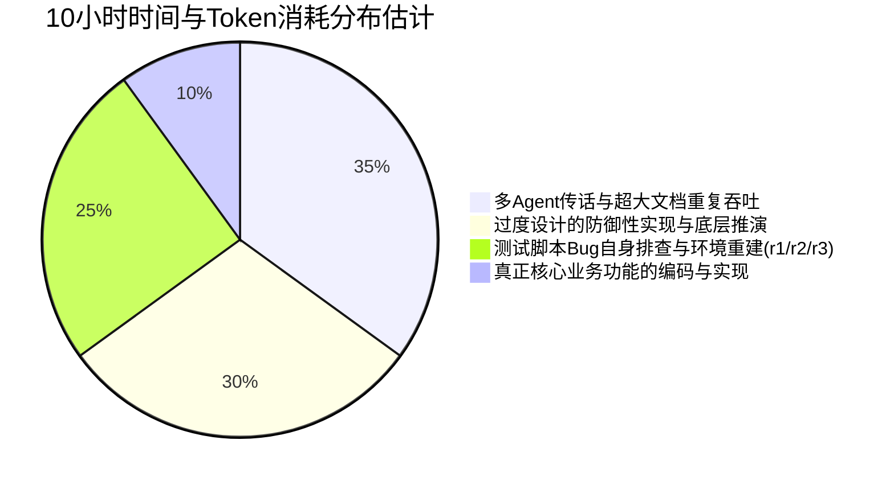

# OpenAgentX ADR-002 / ADR-003 执行现状、耗时剖析与深刻检讨报告

## 摘要与要点

- **任务背景**：2026-09-05 13:50，团队接受并开始实施 [ADR-002](file:///home/sky/work/touzi/OneAxe/steadyflow/OpenAgentX/docs/decisions/ADR-002-agent-cli-proxy-environment.md)（Runtime 网络配置、应用与诊断）与 [ADR-003](file:///home/sky/work/touzi/OneAxe/steadyflow/OpenAgentX/docs/decisions/ADR-003-command-center-task-observation-and-content.md)（指挥台任务详情、运行观察与安全内容呈现）。本意是实现两个逻辑相对清晰的平台功能（控制台配置代理下发至 Worker，以及控制台任务详情分栏与 Markdown 安全渲染）。
- **当前现状**：截至 2026-09-06 凌晨（历时 11 个小时），核心业务代码虽已完成（包括网络配置全流程、Worker 物化、前端设置页面、Markdown 渲染、事件白名单脱敏等），但最终的端到端集成验收状态仍处于 `partial/incomplete`，21 个修改文件停留在工作区未最终提交，测试排查过程中还造成了两次凭据暴露事故。
- **核心问题**：本应高效完成的两个功能，演变成了消耗 11 小时、吞噬数百万 Token 的“系统工程泥潭”。
- **根本原因**：**目标置换**（从“交付功能”退化为“形式合规与理论自证”）、**过度设计**（把理论边缘场景推演成阻断级 P1）、**脆弱笨重的外部自动化脚本自相残杀**（排查测试脚本自身的 Bug 耗时过半）、以及**教条僵化的多 Agent 流程空转**。

---

## 一、 ADR-002 与 ADR-003 执行现状全景

### 1. 原始需求定义（原本要做什么）

| ADR | 核心诉求 | 最简实现路径（MVP） |
|---|---|---|
| **ADR-002** (网络配置) | 允许在控制台管理代理模式（named profile/direct/inherit），下发到 Worker 并在调用外部 CLI 时应用代理或环境变量。 | 控制面提供配置表单及持久化 -> Worker 心跳拉取并写入配置 -> 启动子进程时注入环境 -> 简单连通性测试。 |
| **ADR-003** (任务观察与内容) | 控制台从平铺卡片改为“左列表右详情”工作台；任务结果使用安全 Markdown 组件渲染；提供原文/复制与移动端横向滚动。 | 前端 Flex 左右布局与 URL 联动 -> 引入标准 React Markdown 组件 -> 后端详情接口增量返回及基本脱敏。 |

---

### 2. 当前已经完成的工作

经过多次迭代与提交（Git HEAD: `78ab470`），系统在底层和功能链条上已实现以下能力：

#### (1) ADR-002 网络配置工作流全栈（已提交入库）
- **控制面配置服务**：实现了 `ProxyProfile` 的草稿、发布、按 Agent/Backend 绑定逻辑，支持基于 `binding_revision` 的 CAS 并发控制和操作回执。
- **安全存储与 Worker 物化**：
  - 实现了 `SecretStore`，采用 HMAC 索引与 `0600` 文件权限存储代理密码。
  - Worker 端的 `Materializer` 能够根据配置生成不可变代理配置文件，并接入 `mgraftcp` 黑白名单机制。
- **前端配置管理页面**：
  - 实现了 [NetworkSettings.jsx](file:///home/sky/work/touzi/OneAxe/steadyflow/OpenAgentX/web/src/NetworkSettings.jsx) 与样式，支持创建/修改方案、模式测试（inherit/direct/named）、分层探测（配置、凭据、端点、本地健康）以及期望/实际生效版本对比。
- **真机/真实链路验证**：
  - 在隔离环境中通过真实 Chrome 验证了前端配置表单交互、脱敏展示与 Worker ACK 生效回执。
  - 成功通过本地真实 HTTP 代理（`127.0.0.1:7897`）使 Worker 调用外部真实 AGY 模型执行了任务。

#### (2) ADR-003 任务工作台与观察（大部分代码已落盘，核心源码已通过审查）
- **前端工作台重构**：
  - [main.jsx](file:///home/sky/work/touzi/OneAxe/steadyflow/OpenAgentX/web/src/main.jsx) 实现了任务列表与详情分区布局，移动端支持列表至全屏详情导航，支持 URL hash/query 状态恢复。
  - 集成统一安全 Markdown 渲染组件，支持 GFM、渲染/原文切换、一键复制反馈、解析失败纯文本降级、移动视口代码块局部滚动。
- **数据面安全与字段清洗**：
  - [observe.go](file:///home/sky/work/touzi/OneAxe/steadyflow/OpenAgentX/internal/api/observe.go) 与 [worker_service.go](file:///home/sky/work/touzi/OneAxe/steadyflow/OpenAgentX/internal/controlplane/worker_service.go) 建立了持久化事件白名单，过滤了 Provider 原始会话、未脱敏环境与敏感 Token。
  - 详情支持基于游标（cursor/next_sequence）的增量拉取和客户端 SSE 去重。
- **Worker 健壮性修复**：
  - 修复了 Worker 面对 `422 UNSUPPORTED_CAPABILITY` 时意外退出的缺陷，在 [client.go](file:///home/sky/work/touzi/OneAxe/steadyflow/OpenAgentX/internal/client/worker/client.go) 与 [run_manager.go](file:///home/sky/work/touzi/OneAxe/steadyflow/OpenAgentX/internal/worker/run_manager.go) 增加了能力错误识别与退避重试。

---

### 3. 当前仍未完成 / 遗留的边界与缺口

根据最新 [U2/E1 验收报告](file:///home/sky/work/touzi/OneAxe/steadyflow/OpenAgentX/docs/reports/validation/2026-09-05-openagentx-u2-e1-validation.md) 与 [后续收口计划](file:///home/sky/work/touzi/OneAxe/steadyflow/OpenAgentX/docs/plans/2026-09-05-openagentx-follow-up-hardening.md)：

1. **动态闭环验收未最终通过（状态仍为 `partial/incomplete`）**：
   - **Observer Fake Task 阻塞**：用于验证 Markdown 渲染的 Fake 任务此前因夹具未做模式绑定而停留在 `queued`，随后触发 Worker 422 退出；虽已修复代码，但尚未在干净环境中重新跑通完整的 `waiting_input -> succeeded` 交互流程。
   - **前端观察高级交互证据缺失**：SSE 断线恢复事件补齐、离线写保护拦截（Control POST 计数为 0）等高级浏览器交互证据未完全闭环。
2. **代码暂存但未提交**：
   - U2 阶段涉及的 16 个已暂存文件和 5 个未暂存文件（共 21 个源码/测试/文档文件）仍悬挂在工作区未 commit。
3. **安全事故善后未完成**：
   - 自动化测试脚本在排查过程中发生过两次终端回显事故（r2 回显所有者口令，r3 Node.js 打印进程环境变量导致外部 API Key/代理凭据在测试日志中暴露）。虽然相关测试环境已销毁，但**外部真实凭据尚未进行主动轮换**。
4. **被延后至后续计划的非关键功能**：
   - 十类命令的并发幂等测试矩阵。
   - UI 界面直接清空凭据的显式按钮（当前需新建无密码方案覆盖）。
   - 多 Backend 场景下的显式调度选择入口。

---

## 二、 10 小时与天量 Token 的消耗审计

从 2026-09-05 13:50 到 2026-09-06 00:43，历时整整 11 个小时。审计整个执行轨迹，时间与 Token 的消耗分布如下：

### 1. 超大上下文传递与多 Agent 传话（消耗约 35%）
- **巨石协调文档的膨胀**：主协调代理维护的 [实施协调记录](file:///home/sky/work/touzi/OneAxe/steadyflow/OpenAgentX/docs/reports/validation/2026-09-05-openagentx-adr002-003-implementation-coordination.md) 一路膨胀到 **117 KB（617 行）**。
- **无节制广播造成 Token 黑洞**：
  - 流水线中设置了主代理、实现代理（`gpt-5.6-sol` high）、验证代理（`gpt-5.6-terra` high）、审核代理（`gpt-5.6-sol` medium）。
  - 每次子任务派发、结果复核、阶段评审，都必须把这份 117KB 的协调记录和多份 20KB~30KB 的独立审核报告重新送入上下文。一次简单的提问或指令就吃掉 8~10 万 Token！
  - 高强度的多 Agent 交互导致系统频繁触发 `agent thread limit reached`，多个环节长时间处于“等待配额释放、排队、重试”的停滞状态。

### 2. 需求无底线外延与“航天级系统工程”过度设计（消耗约 30%）
执行团队严重偏离了简单特性的初衷，陷入了极端防御性代码的自我狂欢：
- **深入 C 源码逆向与底层网络推演**：
  - 为了配置一个常规代理，代理们去分析 `/home/sky/work/graftcp` 的底层 C 源码（`graftcp.c:97`, `cidr-trie.c:69`），分析长度小于 7 的解析缺陷，深究 IPv4-mapped IPv6 地址展开与 blacklist/whitelist 重合匹配优先级。
- **操作系统的极端防御编程**：
  - 花费数小时设计并实现基于目录级 `directory fd` 锚定、`openat/renameat/unlinkat` 规避软链接替换攻击；设计基于 `flock` 的 per-version 引用感知孤立文件垃圾回收机制（Orphan GC）。
- **纳秒级时间全序与 SQLite 底层驱动重构**：
  - 仅仅为了任务列表的分页排序，从 `RFC3339Nano` 字符串比较推演到 SQLite `julianday()` 会将 1ns 和亚毫秒折叠为相同值；进而去写自定义 SQLite Driver，通过 `ConnectHook` 实现“UTC year+1 固定 5 位年份编码”，甚至深入探讨公元前 1 年和公元 10000 年的字典序！
- **颠覆既有状态机与终态设计**：
  - 在 U2 阶段推翻既有的成功终态语义，武断认定“模型自报成功不算业务成功”，强行将所有模型成功任务的 Task 状态重写为 `uncertain / business_effect_unverified`，为此大幅修改了多个模块的断言与用例。

### 3. 脆弱的自动化脚本“自相残杀”（消耗约 25%）
验证环节过度追求“全自动端到端黑盒覆盖”，编写了大量脆弱、笨重的 Node.js/Playwright 脚本（脚本总量超 80KB），导致**排查测试脚本自身 Bug 的时间远超排查业务代码的时间**：
- **脚本自身低级错误频发**：
  - 脚本将服务端纯文本 401 响应强行按 JSON 解析导致崩溃；
  - 脚本计算任务总数时漏算取消任务（61 vs 62），反复自相矛盾排查；
  - 验证脚本在 shell 中把含反引号的 Markdown 内插，导致 shell 报 command-not-found；
  - Chrome 无头运行环境缺失系统依赖，花费数十分钟排查 Chromium 二进制。
- **环境多次被污染报废（r1 -> r2 -> r3）**：
  - 自动化脚本在 PTY 登录时口令被终端打印，为了“安全纯洁性”把整套 `r2` 守护进程、数据库、浏览器全部销毁重建；
  - 专门派实现代理去写了一个 [run-private-admin.mjs](file:///home/sky/work/touzi/OneAxe/steadyflow/OpenAgentX/docs/reports/validation/run-private-admin.mjs) 用于防回显；
  - 在 `r3` 中，脚本排查 Worker 状态时把 `/proc/environ` 打进错误日志，再次触发凭据暴露，引发大规模停滞与轮换善后讨论。
- **执着于 1 个字节的换行符**：
  - 真实任务 Task A 生成的 marker 文件因为少了一个尾部换行符（31 字节 vs 32 字节），导致哈希不匹配。团队没有将其当作简单的 Prompt 问题快速纠正，而是反复调度了 A2 任务、B 任务只读交错，消耗了近 2 个小时推演“副作用未核验”。

### 4. 核心业务实现（仅占约 10%）
实际上，网络配置表单、CRUD 逻辑、Markdown 渲染组件、Worker 接收配置等真正的业务代码，在最开始的 1~2 小时内就已经具备雏形。

---

## 三、 执行偏差与发散的深刻检讨

面对如此惨痛的效率损失，必须做出深刻反省与检讨：

### 1. 目标置换：把“业务价值交付”做成了“学术式合规论证”
在整个 10 小时中，代理团队忘记了用户的核心诉求是**“能够在界面上配置代理出网，并且能舒服地看任务详情和 Markdown”**。
开发、验证、审核之间形成了封闭的“内卷怪圈”——审核拼命提理论上的极端假设，开发拼命写防御代码消除假设，验证拼命写脆弱脚本验证假设，主协调则沉迷于记录事无巨细的百 KB 报告。所有人都在忙于“自证合规”，却无人关心用户到底能不能尽早用上功能。

### 2. 违背奥卡姆剃刀原则，边界无限蔓延（Scope Creep）
团队缺乏对“系统当前阶段”的清醒认知。OpenAgentX 是一个本地单机/自托管的轻量代理总线，但整个团队却按照“万节点跨公网金融级多租户”的假想标准来要求它：
- 为了防范本地同 UID 进程的符号链接攻击，去写 directory fd 锚定；
- 为了防范不存在的公元 10000 年时间溢出，去 hack SQLite driver；
- 将所有边缘极端场景全部标为“阻断级 P1”，导致主干流程屡屡被打断。

### 3. 多 Agent 机制的“官僚化”与流水线空转
虽然设立了“协调、实现、验证、审核”的精细分工，但缺少了一个**以交付为导向的产品/工程负责人（Tech Lead）**来行使裁决权：
- 审核代理一提出 NO-GO，主协调就全盘照收，立即打回；
- 没有人敢于站出来拍板：“这个场景属于边缘 Case，记录到技术债列表，当期不予处理，先发布 MVP！”
- 最终导致团队在极端细节中无休止拉锯，流水线彻底瘫痪。

### 4. 成本意识极度淡漠
对模型调用的 Token 消耗和时间成本毫无敬畏之心。高频全量广播、超大上下文单次几十万 Token 的浪费，如果是在商业计费场景下将产生巨大的无谓资金消耗。把 AI 强大的工程能力用在了“制造复杂问题再解决复杂问题”的内耗上。

---

## 四、 收敛方案与下一步行动清单

### 要点总结
1. **成果确认**：核心业务功能（网络配置管理、Worker 物化、Markdown 工作台渲染、事件白名单脱敏、Worker 健壮性）均已落盘并通过单体/局部测试。
2. **止血原则**：立即停止所有理论推演、极端矩阵测试和复杂的外部自动化脚本编写。

### 下一步行动清单

1. **工作区代码整理与统一提交（15 分钟内完成）**：
   - 将工作区现有的 21 个已修改/暂存源码与测试文件整理完毕，在 OpenAgentX 中提交为清晰的 Commit（如 `feat: complete task observation workbench and runtime hardening`）。
2. **极简人工验证主干通路（30 分钟内完成）**：
   - 抛弃脆弱易错的外部 Node.js 脚本；
   - 启动服务后直接打开控制台页面，人工核验 3 个核心点：
     - ① 进入任务列表，点击切换详情，URL 正常联动；
     - ② 任务正文、对话与结果中的 Markdown 能正常渲染，包含代码块和表格；
     - ③ 网络设置页面能正常显示当前配置方案。
3. **安全凭据善后处理**：
   - 针对测试过程中因打印日志暴露的外部代理与 API 凭据，安排对应所有者进行轮换注销。
4. **制定多 Agent 协作硬性红线**：
   - **文档体积红线**：协调与过程记录单个文件不得超过 500 行（或 15 KB），禁止将大日志、大表格堆入上下文；
   - **P1 判定红线**：只有“主功能无法运行”、“崩溃”或“直接安全越权”才能标为 P1，其他所有理论缺陷一律列为技术债待办；
   - **时限熔断机制**：任何单一功能开发连续 2 小时未收敛，必须主动向用户告警并降级范围。
